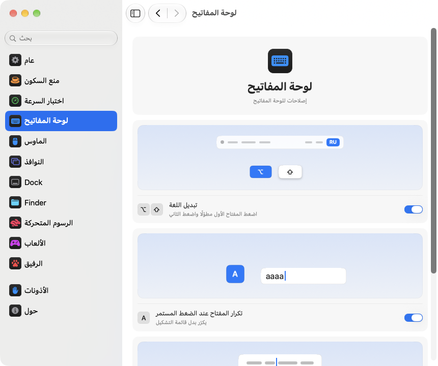

<div dir="rtl">

<p align="center"></p>
<h1 align="center">pikapik</h1>
<p align="center">تحسينات صغيرة للوحة المفاتيح والماوس والنوافذ وFinder، من شريط القائمة في Mac مباشرة.</p>
<p align="center"><sub><a href="../../README.md">English</a> · <a href="README.ru.md">Русский</a> · <a href="README.uk.md">Українська</a> · <a href="README.de.md">Deutsch</a> · <a href="README.fr.md">Français</a> · <a href="README.es.md">Español</a> · <a href="README.it.md">Italiano</a> · <a href="README.pt-BR.md">Português (Brasil)</a> · <a href="README.ja.md">日本語</a> · <a href="README.zh-Hans.md">简体中文</a> · <a href="README.ko.md">한국어</a> · <a href="README.ro.md">Română</a> · <a href="README.pl.md">Polski</a> · <a href="README.tr.md">Türkçe</a> · <a href="README.nl.md">Nederlands</a> · <a href="README.sv.md">Svenska</a> · <a href="README.cs.md">Čeština</a> · <a href="README.zh-Hant.md">繁體中文</a> · <b>العربية</b> · <a href="README.hi.md">हिन्दी</a> · <a href="README.id.md">Bahasa Indonesia</a> · <a href="README.vi.md">Tiếng Việt</a> · <a href="README.th.md">ไทย</a></sub></p>

</div>

<div dir="rtl">

<p align="center">
<picture>
<source media="(prefers-color-scheme: dark)" srcset="../media/settings-ar-dark.png">

</picture>
</p>

</div>

<div dir="rtl">

## التثبيت

</div>

```bash
brew install --cask dev-pikapik/pika-tools/pikapik && open -a pikapik
```

<div dir="rtl">

بعد التثبيت يظهر pikapik في شريط القائمة أعلى الشاشة. يبقى كل شيء متوقفًا حتى تشغّله بنفسك.

</div>

<details>
<summary dir="rtl">لا يوجد Homebrew؟ هناك طريقتان أخريان</summary>

<div dir="rtl">

بدون Homebrew، افتح Terminal والصق هذا السطر واضغط على مفتاح Return:

</div>

```bash
/bin/bash -c "$(curl -fsSL https://raw.githubusercontent.com/dev-pikapik/pika-tools/main/install.sh)"
```

<div dir="rtl">

أو نزّل [pikapik.dmg](https://github.com/dev-pikapik/pika-tools/releases/latest/download/pikapik.dmg) وافتحه واسحب التطبيق إلى مجلد التطبيقات.

يضع كل من Homebrew والسكربت التطبيق في `/Applications`، ثم يشغّله ويطلب الأذونات ويفعّل «الفتح عند تسجيل الدخول». بعد ذلك يحدّث التطبيق نفسه بنفسه، راجع **التحديثات**. لإزالته، راجع **إلغاء التثبيت**.

</div>

</details>

<div dir="rtl">

## ماذا يفعل

</div>

<div dir="rtl">

<table>
<tbody><tr>
<td width="50%" valign="top">
<picture><source media="(prefers-color-scheme: dark)" srcset="../media/keep-awake-dark.png"></picture>
<br><b>إبقاء الجهاز مستيقظًا</b>
<br>يبقى Mac مستيقظًا طوال ما تحتاج، حتى والغطاء مغلق.
</td>
<td width="50%" valign="top">
<picture><source media="(prefers-color-scheme: dark)" srcset="../media/command-keys-dark.png"></picture>
<br><b>حماية ⌘Q و⌘W</b>
<br>لا يُغلق شيء بالخطأ. أضف ⇧ عندما تقصد ذلك.
</td>
</tr></tbody>
<tbody><tr>
<td width="50%" valign="top">
<picture><source media="(prefers-color-scheme: dark)" srcset="../media/compress-dark.png"></picture>
<br><b>نسخة أصغر</b>
<br>انقر بزر الماوس الأيمن على صورة أو PDF أو فيديو لتظهر بجانبه نسخة أخف.
</td>
<td width="50%" valign="top">
<picture><source media="(prefers-color-scheme: dark)" srcset="../media/convert-dark.png"></picture>
<br><b>التحويل</b>
<br>احفظ صورة أو فيديو أو أغنية بتنسيق آخر من قائمة الزر الأيمن.
</td>
</tr></tbody>
<tbody><tr>
<td width="50%" valign="top">
<picture><source media="(prefers-color-scheme: dark)" srcset="../media/input-switch-dark.png"></picture>
<br><b>تبديل اللغة</b>
<br>اضغط مع الاستمرار على ⌥ ثم انقر ⇧ لتغيير لغة لوحة المفاتيح.
</td>
<td width="50%" valign="top">
<picture><source media="(prefers-color-scheme: dark)" srcset="../media/quit-on-close-dark.png"></picture>
<br><b>الإنهاء مع آخر نافذة</b>
<br>أغلق آخر نافذة لتطبيق، فيُنهى التطبيق أيضًا.
</td>
</tr></tbody>
<tbody><tr>
<td width="50%" valign="top">
<picture><source media="(prefers-color-scheme: dark)" srcset="../media/window-zoom-dark.png"></picture>
<br><b>الزر الأخضر يكبّر النافذة</b>
<br>تملأ النافذة الشاشة دون الدخول في وضع ملء الشاشة.
</td>
<td width="50%" valign="top">
<picture><source media="(prefers-color-scheme: dark)" srcset="../media/dock-hide-dark.png"></picture>
<br><b>الإخفاء بنقرة في Dock</b>
<br>انقر التطبيق الذي تستخدمه فيتنحّى جانبًا.
</td>
</tr></tbody>
<tbody><tr>
<td width="50%" valign="top">
<picture><source media="(prefers-color-scheme: dark)" srcset="../media/new-file-dark.png"></picture>
<br><b>ملف جديد</b>
<br>انقر بالزر الأيمن في Finder واكتب اسمًا، فيظهر ملف فارغ.
</td>
<td width="50%" valign="top">
<picture><source media="(prefers-color-scheme: dark)" srcset="../media/finder-cut-dark.png"></picture>
<br><b>⌘X ينقل الملفات</b>
<br>قصّ الملفات في Finder والصقها حيث تريد.
</td>
</tr></tbody>
<tbody><tr>
<td width="50%" valign="top">
<picture><source media="(prefers-color-scheme: dark)" srcset="../media/finder-open-dark.png"></picture>
<br><b>Enter يفتح الملفات</b>
<br>حدّد الملفات في Finder واضغط Enter لفتحها.
</td>
<td width="50%" valign="top">
<picture><source media="(prefers-color-scheme: dark)" srcset="../media/finder-delete-dark.png"></picture>
<br><b>Delete إلى المهملات</b>
<br>اضغط ⌫ في Finder فتذهب الملفات المحددة إلى المهملات.
</td>
</tr></tbody>
<tbody><tr>
<td width="50%" valign="top">
<picture><source media="(prefers-color-scheme: dark)" srcset="../media/game-mode-dark.png"></picture>
<br><b>وضع الألعاب</b>
<br>أثناء اللعب لا يظهر شيء فوق اللعبة ولا يغلقها شيء.
</td>
<td width="50%" valign="top">
<picture><source media="(prefers-color-scheme: dark)" srcset="../media/speed-test-dark.png"></picture>
<br><b>اختبار السرعة</b>
<br>ما مدى سرعة الإنترنت لديك، وما الذي يكفي له.
</td>
</tr></tbody>
<tbody><tr>
<td width="50%" valign="top">
<picture><source media="(prefers-color-scheme: dark)" srcset="../media/side-buttons-dark.png"></picture>
<br><b>الأزرار الجانبية</b>
<br>الزران 4 و5 للرجوع والتقدم، مثل السحب على لوحة التعقب.
</td>
<td width="50%" valign="top">
<picture><source media="(prefers-color-scheme: dark)" srcset="../media/wheel-lines-dark.png"></picture>
<br><b>التمرير بالأسطر</b>
<br>كل نقرة من العجلة تمرّر المسافة نفسها مهما كانت سرعة الدوران.
</td>
</tr></tbody>
<tbody><tr>
<td width="50%" valign="top">
<picture><source media="(prefers-color-scheme: dark)" srcset="../media/wheel-direction-dark.png"></picture>
<br><b>اتجاه التمرير</b>
<br>اتجاه للوحة التعقب وآخر للماوس.
</td>
<td width="50%" valign="top">
<picture><source media="(prefers-color-scheme: dark)" srcset="../media/linear-pointer-dark.png"></picture>
<br><b>إيقاف تسارع المؤشر</b>
<br>يتحرك المؤشر بقدر حركة يدك تمامًا.
</td>
</tr></tbody>
<tbody><tr>
<td width="50%" valign="top">
<picture><source media="(prefers-color-scheme: dark)" srcset="../media/key-repeat-dark.png"></picture>
<br><b>تكرار المفتاح عند الضغط المستمر</b>
<br>اضغط مع الاستمرار على مفتاح ليتكرر، بدلًا من قائمة الحركات.
</td>
<td width="50%" valign="top">
<picture><source media="(prefers-color-scheme: dark)" srcset="../media/home-end-dark.png"></picture>
<br><b>Home وEnd</b>
<br>انتقل إلى بداية السطر أو نهايته أثناء الكتابة.
</td>
</tr></tbody>
<tbody><tr>
<td width="50%" valign="top">
<picture><source media="(prefers-color-scheme: dark)" srcset="../media/animations-dark.png"></picture>
<br><b>الرسوم المتحركة</b>
<br>سرّع Dock والنوافذ والنظرة السريعة، حتى تصبح فورية.
</td>
<td width="50%" valign="top">
<picture><source media="(prefers-color-scheme: dark)" srcset="../media/leftover-permissions-dark.png"></picture>
<br><b>أذونات التطبيقات المحذوفة</b>
<br>أزل الأذونات التي يحتفظ بها macOS لتطبيقات حذفتها بالفعل.
</td>
</tr></tbody>
<tbody><tr>
<td width="50%" valign="top">
<picture><source media="(prefers-color-scheme: dark)" srcset="../media/pet-dark.png"></picture>
<br><b>رفيق على سطح المكتب</b>
<br>صديق صغير يتمشى خلف نوافذك. التقطه وارمه، أو اضغط مفتاح المسافة فيقفز.
</td>
</tr></tbody>
</table>

</div>

<div dir="rtl">

## تفاصيل أكثر

</div>

<details>
<summary dir="rtl">التشغيل الأول</summary>

<div dir="rtl">

يحتاج pikapik إلى إذنين. عند التشغيل الأول يفتح الإعدادات على صفحة «الأذونات» التي ترشدك خطوة بخطوة، ويعرض macOS طلباته الخاصة. انتقل إلى **إعدادات النظام › الخصوصية والأمن** وفعّل pikapik في:

- **تسهيلات الاستخدام**، ليتمكن التطبيق من تغيير ضغطة المفتاح أو النقرة قبل أن تصل إلى التطبيقات الأخرى.
- **مراقبة الإدخال**، ليتمكن التطبيق من رؤية ضغطات المفاتيح والنقرات أصلًا.

يلاحظ التطبيق التغيير خلال ثانية أو ثانيتين، ولا حاجة لإعادة التشغيل.

لا يسجّل pikapik ولا يحفظ ولا يرسل أي شيء تكتبه أو تنقر عليه. تُعالَج الأحداث في الذاكرة وتُمرَّر فورًا. الطلب الوحيد عبر الشبكة هو التحقق من التحديثات، إذ يسأل GitHub عن أحدث إصدار.

</div>

</details>

<details>
<summary dir="rtl">كل أداة بالتفصيل</summary>

<div dir="rtl">

**حماية ⌘Q و⌘W.** لا يفعل ⌘Q ولا ⌘W وحدهما شيئًا، فلا تُنهي تطبيقًا أو تغلق نافذة عن طريق الخطأ. أضف Shift لتفعل ذلك عن قصد: ⇧⌘Q يُنهي، و⇧⌘W يغلق. يعمل في جميع التطبيقات. لكل مفتاح مفتاح تشغيل خاص به. متوقف افتراضيًا.

**تبديل اللغة بـ Option+Shift.** اضغط مع الاستمرار على Option واضغط Shift: ينتقل macOS إلى مصدر الإدخال التالي. استمر في الضغط على Option واضغط Shift مرة أخرى للانتقال إلى ما بعده. اضغط مع الاستمرار على Shift واضغط Option للرجوع. إذا ضغطت مفتاحًا آخر أو نقرت أو أضفت Command أو Control أو Fn أثناء ذلك، فلن تتبدّل اللغة، لذا تعمل اختصارات مثل Option+Shift+سهم كما كانت. متوقف افتراضيًا.

**تكرار المفتاح عند الضغط المستمر.** اضغط على مفتاح باستمرار فيكتب الحرف مرارًا وتكرارًا بدلًا من إظهار قائمة التشكيل. مفيد في الألعاب وعند الكتابة. التطبيقات المفتوحة تطبّق ذلك بعد إعادة تشغيلها. أوقفه ويعود macOS إلى سلوكه المعتاد. متوقف افتراضيًا.

**Home وEnd إلى بداية السطر ونهايته.** أثناء الكتابة، ينقل Home المؤشر إلى بداية السطر وEnd إلى نهايته، بدلًا من تمرير الصفحة. مع ⇧ يحددان النص حتى هناك، ومع ⌘ ينتقلان إلى بداية النص كله أو نهايته. خارج حقول النص، وفي الطرفيات والأجهزة الافتراضية وتطبيقات سطح المكتب البعيد، يعمل المفتاحان كما كانا من قبل. يمكنك إضافة تطبيقات أخرى يجب أن يعملا فيها كالمعتاد. متوقف افتراضيًا.

**إيقاف تسارع المؤشر.** يتحرك المؤشر بالمسافة نفسها التي يتحركها الماوس تمامًا، مهما كانت سرعة تحريكك له. ويضبط شريط التمرير **سرعة التعقب** مدى سرعة حركته. يعمل مع الماوس فقط، وتبقى لوحة التعقب كما هي. أوقف الخيار أو أنهِ pikapik، فيستعيد macOS إعداداته الخاصة. متوقف افتراضيًا.

**التمرير بالأسطر.** كل نقرة على عجلة الماوس تمرّر العدد نفسه من الأسطر مهما كانت سرعة تدويرها. اختر من سطر واحد إلى 10 أسطر لكل نقرة، والافتراضي 3. يبقى التمرير الطبيعي كما ضبطته في إعدادات النظام. يعمل مع الماوس فقط، ولوحة التتبع تبقى كما هي. متوقف افتراضيًا. بجوار شريط التمرير **المسافة لكل نقرة**، تتحرك صفحة صغيرة بالمسافة التي تختارها، وتحدّد نقطة القيمة الافتراضية.

بعض التطبيقات والألعاب تحسب التمرير بالبكسل بدقة: لها، بدّل الإعداد نفسه إلى البكسلات واختر من 1 إلى 200 بكسل لكل نقرة، والافتراضي 40. ويوضّح شريط التمرير أيضًا نسبة ذلك من ارتفاع الشاشة.

**اتجاه التمرير للوحة التعقب والماوس.** في macOS مفتاح واحد للتمرير الطبيعي يشمل لوحة التعقب والماوس معًا. شغّل هذه الميزة واختر اتجاهًا لكل منهما: **طبيعي** حيث تتبع الصفحة أصابعك كما في iPhone، أو **كلاسيكي** حيث تتحرك الصفحة في الاتجاه المعاكس. يشمل اختيار لوحة التعقب أيضًا التمرير الجانبي واستمرار الحركة بعد رفع أصابعك. يمرر Magic Mouse باللمس، لذلك يتبع اختيار لوحة التعقب. اختر الشيء نفسه على كل أجهزة Mac لديك، وسيكون التمرير متشابهًا عليها كلها، حتى عندما تنقل الماوس إلى Mac آخر عبر التحكم العام. متوقفة افتراضيًا. عند تشغيلها يبدأ الاختياران كما في إعدادات النظام، فلا يتغير شيء حتى تختار غير ذلك.

**الأزرار الجانبية للرجوع والتقدم.** يعمل الزرّان 4 و5 في الماوس للرجوع والتقدّم في Finder وSafari وغيرهما من تطبيقات Apple وفي كثير من التطبيقات الأخرى، تمامًا مثل السحب على لوحة التتبع. أما التطبيقات التي تتعامل مع هذين الزرّين بنفسها، فتستلمهما كما هما. وإذا كانا معكوسين في الماوس لديك، فشغّل **تبديل الأزرار الجانبية**. متوقف افتراضيًا.

**الإنهاء عند إغلاق آخر نافذة.** أغلق آخر نافذة لتطبيق فيُنهى التطبيق. يبقى Finder مفتوحًا، وكذلك التطبيقات التي لها نوافذ على أسطح مكتب أخرى أو في Dock. يمكنك إعداد قائمة بالتطبيقات التي يجب ألا تُنهى بهذه الطريقة أبدًا. متوقف افتراضيًا.

**الإخفاء بنقرة في Dock.** انقر على أيقونة التطبيق الذي تستخدمه في Dock فيختفي. انقر مرة أخرى لإعادته. متوقف افتراضيًا.

**الزر الأخضر يكبّر النافذة.** انقر على الزر الأخضر لنافذة ما فتملأ الشاشة دون أن تنتقل إلى وضع ملء الشاشة. انقر مرة أخرى لاستعادة الحجم السابق. اضغط مع الاستمرار على ⌥ فيعمل الزر كالمعتاد. يبقى ملء الشاشة متاحًا من قائمة الزر وعلى ⌃⌘F. يمكنك إدراج التطبيقات التي يجب أن يعمل فيها الزر الأخضر كالمعتاد. متوقف افتراضيًا.

**ملف جديد في Finder.** انقر بزر الماوس الأيمن في نافذة Finder أو على سطح المكتب، واختر **ملف جديد**، واكتب اسمًا، فيظهر ملف فارغ. الامتداد ‎.txt افتراضيًا. متوقف افتراضيًا.

**Enter يفتح الملفات في Finder.** حدّد ملفات في نافذة Finder أو على سطح المكتب واضغط Return أو Enter فتُفتح. ويعيد F2 أو fn F2 تسمية الملف المحدد. وفي حقول النص، مثل أثناء كتابة اسم، تعمل المفاتيح كالمعتاد. متوقف افتراضيًا.

**⌘X يقصّ الملفات في Finder.** حدّد ملفات واضغط ⌘X، ثم افتح المجلد المطلوب واضغط ⌘V، فتنتقل الملفات إليه بدل أن تُنسخ. ويلغي ⌘C القص. متوقف افتراضيًا.

**Delete يحذف الملفات في Finder.** حدّد الملفات واضغط ⌫ أو ⌦ (fn ⌫ في الحاسوب المحمول)، فتنتقل إلى سلة المهملات، تمامًا كما مع ⌘⌫. أثناء إعادة تسمية ملف أو البحث أو الكتابة في أي حقل آخر، يمحو المفتاحان الحروف كالمعتاد. متوقف افتراضيًا.

**نسخة أصغر في Finder.** انقر بزر الماوس الأيمن على ملف في Finder واختر **إنشاء نسخة أصغر**. تُحفظ بجانبه نسخة أخف من الصورة أو ملف GIF أو PDF أو الفيديو، وغالبًا تكون أصغر بعدة مرات. الصوت غير المضغوط مثل WAV أو AIFF يصبح ملف M4A صغيرًا. إذا لم يكن ممكنًا تصغير الملف أكثر، فلن تُنشأ نسخة وسيخبرك pikapik بذلك. يبقى الأصل كما هو، ولا يغادر أي شيء جهاز Mac. متوقف افتراضيًا.

**التحويل في Finder.** انقر بزر الماوس الأيمن على ملف في Finder واختر **تحويل إلى** لحفظه بتنسيق آخر: الصورة بتنسيق JPEG أو PNG أو HEIC أو GIF أو TIFF أو PDF، والفيديو بتنسيق MP4 أو MOV أو الصوت فقط، والموسيقى بتنسيق M4A أو WAV أو AIFF. يبقى الأصل كما هو، ولا يغادر أي شيء جهاز Mac. يُشغَّل بشكل منفصل عن النسخة الأصغر. متوقف افتراضيًا.

**وضع الألعاب.** أضف ألعابك، وأثناء اللعب لن يُخرجك Mac من اللعبة. لا يفتح Spotlight وSiri و⌘Tab وMission Control والسحب بين سطوح المكتب فوق اللعبة، ولا يغلقها ⌘Q و⌘W عن طريق الخطأ، ولا ينزلق المؤشر إلى Dock أو شريط القائمة أو شاشة أخرى، وتبقى الشاشة مضاءة. لكل من هذه مفتاح خاص في صفحة الألعاب، ويقترح pikapik الألعاب التي يجدها على جهاز Mac. في اللعبة يبقى Control-نقر نقرة عادية، ولا يبدّل Control مع الأسهم سطح المكتب. ويتعرّف التطبيق على Minecraft أيضًا: أضف Minecraft Launcher أو CurseForge، فيعمل الوضع داخل Minecraft نفسها. للخروج من اللعبة اضغط ⇧⌘Q، ولإغلاق نافذتها ⇧⌘W. يعمل ⌥⌘Esc دائمًا. بمجرد أن تغادر اللعبة يعمل كل شيء كالمعتاد. متوقف افتراضيًا.

لكل أداة مفتاح تشغيل خاص بها في القائمة وفي الإعدادات.

تُظهر أيقونة شريط القائمة الحالة بنظرة واحدة: علامة pikapik عندما تعمل الأدوات، والعلامة نفسها باهتة عندما يكون كل شيء متوقفًا، ومثلث تحذير عندما تكون أداة قيد التشغيل لكن الأذونات ناقصة.

تبدأ لوحة شريط القوائم بعدد قليل من الصفوف. يمكنك اختيار الصفوف التي تظهر فيها: انقر زر القلم في الأسفل، وحدّد ما تريد رؤيته، ثم انقر **تم**. الصفوف المخفية تواصل عملها وتبقى في الإعدادات. وإذا كانت اللوحة أطول من الشاشة، فيمكنك تمريرها.

يتبع التطبيق لغة النظام أو اللغة التي تختارها في الإعدادات. تتوفر جميع اللغات الـ 23 المدرجة أعلى هذه الصفحة.

</div>

</details>

<details>
<summary dir="rtl">إبقاء الجهاز مستيقظًا</summary>

<div dir="rtl">

يمنع جهاز Mac من الدخول في وضع الإسبات وأنت بعيد عن لوحة المفاتيح: لأي مدة من ثانية واحدة إلى 365 يومًا، أو حتى توقفه بنفسك. شغّله من القائمة، وحدّد المدة في الإعدادات: اكتب الأيام والساعات والدقائق والثواني، أو استخدم ↑ و↓، أو انقر على خيار جاهز من 15 دقيقة إلى 8 ساعات. تعرض القائمة الوقت المتبقي وموعد الانتهاء. في **الشاشة** خياران. **قيد التشغيل دائمًا**: لا تنطفئ، بلا شاشة توقف أو شاشة قفل. **تنطفئ كالمعتاد**: تنطفئ حسب مؤقتها بينما يواصل جهاز Mac العمل. **إطفاء الشاشة الآن** (موجود في القائمة أيضًا) يطفئ الشاشة فورًا ويواصل Mac العمل: حرّك الماوس أو اضغط على أي مفتاح لإعادتها. إنهاء pikapik يُنهي إبقاء الجهاز مستيقظًا.

على MacBook يمكنك أيضًا تشغيل **العمل والغطاء مغلق**. لا يوفر macOS مفتاحًا لذلك، لذا يشغّل pikapik الأمر `pmset -a disablesleep 1` ويطلب كلمة سر المسؤول: وحده المسؤول يستطيع تغيير طريقة إسبات Mac. يعود الإعداد إلى وضعه الطبيعي تلقائيًا عند انتهاء إبقاء الجهاز مستيقظًا، أو عند إنهاء التطبيق، أو إذا توقف بشكل مفاجئ. إذا لم تُدخل كلمة السر، فلن يتغير شيء. احرص على تهوية Mac جيدًا والغطاء مغلق. يُنهي **الإيقاف عندما تقل البطارية عن 20%** الجلسة قبل نفاد البطارية.

يمكن وضع «منع السكون» ووضعَي الشاشة والغطاء المغلق على زر في مركز التحكم أو شريط القوائم أو ودجت على سطح المكتب عبر تطبيق الاختصارات، بروابط تنسخها من الإعدادات › منع السكون.

</div>

</details>

<details>
<summary dir="rtl">اختبار السرعة</summary>

<div dir="rtl">

يعرض مدى سرعة الإنترنت لديك الآن. انقر على **فحص السرعة** في الإعدادات › اختبار السرعة، أو على **فحص** في القائمة بعد إضافة الصف بزر القلم. خلال نحو نصف دقيقة ترى سرعة التنزيل والرفع والبينغ والاستجابة: مدى سرعة استجابة كل شيء أثناء انشغال الاتصال. وتحتها كلمات بسيطة تقول ما الذي يناسبه: أفلام 4K ومكالمات الفيديو والألعاب عبر الإنترنت والتنزيلات الكبيرة. يستخدم الفحص أداة networkQuality المضمّنة في macOS وخوادم Apple. تبقى آخر نتيجة حتى الفحص التالي، ويبدأ رابط لتطبيق الاختصارات الفحص من مركز التحكم.

</div>

</details>

<details>
<summary dir="rtl">الإعدادات</summary>

<div dir="rtl">

افتح الإعدادات من القائمة عبر **الإعدادات…** أو ⌘، أو شغّل pikapik مرة أخرى من Finder أو Launchpad أو Spotlight. ما دامت النافذة مفتوحة، يظهر التطبيق في Dock وفي ⌘Tab.

- **عام**: الفتح عند تسجيل الدخول، والمظهر (النظام أو فاتح أو داكن)، واللغة والتحديثات، والنسخ الاحتياطي: تصدير الإعدادات واستيرادها كملف، أو مزامنتها عبر iCloud Drive.
- **منع السكون**: المدة وخيارات الشاشة والغطاء.
- **اختبار السرعة**: فحص سرعة الإنترنت ومعرفة ما الذي يناسبه.
- **لوحة المفاتيح**: تبديل اللغة، وتكرار المفتاح، وHome وEnd.
- **الماوس**: تسارع المؤشر وسرعة التعقب، والتمرير بالأسطر، واتجاه التمرير، والزرّان الجانبيان.
- **النوافذ**: تكبير النافذة بالزر الأخضر (مع قائمة استثناءات)، والحماية من ⌘Q و⌘W، والإنهاء عند آخر نافذة (مع قائمة استثناءات).
- **Dock**: الإخفاء بنقرة في Dock.
- **Finder**: ملف جديد، ونسخة أصغر وتحويل، والفتح بمفتاح Return، والقص بـ ⌘X، والحذف بـ ⌫.
- **الأذونات**: حالة الإذنين، وحالة iCloud Drive عند تشغيل المزامنة، مع أزرار تفتح المكان الصحيح في إعدادات النظام.
- **حول**: الإصدار، وروابط سجل التغييرات والإبلاغ عن مشكلة.

تأتي كثير من الإعدادات مع صورة صغيرة توضح ما تفعله، مثل جهاز Mac الذي يبقى مستيقظًا أو نافذة تختبئ خلف Dock. تتغير الصورة مع المفتاح، وتتوقف عن الحركة عند تفعيل «تقليل الحركة» في إعدادات النظام.

في أسفل كل صفحة زر **استعادة الإعدادات الافتراضية…**. يسألك أولًا، ثم يوقف أدوات تلك الصفحة ويعيد خياراتها كما كانت، كأن pikapik لم يلمسها قط.

**مزامنة الإعدادات مع iCloud** تُبقي pikapik متطابقًا على كل أجهزة Mac لديك. تُحفظ الإعدادات في مجلد pika-tools داخل iCloud Drive، ويُعتمد آخر تغيير. هذه الميزة متوقفة افتراضيًا وتحتاج إلى تشغيل iCloud Drive. الأذونات لا تُزامَن: كل جهاز Mac يطلبها بنفسه.

</div>

</details>

<details>
<summary dir="rtl">التحديثات</summary>

<div dir="rtl">

يتحقق pikapik من وجود إصدارات جديدة عند التشغيل وكل 6 ساعات. يمكنك إيقاف ذلك من الإعدادات › عام. عند صدور إصدار جديد، يظهر في القائمة زر **التحديث إلى …**: نقرة واحدة فينزّل التطبيق التحديث ويثبّته ويعيد التشغيل. يمكنك أيضًا التحقق يدويًا عبر **تحقق الآن** في الإعدادات › عام.

مع Homebrew يمكنك أيضًا تشغيل `brew upgrade --cask pikapik`.

بدءًا من الإصدار 1.3، تبقى الأذونات كما هي بعد التحديثات.

</div>

</details>

<details>
<summary dir="rtl">إلغاء التثبيت</summary>

```bash
/bin/bash -c "$(curl -fsSL https://raw.githubusercontent.com/dev-pikapik/pika-tools/main/uninstall.sh)"
```

<div dir="rtl">

إذا ثبّتّه باستخدام Homebrew: `brew uninstall --cask --zap pikapik`.

كلاهما يُنهي التطبيق ويزيله من عناصر تسجيل الدخول ويحذفه. ويعيد السكربت أيضًا تعيين أذوناته.

</div>

</details>

<details>
<summary dir="rtl">الأسئلة الشائعة</summary>

<div dir="rtl">

**لماذا يحتاج إلى إذنين؟**
يقسم macOS الوصول إلى لوحة المفاتيح والماوس إلى قسمين. تتيح مراقبة الإدخال للتطبيق رؤية الأحداث، وتتيح له تسهيلات الاستخدام تغييرها. يتطلب حظر اختصار كليهما.

**يقول macOS إن التطبيق من مطوّر غير معروف.**
pikapik موقّع، لكنه غير موثَّق من Apple. يتولى Homebrew وسكربت التثبيت هذا الأمر نيابة عنك. إذا استخدمت ملف dmg، فافتح **إعدادات النظام › الخصوصية والأمن** وانقر على **الفتح على أي حال**، أو شغّل:

</div>

```bash
xattr -dr com.apple.quarantine /Applications/pikapik.app
```

<div dir="rtl">

**هل يعمل على أجهزة Mac بمعالج Intel؟**
نعم. إنه تطبيق عام لـ Apple Silicon وIntel، ويتطلب macOS 14 Sonoma أو أحدث.

**الإذن مفعّل، لكن لا شيء يعمل.**
في **إعدادات النظام › الخصوصية والأمن**، أزل pikapik من القائمتين بزر −، ثم أضفه مرة أخرى. في صفحة «الأذونات» في إعدادات pikapik أزرار تفتح المكان الصحيح.

</div>

</details>

<div dir="rtl">

<p align="center">☕ إن أعجبك pikapik فيمكنك أن <a href="https://buymeacoffee.com/pikapik">تشتري لي فنجان قهوة</a>، وكل ما يصل يذهب إلى تطوير التطبيق ودعمه.</p>

<p align="center"><sub><a href="../whats-new/README.ar.md">ما الجديد</a> · <a href="https://github.com/dev-pikapik/homebrew-pika-tools">مستودع Homebrew</a> · <a href="../../CONTRIBUTING.md">البناء بنفسك</a> · <a href="../../LICENSE">ترخيص MIT</a> · © 2026 pikapik</sub></p>

</div>
