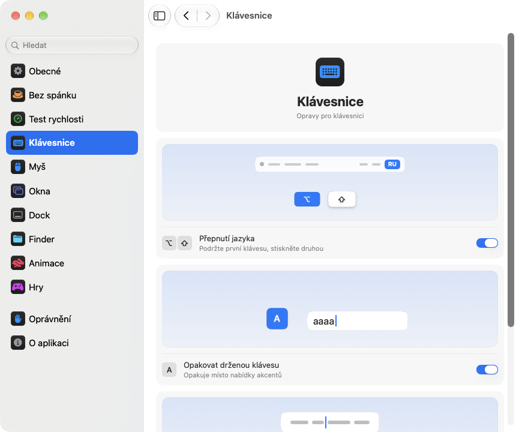

<p align="center"></p>
<h1 align="center">pika-tools</h1>
<p align="center">Drobná vylepšení klávesnice, myši, oken a Finderu přímo v řádku nabídek vašeho Macu.</p>
<p align="center"><sub><a href="../../README.md">English</a> · <a href="README.ru.md">Русский</a> · <a href="README.uk.md">Українська</a> · <a href="README.de.md">Deutsch</a> · <a href="README.fr.md">Français</a> · <a href="README.es.md">Español</a> · <a href="README.it.md">Italiano</a> · <a href="README.pt-BR.md">Português (Brasil)</a> · <a href="README.ja.md">日本語</a> · <a href="README.zh-Hans.md">简体中文</a> · <a href="README.ko.md">한국어</a> · <a href="README.ro.md">Română</a> · <a href="README.pl.md">Polski</a> · <a href="README.tr.md">Türkçe</a> · <a href="README.nl.md">Nederlands</a> · <a href="README.sv.md">Svenska</a> · <b>Čeština</b> · <a href="README.zh-Hant.md">繁體中文</a> · <a href="README.ar.md">العربية</a> · <a href="README.hi.md">हिन्दी</a> · <a href="README.id.md">Bahasa Indonesia</a> · <a href="README.vi.md">Tiếng Việt</a> · <a href="README.th.md">ไทย</a></sub></p>

<p align="center">
<picture>
<source media="(prefers-color-scheme: dark)" srcset="../media/settings-cs-dark.png">

</picture>
</p>

## Instalace

```bash
brew install --cask dev-pikapik/pika-tools/pika-tools && open -a pika-tools
```

pika-tools najdete v řádku nabídek nahoře na obrazovce. Vše je vypnuté, dokud to sami nezapnete.

<details>
<summary>Nemáte Homebrew? Dva další způsoby</summary>

Bez Homebrew: otevřete Terminál, vložte tento řádek a stiskněte Return:

```bash
/bin/bash -c "$(curl -fsSL https://raw.githubusercontent.com/dev-pikapik/pika-tools/main/install.sh)"
```

Nebo si stáhněte [pika-tools.dmg](https://github.com/dev-pikapik/pika-tools/releases/latest/download/pika-tools.dmg), otevřete ho a přetáhněte aplikaci do složky Aplikace.

Homebrew i skript uloží aplikaci do `/Applications`, spustí ji, požádají o oprávnění a zapnou otevírání po přihlášení. Potom se aplikace aktualizuje sama, viz **Aktualizace**. Jak ji odstranit, najdete v části **Odinstalace**.

</details>

## Co umí

<table>
<tbody><tr>
<td width="50%" valign="top">
<picture><source media="(prefers-color-scheme: dark)" srcset="../media/keep-awake-dark.png"></picture>
<br><b>Nespat</b>
<br>Mac zůstane vzhůru, jak dlouho potřebujete, i se zavřeným víkem.
</td>
<td width="50%" valign="top">
<picture><source media="(prefers-color-scheme: dark)" srcset="../media/command-keys-dark.png"></picture>
<br><b>Ochrana ⌘Q a ⌘W</b>
<br>Nic se nezavře omylem. Když to myslíte vážně, přidejte ⇧.
</td>
</tr></tbody>
<tbody><tr>
<td width="50%" valign="top">
<picture><source media="(prefers-color-scheme: dark)" srcset="../media/compress-dark.png"></picture>
<br><b>Menší kopie</b>
<br>Klikněte pravým tlačítkem na fotku, PDF nebo video a vedle se objeví lehčí kopie.
</td>
<td width="50%" valign="top">
<picture><source media="(prefers-color-scheme: dark)" srcset="../media/convert-dark.png"></picture>
<br><b>Převod</b>
<br>Uložte obrázek, video nebo skladbu v jiném formátu z nabídky pravého tlačítka.
</td>
</tr></tbody>
<tbody><tr>
<td width="50%" valign="top">
<picture><source media="(prefers-color-scheme: dark)" srcset="../media/input-switch-dark.png"></picture>
<br><b>Přepnutí jazyka</b>
<br>Podržte ⌥ a ťukněte na ⇧, jazyk klávesnice se přepne.
</td>
<td width="50%" valign="top">
<picture><source media="(prefers-color-scheme: dark)" srcset="../media/quit-on-close-dark.png"></picture>
<br><b>Ukončení s posledním oknem</b>
<br>Zavřete poslední okno aplikace a ukončí se i aplikace.
</td>
</tr></tbody>
<tbody><tr>
<td width="50%" valign="top">
<picture><source media="(prefers-color-scheme: dark)" srcset="../media/window-zoom-dark.png"></picture>
<br><b>Zelené tlačítko zvětšuje</b>
<br>Okno vyplní obrazovku bez přechodu na celou obrazovku.
</td>
<td width="50%" valign="top">
<picture><source media="(prefers-color-scheme: dark)" srcset="../media/dock-hide-dark.png"></picture>
<br><b>Skrytí kliknutím v Docku</b>
<br>Klikněte na aplikaci, ve které právě jste, a uhne z cesty.
</td>
</tr></tbody>
<tbody><tr>
<td width="50%" valign="top">
<picture><source media="(prefers-color-scheme: dark)" srcset="../media/new-file-dark.png"></picture>
<br><b>Nový soubor</b>
<br>Pravé tlačítko ve Finderu, jméno a prázdný soubor je hotový.
</td>
<td width="50%" valign="top">
<picture><source media="(prefers-color-scheme: dark)" srcset="../media/finder-cut-dark.png"></picture>
<br><b>⌘X přesouvá soubory</b>
<br>Vyjměte soubory ve Finderu a vložte je, kam potřebujete.
</td>
</tr></tbody>
<tbody><tr>
<td width="50%" valign="top">
<picture><source media="(prefers-color-scheme: dark)" srcset="../media/finder-open-dark.png"></picture>
<br><b>Enter otevírá soubory</b>
<br>Vyberte soubory ve Finderu a stiskněte Enter, otevřou se.
</td>
<td width="50%" valign="top">
<picture><source media="(prefers-color-scheme: dark)" srcset="../media/finder-delete-dark.png"></picture>
<br><b>Delete do koše</b>
<br>Stiskněte ⌫ ve Finderu a vybrané soubory půjdou do koše.
</td>
</tr></tbody>
<tbody><tr>
<td width="50%" valign="top">
<picture><source media="(prefers-color-scheme: dark)" srcset="../media/game-mode-dark.png"></picture>
<br><b>Herní režim</b>
<br>Zatímco hrajete, nic nevyskočí přes hru a nic ji nezavře.
</td>
<td width="50%" valign="top">
<picture><source media="(prefers-color-scheme: dark)" srcset="../media/speed-test-dark.png"></picture>
<br><b>Test rychlosti</b>
<br>Jak rychlý je váš internet a na co stačí.
</td>
</tr></tbody>
<tbody><tr>
<td width="50%" valign="top">
<picture><source media="(prefers-color-scheme: dark)" srcset="../media/side-buttons-dark.png"></picture>
<br><b>Boční tlačítka</b>
<br>Tlačítka 4 a 5 jdou zpět a vpřed, jako přejetí prsty.
</td>
<td width="50%" valign="top">
<picture><source media="(prefers-color-scheme: dark)" srcset="../media/wheel-lines-dark.png"></picture>
<br><b>Posouvání po řádcích</b>
<br>Každé cvaknutí kolečka posune stejně, ať točíte jakkoli rychle.
</td>
</tr></tbody>
<tbody><tr>
<td width="50%" valign="top">
<picture><source media="(prefers-color-scheme: dark)" srcset="../media/wheel-direction-dark.png"></picture>
<br><b>Směr posouvání</b>
<br>Jeden směr pro trackpad, jiný pro myš.
</td>
<td width="50%" valign="top">
<picture><source media="(prefers-color-scheme: dark)" srcset="../media/linear-pointer-dark.png"></picture>
<br><b>Bez zrychlení ukazatele</b>
<br>Ukazatel ujede přesně tolik co vaše ruka.
</td>
</tr></tbody>
<tbody><tr>
<td width="50%" valign="top">
<picture><source media="(prefers-color-scheme: dark)" srcset="../media/key-repeat-dark.png"></picture>
<br><b>Opakovat drženou klávesu</b>
<br>Podržte klávesu a píše se znovu a znovu, bez nabídky diakritiky.
</td>
<td width="50%" valign="top">
<picture><source media="(prefers-color-scheme: dark)" srcset="../media/home-end-dark.png"></picture>
<br><b>Home a End</b>
<br>Při psaní skok na začátek nebo konec řádku.
</td>
</tr></tbody>
<tbody><tr>
<td width="50%" valign="top">
<picture><source media="(prefers-color-scheme: dark)" srcset="../media/animations-dark.png"></picture>
<br><b>Animace</b>
<br>Zrychlete Dock, okna a Rychlý náhled, klidně až na okamžité.
</td>
<td width="50%" valign="top">
<picture><source media="(prefers-color-scheme: dark)" srcset="../media/leftover-permissions-dark.png"></picture>
<br><b>Oprávnění smazaných aplikací</b>
<br>Odstraňte oprávnění, která si macOS nechává pro už smazané aplikace.
</td>
</tr></tbody>
</table>

## Podrobnosti

<details>
<summary>První spuštění</summary>

pika-tools potřebuje dvě oprávnění. Při prvním spuštění otevře nastavení na stránce Oprávnění, která vás provede krok za krokem, a macOS zobrazí vlastní dotazy. Přejděte do **Nastavení systému › Soukromí a zabezpečení** a zapněte pika-tools v seznamech:

- **Zpřístupnění**, aby aplikace mohla změnit stisk klávesy nebo kliknutí dřív, než se dostane k jiným aplikacím.
- **Sledování vstupu**, aby aplikace vůbec viděla stisky kláves a kliknutí.

Aplikace změnu zaznamená během pár sekund, restart není potřeba.

pika-tools nenahrává, neukládá ani neodesílá nic z toho, co píšete nebo na co klikáte. Události se zpracovávají v paměti a hned se předávají dál. Jediný síťový požadavek je kontrola aktualizací, která se GitHubu ptá na nejnovější verzi.

</details>

<details>
<summary>Každý nástroj podrobně</summary>

**Ochrana ⌘Q a ⌘W.** Samotné ⌘Q a ⌘W nic nedělají, takže omylem neukončíte aplikaci ani nezavřete okno. Přidejte Shift, když to chcete udělat záměrně: ⇧⌘Q ukončí, ⇧⌘W zavře. Funguje ve všech aplikacích. Každá klávesa má vlastní přepínač. Ve výchozím stavu vypnuto.

**Přepínání jazyka pomocí Option+Shift.** Podržte Option a ťukněte na Shift: macOS přepne na další zdroj vstupu. Držte dál Option a znovu ťukněte na Shift, chcete-li pokračovat. Podržte Shift a ťukněte na Option, chcete-li se vrátit. Když mezitím stisknete jinou klávesu, kliknete nebo přidáte Command, Control či Fn, nic se nepřepne, takže zkratky jako Option+Shift+šipka fungují jako dřív. Ve výchozím stavu vypnuto.

**Opakovat drženou klávesu.** Podržte klávesu a písmeno se píše znovu a znovu, místo aby se ukázala nabídka akcentů. Hodí se ve hrách i při psaní. Už otevřené aplikace to převezmou po restartu. Když to vypnete, macOS se chová jako obvykle. Ve výchozím stavu vypnuto.

**Home a End na začátek a konec řádku.** Když píšete, Home přesune kurzor na začátek řádku a End na jeho konec, místo aby posouvaly stránku. S ⇧ vyberou text až tam, s ⌘ skočí na začátek nebo konec celého textu. Mimo textová pole a v terminálech, virtuálních počítačích a aplikacích pro vzdálenou plochu fungují klávesy jako dřív. Můžete přidat další aplikace, kde mají fungovat jako obvykle. Ve výchozím stavu vypnuto.

**Vypnout zrychlení ukazatele.** Ukazatel se posune přesně tolik jako myš, ať s ní pohybujete jakkoli rychle, stejně jako v LinearMouse. Jezdec **Rychlost ukazatele** určuje, jak rychle se pohybuje. Funguje jen s myší, trackpad zůstane, jak je. Vypněte funkci nebo ukončete pika-tools a macOS dostane zpět svoje vlastní nastavení. Ve výchozím stavu vypnuto.

**Posouvat po řádcích.** Každé cvaknutí kolečka myši posune stejný počet řádků, ať kolečkem točíte jakkoli rychle. Vyberte 1 až 10 řádků na cvaknutí, ve výchozím stavu 3. Přirozené posouvání zůstane tak, jak jste ho nastavili v Nastavení systému. Funguje jen pro myš, trackpad zůstává beze změny. Ve výchozím stavu vypnuto. Vedle posuvníku **Vzdálenost na cvaknutí** se malá stránka posune o zvolenou vzdálenost a tečka označuje výchozí hodnotu.

Některé aplikace a hry počítají posouvání v přesných pixelech: pro ně přepněte stejné nastavení na pixely a vyberte 1 až 200 pixelů na cvaknutí, výchozí je 40. Posuvník také ukazuje, jak velkou část výšky obrazovky to tvoří.

**Směr posouvání pro trackpad a myš.** macOS má jen jeden přepínač přirozeného posouvání pro trackpad i myš zároveň. Zapněte tuto funkci a vyberte směr pro každé zvlášť: **Přirozený**, kdy stránka jde za prsty jako na iPhonu, nebo **Klasický**, kdy se stránka posouvá opačným směrem. Volba pro trackpad platí i pro posouvání do stran a pro dojezd po zvednutí prstů. Magic Mouse posouvá dotykem, a proto se řídí volbou pro trackpad. Vyberte na každém svém Macu totéž a posouvání bude všude stejné, i když myš přesunete na jiný Mac přes Společné ovládání. Ve výchozím stavu vypnuto. Po zapnutí jsou obě volby stejné jako v Nastavení systému, takže se nic nezmění, dokud nevyberete něco jiného.

**Boční tlačítka pro zpět a vpřed.** Tlačítka myši 4 a 5 fungují jako zpět a vpřed v Safari, ve Finderu a dalších aplikacích Apple, ve Firefoxu, Opeře a ForkLiftu, stejně jako přejetí po trackpadu. Ostatní aplikace, například vývojová prostředí JetBrains, dostanou tlačítka beze změny a zpracují je po svém. Pokud je má vaše myš obráceně, zapněte **Prohodit boční tlačítka**. Ve výchozím stavu vypnuto.

**Ukončení po zavření posledního okna.** Zavřete poslední okno aplikace a aplikace se ukončí. Finder zůstane otevřený, stejně jako aplikace s okny na jiných plochách nebo v Docku. Můžete si sestavit seznam aplikací, které se tímto způsobem nikdy ukončit nemají. Ve výchozím stavu vypnuto.

**Skrytí kliknutím v Docku.** Klikněte v Docku na ikonu aplikace, se kterou právě pracujete, a skryje se. Dalším kliknutím ji vrátíte. Ve výchozím stavu vypnuto.

**Zelené tlačítko zvětší okno.** Klikněte na zelené tlačítko okna a okno se zvětší tak, aby vyplnilo obrazovku, aniž by přešlo do režimu celé obrazovky. Dalším kliknutím se vrátí původní velikost. S podrženým ⌥ tlačítko funguje jako vždy. Celá obrazovka zůstává v nabídce tlačítka a na ⌃⌘F. Můžete sestavit seznam aplikací, ve kterých má zelené tlačítko fungovat jako obvykle. Ve výchozím stavu vypnuto.

**Nový soubor ve Finderu.** Klikněte pravým v okně Finderu nebo na ploše, vyberte **Nový soubor**, napište název a objeví se prázdný soubor. Standardně .txt. Ve výchozím stavu vypnuto.

**Enter otevírá soubory ve Finderu.** Vyberte soubory v okně Finderu nebo na ploše a stiskněte Return nebo Enter, soubory se otevřou. F2 nebo fn F2 přejmenuje vybraný soubor. V textových polích, například když píšete název, klávesy fungují jako obvykle. Ve výchozím stavu vypnuto.

**⌘X vyjímá soubory ve Finderu.** Vyberte soubory a stiskněte ⌘X, otevřete cílovou složku a stiskněte ⌘V: soubory se tam přesunou místo zkopírování. ⌘C vyjmutí zruší. Ve výchozím stavu vypnuto.

**Delete maže soubory ve Finderu.** Vyberte soubory a stiskněte ⌫ nebo ⌦ (fn ⌫ na notebooku) – přesunou se do Koše, stejně jako s ⌘⌫. Když přejmenováváte soubor, hledáte nebo píšete do jiného pole, klávesy mažou písmena jako obvykle. Ve výchozím stavu vypnuto.

**Menší kopie ve Finderu.** Klikněte pravým na soubor ve Finderu a vyberte **Vytvořit menší kopii**. Vedle se objeví lehčí verze fotky, GIFu, PDF nebo videa, často několikrát menší. Nekomprimovaný zvuk jako WAV nebo AIFF se změní na úsporné M4A. Pokud soubor už menší být nemůže, kopie se nevytvoří a pika-tools vám to řekne. Originál zůstane beze změny a nic neopustí váš Mac. Ve výchozím stavu vypnuto.

**Převod ve Finderu.** Klikněte pravým na soubor ve Finderu a vyberte **Převést na** a soubor se uloží v jiném formátu: obrázek jako JPEG, PNG, HEIC, GIF, TIFF nebo PDF, video jako MP4, MOV nebo jen zvuk, hudba jako M4A, WAV nebo AIFF. Originál zůstane beze změny a nic neopustí váš Mac. Zapíná se zvlášť od menší kopie. Ve výchozím stavu vypnuto.

**Herní režim.** Přidejte své hry a během hraní vás Mac ze hry nevytrhne. Spotlight, Siri, ⌘Tab, Mission Control a přejetí mezi plochami se neotevřou přes hru, ⌘Q a ⌘W ji omylem nezavřou, ukazatel nesklouzne do Docku, na řádek nabídek ani na jiný displej a obrazovka zůstane zapnutá. Každá z těchto voleb má vlastní přepínač na stránce Hry a pika-tools vám nabídne hry, které na vašem Macu najde. Ve hře zůstane Control-kliknutí obyčejným kliknutím a Control se šipkami nepřepne plochu. Pozná i Minecraft: přidejte Minecraft Launcher nebo CurseForge a režim se zapne přímo v Minecraftu. Hru ukončíte stiskem ⇧⌘Q, její okno zavřete stiskem ⇧⌘W. ⌥⌘Esc funguje vždy. Jakmile hru opustíte, vše funguje jako obvykle. Ve výchozím stavu vypnuto.

Každý nástroj má vlastní přepínač v nabídce i v nastavení.

Ikona v řádku nabídek ukazuje stav na první pohled: značka pikapik, když nástroje fungují, stejná značka, jen bledá, když je vše vypnuté, a výstražný trojúhelník, když je nástroj zapnutý, ale chybí oprávnění.

Panel v řádku nabídek začíná jen s několika řádky. Které řádky ukazuje, si vyberete sami: klikněte na tlačítko s tužkou dole, zaškrtněte, co chcete vidět, a klikněte na **Hotovo**. Skryté řádky dál fungují a zůstávají v Nastavení. Když se panel na obrazovku nevejde, dá se posouvat.

Aplikace používá jazyk systému nebo ten, který vyberete v nastavení. K dispozici je všech 23 jazyků ze seznamu na začátku této stránky.

</details>

<details>
<summary>Nespat</summary>

Nedovolí Macu přejít do režimu spánku, když nejste u klávesnice: na libovolnou dobu od 1 sekundy do 365 dnů, nebo dokud to nevypnete. Zapněte to v nabídce a délku nastavte v nastavení: zadejte dny, hodiny, minuty a sekundy, použijte ↑ a ↓ nebo klikněte na hotovou volbu od 15 minut do 8 hodin. Nabídka ukazuje, kolik času zbývá a kdy to skončí. Pro **Displej** jsou dvě volby. **Stále zapnutý**: nezhasne a neukáže spořič ani zamčenou obrazovku. **Vypne se jako obvykle**: zhasne podle svého časovače, zatímco Mac dál pracuje. **Vypnout displej hned** (je i v nabídce) displej rovnou zhasne a Mac pracuje dál: vrátíte ho pohybem myši nebo stiskem klávesy. Ukončením pika-tools skončí i Nespat.

Na MacBooku můžete zapnout také **Pracovat se zavřeným víkem**. macOS na to nemá přepínač, proto pika-tools spustí `pmset -a disablesleep 1` a požádá o heslo správce: měnit, jak Mac usíná, může jen správce. Nastavení se samo vrátí do normálu, když Nespat skončí, když aplikaci ukončíte nebo když spadne. Pokud heslo nezadáte, nic se nezmění. Se zavřeným víkem dbejte na dobré větrání Macu. **Zastavit, když baterie klesne pod 20 %** ukončí relaci dřív, než se baterie vybije.

Keep Awake, režimy displeje a zavřeného víka lze dát na tlačítko v Ovládacím centru, v panelu nabídek nebo na widget na ploše přes aplikaci Zkratky, s odkazy zkopírovanými z Nastavení › Bez spánku.

</details>

<details>
<summary>Test rychlosti</summary>

Ukáže, jak rychlý je váš internet právě teď. Klikněte na **Změřit rychlost** v Nastavení › Test rychlosti, nebo na **Změřit** v nabídce, pokud tam řádek přidáte tlačítkem s tužkou. Asi za půl minuty uvidíte stahování, odesílání, ping a odezvu: jak rychle vše reaguje, když je připojení vytížené. Pod tím je jednoduše napsáno, na co stačí: filmy ve 4K, videohovory, online hry a velká stahování. Měření používá networkQuality, který je součástí macOS, a servery Apple. Poslední výsledek zůstane do dalšího měření a odkaz pro Zkratky ho spustí z Ovládacího centra.

</details>

<details>
<summary>Nastavení</summary>

Nastavení otevřete z nabídky položkou **Nastavení…** nebo zkratkou ⌘, případně pika-tools znovu spusťte z Finderu, Launchpadu nebo Spotlightu. Dokud je okno otevřené, aplikace se zobrazuje v Docku a v ⌘Tab.

- **Obecné**: otevírání po přihlášení, vzhled (Systém, Světlý nebo Tmavý), jazyk, aktualizace a zálohování: export a import nastavení jako souboru nebo synchronizace přes iCloud Drive.
- **Bez spánku**: délka, volby pro displej a víko.
- **Test rychlosti**: změří internet a ukáže, na co stačí.
- **Klávesnice**: přepínání jazyka, opakování kláves, Home a End.
- **Myš**: zrychlení ukazatele a rychlost ukazatele, posouvání po řádcích, směr posouvání, boční tlačítka.
- **Okna**: zvětšení okna zeleným tlačítkem (se seznamem výjimek), ochrana ⌘Q a ⌘W a ukončení po posledním okně (se seznamem výjimek).
- **Dock**: skrytí kliknutím v Docku.
- **Finder**: nový soubor, menší kopie a převod, otevírání klávesou Enter, vyjmutí pomocí ⌘X a mazání klávesou ⌫.
- **Oprávnění**: stav obou oprávnění a iCloud Drive, když je zapnutá synchronizace, s tlačítky, která otevřou správné místo v Nastavení systému.
- **O aplikaci**: verze, odkazy na seznam změn a na nahlášení problému.

Mnoho nastavení má malý obrázek, který ukazuje, co dělají, třeba Mac, který neusíná, nebo okno schované za Dockem. Obrázek se mění spolu s přepínačem a stojí, když je v Nastavení systému zapnuté „Omezit pohyb“.

Na každé stránce je dole tlačítko **Obnovit výchozí…**. Nejdřív se zeptá, pak vypne nástroje na dané stránce a vrátí jejich volby, jako by se jich pika-tools nikdy nedotkl.

**Synchronizovat nastavení přes iCloud** udrží pika-tools stejné na všech vašich Macích. Nastavení jsou ve složce pika-tools na iCloud Drive a vyhrává poslední změna. Ve výchozím stavu je vypnuto a vyžaduje zapnutý iCloud Drive. Oprávnění se nesynchronizují: každý Mac si o ně řekne sám.

</details>

<details>
<summary>Aktualizace</summary>

pika-tools hledá nové verze při spuštění a každých 6 hodin. Můžete to vypnout v Nastavení › Obecné. Když vyjde nová verze, v nabídce se objeví tlačítko **Aktualizovat na …**: jedno kliknutí a aplikace stáhne aktualizaci, nainstaluje ji a restartuje se. Ručně můžete zkontrolovat tlačítkem **Zkontrolovat** v Nastavení › Obecné.

S Homebrew můžete také spustit `brew upgrade --cask pika-tools`.

Od verze 1.3 zůstávají oprávnění po aktualizacích zachována.

</details>

<details>
<summary>Odinstalace</summary>

```bash
/bin/bash -c "$(curl -fsSL https://raw.githubusercontent.com/dev-pikapik/pika-tools/main/uninstall.sh)"
```

Pokud jste instalovali přes Homebrew: `brew uninstall --cask --zap pika-tools`.

Oba způsoby aplikaci ukončí, odeberou ji z položek po přihlášení a smažou ji. Skript navíc obnoví její oprávnění.

</details>

<details>
<summary>Časté dotazy</summary>

**Proč potřebuje dvě oprávnění?**
macOS dělí přístup ke klávesnici a myši na dvě části. Sledování vstupu aplikaci dovolí události vidět, Zpřístupnění jí dovolí je měnit. K zablokování zkratky jsou potřeba obě.

**macOS hlásí, že aplikace je od neidentifikovaného vývojáře.**
pika-tools je podepsaná, ale není ověřená (notarizovaná) společností Apple. Homebrew a instalační skript to vyřeší za vás. Pokud jste použili dmg, otevřete **Nastavení systému › Soukromí a zabezpečení** a klikněte na **Přesto otevřít**, nebo spusťte:

```bash
xattr -dr com.apple.quarantine /Applications/pika-tools.app
```

**Funguje na Macích s Intelem?**
Ano. Je to univerzální aplikace pro Apple Silicon i Intel, pro macOS 14 Sonoma nebo novější.

**Oprávnění je zapnuté, ale nic nefunguje.**
V **Nastavení systému › Soukromí a zabezpečení** odeberte pika-tools z obou seznamů tlačítkem − a pak ji přidejte znovu. Na stránce Oprávnění v nastavení pika-tools jsou tlačítka, která otevřou správné místo.

</details>

<p align="center">☕ Pokud vás pika-tools těší, můžete mi <a href="https://buymeacoffee.com/pikapik">koupit kávu</a> – vše jde na vývoj a podporu aplikace.</p>

<p align="center"><sub><a href="../whats-new/README.cs.md">Novinky</a> · <a href="https://github.com/dev-pikapik/homebrew-pika-tools">Tap Homebrew</a> · <a href="../../CONTRIBUTING.md">Sestavení ze zdrojů</a> · <a href="../../LICENSE">Licence MIT</a> · © 2026 pikapik</sub></p>
