<p align="center"></p>
<h1 align="center">pika-tools</h1>
<p align="center">Kleine Verbesserungen für Tastatur, Maus, Fenster und Finder, direkt in der Menüleiste deines Mac.</p>
<p align="center"><sub><a href="../../README.md">English</a> · <a href="README.ru.md">Русский</a> · <a href="README.uk.md">Українська</a> · <b>Deutsch</b> · <a href="README.fr.md">Français</a> · <a href="README.es.md">Español</a> · <a href="README.it.md">Italiano</a> · <a href="README.pt-BR.md">Português (Brasil)</a> · <a href="README.ja.md">日本語</a> · <a href="README.zh-Hans.md">简体中文</a> · <a href="README.ko.md">한국어</a> · <a href="README.ro.md">Română</a> · <a href="README.pl.md">Polski</a> · <a href="README.tr.md">Türkçe</a> · <a href="README.nl.md">Nederlands</a> · <a href="README.sv.md">Svenska</a> · <a href="README.cs.md">Čeština</a> · <a href="README.zh-Hant.md">繁體中文</a> · <a href="README.ar.md">العربية</a> · <a href="README.hi.md">हिन्दी</a> · <a href="README.id.md">Bahasa Indonesia</a> · <a href="README.vi.md">Tiếng Việt</a> · <a href="README.th.md">ไทย</a></sub></p>

<p align="center">
<picture>
<source media="(prefers-color-scheme: dark)" srcset="../media/settings-de-dark.png">
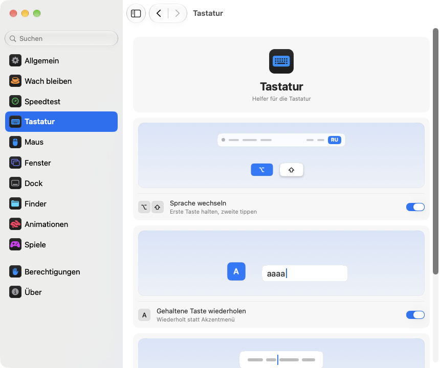
</picture>
</p>

## Installation

```bash
brew install --cask dev-pikapik/pika-tools/pika-tools && open -a pika-tools
```

pika-tools erscheint oben in der Menüleiste. Alles bleibt aus, bis du es einschaltest.

<details>
<summary>Kein Homebrew? Zwei andere Wege</summary>

Ohne Homebrew: Öffne das Terminal, füge diese Zeile ein und drücke den Zeilenschalter (Return):

```bash
/bin/bash -c "$(curl -fsSL https://raw.githubusercontent.com/dev-pikapik/pika-tools/main/install.sh)"
```

Oder lade [pika-tools.dmg](https://github.com/dev-pikapik/pika-tools/releases/latest/download/pika-tools.dmg) herunter, öffne die Datei und ziehe die App in den Ordner „Programme“.

Homebrew und das Skript legen die App in `/Applications` ab, starten sie, fragen nach den Berechtigungen und schalten „Beim Anmelden öffnen“ ein. Danach aktualisiert sich die App selbst, siehe **Updates**. Zum Entfernen siehe **Deinstallation**.

</details>

## Was es kann

<table>
<tbody><tr>
<td width="50%" valign="top">
<picture><source media="(prefers-color-scheme: dark)" srcset="../media/keep-awake-dark.png"></picture>
<br><b>Wach bleiben</b>
<br>Dein Mac bleibt wach, so lange du willst, auch mit zugeklapptem Deckel.
</td>
<td width="50%" valign="top">
<picture><source media="(prefers-color-scheme: dark)" srcset="../media/command-keys-dark.png"></picture>
<br><b>⌘Q und ⌘W schützen</b>
<br>Nichts wird aus Versehen beendet oder geschlossen. Mit ⇧ klappt es gewollt.
</td>
</tr></tbody>
<tbody><tr>
<td width="50%" valign="top">
<picture><source media="(prefers-color-scheme: dark)" srcset="../media/compress-dark.png">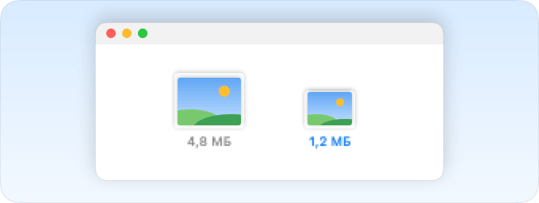</picture>
<br><b>Kleinere Kopie</b>
<br>Rechtsklick auf ein Foto, PDF oder Video, und daneben liegt eine leichtere Kopie.
</td>
<td width="50%" valign="top">
<picture><source media="(prefers-color-scheme: dark)" srcset="../media/convert-dark.png">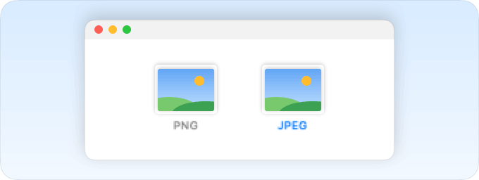</picture>
<br><b>Umwandeln</b>
<br>Bilder, Videos und Musik per Rechtsklick in einem anderen Format sichern.
</td>
</tr></tbody>
<tbody><tr>
<td width="50%" valign="top">
<picture><source media="(prefers-color-scheme: dark)" srcset="../media/input-switch-dark.png">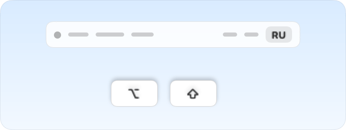</picture>
<br><b>Sprache wechseln</b>
<br>Halte ⌥ gedrückt und tippe auf ⇧, um die Tastatursprache zu wechseln.
</td>
<td width="50%" valign="top">
<picture><source media="(prefers-color-scheme: dark)" srcset="../media/quit-on-close-dark.png"></picture>
<br><b>Mit dem letzten Fenster beenden</b>
<br>Schließt du das letzte Fenster einer App, wird auch die App beendet.
</td>
</tr></tbody>
<tbody><tr>
<td width="50%" valign="top">
<picture><source media="(prefers-color-scheme: dark)" srcset="../media/window-zoom-dark.png">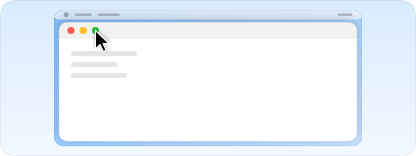</picture>
<br><b>Grüner Knopf vergrößert</b>
<br>Das Fenster füllt den Bildschirm, ohne in den Vollbildmodus zu wechseln.
</td>
<td width="50%" valign="top">
<picture><source media="(prefers-color-scheme: dark)" srcset="../media/dock-hide-dark.png"></picture>
<br><b>Per Klick im Dock ausblenden</b>
<br>Klicke auf die App, in der du gerade bist, und sie macht Platz.
</td>
</tr></tbody>
<tbody><tr>
<td width="50%" valign="top">
<picture><source media="(prefers-color-scheme: dark)" srcset="../media/new-file-dark.png"></picture>
<br><b>Neue Datei</b>
<br>Rechtsklick im Finder, Namen eintippen, und eine leere Datei ist da.
</td>
<td width="50%" valign="top">
<picture><source media="(prefers-color-scheme: dark)" srcset="../media/finder-cut-dark.png">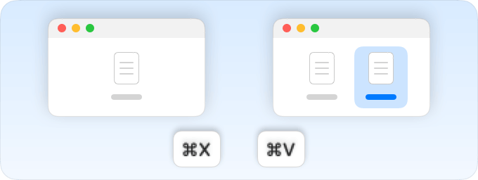</picture>
<br><b>⌘X verschiebt Dateien</b>
<br>Dateien im Finder ausschneiden und dort einsetzen, wo du sie brauchst.
</td>
</tr></tbody>
<tbody><tr>
<td width="50%" valign="top">
<picture><source media="(prefers-color-scheme: dark)" srcset="../media/finder-open-dark.png">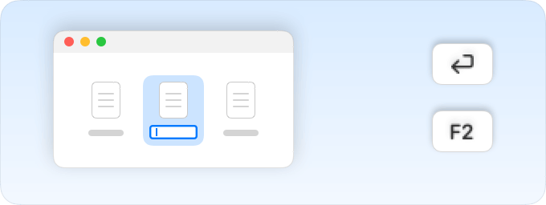</picture>
<br><b>Eingabetaste öffnet Dateien</b>
<br>Wähle Dateien im Finder aus und drücke die Eingabetaste, um sie zu öffnen.
</td>
<td width="50%" valign="top">
<picture><source media="(prefers-color-scheme: dark)" srcset="../media/finder-delete-dark.png">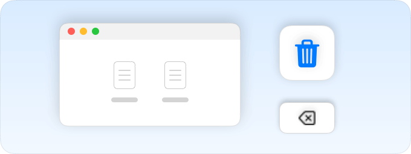</picture>
<br><b>Löschtaste in den Papierkorb</b>
<br>Drücke ⌫ im Finder, und die ausgewählten Dateien landen im Papierkorb.
</td>
</tr></tbody>
<tbody><tr>
<td width="50%" valign="top">
<picture><source media="(prefers-color-scheme: dark)" srcset="../media/game-mode-dark.png"></picture>
<br><b>Spielmodus</b>
<br>Während du spielst, springt nichts über das Spiel und nichts schließt es.
</td>
<td width="50%" valign="top">
<picture><source media="(prefers-color-scheme: dark)" srcset="../media/speed-test-dark.png"></picture>
<br><b>Speedtest</b>
<br>Wie schnell dein Internet ist und wofür es reicht.
</td>
</tr></tbody>
<tbody><tr>
<td width="50%" valign="top">
<picture><source media="(prefers-color-scheme: dark)" srcset="../media/side-buttons-dark.png">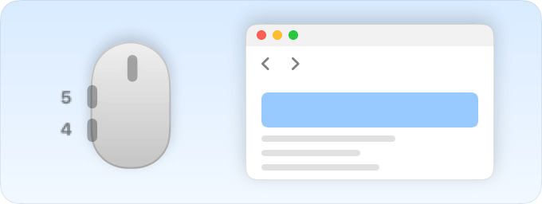</picture>
<br><b>Seitentasten der Maus</b>
<br>Die Tasten 4 und 5 gehen zurück und vor, wie ein Wischen.
</td>
<td width="50%" valign="top">
<picture><source media="(prefers-color-scheme: dark)" srcset="../media/wheel-lines-dark.png"></picture>
<br><b>Zeilenweise scrollen</b>
<br>Jeder Klick am Mausrad scrollt gleich weit, egal wie schnell du drehst.
</td>
</tr></tbody>
<tbody><tr>
<td width="50%" valign="top">
<picture><source media="(prefers-color-scheme: dark)" srcset="../media/wheel-direction-dark.png">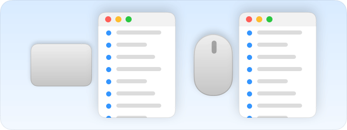</picture>
<br><b>Scrollrichtung</b>
<br>Eine Richtung fürs Trackpad, eine andere für die Maus.
</td>
<td width="50%" valign="top">
<picture><source media="(prefers-color-scheme: dark)" srcset="../media/linear-pointer-dark.png">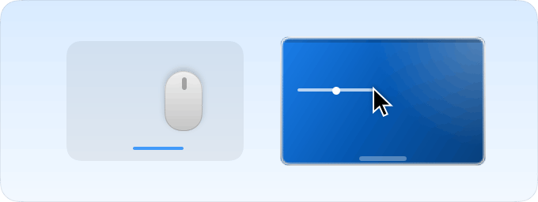</picture>
<br><b>Ohne Zeigerbeschleunigung</b>
<br>Der Zeiger bewegt sich genau so weit wie deine Hand.
</td>
</tr></tbody>
<tbody><tr>
<td width="50%" valign="top">
<picture><source media="(prefers-color-scheme: dark)" srcset="../media/key-repeat-dark.png"></picture>
<br><b>Gehaltene Taste wiederholen</b>
<br>Halte eine Taste, und sie tippt immer wieder, ohne Akzentmenü.
</td>
<td width="50%" valign="top">
<picture><source media="(prefers-color-scheme: dark)" srcset="../media/home-end-dark.png">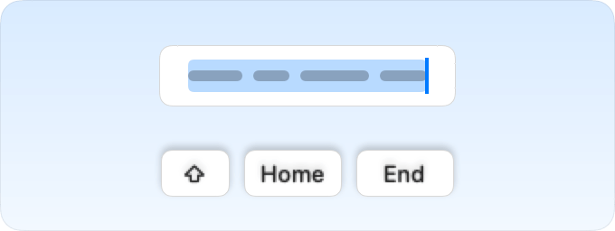</picture>
<br><b>Home und End</b>
<br>Beim Tippen an den Anfang oder das Ende der Zeile springen.
</td>
</tr></tbody>
<tbody><tr>
<td width="50%" valign="top">
<picture><source media="(prefers-color-scheme: dark)" srcset="../media/animations-dark.png"></picture>
<br><b>Animationen</b>
<br>Dock, Fenster und Übersicht werden schneller, auf Wunsch sofort.
</td>
<td width="50%" valign="top"></td>
</tr></tbody>
</table>

## Mehr erfahren

<details>
<summary>Erster Start</summary>

pika-tools braucht zwei Berechtigungen. Beim ersten Start öffnen sich die Einstellungen auf der Seite „Berechtigungen“, die dich Schritt für Schritt durchführt, und macOS zeigt eigene Abfragen an. Öffne **Systemeinstellungen › Datenschutz & Sicherheit** und aktiviere pika-tools unter:

- **Bedienungshilfen**, damit die App einen Tastendruck oder Klick ändern kann, bevor er bei anderen Apps ankommt.
- **Eingabeüberwachung**, damit die App Tastendrücke und Klicks überhaupt sehen kann.

Die App erkennt die Änderung innerhalb von ein, zwei Sekunden, ein Neustart ist nicht nötig.

pika-tools zeichnet nichts auf, speichert nichts und sendet nichts von dem, was du tippst oder klickst. Ereignisse werden im Arbeitsspeicher verarbeitet und sofort weitergegeben. Die einzige Netzwerkanfrage ist die Suche nach Updates, bei der GitHub nach der neuesten Version gefragt wird.

</details>

<details>
<summary>Alle Werkzeuge im Detail</summary>

**⌘Q und ⌘W schützen.** ⌘Q und ⌘W allein bewirken nichts, damit du nicht aus Versehen eine App beendest oder ein Fenster schließt. Nimm Shift dazu, um es bewusst zu tun: ⇧⌘Q beendet, ⇧⌘W schließt. Funktioniert in jeder App. Jede Taste hat einen eigenen Schalter. Standardmäßig aus.

**Sprache mit Option+Shift wechseln.** Halte Option gedrückt und tippe auf Shift: macOS wechselt zur nächsten Eingabequelle. Halte Option weiter gedrückt und tippe erneut auf Shift, um weiterzugehen. Halte Shift gedrückt und tippe auf Option, um zurückzugehen. Drückst du zwischendurch eine andere Taste, klickst oder nimmst Cmd, Ctrl oder Fn dazu, wird nicht gewechselt, sodass Kurzbefehle wie Option+Shift+Pfeiltaste wie bisher funktionieren. Standardmäßig aus.

**Gehaltene Taste wiederholen.** Halte eine Taste gedrückt, und der Buchstabe wird immer wieder getippt, statt dass das Akzentmenü erscheint. Praktisch in Spielen und beim Schreiben. Bereits geöffnete Apps übernehmen das nach einem Neustart. Schaltest du es aus, verhält sich macOS wieder wie gewohnt. Standardmäßig aus.

**Home und End springen an Zeilenanfang und -ende.** Beim Tippen setzt Home den Cursor an den Anfang der Zeile und End an ihr Ende, statt die Seite zu scrollen. Mit ⇧ wählst du bis dorthin aus, mit ⌘ springst du an den Anfang oder das Ende des ganzen Textes. Außerhalb von Textfeldern und in Terminals, virtuellen Maschinen und Apps für entfernte Schreibtische funktionieren die Tasten wie bisher. Du kannst weitere Apps eintragen, in denen sie wie gewohnt funktionieren sollen. Standardmäßig aus.

**Zeigerbeschleunigung ausschalten.** Der Zeiger bewegt sich genau so weit wie die Maus, egal wie schnell du sie bewegst, wie bei LinearMouse. Ein Regler **Zeigerbewegung** legt fest, wie schnell er sich bewegt. Funktioniert nur mit Mäusen, das Trackpad bleibt, wie es ist. Schalte es aus oder beende pika-tools, und macOS bekommt seine eigenen Einstellungen zurück. Standardmäßig aus.

**Zeilenweise scrollen.** Jeder Klick des Mausrads scrollt gleich viele Zeilen, egal wie schnell du es drehst. Wähle 1 bis 10 Zeilen pro Klick, standardmäßig 3. Natürliches Scrollen bleibt so, wie du es in den Systemeinstellungen eingestellt hast. Funktioniert nur für Mäuse, das Trackpad bleibt, wie es ist. Standardmäßig aus. Neben dem Regler **Distanz pro Klick** scrollt eine kleine Seite um die gewählte Distanz, und ein Punkt markiert den Standardwert.

Manche Apps und Spiele zählen das Scrollen in genauen Pixeln: Stell dafür dieselbe Einstellung auf Pixel um und wähle 1 bis 200 Pixel pro Klick, standardmäßig 40. Der Regler zeigt auch, wie viel der Bildschirmhöhe das ist.

**Scrollrichtung für Trackpad und Maus.** macOS hat nur einen Schalter für natürliches Scrollen, für Trackpad und Maus zusammen. Schalte das hier ein und wähle für jedes eine Richtung: **Natürlich**, dann folgt die Seite deinen Fingern wie auf dem iPhone, oder **Klassisch**, bei dem sich die Seite andersherum bewegt. Die Wahl fürs Trackpad gilt auch fürs seitliche Scrollen und fürs Nachgleiten, wenn du die Finger hebst. Die Magic Mouse scrollt per Berührung und folgt deshalb der Wahl fürs Trackpad. Wählst du auf jedem deiner Macs dasselbe, fühlt sich Scrollen überall gleich an, auch wenn du die Maus mit „Universelle Steuerung“ auf einen anderen Mac bewegst. Standardmäßig aus. Beim Einschalten sind beide so wie in den Systemeinstellungen, es ändert sich also nichts, bis du etwas anderes wählst.

**Seitentasten für Zurück und Vorwärts.** Die Maustasten 4 und 5 gehen in Safari, im Finder und in anderen Apple-Apps, in Firefox, Opera und ForkLift zurück und vorwärts, genau wie eine Wischgeste auf dem Trackpad. Andere Apps, zum Beispiel die JetBrains-IDEs, bekommen die Tasten unverändert und gehen damit auf ihre eigene Weise um. Sind sie bei deiner Maus vertauscht, schalte **Seitentasten tauschen** ein. Standardmäßig aus.

**Beenden, wenn das letzte Fenster geschlossen wird.** Schließt du das letzte Fenster einer App, wird die App beendet. Der Finder bleibt offen, ebenso Apps mit Fenstern auf anderen Schreibtischen oder im Dock. Du kannst Apps festlegen, die so nie beendet werden sollen. Standardmäßig aus.

**Mit einem Klick im Dock ausblenden.** Klicke im Dock auf das Symbol der App, in der du gerade arbeitest, und sie wird ausgeblendet. Ein weiterer Klick holt sie zurück. Standardmäßig aus.

**Grüner Knopf vergrößert das Fenster.** Klicke auf den grünen Knopf eines Fensters, und es füllt den Bildschirm, ohne in den Vollbildmodus zu wechseln. Noch ein Klick bringt die vorherige Größe zurück. Halte ⌥ gedrückt, dann funktioniert der Knopf wie immer. Vollbild bleibt im Menü des Knopfs und auf ⌃⌘F. Du kannst Apps auflisten, in denen der grüne Knopf wie gewohnt funktionieren soll. Standardmäßig aus.

**Neue Datei im Finder.** Rechtsklick in ein Finder-Fenster oder auf den Schreibtisch, **Neue Datei** wählen, Namen eingeben – schon ist eine leere Datei da. Standardmäßig .txt. Standardmäßig aus.

**Eingabetaste öffnet Dateien im Finder.** Wähle Dateien in einem Finder-Fenster oder auf dem Schreibtisch aus und drücke Return oder Enter, dann öffnen sie sich. F2 oder fn F2 benennt die ausgewählte Datei um. In Textfeldern, zum Beispiel beim Eingeben eines Namens, funktionieren die Tasten wie gewohnt. Standardmäßig aus.

**⌘X schneidet Dateien im Finder aus.** Wähle Dateien aus und drücke ⌘X, öffne den gewünschten Ordner und drücke ⌘V: Die Dateien werden dorthin verschoben statt kopiert. ⌘C bricht das Ausschneiden ab. Standardmäßig aus.

**Löschtaste löscht Dateien im Finder.** Wähle Dateien aus und drücke ⌫ oder ⌦ (fn ⌫ am Laptop), dann kommen sie in den Papierkorb, genau wie mit ⌘⌫. Während du eine Datei umbenennst, suchst oder in einem anderen Feld tippst, löschen die Tasten wie gewohnt Buchstaben. Standardmäßig aus.

**Kleinere Kopie im Finder.** Rechtsklick auf eine Datei im Finder und **Kleinere Kopie erstellen** wählen. Daneben landet eine leichtere Version eines Fotos, GIFs, PDFs oder Videos, oft um ein Vielfaches kleiner. Unkomprimierter Ton wie WAV oder AIFF wird zu einer kompakten M4A. Lässt sich eine Datei nicht weiter verkleinern, entsteht keine Kopie, und pika-tools sagt dir Bescheid. Das Original bleibt, wie es ist, und nichts verlässt deinen Mac. Standardmäßig aus.

**Umwandeln im Finder.** Rechtsklick auf eine Datei im Finder und **Umwandeln in** wählen, um sie in einem anderen Format zu speichern: Bilder als JPEG, PNG, HEIC, GIF, TIFF oder PDF, Videos als MP4, MOV oder nur den Ton, Musik als M4A, WAV oder AIFF. Das Original bleibt, wie es ist, und nichts verlässt deinen Mac. Lässt sich getrennt von der kleineren Kopie einschalten. Standardmäßig aus.

**Spielmodus.** Füg deine Spiele hinzu, und solange du spielst, reißt dich dein Mac nicht aus dem Spiel. Spotlight, Siri, ⌘Tab, Mission Control und Wischen zwischen Schreibtischen öffnen sich nicht über dem Spiel, ⌘Q und ⌘W schließen es nicht aus Versehen, der Zeiger rutscht nicht ins Dock, in die Menüleiste oder auf einen anderen Bildschirm, und der Bildschirm bleibt an. Jeder dieser Punkte hat einen eigenen Schalter auf der Seite „Spiele“, und pika-tools schlägt Spiele vor, die es auf deinem Mac findet. Im Spiel bleibt Ctrl-Klick ein Klick, und Ctrl mit Pfeiltasten wechselt den Schreibtisch nicht. Auch Minecraft wird erkannt: Füge den Minecraft Launcher oder CurseForge hinzu, dann schaltet sich der Modus in Minecraft selbst ein. Um ein Spiel zu beenden, drück ⇧⌘Q, um sein Fenster zu schließen, ⇧⌘W. ⌥⌘Esc funktioniert immer. Sobald du das Spiel verlässt, funktioniert alles wie gewohnt. Standardmäßig aus.

Jedes Werkzeug hat einen eigenen Schalter im Menü und in den Einstellungen.

Das Symbol in der Menüleiste zeigt den Status auf einen Blick: ein Pfeil mit Klick, wenn die Werkzeuge arbeiten, ein durchgestrichener Pfeil, wenn alles aus ist, und ein Warndreieck, wenn ein Werkzeug an ist, aber Berechtigungen fehlen.

Das Fenster der Menüleiste startet mit nur wenigen Zeilen. Welche es zeigt, bestimmst du selbst: Klicke unten auf den Stift, setze einen Haken bei allem, was du sehen willst, und klicke auf **Fertig**. Ausgeblendete Zeilen funktionieren weiter und bleiben in den Einstellungen. Passt das Fenster nicht auf den Bildschirm, lässt es sich scrollen.

Die App folgt deiner Systemsprache oder der Sprache, die du in den Einstellungen wählst. Verfügbar sind alle 23 Sprachen aus der Liste oben auf dieser Seite.

</details>

<details>
<summary>Wach bleiben</summary>

Verhindert, dass dein Mac einschläft, während du nicht an der Tastatur bist: für eine beliebige Zeit von 1 Sekunde bis 365 Tagen oder bis du es ausschaltest. Schalte es im Menü ein und lege die Dauer in den Einstellungen fest: Gib Tage, Stunden, Minuten und Sekunden ein, nutze ↑ und ↓ oder klicke auf eine Vorgabe von 15 Minuten bis 8 Stunden. Das Menü zeigt, wie viel Zeit noch bleibt und wann es endet. Beim **Display** gibt es zwei Möglichkeiten. **Immer an**: Es wird nicht dunkel, ohne Bildschirmschoner und Sperrbildschirm. **Geht wie gewohnt aus**: Es geht nach eigenem Timer aus, während dein Mac weiterarbeitet. **Display jetzt ausschalten** (auch im Menü) schaltet es sofort aus, der Mac arbeitet weiter: Bewege die Maus oder drücke eine Taste, um es zurückzuholen. Wenn du pika-tools beendest, endet auch „Wach bleiben“.

Auf einem MacBook kannst du außerdem **Mit geschlossenem Deckel arbeiten** einschalten. macOS hat dafür keinen Schalter, deshalb führt pika-tools `pmset -a disablesleep 1` aus und fragt nach einem Administratorpasswort: Nur ein Administrator darf ändern, wie der Mac in den Ruhezustand geht. Die Einstellung wird automatisch zurückgesetzt, wenn „Wach bleiben“ endet, wenn du die App beendest oder wenn sie abstürzt. Gibst du kein Passwort ein, ändert sich nichts. Achte bei geschlossenem Deckel auf ausreichende Belüftung. **Bei Akku unter 20 % beenden** beendet die Sitzung, bevor der Akku leer ist.

Wach bleiben, der Display-Modus und der Modus bei geschlossenem Deckel lassen sich über die App Kurzbefehle auf eine Taste im Kontrollzentrum, in der Menüleiste oder auf ein Widget auf dem Schreibtisch legen, mit Links, die du unter Einstellungen › Wach bleiben kopierst.

</details>

<details>
<summary>Speedtest</summary>

Zeigt, wie schnell dein Internet gerade ist. Klick auf **Geschwindigkeit prüfen** unter Einstellungen › Speedtest oder auf **Prüfen** im Menü, sobald du die Zeile mit dem Stiftknopf hinzugefügt hast. Nach etwa einer halben Minute siehst du Download, Upload, Ping und Reaktionsfähigkeit: wie schnell alles reagiert, während die Leitung ausgelastet ist. Darunter steht in einfachen Worten, wofür es reicht: Filme in 4K, Videoanrufe, Onlinespiele und große Downloads. Die Messung nutzt networkQuality aus macOS und die Server von Apple. Das letzte Ergebnis bleibt bis zur nächsten Messung, und ein Link für Kurzbefehle startet sie aus dem Kontrollzentrum.

</details>

<details>
<summary>Einstellungen</summary>

Öffne die Einstellungen im Menü mit **Einstellungen …** oder ⌘, – oder starte pika-tools einfach erneut über den Finder, das Launchpad oder Spotlight. Solange das Fenster offen ist, erscheint die App im Dock und bei ⌘Tab.

- **Allgemein**: Beim Anmelden öffnen, Erscheinungsbild (System, Hell oder Dunkel), Sprache, Updates und Sicherung: Einstellungen als Datei exportieren und importieren oder über iCloud Drive synchronisieren.
- **Wach bleiben**: Dauer, Display- und Deckeloptionen.
- **Speedtest**: Internetgeschwindigkeit messen und sehen, wofür sie reicht.
- **Tastatur**: Sprachwechsel, Tastenwiederholung, Home und End.
- **Maus**: Zeigerbeschleunigung und Zeigerbewegung, zeilenweises Scrollen, Scrollrichtung, Seitentasten.
- **Fenster**: Vergrößern mit dem grünen Knopf (mit einer Liste von Ausnahmen), Schutz für ⌘Q und ⌘W und Beenden nach dem letzten Fenster (ebenfalls mit einer Liste von Ausnahmen).
- **Dock**: Ausblenden per Klick im Dock.
- **Finder**: neue Datei, kleinere Kopie und Umwandeln, Öffnen mit der Eingabetaste, Ausschneiden mit ⌘X und Löschen mit ⌫.
- **Berechtigungen**: der Status beider Berechtigungen und von iCloud Drive, wenn die Synchronisierung läuft, mit Tasten, die die richtige Stelle in den Systemeinstellungen öffnen.
- **Über**: Version, Links zum Änderungsprotokoll und zum Melden eines Problems.

Viele Einstellungen haben ein kleines Bild, das zeigt, was sie tun, etwa einen Mac, der wach bleibt, oder ein Fenster, das sich hinter dem Dock versteckt. Das Bild ändert sich mit dem Schalter und steht still, wenn in den Systemeinstellungen „Bewegung reduzieren“ aktiviert ist.

Jede Seite hat unten eine Taste **Standard wiederherstellen…**. Sie fragt zuerst nach, schaltet dann die Werkzeuge auf dieser Seite aus und setzt ihre Optionen zurück, als hätte pika-tools sie nie angefasst.

**Einstellungen mit iCloud synchronisieren** hält pika-tools auf all deinen Macs gleich. Die Einstellungen liegen im Ordner pika-tools in iCloud Drive, und die jüngste Änderung gewinnt. Standardmäßig aus, und iCloud Drive muss eingeschaltet sein. Berechtigungen werden nicht synchronisiert: Jeder Mac fragt selbst danach.

</details>

<details>
<summary>Updates</summary>

pika-tools sucht beim Start und alle 6 Stunden nach neuen Versionen. Das kannst du unter Einstellungen › Allgemein ausschalten. Wenn eine neue Version erscheint, zeigt das Menü die Taste **Auf … aktualisieren**: Ein Klick, und die App lädt das Update, installiert es und startet neu. Von Hand suchen kannst du mit **Jetzt suchen** unter Einstellungen › Allgemein.

Mit Homebrew kannst du auch `brew upgrade --cask pika-tools` ausführen.

Seit Version 1.3 bleiben die Berechtigungen nach Updates erhalten.

</details>

<details>
<summary>Deinstallation</summary>

```bash
/bin/bash -c "$(curl -fsSL https://raw.githubusercontent.com/dev-pikapik/pika-tools/main/uninstall.sh)"
```

Wenn du mit Homebrew installiert hast: `brew uninstall --cask --zap pika-tools`.

Beide beenden die App, entfernen sie aus den Anmeldeobjekten und löschen sie. Das Skript setzt zusätzlich ihre Berechtigungen zurück.

</details>

<details>
<summary>Häufige Fragen</summary>

**Warum braucht die App zwei Berechtigungen?**
macOS teilt den Zugriff auf Tastatur und Maus in zwei Teile. Die Eingabeüberwachung erlaubt der App, Ereignisse zu sehen, die Bedienungshilfen erlauben ihr, sie zu ändern. Um einen Kurzbefehl zu blockieren, braucht sie beides.

**macOS meldet, dass die App von einem nicht verifizierten Entwickler stammt.**
pika-tools ist signiert, aber nicht von Apple notarisiert. Homebrew und das Installationsskript kümmern sich darum. Wenn du die dmg verwendet hast, öffne **Systemeinstellungen › Datenschutz & Sicherheit** und klicke auf **Dennoch öffnen** oder führe Folgendes aus:

```bash
xattr -dr com.apple.quarantine /Applications/pika-tools.app
```

**Funktioniert die App auf Intel-Macs?**
Ja. Es ist eine universelle App für Apple Silicon und Intel, ab macOS 14 Sonoma.

**Die Berechtigung ist an, aber nichts funktioniert.**
Entferne pika-tools unter **Systemeinstellungen › Datenschutz & Sicherheit** mit der Taste − aus beiden Listen und füge die App dann wieder hinzu. Auf der Seite „Berechtigungen“ in den Einstellungen von pika-tools gibt es Tasten, die die richtige Stelle öffnen.

</details>

<p align="center"><sub><a href="../whats-new/README.de.md">Neuigkeiten</a> · <a href="https://github.com/dev-pikapik/homebrew-pika-tools">Homebrew-Tap</a> · <a href="../../CONTRIBUTING.md">Selbst bauen</a> · <a href="../../LICENSE">MIT-Lizenz</a> · © 2026 pikapik</sub></p>
