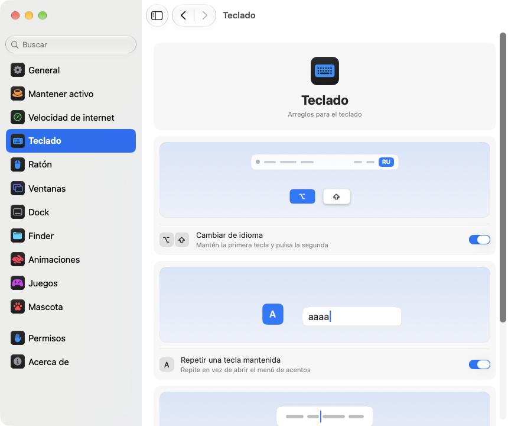

<p align="center"></p>
<h1 align="center">pikapik</h1>
<p align="center">Pequeñas mejoras para el teclado, el ratón, las ventanas y el Finder, directamente en la barra de menús de tu Mac.</p>
<p align="center"><sub><a href="../../README.md">English</a> · <a href="README.ru.md">Русский</a> · <a href="README.uk.md">Українська</a> · <a href="README.de.md">Deutsch</a> · <a href="README.fr.md">Français</a> · <b>Español</b> · <a href="README.it.md">Italiano</a> · <a href="README.pt-BR.md">Português (Brasil)</a> · <a href="README.ja.md">日本語</a> · <a href="README.zh-Hans.md">简体中文</a> · <a href="README.ko.md">한국어</a> · <a href="README.ro.md">Română</a> · <a href="README.pl.md">Polski</a> · <a href="README.tr.md">Türkçe</a> · <a href="README.nl.md">Nederlands</a> · <a href="README.sv.md">Svenska</a> · <a href="README.cs.md">Čeština</a> · <a href="README.zh-Hant.md">繁體中文</a> · <a href="README.ar.md">العربية</a> · <a href="README.hi.md">हिन्दी</a> · <a href="README.id.md">Bahasa Indonesia</a> · <a href="README.vi.md">Tiếng Việt</a> · <a href="README.th.md">ไทย</a></sub></p>

<p align="center">
<picture>
<source media="(prefers-color-scheme: dark)" srcset="../media/settings-es-dark.png">

</picture>
</p>

## Instalación

```bash
brew install --cask dev-pikapik/pika-tools/pikapik && open -a pikapik
```

pikapik aparece en la barra de menús, arriba en la pantalla. Todo está apagado hasta que tú lo enciendas.

<details>
<summary>¿No tienes Homebrew? Otras dos formas</summary>

Sin Homebrew, abre Terminal, pega esta línea y pulsa Retorno:

```bash
/bin/bash -c "$(curl -fsSL https://raw.githubusercontent.com/dev-pikapik/pika-tools/main/install.sh)"
```

O descarga [pikapik.dmg](https://github.com/dev-pikapik/pika-tools/releases/latest/download/pikapik.dmg), ábrelo y arrastra la app a la carpeta Aplicaciones.

Tanto Homebrew como el script colocan la app en `/Applications`, la abren, piden los permisos y activan la apertura al iniciar sesión. Después, la app se actualiza sola; consulta **Actualizaciones**. Para eliminarla, consulta **Desinstalación**.

</details>

## Qué hace

<table>
<tbody><tr>
<td width="50%" valign="top">
<picture><source media="(prefers-color-scheme: dark)" srcset="../media/keep-awake-dark.png"></picture>
<br><b>Mantener activo</b>
<br>Tu Mac no se duerme durante el tiempo que necesites, incluso con la tapa cerrada.
</td>
<td width="50%" valign="top">
<picture><source media="(prefers-color-scheme: dark)" srcset="../media/command-keys-dark.png"></picture>
<br><b>Proteger ⌘Q y ⌘W</b>
<br>Nada se cierra por accidente. Añade ⇧ cuando quieras hacerlo.
</td>
</tr></tbody>
<tbody><tr>
<td width="50%" valign="top">
<picture><source media="(prefers-color-scheme: dark)" srcset="../media/compress-dark.png"></picture>
<br><b>Copia más ligera</b>
<br>Clic derecho en una foto, un PDF o un vídeo, y aparece una copia más ligera.
</td>
<td width="50%" valign="top">
<picture><source media="(prefers-color-scheme: dark)" srcset="../media/convert-dark.png"></picture>
<br><b>Conversión</b>
<br>Guarda una imagen, un vídeo o una canción en otro formato con un clic derecho.
</td>
</tr></tbody>
<tbody><tr>
<td width="50%" valign="top">
<picture><source media="(prefers-color-scheme: dark)" srcset="../media/input-switch-dark.png"></picture>
<br><b>Cambiar de idioma</b>
<br>Mantén ⌥ y pulsa ⇧ para cambiar el idioma del teclado.
</td>
<td width="50%" valign="top">
<picture><source media="(prefers-color-scheme: dark)" srcset="../media/quit-on-close-dark.png"></picture>
<br><b>Salir con la última ventana</b>
<br>Cierra la última ventana de una app y la app también se cierra.
</td>
</tr></tbody>
<tbody><tr>
<td width="50%" valign="top">
<picture><source media="(prefers-color-scheme: dark)" srcset="../media/window-zoom-dark.png"></picture>
<br><b>El botón verde amplía</b>
<br>La ventana llena la pantalla sin pasar a pantalla completa.
</td>
<td width="50%" valign="top">
<picture><source media="(prefers-color-scheme: dark)" srcset="../media/dock-hide-dark.png"></picture>
<br><b>Ocultar con un clic en el Dock</b>
<br>Haz clic en la app que estás usando y se aparta.
</td>
</tr></tbody>
<tbody><tr>
<td width="50%" valign="top">
<picture><source media="(prefers-color-scheme: dark)" srcset="../media/new-file-dark.png"></picture>
<br><b>Archivo nuevo</b>
<br>Clic derecho en el Finder, escribe un nombre y listo: un archivo vacío.
</td>
<td width="50%" valign="top">
<picture><source media="(prefers-color-scheme: dark)" srcset="../media/finder-cut-dark.png"></picture>
<br><b>⌘X mueve archivos</b>
<br>Corta archivos en el Finder y pégalos donde quieras.
</td>
</tr></tbody>
<tbody><tr>
<td width="50%" valign="top">
<picture><source media="(prefers-color-scheme: dark)" srcset="../media/finder-open-dark.png"></picture>
<br><b>Intro abre archivos</b>
<br>Selecciona archivos en el Finder y pulsa Intro para abrirlos.
</td>
<td width="50%" valign="top">
<picture><source media="(prefers-color-scheme: dark)" srcset="../media/finder-delete-dark.png"></picture>
<br><b>Borrar a la Papelera</b>
<br>Pulsa ⌫ en el Finder y los archivos seleccionados van a la Papelera.
</td>
</tr></tbody>
<tbody><tr>
<td width="50%" valign="top">
<picture><source media="(prefers-color-scheme: dark)" srcset="../media/game-mode-dark.png"></picture>
<br><b>Modo de juego</b>
<br>Mientras juegas, nada se abre encima del juego ni lo cierra.
</td>
<td width="50%" valign="top">
<picture><source media="(prefers-color-scheme: dark)" srcset="../media/speed-test-dark.png"></picture>
<br><b>Velocidad de internet</b>
<br>Lo rápida que es tu conexión y para qué te alcanza.
</td>
</tr></tbody>
<tbody><tr>
<td width="50%" valign="top">
<picture><source media="(prefers-color-scheme: dark)" srcset="../media/side-buttons-dark.png"></picture>
<br><b>Botones laterales</b>
<br>Los botones 4 y 5 van atrás y adelante, como un deslizamiento.
</td>
<td width="50%" valign="top">
<picture><source media="(prefers-color-scheme: dark)" srcset="../media/wheel-lines-dark.png"></picture>
<br><b>Desplazarse por líneas</b>
<br>Cada clic de la rueda desplaza lo mismo, la gires tan rápido como la gires.
</td>
</tr></tbody>
<tbody><tr>
<td width="50%" valign="top">
<picture><source media="(prefers-color-scheme: dark)" srcset="../media/wheel-direction-dark.png"></picture>
<br><b>Dirección de desplazamiento</b>
<br>Una dirección para el trackpad y otra para el ratón.
</td>
<td width="50%" valign="top">
<picture><source media="(prefers-color-scheme: dark)" srcset="../media/linear-pointer-dark.png"></picture>
<br><b>Sin aceleración del puntero</b>
<br>El puntero recorre exactamente lo mismo que tu mano.
</td>
</tr></tbody>
<tbody><tr>
<td width="50%" valign="top">
<picture><source media="(prefers-color-scheme: dark)" srcset="../media/key-repeat-dark.png"></picture>
<br><b>Repetir una tecla mantenida</b>
<br>Mantén una tecla para repetirla, sin el menú de acentos.
</td>
<td width="50%" valign="top">
<picture><source media="(prefers-color-scheme: dark)" srcset="../media/home-end-dark.png"></picture>
<br><b>Home y End</b>
<br>Ve al inicio o al final de la línea mientras escribes.
</td>
</tr></tbody>
<tbody><tr>
<td width="50%" valign="top">
<picture><source media="(prefers-color-scheme: dark)" srcset="../media/animations-dark.png"></picture>
<br><b>Animaciones</b>
<br>Acelera el Dock, las ventanas y Vista Rápida, hasta que sean instantáneos.
</td>
<td width="50%" valign="top">
<picture><source media="(prefers-color-scheme: dark)" srcset="../media/leftover-permissions-dark.png"></picture>
<br><b>Permisos de apps eliminadas</b>
<br>Quita los permisos que macOS guarda para las apps que ya eliminaste.
</td>
</tr></tbody>
<tbody><tr>
<td width="50%" valign="top">
<picture><source media="(prefers-color-scheme: dark)" srcset="../media/pet-dark.png"></picture>
<br><b>Mascota en el escritorio</b>
<br>Un amiguito pasea detrás de tus ventanas. Agárralo y lánzalo, o pulsa Espacio para que salte.
</td>
</tr></tbody>
</table>

## Más detalles

<details>
<summary>Primer inicio</summary>

pikapik necesita dos permisos. La primera vez que se abre, muestra los ajustes en la página Permisos, que te guía paso a paso, y macOS muestra sus propios avisos. Ve a **Ajustes del Sistema › Privacidad y seguridad** y activa pikapik en:

- **Accesibilidad**, para que la app pueda cambiar una pulsación o un clic antes de que llegue a otras apps.
- **Monitorización de entrada**, para que la app pueda ver las pulsaciones y los clics.

La app detecta el cambio en un par de segundos, sin necesidad de reiniciar.

pikapik no graba, no guarda ni envía nada de lo que escribes o pulsas. Los eventos se procesan en memoria y se transmiten al instante. La única conexión de red es la búsqueda de actualizaciones, que pregunta a GitHub cuál es la última versión.

</details>

<details>
<summary>Cada herramienta en detalle</summary>

**Proteger ⌘Q y ⌘W.** ⌘Q y ⌘W por sí solos no hacen nada, así que no cerrarás una app ni una ventana por accidente. Añade Mayúsculas para hacerlo a propósito: ⇧⌘Q sale de la app y ⇧⌘W cierra la ventana. Funciona en todas las apps. Cada tecla tiene su propio interruptor. Desactivado por omisión.

**Cambiar de idioma con Opción+Mayúsculas.** Mantén pulsada Opción y toca Mayúsculas: macOS pasa a la siguiente fuente de entrada. Sigue manteniendo Opción y vuelve a tocar Mayúsculas para avanzar más. Mantén pulsada Mayúsculas y toca Opción para retroceder. Si entre medias pulsas otra tecla, haces clic o añades Comando, Control o Fn, no cambia nada, así que atajos como Opción+Mayúsculas+flecha siguen funcionando como antes. Desactivado por omisión.

**Repetir una tecla mantenida.** Mantén pulsada una tecla y la letra se escribe una y otra vez, en lugar de abrir el menú de acentos. Viene genial en juegos y al escribir. Las apps que ya están abiertas lo aplican tras reiniciarlas. Si lo desactivas, macOS vuelve a funcionar como siempre. Desactivado por omisión.

**Home y End van al inicio y al final de la línea.** Mientras escribes, Home lleva el cursor al inicio de la línea y End a su final, en lugar de desplazar la página. Con ⇧ seleccionan hasta ahí, con ⌘ van al inicio o al final de todo el texto. Fuera de los campos de texto, y en terminales, máquinas virtuales y apps de escritorio remoto, las teclas funcionan como antes. Puedes añadir otras apps donde deban funcionar como siempre. Desactivado por omisión.

**Desactivar la aceleración del puntero.** El puntero se mueve exactamente lo mismo que el ratón, por rápido que lo muevas. Un regulador **Velocidad del cursor** ajusta lo rápido que va. Solo funciona con ratones; el trackpad se queda como está. Desactívalo o sal de pikapik y macOS recupera sus propios ajustes. Desactivado por omisión.

**Desplazarse por líneas.** Cada clic de la rueda del ratón desplaza el mismo número de líneas, por rápido que la gires. Elige de 1 a 10 líneas por clic, 3 por omisión. El desplazamiento natural se queda como lo hayas ajustado en Ajustes del Sistema. Solo funciona con ratones, el trackpad no cambia. Desactivado por omisión. Junto al control deslizante **Distancia por clic**, una página pequeña se desplaza la distancia que elijas, y un punto marca el valor predeterminado.

Algunas apps y juegos cuentan el desplazamiento en píxeles exactos: para ellos, cambia este mismo ajuste a píxeles y elige de 1 a 200 píxeles por clic, 40 por omisión. El control también indica qué parte de la altura de la pantalla supone.

**Dirección de desplazamiento para el trackpad y el ratón.** macOS tiene un solo interruptor de desplazamiento natural para el trackpad y el ratón a la vez. Actívalo y elige una dirección para cada uno: **Natural**, donde la página sigue a tus dedos como en el iPhone, o **Clásica**, donde la página va en sentido contrario. La opción del trackpad también vale para el desplazamiento lateral y para la inercia al levantar los dedos. El Magic Mouse se desplaza al tacto, así que sigue la opción del trackpad. Elige lo mismo en cada uno de tus Mac y el desplazamiento será igual en todos, incluso cuando pasas el ratón a otro Mac con Control universal. Desactivado por omisión. Al activarlo, los dos empiezan como en Ajustes del Sistema, así que nada cambia hasta que elijas otra cosa.

**Botones laterales para atrás y adelante.** Los botones 4 y 5 del ratón van atrás y adelante en el Finder, Safari y otras apps de Apple y en muchas otras apps, igual que deslizar el dedo en el trackpad. Las apps que gestionan estos botones por su cuenta los reciben tal cual. Si tu ratón los tiene al revés, activa **Intercambiar los botones laterales**. Desactivado por omisión.

**Salir al cerrar la última ventana.** Cierra la última ventana de una app y la app se cierra. El Finder sigue abierto, igual que las apps con ventanas en otros escritorios o en el Dock. Puedes hacer una lista de apps que nunca deben cerrarse así. Desactivado por omisión.

**Ocultar con un clic en el Dock.** Haz clic en el icono del Dock de la app que estás usando y se ocultará. Vuelve a hacer clic para que reaparezca. Desactivado por omisión.

**El botón verde amplía la ventana.** Haz clic en el botón verde de una ventana y esta crece hasta llenar la pantalla, sin pasar a pantalla completa. Otro clic devuelve el tamaño anterior. Si mantienes pulsado ⌥, el botón funciona como siempre. La pantalla completa sigue en el menú del botón y con ⌃⌘F. Puedes indicar las apps en las que el botón verde debe funcionar como siempre. Desactivado por omisión.

**Archivo nuevo en el Finder.** Haz clic derecho en una ventana del Finder o en el escritorio, elige **Archivo nuevo**, escribe un nombre y aparece un archivo vacío. .txt por omisión. Desactivado por omisión.

**Intro abre los archivos en el Finder.** Selecciona archivos en una ventana del Finder o en el escritorio y pulsa Retorno o Intro: se abren. F2 o fn F2 renombra el archivo seleccionado. En los campos de texto, por ejemplo mientras escribes un nombre, las teclas funcionan como siempre. Desactivado por omisión.

**⌘X corta archivos en el Finder.** Selecciona archivos y pulsa ⌘X, abre la carpeta de destino y pulsa ⌘V: los archivos se mueven allí en lugar de copiarse. ⌘C cancela el corte. Desactivado por omisión.

**Borrar elimina archivos en el Finder.** Selecciona archivos y pulsa ⌫ o ⌦ (fn ⌫ en un portátil): van a la Papelera, igual que con ⌘⌫. Mientras renombras un archivo, buscas o escribes en cualquier otro campo, las teclas borran letras como siempre. Desactivado por omisión.

**Copia más ligera en el Finder.** Haz clic derecho en un archivo en el Finder y elige **Crear copia más ligera**. Al lado aparece una versión más ligera de una foto, un GIF, un PDF o un vídeo, a menudo varias veces más pequeña. El sonido sin comprimir, como WAV o AIFF, pasa a un M4A compacto. Si el archivo no puede ser más ligero, no se crea ninguna copia y pikapik te lo dice. El original se queda tal cual y nada sale de tu Mac. Desactivado por omisión.

**Conversión en el Finder.** Haz clic derecho en un archivo en el Finder y elige **Convertir a** para guardarlo en otro formato: una imagen como JPEG, PNG, HEIC, GIF, TIFF o PDF, un vídeo como MP4, MOV o solo su sonido, la música como M4A, WAV o AIFF. El original se queda tal cual y nada sale de tu Mac. Se activa por separado de la copia más ligera. Desactivado por omisión.

**Modo de juego.** Añade tus juegos y, mientras juegas, tu Mac no te saca del juego. Spotlight, Siri, ⌘Tab, Mission Control y los deslizamientos entre escritorios no se abren encima del juego, ⌘Q y ⌘W no lo cierran por accidente, el puntero no se escapa al Dock, a la barra de menús ni a otra pantalla, y la pantalla se mantiene encendida. Cada una de estas opciones tiene su propio interruptor en la página Juegos, y pikapik te sugiere los juegos que encuentra en tu Mac. En el juego, Control-clic sigue siendo un clic, y Control con flechas no cambia de escritorio. También reconoce Minecraft: añade Minecraft Launcher o CurseForge, y el modo se activa dentro del propio Minecraft. Para salir de un juego, pulsa ⇧⌘Q; para cerrar su ventana, ⇧⌘W. ⌥⌘Esc siempre funciona. En cuanto sales del juego, todo funciona como siempre. Desactivado por omisión.

Cada herramienta tiene su propio interruptor en el menú y en los ajustes.

El icono de la barra de menús muestra el estado de un vistazo: la marca de pikapik cuando las herramientas funcionan, la misma marca más pálida cuando todo está desactivado y un triángulo de aviso cuando una herramienta está activada pero faltan permisos.

El panel de la barra de menús empieza con solo unas pocas filas. Tú eliges cuáles muestra: haz clic en el botón del lápiz de abajo, marca lo que quieras ver y haz clic en **Hecho**. Las filas ocultas siguen funcionando y se quedan en Ajustes. Si el panel no cabe en la pantalla, se desplaza.

La app usa el idioma del sistema o el que elijas en los ajustes. Están disponibles los 23 idiomas de la lista al principio de esta página.

</details>

<details>
<summary>Mantener activo</summary>

Evita que tu Mac entre en reposo mientras no estás frente al teclado: durante cualquier tiempo de 1 segundo a 365 días, o hasta que lo desactives. Actívalo desde el menú y define la duración en los ajustes: escribe días, horas, minutos y segundos, usa ↑ y ↓ o haz clic en una opción rápida de 15 minutos a 8 horas. El menú muestra cuánto tiempo queda y cuándo termina. Para la **Pantalla** hay dos opciones. **Siempre encendida**: no se apaga, sin salvapantallas ni pantalla de bloqueo. **Se apaga como siempre**: se apaga con su propio temporizador mientras tu Mac sigue funcionando. **Apagar la pantalla ahora** (también en el menú) la apaga al instante y el Mac sigue funcionando: mueve el ratón o pulsa una tecla para volver a verla. Al salir de pikapik, Mantener activo termina.

En un MacBook también puedes activar **Funcionar con la tapa cerrada**. macOS no tiene un ajuste para esto, así que pikapik ejecuta `pmset -a disablesleep 1` y pide una contraseña de administrador: solo un administrador puede cambiar cómo entra en reposo el Mac. El ajuste vuelve a la normalidad por sí solo cuando termina Mantener activo, cuando sales de la app o si se cierra inesperadamente. Si no introduces la contraseña, no cambia nada. Mantén el Mac bien ventilado con la tapa cerrada. **Detener con la batería por debajo del 20 %** termina la sesión antes de que se agote la batería.

Mantener activo, el modo de pantalla y el de tapa cerrada se pueden poner en un botón del Centro de control, de la barra de menús o en un widget del escritorio con la app Atajos, con enlaces que copias en Ajustes › Mantener activo.

</details>

<details>
<summary>Velocidad de internet</summary>

Muestra lo rápido que va tu internet ahora mismo. Haz clic en **Comprobar velocidad** en Ajustes › Velocidad de internet, o en **Comprobar** en el menú si añades la fila con el botón del lápiz. En medio minuto verás la velocidad de descarga y de subida, el ping y la capacidad de respuesta: lo rápido que responde todo mientras la conexión está ocupada. Debajo, en palabras sencillas, para qué sirve: películas en 4K, videollamadas, juegos en línea y descargas grandes. La prueba usa networkQuality, que viene con macOS, y los servidores de Apple. El último resultado se guarda hasta la siguiente prueba, y un enlace para Atajos la lanza desde el Centro de control.

</details>

<details>
<summary>Ajustes</summary>

Abre los ajustes desde el menú con **Ajustes…** o ⌘, o vuelve a abrir pikapik desde el Finder, Launchpad o Spotlight. Mientras la ventana está abierta, la app aparece en el Dock y en ⌘Tab.

- **General**: abrir al iniciar sesión, aspecto (Sistema, Claro u Oscuro), idioma, actualizaciones y copia de seguridad: exportar e importar los ajustes como archivo, o sincronizarlos con iCloud Drive.
- **Mantener activo**: duración y opciones de pantalla y de tapa.
- **Velocidad de internet**: comprueba la velocidad y para qué te sirve.
- **Teclado**: cambio de idioma, repetición de teclas, Home y End.
- **Ratón**: aceleración del puntero y velocidad del cursor, desplazamiento por líneas, dirección de desplazamiento, botones laterales.
- **Ventanas**: ampliar con el botón verde (con una lista de excepciones), protección de ⌘Q y ⌘W, y salir al cerrar la última ventana (con una lista de excepciones).
- **Dock**: ocultar con un clic en el Dock.
- **Finder**: archivo nuevo, copia más ligera y conversión, abrir con Intro, cortar con ⌘X y borrar con ⌫.
- **Permisos**: el estado de ambos permisos, y de iCloud Drive cuando la sincronización está activada, con botones que abren el lugar adecuado en Ajustes del Sistema.
- **Acerca de**: versión, enlaces al historial de cambios y para informar de un problema.

Muchos ajustes incluyen una imagen pequeña que muestra lo que hacen, como un Mac que no se duerme o una ventana que se oculta tras el Dock. La imagen cambia junto con el interruptor y se queda quieta cuando «Reducir movimiento» está activado en Ajustes del Sistema.

Cada página tiene abajo un botón **Restaurar valores por omisión…**. Primero pregunta y luego desactiva las herramientas de esa página y devuelve sus opciones a como estaban, como si pikapik nunca las hubiera tocado.

**Sincronizar ajustes con iCloud** mantiene pikapik igual en todos tus Mac. Los ajustes viven en la carpeta pika-tools de iCloud Drive y gana el cambio más reciente. Está desactivado por omisión y necesita iCloud Drive activado. Los permisos no se sincronizan: cada Mac los pide por su cuenta.

</details>

<details>
<summary>Actualizaciones</summary>

pikapik busca nuevas versiones al abrirse y cada 6 horas. Puedes desactivarlo en Ajustes › General. Cuando sale una nueva, aparece en el menú un botón **Actualizar a …**: con un clic, la app descarga la actualización, la instala y se reinicia. También puedes comprobarlo tú con **Buscar ahora** en Ajustes › General.

Con Homebrew también puedes ejecutar `brew upgrade --cask pikapik`.

Desde la versión 1.3, los permisos se conservan tras las actualizaciones.

</details>

<details>
<summary>Desinstalación</summary>

```bash
/bin/bash -c "$(curl -fsSL https://raw.githubusercontent.com/dev-pikapik/pika-tools/main/uninstall.sh)"
```

Si instalaste con Homebrew: `brew uninstall --cask --zap pikapik`.

Ambos cierran la app, la quitan de los ítems de inicio y la eliminan. El script además restablece sus permisos.

</details>

<details>
<summary>Preguntas frecuentes</summary>

**¿Por qué necesita dos permisos?**
macOS divide el acceso al teclado y al ratón en dos. La monitorización de entrada permite a la app ver los eventos, y la accesibilidad le permite cambiarlos. Para bloquear un atajo hacen falta los dos.

**macOS dice que la app es de un desarrollador no identificado.**
pikapik está firmada, pero Apple no la ha notarizado. Homebrew y el script de instalación se encargan de esto por ti. Si usaste el dmg, abre **Ajustes del Sistema › Privacidad y seguridad** y haz clic en **Abrir igualmente**, o ejecuta:

```bash
xattr -dr com.apple.quarantine /Applications/pikapik.app
```

**¿Funciona en Mac con Intel?**
Sí. Es una app universal para Apple Silicon e Intel, con macOS 14 Sonoma o posterior.

**El permiso está activado, pero nada funciona.**
En **Ajustes del Sistema › Privacidad y seguridad**, elimina pikapik de ambas listas con el botón − y vuelve a añadirla. La página Permisos de los ajustes de pikapik tiene botones que abren el lugar adecuado.

</details>

<p align="center">☕ Si te gusta pikapik, puedes <a href="https://buymeacoffee.com/pikapik">invitarme a un café</a>: todo va al desarrollo y el mantenimiento de la app.</p>

<p align="center"><sub><a href="../whats-new/README.es.md">Novedades</a> · <a href="https://github.com/dev-pikapik/homebrew-pika-tools">Tap de Homebrew</a> · <a href="../../CONTRIBUTING.md">Compilarlo tú mismo</a> · <a href="../../LICENSE">Licencia MIT</a> · © 2026 pikapik</sub></p>
