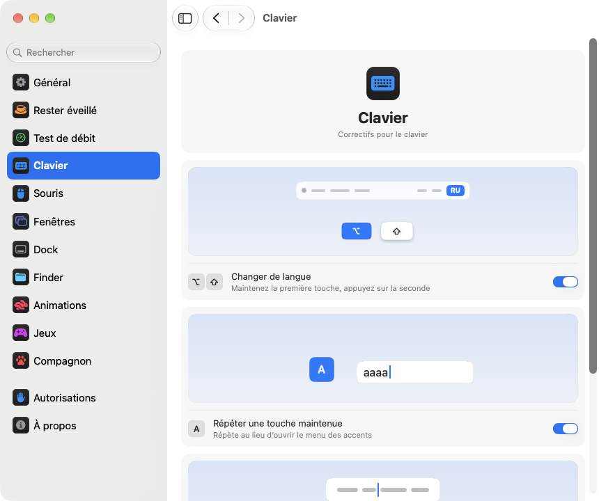

<p align="center"></p>
<h1 align="center">pikapik</h1>
<p align="center">De petites améliorations pour le clavier, la souris, les fenêtres et le Finder, directement dans la barre des menus de votre Mac.</p>
<p align="center"><sub><a href="../../README.md">English</a> · <a href="README.ru.md">Русский</a> · <a href="README.uk.md">Українська</a> · <a href="README.de.md">Deutsch</a> · <b>Français</b> · <a href="README.es.md">Español</a> · <a href="README.it.md">Italiano</a> · <a href="README.pt-BR.md">Português (Brasil)</a> · <a href="README.ja.md">日本語</a> · <a href="README.zh-Hans.md">简体中文</a> · <a href="README.ko.md">한국어</a> · <a href="README.ro.md">Română</a> · <a href="README.pl.md">Polski</a> · <a href="README.tr.md">Türkçe</a> · <a href="README.nl.md">Nederlands</a> · <a href="README.sv.md">Svenska</a> · <a href="README.cs.md">Čeština</a> · <a href="README.zh-Hant.md">繁體中文</a> · <a href="README.ar.md">العربية</a> · <a href="README.hi.md">हिन्दी</a> · <a href="README.id.md">Bahasa Indonesia</a> · <a href="README.vi.md">Tiếng Việt</a> · <a href="README.th.md">ไทย</a></sub></p>

<p align="center">
<picture>
<source media="(prefers-color-scheme: dark)" srcset="../media/settings-fr-dark.png">

</picture>
</p>

## Installation

```bash
brew install --cask dev-pikapik/pika-tools/pikapik && open -a pikapik
```

pikapik apparaît dans la barre des menus, en haut de l’écran. Tout reste éteint tant que vous ne l’activez pas.

<details>
<summary>Pas de Homebrew ? Deux autres façons</summary>

Sans Homebrew, ouvrez Terminal, collez cette ligne et appuyez sur Retour :

```bash
/bin/bash -c "$(curl -fsSL https://raw.githubusercontent.com/dev-pikapik/pika-tools/main/install.sh)"
```

Ou téléchargez [pikapik.dmg](https://github.com/dev-pikapik/pika-tools/releases/latest/download/pikapik.dmg), ouvrez-le et faites glisser l’app dans le dossier Applications.

Homebrew et le script placent tous deux l’app dans `/Applications`, la lancent, demandent les autorisations et activent l’ouverture à la connexion. Ensuite, l’app se met à jour toute seule, voir **Mises à jour**. Pour la supprimer, voir **Désinstallation**.

</details>

## Ce qu’il fait

<table>
<tbody><tr>
<td width="50%" valign="top">
<picture><source media="(prefers-color-scheme: dark)" srcset="../media/keep-awake-dark.png"></picture>
<br><b>Rester éveillé</b>
<br>Votre Mac reste éveillé aussi longtemps qu’il le faut, même écran rabattu.
</td>
<td width="50%" valign="top">
<picture><source media="(prefers-color-scheme: dark)" srcset="../media/command-keys-dark.png"></picture>
<br><b>Protéger ⌘Q et ⌘W</b>
<br>Rien ne se ferme par erreur. Ajoutez ⇧ quand c’est voulu.
</td>
</tr></tbody>
<tbody><tr>
<td width="50%" valign="top">
<picture><source media="(prefers-color-scheme: dark)" srcset="../media/compress-dark.png"></picture>
<br><b>Copie allégée</b>
<br>Clic droit sur une photo, un PDF ou une vidéo, et une copie plus légère apparaît.
</td>
<td width="50%" valign="top">
<picture><source media="(prefers-color-scheme: dark)" srcset="../media/convert-dark.png"></picture>
<br><b>Conversion</b>
<br>Enregistrez une image, une vidéo ou un morceau dans un autre format d’un clic droit.
</td>
</tr></tbody>
<tbody><tr>
<td width="50%" valign="top">
<picture><source media="(prefers-color-scheme: dark)" srcset="../media/input-switch-dark.png"></picture>
<br><b>Changer de langue</b>
<br>Maintenez ⌥ et touchez ⇧ pour changer la langue du clavier.
</td>
<td width="50%" valign="top">
<picture><source media="(prefers-color-scheme: dark)" srcset="../media/quit-on-close-dark.png"></picture>
<br><b>Quitter avec la dernière fenêtre</b>
<br>Fermez la dernière fenêtre d’une app, et l’app se ferme aussi.
</td>
</tr></tbody>
<tbody><tr>
<td width="50%" valign="top">
<picture><source media="(prefers-color-scheme: dark)" srcset="../media/window-zoom-dark.png"></picture>
<br><b>Le bouton vert agrandit</b>
<br>La fenêtre remplit l’écran sans passer en plein écran.
</td>
<td width="50%" valign="top">
<picture><source media="(prefers-color-scheme: dark)" srcset="../media/dock-hide-dark.png"></picture>
<br><b>Masquer d’un clic dans le Dock</b>
<br>Cliquez sur l’app que vous utilisez, et elle s’efface.
</td>
</tr></tbody>
<tbody><tr>
<td width="50%" valign="top">
<picture><source media="(prefers-color-scheme: dark)" srcset="../media/new-file-dark.png"></picture>
<br><b>Nouveau fichier</b>
<br>Clic droit dans le Finder, un nom, et le fichier vide est prêt.
</td>
<td width="50%" valign="top">
<picture><source media="(prefers-color-scheme: dark)" srcset="../media/finder-cut-dark.png"></picture>
<br><b>⌘X déplace les fichiers</b>
<br>Coupez des fichiers dans le Finder et collez-les où vous voulez.
</td>
</tr></tbody>
<tbody><tr>
<td width="50%" valign="top">
<picture><source media="(prefers-color-scheme: dark)" srcset="../media/finder-open-dark.png"></picture>
<br><b>Entrée ouvre les fichiers</b>
<br>Sélectionnez des fichiers dans le Finder et appuyez sur Entrée pour les ouvrir.
</td>
<td width="50%" valign="top">
<picture><source media="(prefers-color-scheme: dark)" srcset="../media/finder-delete-dark.png"></picture>
<br><b>Supprimer vers la Corbeille</b>
<br>Appuyez sur ⌫ dans le Finder, et les fichiers sélectionnés vont à la Corbeille.
</td>
</tr></tbody>
<tbody><tr>
<td width="50%" valign="top">
<picture><source media="(prefers-color-scheme: dark)" srcset="../media/game-mode-dark.png"></picture>
<br><b>Mode Jeu</b>
<br>Pendant que vous jouez, rien ne s’ouvre par-dessus le jeu ni ne le ferme.
</td>
<td width="50%" valign="top">
<picture><source media="(prefers-color-scheme: dark)" srcset="../media/speed-test-dark.png"></picture>
<br><b>Test de débit</b>
<br>La vitesse de votre connexion, et ce qu’elle permet.
</td>
</tr></tbody>
<tbody><tr>
<td width="50%" valign="top">
<picture><source media="(prefers-color-scheme: dark)" srcset="../media/side-buttons-dark.png"></picture>
<br><b>Boutons latéraux</b>
<br>Les boutons 4 et 5 reculent et avancent, comme un balayage.
</td>
<td width="50%" valign="top">
<picture><source media="(prefers-color-scheme: dark)" srcset="../media/wheel-lines-dark.png"></picture>
<br><b>Défiler par lignes</b>
<br>Chaque cran de la molette fait défiler d’autant, quelle que soit la vitesse.
</td>
</tr></tbody>
<tbody><tr>
<td width="50%" valign="top">
<picture><source media="(prefers-color-scheme: dark)" srcset="../media/wheel-direction-dark.png"></picture>
<br><b>Sens de défilement</b>
<br>Un sens pour le trackpad, un autre pour la souris.
</td>
<td width="50%" valign="top">
<picture><source media="(prefers-color-scheme: dark)" srcset="../media/linear-pointer-dark.png"></picture>
<br><b>Sans accélération du pointeur</b>
<br>Le pointeur parcourt exactement la distance de votre main.
</td>
</tr></tbody>
<tbody><tr>
<td width="50%" valign="top">
<picture><source media="(prefers-color-scheme: dark)" srcset="../media/key-repeat-dark.png"></picture>
<br><b>Répéter une touche maintenue</b>
<br>Maintenez une touche pour la répéter, sans menu des accents.
</td>
<td width="50%" valign="top">
<picture><source media="(prefers-color-scheme: dark)" srcset="../media/home-end-dark.png"></picture>
<br><b>Home et End</b>
<br>Allez au début ou à la fin de la ligne pendant la saisie.
</td>
</tr></tbody>
<tbody><tr>
<td width="50%" valign="top">
<picture><source media="(prefers-color-scheme: dark)" srcset="../media/animations-dark.png"></picture>
<br><b>Animations</b>
<br>Accélérez le Dock, les fenêtres et Coup d’œil, jusqu’à l’instantané.
</td>
<td width="50%" valign="top">
<picture><source media="(prefers-color-scheme: dark)" srcset="../media/leftover-permissions-dark.png"></picture>
<br><b>Autorisations des apps supprimées</b>
<br>Retirez les autorisations que macOS garde pour les apps déjà supprimées.
</td>
</tr></tbody>
<tbody><tr>
<td width="50%" valign="top">
<picture><source media="(prefers-color-scheme: dark)" srcset="../media/pet-dark.png"></picture>
<br><b>Compagnon sur le bureau</b>
<br>Un petit ami se promène derrière vos fenêtres. Attrapez-le et lancez-le, ou appuyez sur Espace pour le faire sauter.
</td>
</tr></tbody>
</table>

## En savoir plus

<details>
<summary>Premier lancement</summary>

pikapik a besoin de deux autorisations. Au premier lancement, elle ouvre les réglages sur la page Autorisations, qui vous guide pas à pas, et macOS affiche ses propres demandes. Allez dans **Réglages Système › Confidentialité et sécurité** et activez pikapik dans :

- **Accessibilité**, pour que l’app puisse modifier une frappe ou un clic avant qu’il n’atteigne les autres apps.
- **Surveillance de l’entrée**, pour que l’app puisse tout simplement voir les frappes et les clics.

L’app détecte le changement en une ou deux secondes, sans redémarrage.

pikapik n’enregistre, ne conserve et n’envoie rien de ce que vous tapez ou cliquez. Les évènements sont traités en mémoire et transmis immédiatement. La seule requête réseau est la recherche de mises à jour, qui demande à GitHub la dernière version.

</details>

<details>
<summary>Chaque outil en détail</summary>

**Protéger ⌘Q et ⌘W.** ⌘Q et ⌘W seuls ne font rien, vous ne quittez donc pas une app ni ne fermez une fenêtre par accident. Ajoutez Maj pour le faire exprès : ⇧⌘Q quitte, ⇧⌘W ferme. Fonctionne dans toutes les apps. Chaque touche a son propre interrupteur. Désactivé par défaut.

**Changer de langue avec Option+Maj.** Maintenez Option et touchez Maj : macOS passe à la source de saisie suivante. Gardez Option enfoncée et touchez de nouveau Maj pour continuer. Maintenez Maj et touchez Option pour revenir en arrière. Si vous appuyez entre-temps sur une autre touche, cliquez ou ajoutez Commande, Contrôle ou Fn, rien ne change, donc les raccourcis comme Option+Maj+flèche fonctionnent comme avant. Désactivé par défaut.

**Répéter une touche maintenue.** Maintenez une touche et la lettre se tape encore et encore au lieu d’afficher le menu des accents. Pratique dans les jeux et pour écrire. Les apps déjà ouvertes en tiennent compte après un redémarrage. Désactivez-le et macOS retrouve son comportement habituel. Désactivé par défaut.

**Home et End vont au début et à la fin de la ligne.** Pendant la saisie, Home place le curseur au début de la ligne et End à la fin, au lieu de faire défiler la page. Avec ⇧, elles sélectionnent jusque-là, avec ⌘, elles vont au début ou à la fin du texte entier. Hors des champs de texte, ainsi que dans les terminaux, les machines virtuelles et les apps de bureau à distance, les touches fonctionnent comme avant. Vous pouvez ajouter d’autres apps où elles doivent fonctionner comme d’habitude. Désactivé par défaut.

**Désactiver l’accélération du pointeur.** Le pointeur se déplace exactement autant que la souris, quelle que soit la vitesse de votre geste. Un curseur **Vitesse de déplacement** règle sa rapidité. Fonctionne uniquement avec les souris, le trackpad reste tel quel. Désactivez l’option ou quittez pikapik, et macOS retrouve ses propres réglages. Désactivé par défaut.

**Défiler par lignes.** Chaque cran de la molette de la souris fait défiler le même nombre de lignes, quelle que soit la vitesse à laquelle vous la tournez. Choisissez de 1 à 10 lignes par cran, 3 par défaut. Le défilement naturel reste tel que vous l’avez réglé dans Réglages Système. Ne concerne que les souris, le trackpad reste comme il est. Désactivé par défaut. À côté du curseur **Distance par cran**, une petite page défile de la distance choisie, et un point marque la valeur par défaut.

Certaines apps et certains jeux comptent le défilement en pixels exacts : pour eux, passez ce même réglage en pixels et choisissez de 1 à 200 pixels par cran, 40 par défaut. Le curseur indique aussi quelle part de la hauteur de l’écran cela représente.

**Sens de défilement pour le trackpad et la souris.** macOS n’a qu’un seul réglage de défilement naturel pour le trackpad et la souris à la fois. Active cette fonction et choisis un sens pour chacun : **Naturel**, la page suit tes doigts comme sur iPhone, ou **Classique**, où la page va dans l’autre sens. Le choix du trackpad vaut aussi pour le défilement horizontal et pour l’élan après avoir levé les doigts. La Magic Mouse défile au toucher, elle suit donc le choix du trackpad. Choisis la même chose sur chacun de tes Mac et le défilement sera le même partout, même quand tu passes la souris sur un autre Mac avec Commande universelle. Désactivé par défaut. À l’activation, les deux sont réglés comme dans Réglages Système, donc rien ne change tant que tu ne choisis pas autre chose.

**Boutons latéraux pour Précédent et Suivant.** Les boutons 4 et 5 de la souris font précédent et suivant dans le Finder, Safari et les autres apps Apple, ainsi que dans de nombreuses autres apps, comme un balayage sur le trackpad. Les apps qui gèrent elles-mêmes ces boutons les reçoivent tels quels. Si votre souris les a dans l’autre sens, activez **Inverser les boutons latéraux**. Désactivé par défaut.

**Quitter à la fermeture de la dernière fenêtre.** Fermez la dernière fenêtre d’une app et l’app se ferme. Le Finder reste ouvert, tout comme les apps qui ont des fenêtres sur d’autres bureaux ou dans le Dock. Vous pouvez dresser la liste des apps qui ne doivent jamais se fermer ainsi. Désactivé par défaut.

**Masquer d’un clic dans le Dock.** Cliquez sur l’icône de l’app que vous utilisez dans le Dock, et elle se masque. Cliquez de nouveau pour la faire revenir. Désactivé par défaut.

**Le bouton vert agrandit la fenêtre.** Cliquez sur le bouton vert d’une fenêtre : elle remplit l’écran sans passer en plein écran. Un autre clic rétablit la taille précédente. Si vous maintenez ⌥, le bouton fonctionne comme d’habitude. Le plein écran reste dans le menu du bouton et sur ⌃⌘F. Vous pouvez lister les apps où le bouton vert doit fonctionner comme d’habitude. Désactivé par défaut.

**Nouveau fichier dans le Finder.** Clic droit dans une fenêtre du Finder ou sur le bureau, choisissez **Nouveau fichier**, tapez un nom, et un fichier vide apparaît. En .txt par défaut. Désactivé par défaut.

**Entrée ouvre les fichiers dans le Finder.** Sélectionnez des fichiers dans une fenêtre du Finder ou sur le bureau et appuyez sur Retour ou Entrée : ils s’ouvrent. F2 ou fn F2 renomme le fichier sélectionné. Dans les champs de texte, par exemple quand vous saisissez un nom, les touches fonctionnent comme d’habitude. Désactivé par défaut.

**⌘X coupe les fichiers dans le Finder.** Sélectionnez des fichiers et appuyez sur ⌘X, ouvrez le dossier voulu et appuyez sur ⌘V : les fichiers y sont déplacés au lieu d’être copiés. ⌘C annule la coupe. Désactivé par défaut.

**Supprimer efface les fichiers dans le Finder.** Sélectionnez des fichiers et appuyez sur ⌫ ou ⌦ (fn ⌫ sur un portable) : ils vont à la Corbeille, comme avec ⌘⌫. Quand vous renommez un fichier, faites une recherche ou tapez dans un autre champ, les touches effacent les lettres comme d’habitude. Désactivé par défaut.

**Copie allégée dans le Finder.** Clic droit sur un fichier dans le Finder, puis **Créer une copie allégée**. Une version plus légère d’une photo, d’un GIF, d’un PDF ou d’une vidéo apparaît juste à côté, souvent plusieurs fois plus petite. Le son non compressé, comme WAV ou AIFF, devient un M4A compact. Si le fichier ne peut pas être plus léger, aucune copie n’est créée et pikapik vous le dit. L’original reste intact, et rien ne quitte votre Mac. Désactivé par défaut.

**Conversion dans le Finder.** Clic droit sur un fichier dans le Finder, puis **Convertir en** pour l’enregistrer dans un autre format : une image en JPEG, PNG, HEIC, GIF, TIFF ou PDF, une vidéo en MP4, MOV ou seulement le son, de la musique en M4A, WAV ou AIFF. L’original reste intact, et rien ne quitte votre Mac. S’active séparément de la copie allégée. Désactivé par défaut.

**Mode Jeu.** Ajoutez vos jeux, et pendant que vous jouez, votre Mac ne vous fait pas sortir du jeu. Spotlight, Siri, ⌘Tab, Mission Control et les balayages entre bureaux ne s’ouvrent pas par-dessus le jeu, ⌘Q et ⌘W ne le ferment pas par accident, le pointeur ne glisse pas vers le Dock, la barre des menus ou un autre écran, et l’écran reste allumé. Chacun de ces réglages a son propre interrupteur sur la page Jeux, et pikapik vous propose les jeux qu’il trouve sur votre Mac. Dans un jeu, Contrôle-clic reste un simple clic, et Contrôle avec les flèches ne change pas de bureau. Minecraft est reconnu aussi : ajoutez Minecraft Launcher ou CurseForge, et le mode s’active dans Minecraft lui-même. Pour quitter un jeu, appuyez sur ⇧⌘Q ; pour fermer sa fenêtre, sur ⇧⌘W. ⌥⌘Esc fonctionne toujours. Dès que vous quittez le jeu, tout fonctionne comme d’habitude. Désactivé par défaut.

Chaque outil a son propre interrupteur dans le menu et dans les réglages.

L’icône dans la barre des menus montre l’état d’un coup d’œil : le symbole pikapik quand les outils fonctionnent, le même symbole plus pâle quand tout est désactivé et un triangle d’avertissement quand un outil est activé mais que des autorisations manquent.

Le panneau de la barre des menus démarre avec seulement quelques lignes. Vous choisissez celles qu’il affiche : cliquez sur le bouton en forme de crayon en bas, cochez ce que vous voulez voir, puis cliquez sur **Terminé**. Les lignes masquées continuent de fonctionner et restent dans les Réglages. Si le panneau ne tient pas à l’écran, il défile.

L’app suit la langue du système ou celle que vous choisissez dans les réglages. Les 23 langues de la liste en haut de cette page sont toutes disponibles.

</details>

<details>
<summary>Rester éveillé</summary>

Empêche votre Mac de se mettre en veille pendant que vous n’êtes pas devant le clavier : pour n’importe quelle durée de 1 seconde à 365 jours, ou jusqu’à ce que vous le désactiviez. Activez-le depuis le menu et réglez la durée dans les réglages : saisissez les jours, heures, minutes et secondes, utilisez ↑ et ↓, ou cliquez sur une durée prédéfinie de 15 minutes à 8 heures. Le menu indique le temps restant et l’heure de fin. Pour l’**Écran**, deux choix. **Toujours allumé** : il ne s’éteint pas, sans économiseur d’écran ni écran verrouillé. **S’éteint comme d’habitude** : il s’éteint selon son propre délai pendant que votre Mac continue de fonctionner. **Éteindre l’écran maintenant** (aussi dans le menu) l’éteint tout de suite et le Mac continue de fonctionner : bougez la souris ou appuyez sur une touche pour le rallumer. Quitter pikapik met fin à Rester éveillé.

Sur un MacBook, vous pouvez aussi activer **Fonctionner écran rabattu**. macOS n’a pas de réglage pour cela, donc pikapik exécute `pmset -a disablesleep 1` et demande un mot de passe administrateur : seul un administrateur peut modifier la mise en veille du Mac. Le réglage revient à la normale tout seul quand Rester éveillé se termine, quand vous quittez l’app ou si elle plante. Si vous ne saisissez pas le mot de passe, rien ne change. Veillez à ce que le Mac reste bien ventilé écran rabattu. **Arrêter sous 20 % de batterie** met fin à la session avant que la batterie ne soit vide.

Rester éveillé, les modes écran et capot fermé peuvent devenir un bouton du Centre de contrôle, de la barre des menus ou un widget du bureau grâce à l’app Raccourcis, avec des liens que tu copies dans Réglages › Rester éveillé.

</details>

<details>
<summary>Test de débit</summary>

Montre la vitesse de ta connexion en ce moment. Clique sur **Tester le débit** dans Réglages › Test de débit, ou sur **Tester** dans le menu une fois la ligne ajoutée avec le bouton crayon. En une demi-minute environ, tu vois le débit en téléchargement et en envoi, le ping et la réactivité : la rapidité de réaction quand la connexion est chargée. En dessous, en mots simples, ce qu’elle permet : films en 4K, appels vidéo, jeux en ligne et gros téléchargements. Le test utilise networkQuality, intégré à macOS, et les serveurs d’Apple. Le dernier résultat reste jusqu’au test suivant, et un lien pour Raccourcis le lance depuis le Centre de contrôle.

</details>

<details>
<summary>Réglages</summary>

Ouvrez les réglages depuis le menu avec **Réglages…** ou ⌘, ou relancez simplement pikapik depuis le Finder, Launchpad ou Spotlight. Tant que la fenêtre est ouverte, l’app apparaît dans le Dock et dans ⌘Tab.

- **Général** : ouverture à la connexion, apparence (Système, Clair ou Sombre), langue, mises à jour et sauvegarde : exporter et importer les réglages sous forme de fichier, ou les synchroniser avec iCloud Drive.
- **Rester éveillé** : durée, options d’écran et de capot.
- **Test de débit** : mesurer la connexion et voir ce qu’elle permet.
- **Clavier** : changement de langue, répétition des touches, Home et End.
- **Souris ** : accélération du pointeur et vitesse de déplacement, défilement par lignes, sens de défilement, boutons latéraux.
- **Fenêtres** : agrandir avec le bouton vert (avec une liste d’exceptions), protection de ⌘Q et ⌘W, et quitter à la dernière fenêtre (avec une liste d’exceptions).
- **Dock** : masquer d’un clic dans le Dock.
- **Finder** : nouveau fichier, copie allégée et conversion, ouvrir avec Entrée, couper avec ⌘X et supprimer avec ⌫.
- **Autorisations** : l’état des deux autorisations, et d’iCloud Drive quand la synchronisation est activée, avec des boutons qui ouvrent le bon endroit dans Réglages Système.
- **À propos** : version, liens vers l’historique des changements et pour signaler un problème.

De nombreux réglages s’accompagnent d’une petite image qui montre ce qu’ils font, par exemple un Mac qui reste éveillé ou une fenêtre qui se cache derrière le Dock. L’image change avec l’interrupteur et reste fixe quand « Réduire les animations » est activé dans Réglages Système.

Chaque page comporte en bas un bouton **Rétablir les réglages par défaut…**. Il demande d’abord confirmation, puis désactive les outils de la page et rétablit leurs options, comme si pikapik n’y avait jamais touché.

**Synchroniser les réglages avec iCloud** garde pikapik identique sur tous vos Mac. Les réglages se trouvent dans le dossier pika-tools d’iCloud Drive, et la modification la plus récente l’emporte. Désactivé par défaut, et iCloud Drive doit être activé. Les autorisations ne sont pas synchronisées : chaque Mac les demande lui-même.

</details>

<details>
<summary>Mises à jour</summary>

pikapik recherche les nouvelles versions au lancement et toutes les 6 heures. Vous pouvez désactiver cela dans Réglages › Général. Quand une nouvelle version sort, un bouton **Mettre à jour vers …** apparaît dans le menu : un clic, et l’app télécharge la mise à jour, l’installe et redémarre. Vous pouvez aussi vérifier vous-même avec **Rechercher** dans Réglages › Général.

Avec Homebrew, vous pouvez aussi lancer `brew upgrade --cask pikapik`.

Depuis la version 1.3, les autorisations sont conservées après les mises à jour.

</details>

<details>
<summary>Désinstallation</summary>

```bash
/bin/bash -c "$(curl -fsSL https://raw.githubusercontent.com/dev-pikapik/pika-tools/main/uninstall.sh)"
```

Si vous avez installé avec Homebrew : `brew uninstall --cask --zap pikapik`.

Les deux quittent l’app, la retirent des éléments d’ouverture et la suppriment. Le script réinitialise aussi ses autorisations.

</details>

<details>
<summary>Questions fréquentes</summary>

**Pourquoi faut-il deux autorisations ?**
macOS sépare l’accès au clavier et à la souris en deux. La surveillance de l’entrée permet à l’app de voir les évènements, l’accessibilité lui permet de les modifier. Pour bloquer un raccourci, il faut les deux.

**macOS indique que l’app provient d’un développeur non identifié.**
pikapik est signée, mais pas notarisée par Apple. Homebrew et le script d’installation s’en chargent pour vous. Si vous avez utilisé le dmg, ouvrez **Réglages Système › Confidentialité et sécurité** et cliquez sur **Ouvrir quand même**, ou exécutez :

```bash
xattr -dr com.apple.quarantine /Applications/pikapik.app
```

**Fonctionne-t-elle sur les Mac Intel ?**
Oui. C’est une app universelle pour Apple Silicon et Intel, à partir de macOS 14 Sonoma.

**L’autorisation est activée, mais rien ne fonctionne.**
Dans **Réglages Système › Confidentialité et sécurité**, retirez pikapik des deux listes avec le bouton −, puis ajoutez-la de nouveau. La page Autorisations des réglages de pikapik a des boutons qui ouvrent le bon endroit.

</details>

<p align="center">☕ Si pikapik vous plaît, vous pouvez <a href="https://buymeacoffee.com/pikapik">m’offrir un café</a> : tout va au développement et au suivi de l’app.</p>

<p align="center"><sub><a href="../whats-new/README.fr.md">Nouveautés</a> · <a href="https://github.com/dev-pikapik/homebrew-pika-tools">Tap Homebrew</a> · <a href="../../CONTRIBUTING.md">Compiler soi-même</a> · <a href="../../LICENSE">Licence MIT</a> · © 2026 pikapik</sub></p>
