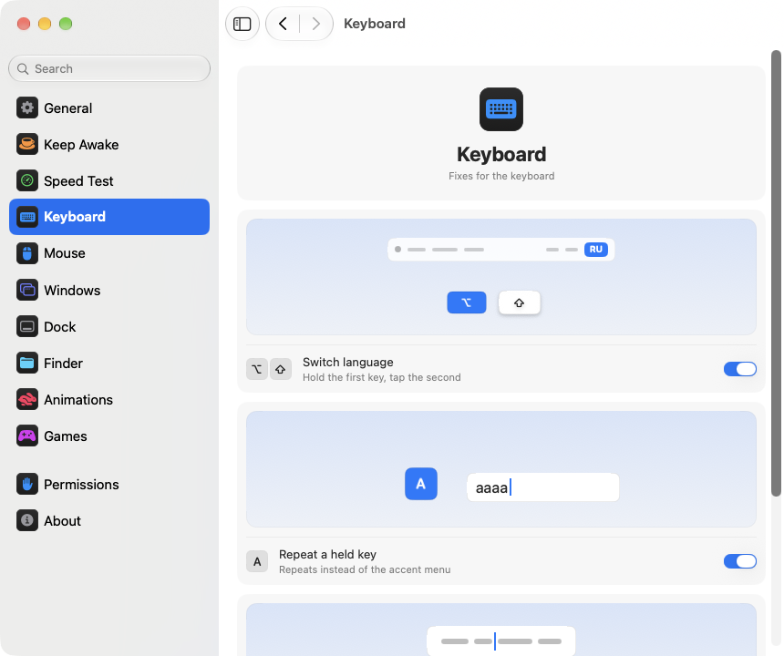

<p align="center"></p>
<h1 align="center">pika-tools</h1>
<p align="center">कीबोर्ड, माउस, विंडो और Finder के लिए छोटे-छोटे सुधार, सीधे आपके Mac के मेन्यू बार में।</p>
<p align="center"><sub><a href="../../README.md">English</a> · <a href="README.ru.md">Русский</a> · <a href="README.uk.md">Українська</a> · <a href="README.de.md">Deutsch</a> · <a href="README.fr.md">Français</a> · <a href="README.es.md">Español</a> · <a href="README.it.md">Italiano</a> · <a href="README.pt-BR.md">Português (Brasil)</a> · <a href="README.ja.md">日本語</a> · <a href="README.zh-Hans.md">简体中文</a> · <a href="README.ko.md">한국어</a> · <a href="README.ro.md">Română</a> · <a href="README.pl.md">Polski</a> · <a href="README.tr.md">Türkçe</a> · <a href="README.nl.md">Nederlands</a> · <a href="README.sv.md">Svenska</a> · <a href="README.cs.md">Čeština</a> · <a href="README.zh-Hant.md">繁體中文</a> · <a href="README.ar.md">العربية</a> · <b>हिन्दी</b> · <a href="README.id.md">Bahasa Indonesia</a> · <a href="README.vi.md">Tiếng Việt</a> · <a href="README.th.md">ไทย</a></sub></p>

<p align="center">
<picture>
<source media="(prefers-color-scheme: dark)" srcset="../media/settings-en-dark.png">

</picture>
</p>

## इंस्टॉल करें

```bash
brew install --cask dev-pikapik/pika-tools/pika-tools && open -a pika-tools
```

इंस्टॉल होने के बाद pika-tools स्क्रीन के ऊपर मेन्यू बार में दिखेगा। जब तक आप ख़ुद चालू न करें, सब कुछ बंद रहता है।

<details>
<summary>Homebrew नहीं है? दो और तरीके</summary>

Homebrew के बिना, टर्मिनल खोलें, यह लाइन पेस्ट करें और Return दबाएँ:

```bash
/bin/bash -c "$(curl -fsSL https://raw.githubusercontent.com/dev-pikapik/pika-tools/main/install.sh)"
```

या [pika-tools.dmg](https://github.com/dev-pikapik/pika-tools/releases/latest/download/pika-tools.dmg) डाउनलोड करें, उसे खोलें और ऐप को ऐप्लिकेशन फ़ोल्डर में ड्रैग करें।

Homebrew और स्क्रिप्ट दोनों ऐप को `/Applications` में रखते हैं, उसे खोलते हैं, अनुमतियाँ माँगते हैं और “लॉगिन पर खोलें” चालू कर देते हैं। इसके बाद ऐप ख़ुद को अपडेट करती रहती है, देखें **अपडेट**। हटाने के लिए देखें **अनइंस्टॉल करें**।

</details>

## यह क्या करता है

<table>
<tbody><tr>
<td width="50%" valign="top">
<picture><source media="(prefers-color-scheme: dark)" srcset="../media/keep-awake-dark.png"></picture>
<br><b>जगाए रखें</b>
<br>जितनी देर चाहिए, Mac जागा रहता है, ढक्कन बंद होने पर भी।
</td>
<td width="50%" valign="top">
<picture><source media="(prefers-color-scheme: dark)" srcset="../media/command-keys-dark.png"></picture>
<br><b>⌘Q और ⌘W सुरक्षित</b>
<br>गलती से कुछ बंद नहीं होगा। जानबूझकर करना हो तो ⇧ जोड़ें।
</td>
</tr></tbody>
<tbody><tr>
<td width="50%" valign="top">
<picture><source media="(prefers-color-scheme: dark)" srcset="../media/compress-dark.png"></picture>
<br><b>छोटी कॉपी</b>
<br>फ़ोटो, PDF या वीडियो पर राइट-क्लिक करें, और बगल में हल्की कॉपी बन जाएगी।
</td>
<td width="50%" valign="top">
<picture><source media="(prefers-color-scheme: dark)" srcset="../media/convert-dark.png"></picture>
<br><b>कन्वर्ट</b>
<br>राइट-क्लिक से तस्वीर, वीडियो या गाना दूसरे फ़ॉर्मैट में सेव करें।
</td>
</tr></tbody>
<tbody><tr>
<td width="50%" valign="top">
<picture><source media="(prefers-color-scheme: dark)" srcset="../media/input-switch-dark.png"></picture>
<br><b>भाषा बदलें</b>
<br>⌥ दबाए रखें और ⇧ टैप करें, कीबोर्ड की भाषा बदल जाएगी।
</td>
<td width="50%" valign="top">
<picture><source media="(prefers-color-scheme: dark)" srcset="../media/quit-on-close-dark.png"></picture>
<br><b>आख़िरी विंडो के साथ बंद</b>
<br>ऐप की आख़िरी विंडो बंद करें, और ऐप भी बंद हो जाएगा।
</td>
</tr></tbody>
<tbody><tr>
<td width="50%" valign="top">
<picture><source media="(prefers-color-scheme: dark)" srcset="../media/window-zoom-dark.png"></picture>
<br><b>हरा बटन बड़ा करता है</b>
<br>विंडो फ़ुल स्क्रीन मोड में गए बिना पूरी स्क्रीन भर देती है।
</td>
<td width="50%" valign="top">
<picture><source media="(prefers-color-scheme: dark)" srcset="../media/dock-hide-dark.png"></picture>
<br><b>Dock में क्लिक से छिपाएँ</b>
<br>जिस ऐप में आप हैं, उस पर क्लिक करें, वह रास्ते से हट जाएगा।
</td>
</tr></tbody>
<tbody><tr>
<td width="50%" valign="top">
<picture><source media="(prefers-color-scheme: dark)" srcset="../media/new-file-dark.png"></picture>
<br><b>नई फ़ाइल</b>
<br>Finder में राइट-क्लिक करें, नाम लिखें, और ख़ाली फ़ाइल तैयार।
</td>
<td width="50%" valign="top">
<picture><source media="(prefers-color-scheme: dark)" srcset="../media/finder-cut-dark.png"></picture>
<br><b>⌘X से फ़ाइलें ले जाएँ</b>
<br>Finder में फ़ाइलें काटें और जहाँ चाहें पेस्ट करें।
</td>
</tr></tbody>
<tbody><tr>
<td width="50%" valign="top">
<picture><source media="(prefers-color-scheme: dark)" srcset="../media/finder-open-dark.png"></picture>
<br><b>Enter से फ़ाइलें खोलें</b>
<br>Finder में फ़ाइलें चुनें और खोलने के लिए Enter दबाएँ।
</td>
<td width="50%" valign="top">
<picture><source media="(prefers-color-scheme: dark)" srcset="../media/finder-delete-dark.png"></picture>
<br><b>Delete से ट्रैश में</b>
<br>Finder में ⌫ दबाएँ, और चुनी गई फ़ाइलें ट्रैश में चली जाएँगी।
</td>
</tr></tbody>
<tbody><tr>
<td width="50%" valign="top">
<picture><source media="(prefers-color-scheme: dark)" srcset="../media/game-mode-dark.png"></picture>
<br><b>गेम मोड</b>
<br>खेलते समय गेम के ऊपर कुछ नहीं खुलता और गेम बंद नहीं होता।
</td>
<td width="50%" valign="top">
<picture><source media="(prefers-color-scheme: dark)" srcset="../media/speed-test-dark.png"></picture>
<br><b>स्पीड टेस्ट</b>
<br>इंटरनेट कितना तेज़ है और किन कामों के लिए काफ़ी है।
</td>
</tr></tbody>
<tbody><tr>
<td width="50%" valign="top">
<picture><source media="(prefers-color-scheme: dark)" srcset="../media/side-buttons-dark.png"></picture>
<br><b>माउस के साइड बटन</b>
<br>बटन 4 और 5 पीछे और आगे ले जाते हैं, ट्रैकपैड पर स्वाइप की तरह।
</td>
<td width="50%" valign="top">
<picture><source media="(prefers-color-scheme: dark)" srcset="../media/wheel-lines-dark.png"></picture>
<br><b>पंक्तियों के हिसाब से स्क्रोल</b>
<br>व्हील कितनी भी तेज़ घुमाएँ, हर क्लिक बराबर स्क्रोल करता है।
</td>
</tr></tbody>
<tbody><tr>
<td width="50%" valign="top">
<picture><source media="(prefers-color-scheme: dark)" srcset="../media/wheel-direction-dark.png"></picture>
<br><b>स्क्रॉल दिशा</b>
<br>ट्रैकपैड के लिए एक दिशा, माउस के लिए दूसरी।
</td>
<td width="50%" valign="top">
<picture><source media="(prefers-color-scheme: dark)" srcset="../media/linear-pointer-dark.png"></picture>
<br><b>पॉइंटर ऐक्सलरेशन बंद</b>
<br>पॉइंटर ठीक उतना ही चलता है जितना आपका हाथ।
</td>
</tr></tbody>
<tbody><tr>
<td width="50%" valign="top">
<picture><source media="(prefers-color-scheme: dark)" srcset="../media/key-repeat-dark.png"></picture>
<br><b>दबाए रखने पर कुंजी दोहराएं</b>
<br>कुंजी दबाए रखें, वह बार-बार टाइप होगी, ऐक्सेंट मेन्यू के बिना।
</td>
<td width="50%" valign="top">
<picture><source media="(prefers-color-scheme: dark)" srcset="../media/home-end-dark.png"></picture>
<br><b>Home और End</b>
<br>टाइप करते हुए लाइन की शुरुआत या अंत पर जाएँ।
</td>
</tr></tbody>
<tbody><tr>
<td width="50%" valign="top">
<picture><source media="(prefers-color-scheme: dark)" srcset="../media/animations-dark.png"></picture>
<br><b>एनिमेशन</b>
<br>Dock, विंडो और क्विक लुक को तेज़ करें, चाहें तो तुरंत।
</td>
<td width="50%" valign="top"></td>
</tr></tbody>
</table>

## और जानकारी

<details>
<summary>पहली बार खोलना</summary>

pika-tools को दो अनुमतियों की ज़रूरत है। पहली बार खोलने पर यह सेटिंग्ज़ में अनुमतियाँ पेज खोलती है, जो आपको हर क़दम बताता है, और macOS अपने संकेत दिखाता है। **सिस्टम सेटिंग्ज़ › गोपनीयता और सुरक्षा** में जाएँ और pika-tools को इनमें चालू करें:

- **ऐक्सेसिबिलिटी**, ताकि ऐप किसी की-प्रेस या क्लिक को दूसरी ऐप्स तक पहुँचने से पहले बदल सके।
- **इनपुट मॉनिटरिंग**, ताकि ऐप की-प्रेस और क्लिक देख सके।

ऐप कुछ ही सेकंड में बदलाव पहचान लेती है, रीस्टार्ट की ज़रूरत नहीं।

pika-tools आपकी टाइप की गई या क्लिक की गई किसी भी चीज़ को रिकॉर्ड, स्टोर या कहीं नहीं भेजती। इवेंट मेमोरी में संभाले जाते हैं और तुरंत आगे भेज दिए जाते हैं। नेटवर्क पर एकमात्र अनुरोध अपडेट की जाँच है, जिसमें GitHub से नवीनतम रिलीज़ पूछी जाती है।

</details>

<details>
<summary>हर टूल विस्तार से</summary>

**⌘Q और ⌘W को सुरक्षित रखें।** अकेले ⌘Q और ⌘W कुछ नहीं करते, इसलिए आप ग़लती से कोई ऐप बंद या विंडो बंद नहीं करते। जान-बूझकर करने के लिए Shift जोड़ें: ⇧⌘Q ऐप से बाहर निकलता है, ⇧⌘W विंडो बंद करता है। हर ऐप में काम करता है। हर की का अपना स्विच है। डिफ़ॉल्ट रूप से बंद।

**Option+Shift से भाषा बदलें।** Option दबाए रखें और Shift टैप करें: macOS अगले इनपुट स्रोत पर चला जाता है। Option दबाए रखते हुए Shift फिर से टैप करें, तो आगे बढ़ता जाता है। पीछे जाने के लिए Shift दबाए रखें और Option टैप करें। अगर बीच में आप कोई और की दबाते हैं, क्लिक करते हैं या Cmd, Ctrl या Fn जोड़ते हैं, तो भाषा नहीं बदलती, इसलिए Option+Shift+ऐरो जैसे शॉर्टकट पहले की तरह काम करते हैं। डिफ़ॉल्ट रूप से बंद।

**दबाए रखने पर कुंजी दोहराएं।** कोई कुंजी दबाए रखें तो अक्षर बार-बार टाइप होता है, एक्सेंट मेनू नहीं खुलता। गेम खेलते और टाइप करते समय काम आता है। पहले से खुले ऐप्स इसे रीस्टार्ट के बाद अपनाते हैं। इसे बंद करें तो macOS फिर से पहले जैसा काम करता है। डिफ़ॉल्ट रूप से बंद।

**Home और End से लाइन की शुरुआत और अंत पर जाएँ।** टाइप करते समय Home कर्सर को लाइन की शुरुआत पर और End उसके अंत पर ले जाता है, पेज स्क्रॉल नहीं होता। ⇧ के साथ ये वहाँ तक टेक्स्ट चुनते हैं, ⌘ के साथ पूरे टेक्स्ट की शुरुआत या अंत पर जाते हैं। टेक्स्ट फ़ील्ड के बाहर, और टर्मिनल, वर्चुअल मशीन और रिमोट डेस्कटॉप ऐप्स में ये कुंजियाँ पहले की तरह काम करती हैं। आप ऐसी दूसरी ऐप्स भी जोड़ सकते हैं जिनमें ये पहले की तरह काम करें। डिफ़ॉल्ट रूप से बंद।

**पॉइंटर ऐक्सलरेशन बंद करें।** माउस को आप कितना भी तेज़ चलाएँ, पॉइंटर ठीक उतना ही चलता है जितना माउस, LinearMouse की तरह। **ट्रैकिंग गति** स्लाइडर तय करता है कि वह कितना तेज़ चले। यह सिर्फ़ माउस के लिए काम करता है, ट्रैकपैड जैसा है वैसा ही रहता है। इसे बंद करें या pika-tools से बाहर निकलें, और macOS को अपनी सेटिंग्स वापस मिल जाती हैं। डिफ़ॉल्ट रूप से बंद।

**पंक्तियों के हिसाब से स्क्रोल करें।** माउस व्हील का हर क्लिक उतनी ही पंक्तियाँ स्क्रोल करता है, चाहे आप उसे कितनी भी तेज़ घुमाएँ। हर क्लिक पर 1 से 10 पंक्तियाँ चुनें, डिफ़ॉल्ट 3 है। नैचुरल स्क्रोलिंग वैसी ही रहती है जैसी आपने सिस्टम सेटिंग्ज़ में रखी है। यह सिर्फ़ माउस पर चलता है, ट्रैकपैड जैसा है वैसा ही रहता है। डिफ़ॉल्ट रूप से बंद। **प्रति क्लिक दूरी** स्लाइडर के पास एक छोटा पन्ना चुनी हुई दूरी तक स्क्रॉल होता है, और एक बिंदु डिफ़ॉल्ट मान दिखाता है।

कुछ ऐप्स और गेम्स स्क्रॉल को सटीक पिक्सेल में गिनते हैं: उनके लिए इसी सेटिंग को पिक्सेल पर कर दें और हर क्लिक पर 1 से 200 पिक्सेल चुनें, डिफ़ॉल्ट 40। स्लाइडर यह भी बताता है कि यह स्क्रीन की ऊँचाई का कितना हिस्सा है।

**ट्रैकपैड और माउस के लिए स्क्रॉल दिशा।** macOS में सहज स्क्रॉलिंग का एक ही स्विच है, जो ट्रैकपैड और माउस दोनों पर लागू होता है। इसे चालू करें और हर एक के लिए दिशा चुनें: **सहज**, जिसमें पेज iPhone की तरह आपकी उँगलियों के साथ चलता है, या **क्लासिक**, जिसमें पेज उलटी दिशा में चलता है। ट्रैकपैड वाला चुनाव बगल में स्क्रॉल करने और उँगलियाँ उठाने के बाद पेज के खिसकते रहने पर भी लागू होता है। Magic Mouse छूकर स्क्रॉल करता है, इसलिए वह ट्रैकपैड वाले चुनाव पर चलता है। अपने हर Mac पर एक जैसा चुनें, तो स्क्रॉल हर जगह एक जैसा लगेगा, तब भी जब आप यूनिवर्सल कंट्रोल से माउस को दूसरे Mac पर ले जाएँ। डिफ़ॉल्ट रूप से बंद। चालू करने पर दोनों वैसे ही रहते हैं जैसे सिस्टम सेटिंग्ज़ में हैं, इसलिए जब तक आप कुछ और न चुनें, कुछ नहीं बदलता।

**साइड बटन से पीछे और आगे जाएँ।** माउस के बटन 4 और 5 Safari, Finder और Apple की दूसरी ऐप, Firefox, Opera और ForkLift में पीछे और आगे ले जाते हैं, बिल्कुल ट्रैकपैड पर स्वाइप की तरह। दूसरी ऐप, जैसे JetBrains के IDE, को बटन जस के तस मिलते हैं और वे उन्हें अपने तरीके से संभालती हैं। अगर आपके माउस में ये उल्टे हैं, तो **साइड बटन आपस में बदलें** चालू करें। डिफ़ॉल्ट रूप से बंद।

**आख़िरी विंडो बंद होने पर बाहर निकलें।** किसी ऐप की आख़िरी विंडो बंद करें, और ऐप बंद हो जाती है। Finder खुला रहता है, और वे ऐप्स भी जिनकी विंडो दूसरे डेस्कटॉप पर या Dock में हैं। आप उन ऐप्स की सूची बना सकते हैं जिन्हें इस तरह कभी बंद नहीं होना चाहिए। डिफ़ॉल्ट रूप से बंद।

**Dock में क्लिक से छिपाएँ।** जिस ऐप में आप काम कर रहे हैं, Dock में उसके आइकॉन पर क्लिक करें, और वह छिप जाती है। वापस लाने के लिए फिर से क्लिक करें। डिफ़ॉल्ट रूप से बंद।

**हरा बटन विंडो को बड़ा करता है।** किसी विंडो के हरे बटन पर क्लिक करें, तो वह फ़ुल स्क्रीन में गए बिना पूरी स्क्रीन भर देती है। पहले का आकार वापस पाने के लिए फिर से क्लिक करें। ⌥ दबाए रखने पर बटन हमेशा की तरह काम करता है। फ़ुल स्क्रीन बटन के मेनू में और ⌃⌘F पर बनी रहती है। आप उन ऐप्स की सूची बना सकते हैं जिनमें हरा बटन पहले की तरह ही काम करे। डिफ़ॉल्ट रूप से बंद।

**Finder में नई फ़ाइल।** Finder विंडो या डेस्कटॉप पर राइट-क्लिक करें, **नई फ़ाइल** चुनें, नाम लिखें — और एक ख़ाली फ़ाइल बन जाती है। डिफ़ॉल्ट रूप से .txt। डिफ़ॉल्ट रूप से बंद।

**Enter से Finder में फ़ाइलें खुलती हैं।** Finder विंडो या डेस्कटॉप पर फ़ाइलें चुनें और Return या Enter दबाएँ, फ़ाइलें खुल जाएँगी। F2 या fn F2 चुनी हुई फ़ाइल का नाम बदलता है। टेक्स्ट फ़ील्ड में, जैसे नाम लिखते समय, ये कुंजियाँ हमेशा की तरह काम करती हैं। डिफ़ॉल्ट रूप से बंद।

**⌘X से Finder में फ़ाइलें कट होती हैं।** फ़ाइलें चुनें और ⌘X दबाएँ, फिर मनचाहा फ़ोल्डर खोलकर ⌘V दबाएँ, फ़ाइलें कॉपी होने के बजाय वहाँ चली जाएँगी। ⌘C कट को रद्द कर देता है। डिफ़ॉल्ट रूप से बंद।

**Delete से Finder में फ़ाइलें हटाएँ।** फ़ाइलें चुनें और ⌫ या ⌦ (लैपटॉप पर fn ⌫) दबाएँ, फ़ाइलें ट्रैश में चली जाएँगी, ठीक ⌘⌫ की तरह। जब आप किसी फ़ाइल का नाम बदल रहे हों, खोज रहे हों या किसी दूसरे फ़ील्ड में टाइप कर रहे हों, तो ये कुंजियाँ पहले की तरह अक्षर मिटाती हैं। डिफ़ॉल्ट रूप से बंद।

**Finder में छोटी कॉपी।** Finder में किसी फ़ाइल पर राइट-क्लिक करें और **छोटी कॉपी बनाएँ** चुनें। फ़ोटो, GIF, PDF या वीडियो का हल्का वर्शन ठीक उसके पास सेव होता है, जो अक्सर कई गुना छोटा होता है। WAV या AIFF जैसी बिना कंप्रेस की आवाज़ छोटी M4A फ़ाइल बन जाती है। अगर फ़ाइल और छोटी नहीं हो सकती, तो कोई कॉपी नहीं बनती और pika-tools आपको बता देता है। मूल फ़ाइल जैसी है वैसी ही रहती है, और कुछ भी आपके Mac से बाहर नहीं जाता। डिफ़ॉल्ट रूप से बंद।

**Finder में कन्वर्ट।** Finder में किसी फ़ाइल पर राइट-क्लिक करें और **कन्वर्ट करें** चुनें, फ़ाइल दूसरे फ़ॉर्मैट में सेव हो जाएगी: तस्वीर JPEG, PNG, HEIC, GIF, TIFF या PDF में, वीडियो MP4, MOV में या सिर्फ़ उसकी आवाज़, संगीत M4A, WAV या AIFF में। मूल फ़ाइल जैसी है वैसी ही रहती है, और कुछ भी आपके Mac से बाहर नहीं जाता। छोटी कॉपी से अलग चालू होता है। डिफ़ॉल्ट रूप से बंद।

**गेम मोड।** अपने गेम जोड़ें, और जब आप खेल रहे हों, आपका Mac आपको गेम से बाहर नहीं खींचता। Spotlight, Siri, ⌘Tab, Mission Control और डेस्कटॉप के बीच स्वाइप गेम के ऊपर नहीं खुलते, ⌘Q और ⌘W गेम को गलती से बंद नहीं करते, पॉइंटर Dock, मेनू बार या दूसरी स्क्रीन पर नहीं फिसलता और स्क्रीन चालू रहती है। इनमें से हर एक का गेम पेज पर अपना स्विच है, और pika-tools आपके Mac पर मिले गेम सुझाता है। गेम में Control-क्लिक साधारण क्लिक ही रहता है, और तीर कुंजियों के साथ Control डेस्कटॉप नहीं बदलता। Minecraft भी पहचाना जाता है: Minecraft Launcher या CurseForge जोड़ें, और मोड Minecraft के अंदर ही चालू हो जाएगा। गेम से बाहर निकलने के लिए ⇧⌘Q दबाएँ, और उसकी विंडो बंद करने के लिए ⇧⌘W। ⌥⌘Esc हमेशा काम करता है। गेम छोड़ते ही सब कुछ पहले की तरह काम करता है। डिफ़ॉल्ट रूप से बंद।

हर टूल का मेनू और सेटिंग्ज़ में अपना स्विच है।

मेनू बार आइकॉन एक नज़र में स्थिति दिखाता है: टूल काम कर रहे हों तो क्लिक के निशान वाला तीर, सब कुछ बंद हो तो कटा हुआ तीर, और कोई टूल चालू हो पर अनुमतियाँ न हों तो चेतावनी वाला त्रिकोण।

मेनू बार पैनल में शुरुआत में बस कुछ ही पंक्तियाँ दिखती हैं। कौन-सी पंक्तियाँ दिखें, यह आप चुन सकते हैं: नीचे पेंसिल वाले बटन पर क्लिक करें, जो देखना चाहते हैं उस पर निशान लगाएँ और **पूर्ण** पर क्लिक करें। छिपी पंक्तियाँ काम करती रहती हैं और सेटिंग में बनी रहती हैं। पैनल स्क्रीन में न समाए, तो वह स्क्रॉल होता है।

ऐप सिस्टम की भाषा या सेटिंग्ज़ में चुनी गई भाषा में चलती है। इस पेज के ऊपर दी गई सभी 23 भाषाएँ उपलब्ध हैं।

</details>

<details>
<summary>जगाए रखें</summary>

जब आप कीबोर्ड से दूर हों, तब आपके Mac को स्लीप में जाने से रोकता है: 1 सेकंड से 365 दिन तक किसी भी समय के लिए, या जब तक आप इसे बंद न करें। इसे मेनू से चालू करें और सेटिंग्ज़ में अवधि सेट करें: दिन, घंटे, मिनट और सेकंड टाइप करें, ↑ और ↓ दबाएँ, या 15 मिनट से 8 घंटे तक का कोई तैयार विकल्प क्लिक करें। मेनू दिखाता है कि कितना समय बचा है और यह कब ख़त्म होगा। **डिस्प्ले** के लिए दो विकल्प हैं। **हमेशा चालू**: स्क्रीन बंद नहीं होती, न स्क्रीन सेवर आता है, न लॉक स्क्रीन। **हमेशा की तरह बंद होता है**: स्क्रीन अपने टाइमर से बंद होती है और Mac काम करता रहता है। **अभी डिस्प्ले बंद करें** (यह मेनू में भी है) स्क्रीन को तुरंत बंद कर देता है और Mac काम करता रहता है: वापस लाने के लिए माउस हिलाएँ या कोई कुंजी दबाएँ। pika-tools से बाहर निकलने पर जगाए रखें भी बंद हो जाता है।

MacBook पर आप **ढक्कन बंद होने पर भी काम करें** भी चालू कर सकते हैं। macOS में इसके लिए कोई स्विच नहीं है, इसलिए pika-tools `pmset -a disablesleep 1` चलाती है और एडमिनिस्ट्रेटर पासवर्ड माँगती है: Mac के स्लीप करने का तरीक़ा सिर्फ़ एडमिनिस्ट्रेटर बदल सकता है। जगाए रखें ख़त्म होने पर, ऐप से बाहर निकलने पर या ऐप के क्रैश होने पर यह सेटिंग अपने आप सामान्य हो जाती है। अगर आप पासवर्ड नहीं डालते, तो कुछ नहीं बदलता। ढक्कन बंद होने पर Mac में हवा का अच्छा प्रवाह बनाए रखें। **बैटरी 20% से कम होने पर रोकें** बैटरी ख़त्म होने से पहले सेशन बंद कर देता है।

Keep Awake, डिस्प्ले मोड और ढक्कन बंद मोड को शॉर्टकट ऐप के ज़रिए कंट्रोल सेंटर, मेन्यू बार या डेस्कटॉप विजेट के बटन पर रखा जा सकता है, इसके लिए लिंक सेटिंग › जगाए रखें से कॉपी करें।

</details>

<details>
<summary>स्पीड टेस्ट</summary>

दिखाता है कि अभी आपका इंटरनेट कितना तेज़ है। सेटिंग › स्पीड टेस्ट में **स्पीड जाँचें** दबाएँ, या पेंसिल बटन से पंक्ति जोड़ने के बाद मेन्यू में **जाँचें** दबाएँ। लगभग आधे मिनट में डाउनलोड और अपलोड की स्पीड, पिंग और प्रतिक्रिया दिखती है: कनेक्शन व्यस्त होने पर चीज़ें कितनी जल्दी प्रतिक्रिया देती हैं। नीचे आसान शब्दों में लिखा होता है कि यह किसके लिए ठीक है: 4K फ़िल्में, वीडियो कॉल, ऑनलाइन गेम और बड़े डाउनलोड। जाँच macOS में मौजूद networkQuality और Apple के सर्वर से होती है। आखिरी नतीजा अगली जाँच तक रहता है, और शॉर्टकट्स के लिए लिंक से इसे कंट्रोल सेंटर से शुरू किया जा सकता है।

</details>

<details>
<summary>सेटिंग्ज़</summary>

मेनू में **सेटिंग्ज़…** से या ⌘, दबाकर सेटिंग्ज़ खोलें, या Finder, Launchpad या Spotlight से pika-tools को फिर से खोलें। जब तक विंडो खुली है, ऐप Dock और ⌘Tab में दिखती है।

- **सामान्य**: लॉगिन पर खोलें, रूप (सिस्टम, लाइट या डार्क), भाषा, अपडेट और बैकअप: सेटिंग्ज़ को फ़ाइल के रूप में एक्सपोर्ट और इंपोर्ट करें, या iCloud Drive से सिंक करें।
- **जगाए रखें**: अवधि, डिस्प्ले और ढक्कन के विकल्प।
- **स्पीड टेस्ट**: इंटरनेट की स्पीड जाँचें और देखें कि यह किसके लिए ठीक है।
- **कीबोर्ड**: भाषा बदलना, दबाए रखने पर कुंजी का दोहराव, Home और End।
- **माउस**: पॉइंटर एक्सेलरेशन और ट्रैकिंग गति, पंक्तियों के हिसाब से स्क्रोल, स्क्रॉल दिशा, साइड बटन।
- **विंडो**: हरे बटन से विंडो बड़ी करना (अपवादों की सूची के साथ), ⌘Q और ⌘W से सुरक्षा, और आख़िरी विंडो पर बाहर निकलना (अपवादों की सूची के साथ)।
- **Dock**: Dock में क्लिक से छिपाना।
- **Finder**: नई फ़ाइल, छोटी कॉपी और कन्वर्ट, Return से खोलना, ⌘X से काटना और ⌫ से हटाना।
- **अनुमतियाँ**: दोनों अनुमतियों की स्थिति, सिंक चालू होने पर iCloud Drive की स्थिति, और सिस्टम सेटिंग्ज़ में सही जगह खोलने वाले बटन।
- **परिचय**: वर्ज़न, बदलावों की सूची और समस्या रिपोर्ट करने के लिंक।

कई सेटिंग्ज़ के साथ एक छोटी तस्वीर होती है जो दिखाती है कि वे क्या करती हैं, जैसे जागा रहता Mac या Dock के पीछे छिपती विंडो। तस्वीर स्विच के साथ बदलती है और सिस्टम सेटिंग्ज़ में “गति कम करें” चालू होने पर स्थिर रहती है।

हर पेज के नीचे **डिफ़ॉल्ट पर रीस्टोर करें…** बटन है। यह पहले पूछता है, फिर उस पेज के टूल बंद करता है और उनके विकल्प पहले जैसे कर देता है, मानो pika-tools ने उन्हें कभी छुआ ही न हो।

**iCloud के साथ सेटिंग्ज़ सिंक करें** आपके सभी Mac पर pika-tools को एक जैसा रखता है। सेटिंग्ज़ iCloud Drive के pika-tools फ़ोल्डर में रहती हैं, और सबसे ताज़ा बदलाव लागू होता है। यह डिफ़ॉल्ट रूप से बंद है और इसके लिए iCloud Drive चालू होना ज़रूरी है। अनुमतियाँ सिंक नहीं होतीं: हर Mac उन्हें अलग से माँगता है।

</details>

<details>
<summary>अपडेट</summary>

pika-tools खुलते समय और हर 6 घंटे में नए वर्ज़न की जाँच करती है। आप इसे सेटिंग्ज़ › सामान्य में बंद कर सकते हैं। नया वर्ज़न आने पर मेनू में **… पर अपडेट करें** बटन दिखता है: एक क्लिक, और ऐप अपडेट डाउनलोड करती है, इंस्टॉल करती है और रीस्टार्ट हो जाती है। आप सेटिंग्ज़ › सामान्य में **अभी जाँचें** से ख़ुद भी जाँच सकते हैं।

Homebrew के साथ आप `brew upgrade --cask pika-tools` भी चला सकते हैं।

1.3 से, अपडेट के बाद भी अनुमतियाँ बनी रहती हैं।

</details>

<details>
<summary>अनइंस्टॉल करें</summary>

```bash
/bin/bash -c "$(curl -fsSL https://raw.githubusercontent.com/dev-pikapik/pika-tools/main/uninstall.sh)"
```

अगर आपने Homebrew से इंस्टॉल किया था: `brew uninstall --cask --zap pika-tools`।

दोनों ऐप से बाहर निकलते हैं, उसे लॉगिन आइटम से हटाते हैं और डिलीट कर देते हैं। स्क्रिप्ट उसकी अनुमतियाँ भी रीसेट कर देती है।

</details>

<details>
<summary>अक्सर पूछे जाने वाले सवाल</summary>

**इसे दो अनुमतियों की ज़रूरत क्यों है?**
macOS कीबोर्ड और माउस की पहुँच को दो हिस्सों में बाँटता है। इनपुट मॉनिटरिंग से ऐप इवेंट देख पाती है, और ऐक्सेसिबिलिटी से उन्हें बदल पाती है। किसी शॉर्टकट को रोकने के लिए दोनों चाहिए।

**macOS कहता है कि ऐप किसी अज्ञात डेवलपर की है।**
pika-tools साइन की हुई है, लेकिन Apple से नोटराइज़ नहीं है। Homebrew और इंस्टॉल स्क्रिप्ट यह आपके लिए संभाल लेते हैं। अगर आपने dmg इस्तेमाल किया है, तो **सिस्टम सेटिंग्ज़ › गोपनीयता और सुरक्षा** खोलें और **फिर भी खोलें** पर क्लिक करें, या यह चलाएँ:

```bash
xattr -dr com.apple.quarantine /Applications/pika-tools.app
```

**क्या यह Intel Mac पर चलती है?**
हाँ। यह Apple silicon और Intel के लिए यूनिवर्सल ऐप है, macOS 14 Sonoma या उसके बाद के वर्ज़न पर।

**अनुमति चालू है, फिर भी कुछ काम नहीं कर रहा।**
**सिस्टम सेटिंग्ज़ › गोपनीयता और सुरक्षा** में दोनों सूचियों से − बटन से pika-tools हटाएँ, फिर उसे दोबारा जोड़ें। pika-tools की सेटिंग्ज़ के अनुमतियाँ पेज पर सही जगह खोलने वाले बटन हैं।

</details>

<p align="center"><sub><a href="../../CHANGELOG.md">नया क्या है</a> · <a href="https://github.com/dev-pikapik/homebrew-pika-tools">Homebrew tap</a> · <a href="../../CONTRIBUTING.md">ख़ुद बिल्ड करें</a> · <a href="../../LICENSE">MIT लाइसेंस</a> · © 2026 pikapik</sub></p>
