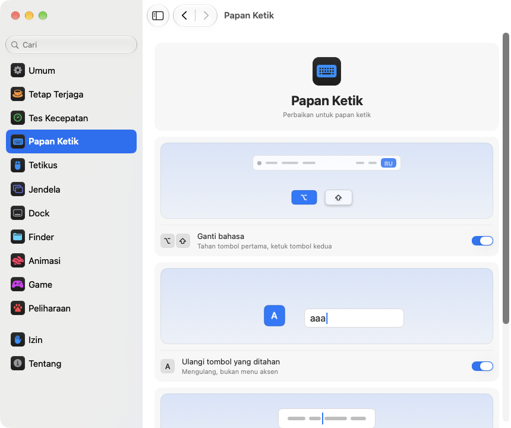

<p align="center"></p>
<h1 align="center">pika-tools</h1>
<p align="center">Perbaikan kecil untuk keyboard, tetikus, jendela, dan Finder, langsung dari bar menu Mac Anda.</p>
<p align="center"><sub><a href="../../README.md">English</a> · <a href="README.ru.md">Русский</a> · <a href="README.uk.md">Українська</a> · <a href="README.de.md">Deutsch</a> · <a href="README.fr.md">Français</a> · <a href="README.es.md">Español</a> · <a href="README.it.md">Italiano</a> · <a href="README.pt-BR.md">Português (Brasil)</a> · <a href="README.ja.md">日本語</a> · <a href="README.zh-Hans.md">简体中文</a> · <a href="README.ko.md">한국어</a> · <a href="README.ro.md">Română</a> · <a href="README.pl.md">Polski</a> · <a href="README.tr.md">Türkçe</a> · <a href="README.nl.md">Nederlands</a> · <a href="README.sv.md">Svenska</a> · <a href="README.cs.md">Čeština</a> · <a href="README.zh-Hant.md">繁體中文</a> · <a href="README.ar.md">العربية</a> · <a href="README.hi.md">हिन्दी</a> · <b>Bahasa Indonesia</b> · <a href="README.vi.md">Tiếng Việt</a> · <a href="README.th.md">ไทย</a></sub></p>

<p align="center">
<picture>
<source media="(prefers-color-scheme: dark)" srcset="../media/settings-id-dark.png">

</picture>
</p>

## Instalasi

```bash
brew install --cask dev-pikapik/pika-tools/pika-tools && open -a pika-tools
```

pika-tools muncul di bar menu di bagian atas layar. Semuanya tetap mati sampai Anda menyalakannya.

<details>
<summary>Tidak punya Homebrew? Ada dua cara lain</summary>

Tanpa Homebrew, buka Terminal, tempel baris ini, lalu tekan Return:

```bash
/bin/bash -c "$(curl -fsSL https://raw.githubusercontent.com/dev-pikapik/pika-tools/main/install.sh)"
```

Atau unduh [pika-tools.dmg](https://github.com/dev-pikapik/pika-tools/releases/latest/download/pika-tools.dmg), buka, lalu seret app ke folder Aplikasi.

Homebrew maupun skrip sama-sama menaruh app di `/Applications`, membukanya, meminta izin, dan menyalakan “Buka saat Masuk”. Setelah itu, app memperbarui dirinya sendiri, lihat **Pembaruan**. Untuk menghapusnya, lihat **Hapus instalasi**.

</details>

## Apa saja yang bisa dilakukan

<table>
<tbody><tr>
<td width="50%" valign="top">
<picture><source media="(prefers-color-scheme: dark)" srcset="../media/keep-awake-dark.png"></picture>
<br><b>Tetap Terjaga</b>
<br>Mac tetap terjaga selama yang Anda perlukan, bahkan saat penutupnya ditutup.
</td>
<td width="50%" valign="top">
<picture><source media="(prefers-color-scheme: dark)" srcset="../media/command-keys-dark.png"></picture>
<br><b>Lindungi ⌘Q dan ⌘W</b>
<br>Tidak ada yang tertutup tanpa sengaja. Tambahkan ⇧ jika memang disengaja.
</td>
</tr></tbody>
<tbody><tr>
<td width="50%" valign="top">
<picture><source media="(prefers-color-scheme: dark)" srcset="../media/compress-dark.png"></picture>
<br><b>Salinan Lebih Kecil</b>
<br>Klik kanan foto, PDF, atau video, dan salinan yang lebih ringan muncul di sebelahnya.
</td>
<td width="50%" valign="top">
<picture><source media="(prefers-color-scheme: dark)" srcset="../media/convert-dark.png"></picture>
<br><b>Konversi</b>
<br>Simpan gambar, video, atau lagu dalam format lain lewat klik kanan.
</td>
</tr></tbody>
<tbody><tr>
<td width="50%" valign="top">
<picture><source media="(prefers-color-scheme: dark)" srcset="../media/input-switch-dark.png"></picture>
<br><b>Ganti bahasa</b>
<br>Tahan ⌥ lalu ketuk ⇧ untuk mengganti bahasa keyboard.
</td>
<td width="50%" valign="top">
<picture><source media="(prefers-color-scheme: dark)" srcset="../media/quit-on-close-dark.png"></picture>
<br><b>Keluar bersama jendela terakhir</b>
<br>Tutup jendela terakhir sebuah app, dan app itu ikut keluar.
</td>
</tr></tbody>
<tbody><tr>
<td width="50%" valign="top">
<picture><source media="(prefers-color-scheme: dark)" srcset="../media/window-zoom-dark.png"></picture>
<br><b>Tombol hijau memperbesar</b>
<br>Jendela memenuhi layar tanpa masuk mode layar penuh.
</td>
<td width="50%" valign="top">
<picture><source media="(prefers-color-scheme: dark)" srcset="../media/dock-hide-dark.png"></picture>
<br><b>Sembunyikan dengan klik di Dock</b>
<br>Klik app yang sedang Anda pakai, dan app itu menyingkir.
</td>
</tr></tbody>
<tbody><tr>
<td width="50%" valign="top">
<picture><source media="(prefers-color-scheme: dark)" srcset="../media/new-file-dark.png"></picture>
<br><b>File Baru</b>
<br>Klik kanan di Finder, ketik nama, dan file kosong pun siap.
</td>
<td width="50%" valign="top">
<picture><source media="(prefers-color-scheme: dark)" srcset="../media/finder-cut-dark.png"></picture>
<br><b>⌘X memindahkan file</b>
<br>Potong file di Finder lalu tempel di mana saja.
</td>
</tr></tbody>
<tbody><tr>
<td width="50%" valign="top">
<picture><source media="(prefers-color-scheme: dark)" srcset="../media/finder-open-dark.png"></picture>
<br><b>Enter membuka file</b>
<br>Pilih file di Finder lalu tekan Enter untuk membukanya.
</td>
<td width="50%" valign="top">
<picture><source media="(prefers-color-scheme: dark)" srcset="../media/finder-delete-dark.png"></picture>
<br><b>Delete ke Tempat Sampah</b>
<br>Tekan ⌫ di Finder, dan file yang dipilih masuk ke Tempat Sampah.
</td>
</tr></tbody>
<tbody><tr>
<td width="50%" valign="top">
<picture><source media="(prefers-color-scheme: dark)" srcset="../media/game-mode-dark.png"></picture>
<br><b>Mode Game</b>
<br>Selama Anda bermain, tidak ada yang muncul di atas game atau menutupnya.
</td>
<td width="50%" valign="top">
<picture><source media="(prefers-color-scheme: dark)" srcset="../media/speed-test-dark.png"></picture>
<br><b>Tes Kecepatan</b>
<br>Seberapa cepat internet Anda dan cukup untuk apa saja.
</td>
</tr></tbody>
<tbody><tr>
<td width="50%" valign="top">
<picture><source media="(prefers-color-scheme: dark)" srcset="../media/side-buttons-dark.png"></picture>
<br><b>Tombol samping</b>
<br>Tombol 4 dan 5 untuk kembali dan maju, seperti usapan di trackpad.
</td>
<td width="50%" valign="top">
<picture><source media="(prefers-color-scheme: dark)" srcset="../media/wheel-lines-dark.png"></picture>
<br><b>Gulir per baris</b>
<br>Setiap klik roda menggulir sama jauh, secepat apa pun diputar.
</td>
</tr></tbody>
<tbody><tr>
<td width="50%" valign="top">
<picture><source media="(prefers-color-scheme: dark)" srcset="../media/wheel-direction-dark.png"></picture>
<br><b>Arah gulir</b>
<br>Satu arah untuk trackpad, arah lain untuk tetikus.
</td>
<td width="50%" valign="top">
<picture><source media="(prefers-color-scheme: dark)" srcset="../media/linear-pointer-dark.png"></picture>
<br><b>Tanpa akselerasi penunjuk</b>
<br>Penunjuk bergerak persis sejauh tangan Anda.
</td>
</tr></tbody>
<tbody><tr>
<td width="50%" valign="top">
<picture><source media="(prefers-color-scheme: dark)" srcset="../media/key-repeat-dark.png"></picture>
<br><b>Ulangi tombol yang ditahan</b>
<br>Tahan tombol untuk mengetiknya berulang kali, tanpa menu aksen.
</td>
<td width="50%" valign="top">
<picture><source media="(prefers-color-scheme: dark)" srcset="../media/home-end-dark.png"></picture>
<br><b>Home dan End</b>
<br>Lompat ke awal atau akhir baris saat mengetik.
</td>
</tr></tbody>
<tbody><tr>
<td width="50%" valign="top">
<picture><source media="(prefers-color-scheme: dark)" srcset="../media/animations-dark.png"></picture>
<br><b>Animasi</b>
<br>Percepat Dock, jendela, dan Lihat Cepat, bahkan sampai instan.
</td>
<td width="50%" valign="top"></td>
</tr></tbody>
</table>

## Detail lainnya

<details>
<summary>Pembukaan pertama</summary>

pika-tools memerlukan dua izin. Saat pertama kali dibuka, app menampilkan pengaturan di halaman Izin yang memandu Anda langkah demi langkah, dan macOS menampilkan permintaannya sendiri. Buka **Pengaturan Sistem › Privasi & Keamanan** dan nyalakan pika-tools di:

- **Aksesibilitas**, agar app bisa mengubah tekanan tombol atau klik sebelum sampai ke app lain.
- **Pemantauan Input**, agar app bisa melihat tekanan tombol dan klik.

App mendeteksi perubahan dalam satu atau dua detik, tanpa perlu memulai ulang.

pika-tools tidak merekam, menyimpan, atau mengirim apa pun yang Anda ketik atau klik. Peristiwa diproses di memori dan langsung diteruskan. Satu-satunya permintaan jaringan adalah pemeriksaan pembaruan, yang menanyakan rilis terbaru ke GitHub.

</details>

<details>
<summary>Setiap alat secara detail</summary>

**Lindungi ⌘Q dan ⌘W.** ⌘Q dan ⌘W saja tidak melakukan apa pun, jadi Anda tidak akan keluar dari app atau menutup jendela secara tidak sengaja. Tambahkan Shift untuk melakukannya dengan sengaja: ⇧⌘Q keluar, ⇧⌘W menutup. Berfungsi di semua app. Setiap tombol punya saklarnya sendiri. Mati secara default.

**Ganti bahasa dengan Option+Shift.** Tahan Option lalu ketuk Shift: macOS berpindah ke sumber input berikutnya. Tetap tahan Option dan ketuk Shift lagi untuk maju terus. Tahan Shift lalu ketuk Option untuk kembali. Jika di antaranya Anda menekan tombol lain, mengeklik, atau menambahkan Command, Control, atau Fn, bahasa tidak berganti, sehingga pintasan seperti Option+Shift+panah tetap bekerja seperti sebelumnya. Mati secara default.

**Ulangi tombol yang ditahan.** Tahan sebuah tombol dan hurufnya terketik berulang kali, bukan muncul menu aksen. Berguna saat bermain game dan mengetik. App yang sudah terbuka menerapkannya setelah dimulai ulang. Matikan, dan macOS kembali bekerja seperti biasa. Mati secara default.

**Home dan End ke awal dan akhir baris.** Saat Anda mengetik, Home memindahkan kursor ke awal baris dan End ke akhirnya, bukan menggulir halaman. Dengan ⇧ keduanya memilih sampai di sana, dengan ⌘ keduanya ke awal atau akhir seluruh teks. Di luar kolom teks, serta di terminal, mesin virtual, dan app desktop jarak jauh, tombolnya berfungsi seperti sebelumnya. Anda bisa menambahkan app lain tempat tombol ini harus berfungsi seperti biasa. Mati secara bawaan.

**Matikan akselerasi penunjuk.** Penunjuk bergerak persis sejauh gerakan tetikus, secepat apa pun Anda menggerakkannya, seperti LinearMouse. Penggeser **Kecepatan melacak** mengatur seberapa cepat penunjuk bergerak. Hanya berlaku untuk tetikus, trackpad tetap seperti semula. Matikan fitur ini atau keluar dari pika-tools, dan macOS mendapatkan kembali pengaturannya sendiri. Mati secara default.

**Gulir per baris.** Setiap klik roda tetikus menggulir jumlah baris yang sama, secepat apa pun Anda memutarnya. Pilih 1 sampai 10 baris per klik, default-nya 3. Pengguliran alami tetap seperti yang Anda atur di Pengaturan Sistem. Hanya berlaku untuk tetikus, trackpad tidak berubah. Mati secara default. Di samping penggeser **Jarak per klik**, halaman kecil bergulir sejauh yang Anda pilih, dan titik menandai nilai bawaan.

Beberapa app dan game menghitung guliran dalam piksel yang tepat: untuk itu, ubah pengaturan yang sama ke piksel dan pilih 1 sampai 200 piksel per klik, bawaannya 40. Penggeser juga menunjukkan berapa bagian tinggi layar itu.

**Arah gulir untuk trackpad dan tetikus.** macOS hanya punya satu sakelar pengguliran alami untuk trackpad dan tetikus sekaligus. Nyalakan fitur ini dan pilih arah untuk masing-masing: **Alami**, halaman mengikuti jari Anda seperti di iPhone, atau **Klasik**, saat halaman bergerak ke arah sebaliknya. Pilihan untuk trackpad juga berlaku untuk gulir ke samping dan luncuran setelah jari diangkat. Magic Mouse menggulir dengan sentuhan, jadi mengikuti pilihan trackpad. Pilih yang sama di setiap Mac Anda agar pengguliran terasa sama di semuanya, bahkan saat Anda memindahkan tetikus ke Mac lain dengan Kontrol Universal. Mati secara bawaan. Saat dinyalakan, keduanya mulai seperti di Pengaturan Sistem, jadi tidak ada yang berubah sampai Anda memilih yang lain.

**Tombol samping untuk kembali dan maju.** Tombol tetikus 4 dan 5 berfungsi untuk mundur dan maju di Safari, Finder, dan app Apple lainnya, juga di Firefox, Opera, dan ForkLift, sama seperti usapan di trackpad. App lain, seperti IDE JetBrains, menerima tombolnya apa adanya dan menanganinya dengan cara sendiri. Jika posisi keduanya terbalik di tetikus Anda, nyalakan **Tukar tombol samping**. Mati secara default.

**Keluar saat jendela terakhir ditutup.** Tutup jendela terakhir sebuah app, dan app akan keluar. Finder tetap terbuka, begitu juga app yang punya jendela di desktop lain atau di Dock. Anda bisa membuat daftar app yang tidak boleh keluar dengan cara ini. Mati secara default.

**Sembunyikan dengan klik di Dock.** Klik ikon Dock dari app yang sedang Anda gunakan, dan app itu tersembunyi. Klik lagi untuk memunculkannya kembali. Mati secara default.

**Tombol hijau memperbesar jendela.** Klik tombol hijau pada jendela, dan jendela akan memenuhi layar tanpa masuk ke layar penuh. Klik lagi untuk mengembalikan ukuran sebelumnya. Tahan ⌥, dan tombol bekerja seperti biasa. Layar penuh tetap ada di menu tombol dan di ⌃⌘F. Anda bisa membuat daftar app yang tombol hijaunya harus bekerja seperti biasa. Mati secara default.

**File Baru di Finder.** Klik kanan di jendela Finder atau di desktop, pilih **File Baru**, ketik nama, dan file kosong langsung muncul. Bawaannya .txt. Mati secara bawaan.

**Enter Membuka File di Finder.** Pilih file di jendela Finder atau di desktop, lalu tekan Return atau Enter, dan file langsung terbuka. F2 atau fn F2 mengganti nama file yang dipilih. Di kolom teks, misalnya saat mengetik nama, tombol-tombol ini bekerja seperti biasa. Mati secara bawaan.

**⌘X Memotong File di Finder.** Pilih file lalu tekan ⌘X, buka folder tujuan dan tekan ⌘V, dan file dipindahkan ke sana, bukan disalin. ⌘C membatalkan pemotongan. Mati secara bawaan.

**Delete menghapus file di Finder.** Pilih file lalu tekan ⌫ atau ⌦ (fn ⌫ di laptop), dan file masuk ke Tong Sampah, sama seperti dengan ⌘⌫. Saat Anda mengganti nama file, mencari, atau mengetik di kolom lain, tombolnya menghapus huruf seperti biasa. Mati secara bawaan.

**Salinan Lebih Kecil di Finder.** Klik kanan file di Finder dan pilih **Buat Salinan Lebih Kecil**. Versi foto, GIF, PDF, atau video yang lebih ringan disimpan tepat di sebelahnya, sering kali beberapa kali lebih kecil. Suara tanpa kompresi seperti WAV atau AIFF menjadi M4A yang ringkas. Jika file tidak bisa lebih kecil lagi, salinan tidak dibuat dan pika-tools memberi tahu Anda. File asli tetap seperti semula, dan tidak ada yang keluar dari Mac Anda. Mati secara bawaan.

**Konversi di Finder.** Klik kanan file di Finder dan pilih **Konversi ke** untuk menyimpannya dalam format lain: gambar sebagai JPEG, PNG, HEIC, GIF, TIFF, atau PDF, video sebagai MP4, MOV, atau suaranya saja, musik sebagai M4A, WAV, atau AIFF. File asli tetap seperti semula, dan tidak ada yang keluar dari Mac Anda. Dinyalakan terpisah dari Salinan Lebih Kecil. Mati secara bawaan.

**Mode Game.** Tambahkan game Anda, dan selama Anda bermain, Mac tidak menarik Anda keluar dari game. Spotlight, Siri, ⌘Tab, Mission Control, dan gesekan antar-desktop tidak terbuka di atas game, ⌘Q dan ⌘W tidak menutupnya tanpa sengaja, penunjuk tidak meluncur ke Dock, bar menu, atau layar lain, dan layar tetap menyala. Masing-masing punya saklarnya sendiri di halaman Game, dan pika-tools menyarankan game yang ditemukannya di Mac Anda. Di dalam game, Control-klik tetap klik biasa, dan Control dengan panah tidak mengganti desktop. Minecraft juga dikenali: tambahkan Minecraft Launcher atau CurseForge, dan mode ini menyala di dalam Minecraft itu sendiri. Untuk keluar dari game, tekan ⇧⌘Q; untuk menutup jendelanya, ⇧⌘W. ⌥⌘Esc selalu berfungsi. Begitu Anda keluar dari game, semuanya berfungsi seperti biasa. Mati secara bawaan.

Setiap alat punya saklarnya sendiri di menu dan di pengaturan.

Ikon di bar menu menunjukkan status sekilas: panah dengan klik saat alat bekerja, panah dicoret saat semuanya mati, dan segitiga peringatan saat sebuah alat menyala tetapi izinnya belum lengkap.

Panel bar menu awalnya hanya menampilkan beberapa baris. Anda bisa memilih baris yang tampil: klik tombol pensil di bagian bawah, centang yang ingin Anda lihat, lalu klik **Selesai**. Baris yang disembunyikan tetap berfungsi dan tetap ada di Pengaturan. Jika panel tidak muat di layar, panel bisa digulir.

App mengikuti bahasa sistem atau bahasa yang Anda pilih di pengaturan. Semua 23 bahasa dalam daftar di bagian atas halaman ini tersedia.

</details>

<details>
<summary>Tetap Terjaga</summary>

Mencegah Mac masuk mode tidur saat Anda jauh dari papan ketik: untuk waktu berapa pun dari 1 detik hingga 365 hari, atau sampai Anda mematikannya. Nyalakan dari menu, lalu atur durasinya di pengaturan: ketik hari, jam, menit, dan detik, gunakan ↑ dan ↓, atau klik pilihan siap pakai dari 15 menit hingga 8 jam. Menu menampilkan sisa waktu dan kapan berakhir. Untuk **Layar** ada dua pilihan. **Selalu menyala**: layar tidak mati, tanpa penghemat layar atau layar kunci. **Mati seperti biasa**: layar mati sesuai pewaktunya, sementara Mac tetap bekerja. **Matikan layar sekarang** (ada juga di menu) langsung mematikan layar dan Mac tetap bekerja: gerakkan mouse atau tekan tombol apa saja untuk menyalakannya lagi. Keluar dari pika-tools akan mengakhiri Tetap Terjaga.

Di MacBook, Anda juga bisa menyalakan **Bekerja dengan penutup tertutup**. macOS tidak punya saklar untuk ini, jadi pika-tools menjalankan `pmset -a disablesleep 1` dan meminta kata sandi administrator: hanya administrator yang bisa mengubah cara Mac tidur. Pengaturan ini kembali normal dengan sendirinya saat Tetap Terjaga berakhir, saat Anda keluar dari app, atau jika app mogok. Jika Anda tidak memasukkan kata sandi, tidak ada yang berubah. Pastikan Mac mendapat sirkulasi udara yang baik saat penutupnya tertutup. **Berhenti saat baterai di bawah 20%** mengakhiri sesi sebelum baterai habis.

Keep Awake, mode layar, dan mode layar tertutup bisa dipasang ke tombol di Pusat Kontrol, bilah menu, atau widget desktop lewat app Pintasan, dengan tautan yang kamu salin dari Pengaturan › Tetap Terjaga.

</details>

<details>
<summary>Tes Kecepatan</summary>

Menunjukkan seberapa cepat internetmu saat ini. Klik **Cek Kecepatan** di Pengaturan › Tes Kecepatan, atau **Cek** di menu setelah kamu menambahkan barisnya dengan tombol pensil. Dalam sekitar setengah menit kamu melihat kecepatan unduh dan unggah, ping, serta responsivitas: seberapa cepat semuanya merespons saat koneksi sedang sibuk. Di bawahnya tertulis dengan kata sederhana koneksi ini cocok untuk apa: film 4K, panggilan video, game online, dan unduhan besar. Pengecekan memakai networkQuality bawaan macOS dan server Apple. Hasil terakhir tetap tersimpan sampai pengecekan berikutnya, dan tautan untuk Pintasan menjalankannya dari Pusat Kontrol.

</details>

<details>
<summary>Pengaturan</summary>

Buka pengaturan dari menu dengan **Pengaturan…** atau ⌘, atau buka lagi pika-tools dari Finder, Launchpad, atau Spotlight. Selama jendelanya terbuka, app muncul di Dock dan di ⌘Tab.

- **Umum**: buka saat masuk, tampilan (Sistem, Terang, atau Gelap), bahasa, pembaruan, dan pencadangan: ekspor dan impor pengaturan sebagai file, atau selaraskan lewat iCloud Drive.
- **Tetap Terjaga**: durasi, opsi layar dan penutup.
- **Tes Kecepatan**: cek kecepatan internet dan lihat cocok untuk apa.
- **Papan Ketik**: penggantian bahasa, pengulangan tombol, Home dan End.
- **Tetikus**: akselerasi penunjuk dan kecepatan melacak, gulir per baris, arah gulir, tombol samping.
- **Jendela**: memperbesar jendela dengan tombol hijau (dengan daftar pengecualian), perlindungan ⌘Q dan ⌘W, serta keluar saat jendela terakhir ditutup (dengan daftar pengecualian).
- **Dock**: menyembunyikan dengan klik di Dock.
- **Finder**: file baru, salinan lebih kecil dan konversi, buka dengan Return, potong dengan ⌘X, dan hapus dengan ⌫.
- **Izin**: status kedua izin, dan status iCloud Drive saat sinkronisasi menyala, dengan tombol yang membuka tempat yang tepat di Pengaturan Sistem.
- **Tentang**: versi, tautan ke catatan perubahan dan untuk melaporkan masalah.

Banyak pengaturan dilengkapi gambar kecil yang menunjukkan fungsinya, misalnya Mac yang tetap terjaga atau jendela yang bersembunyi di balik Dock. Gambar berubah bersama sakelar dan diam saja saat “Kurangi Gerakan” aktif di Pengaturan Sistem.

Setiap halaman memiliki tombol **Pulihkan Default…** di bagian bawah. Tombol ini bertanya terlebih dahulu, lalu mematikan alat di halaman tersebut dan mengembalikan pilihannya, seolah pika-tools tidak pernah menyentuhnya.

**Selaraskan pengaturan dengan iCloud** menjaga pika-tools tetap sama di semua Mac Anda. Pengaturan disimpan di folder pika-tools di iCloud Drive, dan perubahan terbaru yang berlaku. Mati secara default dan memerlukan iCloud Drive yang menyala. Izin tidak ikut disinkronkan: setiap Mac memintanya sendiri.

</details>

<details>
<summary>Pembaruan</summary>

pika-tools memeriksa versi baru saat dibuka dan setiap 6 jam. Anda bisa mematikannya di Pengaturan › Umum. Saat versi baru tersedia, tombol **Perbarui ke …** muncul di menu: satu klik, dan app mengunduh pembaruan, memasangnya, lalu memulai ulang. Anda juga bisa memeriksa sendiri dengan **Periksa Sekarang** di Pengaturan › Umum.

Dengan Homebrew, Anda juga bisa menjalankan `brew upgrade --cask pika-tools`.

Mulai versi 1.3, izin tetap ada setelah pembaruan.

</details>

<details>
<summary>Hapus instalasi</summary>

```bash
/bin/bash -c "$(curl -fsSL https://raw.githubusercontent.com/dev-pikapik/pika-tools/main/uninstall.sh)"
```

Jika Anda memasang dengan Homebrew: `brew uninstall --cask --zap pika-tools`.

Keduanya keluar dari app, menghapusnya dari item masuk, dan menghapus app. Skrip juga mengatur ulang izinnya.

</details>

<details>
<summary>Pertanyaan umum</summary>

**Mengapa perlu dua izin?**
macOS membagi akses ke papan ketik dan mouse menjadi dua. Pemantauan Input membuat app bisa melihat peristiwa, sedangkan Aksesibilitas membuatnya bisa mengubah peristiwa itu. Untuk memblokir pintasan, keduanya diperlukan.

**macOS mengatakan app berasal dari pengembang yang tidak dikenal.**
pika-tools sudah ditandatangani, tetapi tidak dinotarisasi oleh Apple. Homebrew dan skrip instalasi mengurus hal ini untuk Anda. Jika Anda memakai dmg, buka **Pengaturan Sistem › Privasi & Keamanan** dan klik **Tetap Buka**, atau jalankan:

```bash
xattr -dr com.apple.quarantine /Applications/pika-tools.app
```

**Apakah berjalan di Mac Intel?**
Ya. Ini adalah app universal untuk Apple silicon dan Intel, dengan macOS 14 Sonoma atau lebih baru.

**Izin sudah menyala, tetapi tidak ada yang bekerja.**
Di **Pengaturan Sistem › Privasi & Keamanan**, hapus pika-tools dari kedua daftar dengan tombol −, lalu tambahkan lagi. Halaman Izin di pengaturan pika-tools punya tombol yang membuka tempat yang tepat.

</details>

<p align="center">☕ Jika Anda menyukai pika-tools, Anda bisa <a href="https://buymeacoffee.com/pikapik">mentraktir saya kopi</a> — semuanya untuk pengembangan dan dukungan aplikasi.</p>

<p align="center"><sub><a href="../whats-new/README.id.md">Yang baru</a> · <a href="https://github.com/dev-pikapik/homebrew-pika-tools">Tap Homebrew</a> · <a href="../../CONTRIBUTING.md">Bangun sendiri</a> · <a href="../../LICENSE">Lisensi MIT</a> · © 2026 pikapik</sub></p>
