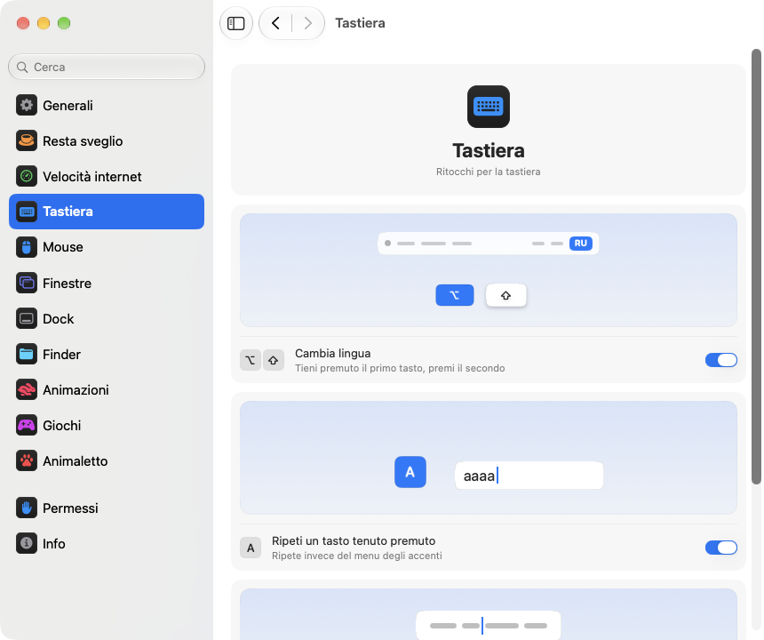

<p align="center"></p>
<h1 align="center">pika-tools</h1>
<p align="center">Piccoli ritocchi per tastiera, mouse, finestre e Finder, direttamente nella barra dei menu del tuo Mac.</p>
<p align="center"><sub><a href="../../README.md">English</a> · <a href="README.ru.md">Русский</a> · <a href="README.uk.md">Українська</a> · <a href="README.de.md">Deutsch</a> · <a href="README.fr.md">Français</a> · <a href="README.es.md">Español</a> · <b>Italiano</b> · <a href="README.pt-BR.md">Português (Brasil)</a> · <a href="README.ja.md">日本語</a> · <a href="README.zh-Hans.md">简体中文</a> · <a href="README.ko.md">한국어</a> · <a href="README.ro.md">Română</a> · <a href="README.pl.md">Polski</a> · <a href="README.tr.md">Türkçe</a> · <a href="README.nl.md">Nederlands</a> · <a href="README.sv.md">Svenska</a> · <a href="README.cs.md">Čeština</a> · <a href="README.zh-Hant.md">繁體中文</a> · <a href="README.ar.md">العربية</a> · <a href="README.hi.md">हिन्दी</a> · <a href="README.id.md">Bahasa Indonesia</a> · <a href="README.vi.md">Tiếng Việt</a> · <a href="README.th.md">ไทย</a></sub></p>

<p align="center">
<picture>
<source media="(prefers-color-scheme: dark)" srcset="../media/settings-it-dark.png">

</picture>
</p>

## Installazione

```bash
brew install --cask dev-pikapik/pika-tools/pika-tools && open -a pika-tools
```

pika-tools compare nella barra dei menu, in alto sullo schermo. Tutto resta spento finché non lo accendi tu.

<details>
<summary>Non hai Homebrew? Altri due modi</summary>

Senza Homebrew, apri Terminale, incolla questa riga e premi A capo:

```bash
/bin/bash -c "$(curl -fsSL https://raw.githubusercontent.com/dev-pikapik/pika-tools/main/install.sh)"
```

Oppure scarica [pika-tools.dmg](https://github.com/dev-pikapik/pika-tools/releases/latest/download/pika-tools.dmg), aprilo e trascina l’app nella cartella Applicazioni.

Sia Homebrew sia lo script mettono l’app in `/Applications`, la avviano, chiedono i permessi e attivano l’apertura al login. Da quel momento l’app si aggiorna da sola, vedi **Aggiornamenti**. Per rimuoverla, vedi **Disinstallazione**.

</details>

## Cosa fa

<table>
<tbody><tr>
<td width="50%" valign="top">
<picture><source media="(prefers-color-scheme: dark)" srcset="../media/keep-awake-dark.png"></picture>
<br><b>Resta sveglio</b>
<br>Il Mac resta sveglio per tutto il tempo che serve, anche con il coperchio chiuso.
</td>
<td width="50%" valign="top">
<picture><source media="(prefers-color-scheme: dark)" srcset="../media/command-keys-dark.png"></picture>
<br><b>Proteggi ⌘Q e ⌘W</b>
<br>Niente si chiude per sbaglio. Aggiungi ⇧ quando lo vuoi davvero.
</td>
</tr></tbody>
<tbody><tr>
<td width="50%" valign="top">
<picture><source media="(prefers-color-scheme: dark)" srcset="../media/compress-dark.png"></picture>
<br><b>Copia più leggera</b>
<br>Clic destro su una foto, un PDF o un video, e accanto compare una copia più leggera.
</td>
<td width="50%" valign="top">
<picture><source media="(prefers-color-scheme: dark)" srcset="../media/convert-dark.png"></picture>
<br><b>Conversione</b>
<br>Salva un’immagine, un video o un brano in un altro formato con il clic destro.
</td>
</tr></tbody>
<tbody><tr>
<td width="50%" valign="top">
<picture><source media="(prefers-color-scheme: dark)" srcset="../media/input-switch-dark.png"></picture>
<br><b>Cambia lingua</b>
<br>Tieni premuto ⌥ e tocca ⇧ per cambiare la lingua della tastiera.
</td>
<td width="50%" valign="top">
<picture><source media="(prefers-color-scheme: dark)" srcset="../media/quit-on-close-dark.png"></picture>
<br><b>Esci con l’ultima finestra</b>
<br>Chiudi l’ultima finestra di un’app, e si chiude anche l’app.
</td>
</tr></tbody>
<tbody><tr>
<td width="50%" valign="top">
<picture><source media="(prefers-color-scheme: dark)" srcset="../media/window-zoom-dark.png"></picture>
<br><b>Il pulsante verde ingrandisce</b>
<br>La finestra riempie lo schermo senza passare a schermo intero.
</td>
<td width="50%" valign="top">
<picture><source media="(prefers-color-scheme: dark)" srcset="../media/dock-hide-dark.png"></picture>
<br><b>Nascondi con un clic nel Dock</b>
<br>Fai clic sull’app che stai usando, e si toglie di mezzo.
</td>
</tr></tbody>
<tbody><tr>
<td width="50%" valign="top">
<picture><source media="(prefers-color-scheme: dark)" srcset="../media/new-file-dark.png"></picture>
<br><b>Nuovo file</b>
<br>Clic destro nel Finder, un nome, ed ecco un file vuoto.
</td>
<td width="50%" valign="top">
<picture><source media="(prefers-color-scheme: dark)" srcset="../media/finder-cut-dark.png"></picture>
<br><b>⌘X sposta i file</b>
<br>Taglia i file nel Finder e incollali dove vuoi.
</td>
</tr></tbody>
<tbody><tr>
<td width="50%" valign="top">
<picture><source media="(prefers-color-scheme: dark)" srcset="../media/finder-open-dark.png"></picture>
<br><b>Invio apre i file</b>
<br>Seleziona i file nel Finder e premi Invio per aprirli.
</td>
<td width="50%" valign="top">
<picture><source media="(prefers-color-scheme: dark)" srcset="../media/finder-delete-dark.png"></picture>
<br><b>Elimina nel Cestino</b>
<br>Premi ⌫ nel Finder, e i file selezionati finiscono nel Cestino.
</td>
</tr></tbody>
<tbody><tr>
<td width="50%" valign="top">
<picture><source media="(prefers-color-scheme: dark)" srcset="../media/game-mode-dark.png"></picture>
<br><b>Modalità gioco</b>
<br>Mentre giochi, niente si apre sopra il gioco né lo chiude.
</td>
<td width="50%" valign="top">
<picture><source media="(prefers-color-scheme: dark)" srcset="../media/speed-test-dark.png"></picture>
<br><b>Velocità internet</b>
<br>Quanto è veloce la tua connessione e a cosa basta.
</td>
</tr></tbody>
<tbody><tr>
<td width="50%" valign="top">
<picture><source media="(prefers-color-scheme: dark)" srcset="../media/side-buttons-dark.png"></picture>
<br><b>Tasti laterali</b>
<br>I tasti 4 e 5 vanno indietro e avanti, come uno swipe.
</td>
<td width="50%" valign="top">
<picture><source media="(prefers-color-scheme: dark)" srcset="../media/wheel-lines-dark.png"></picture>
<br><b>Scorri per righe</b>
<br>Ogni scatto della rotella scorre allo stesso modo, a qualsiasi velocità.
</td>
</tr></tbody>
<tbody><tr>
<td width="50%" valign="top">
<picture><source media="(prefers-color-scheme: dark)" srcset="../media/wheel-direction-dark.png"></picture>
<br><b>Direzione di scorrimento</b>
<br>Una direzione per il trackpad, un’altra per il mouse.
</td>
<td width="50%" valign="top">
<picture><source media="(prefers-color-scheme: dark)" srcset="../media/linear-pointer-dark.png"></picture>
<br><b>Senza accelerazione del puntatore</b>
<br>Il puntatore si muove esattamente quanto la tua mano.
</td>
</tr></tbody>
<tbody><tr>
<td width="50%" valign="top">
<picture><source media="(prefers-color-scheme: dark)" srcset="../media/key-repeat-dark.png"></picture>
<br><b>Ripeti un tasto tenuto premuto</b>
<br>Tieni premuto un tasto per ripeterlo, senza il menu degli accenti.
</td>
<td width="50%" valign="top">
<picture><source media="(prefers-color-scheme: dark)" srcset="../media/home-end-dark.png"></picture>
<br><b>Home ed End</b>
<br>Vai a inizio o fine riga mentre scrivi.
</td>
</tr></tbody>
<tbody><tr>
<td width="50%" valign="top">
<picture><source media="(prefers-color-scheme: dark)" srcset="../media/animations-dark.png"></picture>
<br><b>Animazioni</b>
<br>Velocizza il Dock, le finestre e Visualizzazione rapida, fino a renderli istantanei.
</td>
<td width="50%" valign="top"></td>
</tr></tbody>
</table>

## Più dettagli

<details>
<summary>Primo avvio</summary>

pika-tools ha bisogno di due permessi. Al primo avvio apre le impostazioni sulla pagina Permessi, che ti guida passo passo, e macOS mostra le sue richieste. Vai in **Impostazioni di Sistema › Privacy e sicurezza** e attiva pika-tools in:

- **Accessibilità**, così l’app può modificare la pressione di un tasto o un clic prima che arrivi alle altre app.
- **Monitoraggio input**, così l’app può vedere pressioni dei tasti e clic.

L’app si accorge della modifica in un paio di secondi, senza bisogno di riavviare.

pika-tools non registra, non conserva e non invia nulla di ciò che digiti o clicchi. Gli eventi vengono gestiti in memoria e inoltrati subito. L’unica richiesta di rete è il controllo degli aggiornamenti, che chiede a GitHub qual è l’ultima versione.

</details>

<details>
<summary>Ogni strumento nel dettaglio</summary>

**Proteggi ⌘Q e ⌘W.** ⌘Q e ⌘W da soli non fanno nulla, così non chiudi un’app o una finestra per sbaglio. Aggiungi Maiuscole per farlo apposta: ⇧⌘Q esce, ⇧⌘W chiude. Funziona in tutte le app. Ogni tasto ha il suo interruttore. Disattivato di default.

**Cambia lingua con Opzione+Maiuscole.** Tieni premuto Opzione e tocca Maiuscole: macOS passa alla sorgente di input successiva. Continua a tenere premuto Opzione e tocca di nuovo Maiuscole per andare avanti. Tieni premuto Maiuscole e tocca Opzione per tornare indietro. Se nel frattempo premi un altro tasto, fai clic o aggiungi Comando, Control o Fn, non cambia nulla, quindi abbreviazioni come Opzione+Maiuscole+freccia funzionano come prima. Disattivato di default.

**Ripeti un tasto tenuto premuto.** Tieni premuto un tasto e la lettera viene scritta più e più volte, invece di aprire il menu degli accenti. Comodo nei giochi e quando scrivi. Le app già aperte lo applicano dopo il riavvio. Se lo disattivi, macOS torna a comportarsi come sempre. Disattivato di default.

**Home ed End vanno a inizio e fine riga.** Mentre scrivi, Home porta il cursore all’inizio della riga ed End alla fine, invece di scorrere la pagina. Con ⇧ selezionano fin lì, con ⌘ vanno all’inizio o alla fine di tutto il testo. Fuori dai campi di testo, e nei terminali, nelle macchine virtuali e nelle app di desktop remoto, i tasti funzionano come prima. Puoi aggiungere altre app in cui devono funzionare come al solito. Disattivato di default.

**Disattiva l’accelerazione del puntatore.** Il puntatore si sposta esattamente quanto il mouse, a qualsiasi velocità lo muovi, come con LinearMouse. Un cursore **Velocità puntatore** ne regola la velocità. Funziona solo con i mouse, il trackpad resta com’è. Disattivala o esci da pika-tools e macOS riprende le sue impostazioni. Disattivato di default.

**Scorri per righe.** Ogni scatto della rotella del mouse scorre lo stesso numero di righe, per quanto veloce la giri. Scegli da 1 a 10 righe per scatto, 3 di default. Lo scorrimento naturale resta come l’hai impostato in Impostazioni di Sistema. Funziona solo con i mouse, il trackpad resta com’è. Disattivato di default. Accanto al cursore **Distanza per scatto**, una piccola pagina scorre della distanza scelta, e un punto indica il valore predefinito.

Alcune app e alcuni giochi contano lo scorrimento in pixel esatti: per loro, passa la stessa impostazione ai pixel e scegli da 1 a 200 pixel per scatto, 40 di base. Il cursore mostra anche quanta parte dell’altezza dello schermo corrisponde.

**Direzione di scorrimento per trackpad e mouse.** macOS ha un solo interruttore per lo scorrimento naturale, sia per il trackpad sia per il mouse. Attiva questa funzione e scegli una direzione per ciascuno: **Naturale**, con la pagina che segue le dita come su iPhone, oppure **Classica**, in cui la pagina va nel verso opposto. La scelta del trackpad vale anche per lo scorrimento laterale e per l’inerzia dopo aver sollevato le dita. Il Magic Mouse scorre al tocco, quindi segue la scelta del trackpad. Scegli lo stesso su ogni tuo Mac e lo scorrimento sarà uguale ovunque, anche quando sposti il mouse su un altro Mac con Controllo universale. Disattivata di default. Quando la attivi, entrambe partono come in Impostazioni di Sistema, quindi non cambia nulla finché non scegli altro.

**Tasti laterali per indietro e avanti.** I tasti 4 e 5 del mouse vanno indietro e avanti in Safari, nel Finder e in altre app Apple, in Firefox, Opera e ForkLift, proprio come uno swipe sul trackpad. Le altre app, come gli IDE JetBrains, ricevono i tasti così come sono e li gestiscono a modo loro. Se il tuo mouse li ha invertiti, attiva **Inverti i tasti laterali**. Disattivato di default.

**Esci quando si chiude l’ultima finestra.** Chiudi l’ultima finestra di un’app e l’app si chiude. Il Finder resta aperto, così come le app con finestre su altre scrivanie o nel Dock. Puoi indicare le app che non devono mai chiudersi in questo modo. Disattivato di default.

**Nascondi con un clic nel Dock.** Fai clic sull’icona nel Dock dell’app che stai usando e si nasconde. Fai di nuovo clic per riaverla. Disattivato di default.

**Il pulsante verde ingrandisce la finestra.** Fai clic sul pulsante verde di una finestra e questa si allarga fino a riempire lo schermo, senza passare a schermo intero. Un altro clic riporta la misura precedente. Tieni premuto ⌥ e il pulsante funziona come sempre. Lo schermo intero resta nel menu del pulsante e con ⌃⌘F. Puoi elencare le app in cui il pulsante verde deve funzionare come sempre. Disattivato di default.

**Nuovo file nel Finder.** Clic destro in una finestra del Finder o sulla scrivania, scegli **Nuovo file**, scrivi un nome e compare un file vuoto. .txt di default. Disattivato di default.

**Invio apre i file nel Finder.** Seleziona dei file in una finestra del Finder o sulla scrivania e premi Invio o Enter: si aprono. F2 o fn F2 rinomina il file selezionato. Nei campi di testo, per esempio mentre scrivi un nome, i tasti funzionano come sempre. Disattivato di default.

**⌘X taglia i file nel Finder.** Seleziona dei file e premi ⌘X, apri la cartella di destinazione e premi ⌘V: i file vengono spostati lì invece di essere copiati. ⌘C annulla il taglio. Disattivato di default.

**Elimina cancella i file nel Finder.** Seleziona i file e premi ⌫ o ⌦ (fn ⌫ su un portatile): finiscono nel Cestino, proprio come con ⌘⌫. Mentre rinomini un file, cerchi o scrivi in un altro campo, i tasti cancellano le lettere come al solito. Disattivato di default.

**Copia più leggera nel Finder.** Clic destro su un file nel Finder e scegli **Crea copia più leggera**. Accanto compare una versione più leggera di una foto, una GIF, un PDF o un video, spesso molte volte più piccola. L’audio non compresso, come WAV o AIFF, diventa un M4A compatto. Se il file non può diventare più leggero, la copia non viene creata e pika-tools te lo dice. L’originale resta com’è e niente lascia il tuo Mac. Disattivato di default.

**Conversione nel Finder.** Clic destro su un file nel Finder e scegli **Converti in** per salvarlo in un altro formato: un’immagine come JPEG, PNG, HEIC, GIF, TIFF o PDF, un video come MP4, MOV o solo l’audio, la musica come M4A, WAV o AIFF. L’originale resta com’è e niente lascia il tuo Mac. Si attiva separatamente dalla copia più leggera. Disattivato di default.

**Modalità gioco.** Aggiungi i tuoi giochi e, mentre giochi, il Mac non ti tira fuori dal gioco. Spotlight, Siri, ⌘Tab, Mission Control e gli scorrimenti tra le scrivanie non si aprono sopra il gioco, ⌘Q e ⌘W non lo chiudono per sbaglio, il puntatore non scivola sul Dock, sulla barra dei menu o su un altro schermo e lo schermo resta acceso. Ognuna di queste opzioni ha il suo interruttore nella pagina Giochi, e pika-tools ti suggerisce i giochi che trova sul tuo Mac. Nel gioco, Control-clic resta un semplice clic, e Control con le frecce non cambia scrivania. Riconosce anche Minecraft: aggiungi Minecraft Launcher o CurseForge, e la modalità si attiva dentro Minecraft stesso. Per uscire da un gioco, premi ⇧⌘Q; per chiuderne la finestra, ⇧⌘W. ⌥⌘Esc funziona sempre. Appena esci dal gioco, tutto funziona come al solito. Disattivato di default.

Ogni strumento ha il suo interruttore nel menu e nelle impostazioni.

L’icona nella barra dei menu mostra lo stato a colpo d’occhio: una freccia con un clic quando gli strumenti funzionano, una freccia barrata quando è tutto spento e un triangolo di avviso quando uno strumento è attivo ma mancano i permessi.

Il pannello della barra dei menu parte con poche righe. Puoi scegliere quali mostrare: fai clic sul pulsante con la matita in basso, seleziona ciò che vuoi vedere e fai clic su **Fine**. Le righe nascoste continuano a funzionare e restano nelle Impostazioni. Se il pannello non sta nello schermo, scorre.

L’app usa la lingua del sistema o quella che scegli nelle impostazioni. Sono disponibili tutte le 23 lingue elencate in cima a questa pagina.

</details>

<details>
<summary>Resta sveglio</summary>

Impedisce al Mac di andare in stop mentre sei lontano dalla tastiera: per qualsiasi durata da 1 secondo a 365 giorni, o finché non lo disattivi. Attivalo dal menu e imposta la durata nelle impostazioni: digita giorni, ore, minuti e secondi, usa ↑ e ↓ oppure fai clic su una durata predefinita da 15 minuti a 8 ore. Il menu mostra quanto tempo resta e quando finisce. Per lo **Schermo** ci sono due scelte. **Sempre acceso**: non si spegne, niente salvaschermo né schermata di blocco. **Si spegne come al solito**: si spegne con il suo timer mentre il Mac continua a funzionare. **Spegni lo schermo ora** (anche nel menu) lo spegne subito e il Mac continua a funzionare: muovi il mouse o premi un tasto per riaccenderlo. Uscendo da pika-tools, Resta sveglio termina.

Su un MacBook puoi anche attivare **Funziona con il coperchio chiuso**. macOS non ha un’opzione per farlo, quindi pika-tools esegue `pmset -a disablesleep 1` e chiede una password da amministratore: solo un amministratore può cambiare il modo in cui il Mac va in stop. L’impostazione torna normale da sola quando Resta sveglio finisce, quando esci dall’app o se l’app si chiude in modo imprevisto. Se non inserisci la password, non cambia nulla. Tieni il Mac ben ventilato con il coperchio chiuso. **Interrompi con batteria sotto il 20%** termina la sessione prima che la batteria si esaurisca.

Keep Awake, la modalità schermo e quella a schermo chiuso si possono mettere su un pulsante nel Centro di Controllo, nella barra dei menu o in un widget sulla scrivania tramite l’app Comandi rapidi, con i link che copi da Impostazioni › Resta sveglio.

</details>

<details>
<summary>Velocità internet</summary>

Mostra quanto è veloce la tua connessione adesso. Fai clic su **Misura velocità** in Impostazioni › Velocità internet, oppure su **Misura** nel menu dopo aver aggiunto la riga con il pulsante a matita. In circa mezzo minuto vedi download, upload, ping e reattività: quanto velocemente reagisce tutto mentre la rete è occupata. Sotto, in parole semplici, a cosa basta: film in 4K, videochiamate, giochi online e download pesanti. La misura usa networkQuality, incluso in macOS, e i server di Apple. L’ultimo risultato resta fino alla misura successiva, e un link per Comandi Rapidi la avvia dal Centro di Controllo.

</details>

<details>
<summary>Impostazioni</summary>

Apri le impostazioni dal menu con **Impostazioni…** o ⌘, oppure avvia di nuovo pika-tools dal Finder, da Launchpad o da Spotlight. Finché la finestra è aperta, l’app compare nel Dock e in ⌘Tab.

- **Generali**: apertura al login, aspetto (Sistema, Chiaro o Scuro), lingua, aggiornamenti e backup: esporta e importa le impostazioni come file, oppure sincronizzale con iCloud Drive.
- **Resta sveglio**: durata, opzioni per schermo e coperchio.
- **Velocità internet**: misura la connessione e mostra a cosa basta.
- **Tastiera**: cambio lingua, ripetizione dei tasti, Home ed End.
- **Mouse**: accelerazione del puntatore e velocità puntatore, scorrimento per righe, direzione di scorrimento, tasti laterali.
- **Finestre**: ingrandimento con il pulsante verde (con un elenco di eccezioni), protezione di ⌘Q e ⌘W, e uscita con l’ultima finestra (con un elenco di eccezioni).
- **Dock**: nascondere con un clic nel Dock.
- **Finder**: nuovo file, copia più leggera e conversione, apertura con Invio, taglio con ⌘X ed eliminazione con ⌫.
- **Permessi**: lo stato di entrambi i permessi, e di iCloud Drive quando la sincronizzazione è attiva, con pulsanti che aprono il punto giusto in Impostazioni di Sistema.
- **Info**: versione, link alle novità e per segnalare un problema.

Molte impostazioni hanno una piccola immagine che mostra cosa fanno, per esempio un Mac che resta attivo o una finestra che si nasconde dietro il Dock. L’immagine cambia insieme all’interruttore e resta ferma quando “Riduci movimento” è attivo in Impostazioni di Sistema.

Ogni pagina ha in basso un pulsante **Ripristina default…**. Prima chiede conferma, poi disattiva gli strumenti di quella pagina e ne ripristina le opzioni, come se pika-tools non le avesse mai toccate.

**Sincronizza le impostazioni con iCloud** mantiene pika-tools uguale su tutti i tuoi Mac. Le impostazioni stanno nella cartella pika-tools di iCloud Drive e vince la modifica più recente. È disattivato di default e richiede iCloud Drive attivo. I permessi non vengono sincronizzati: ogni Mac li chiede per conto suo.

</details>

<details>
<summary>Aggiornamenti</summary>

pika-tools cerca nuove versioni all’avvio e ogni 6 ore. Puoi disattivarlo in Impostazioni › Generali. Quando ne esce una, nel menu compare il pulsante **Aggiorna a …**: un clic e l’app scarica l’aggiornamento, lo installa e si riavvia. Puoi anche controllare a mano con **Controlla ora** in Impostazioni › Generali.

Con Homebrew puoi anche eseguire `brew upgrade --cask pika-tools`.

Dalla versione 1.3 i permessi restano attivi dopo gli aggiornamenti.

</details>

<details>
<summary>Disinstallazione</summary>

```bash
/bin/bash -c "$(curl -fsSL https://raw.githubusercontent.com/dev-pikapik/pika-tools/main/uninstall.sh)"
```

Se hai installato con Homebrew: `brew uninstall --cask --zap pika-tools`.

Entrambi chiudono l’app, la tolgono dagli elementi login e la eliminano. Lo script ne reimposta anche i permessi.

</details>

<details>
<summary>Domande frequenti</summary>

**Perché servono due permessi?**
macOS divide l’accesso a tastiera e mouse in due. Monitoraggio input permette all’app di vedere gli eventi, Accessibilità le permette di modificarli. Per bloccare un’abbreviazione servono entrambi.

**macOS dice che l’app proviene da uno sviluppatore non identificato.**
pika-tools è firmata, ma non autenticata da Apple. Homebrew e lo script di installazione se ne occupano per te. Se hai usato il dmg, apri **Impostazioni di Sistema › Privacy e sicurezza** e fai clic su **Apri comunque**, oppure esegui:

```bash
xattr -dr com.apple.quarantine /Applications/pika-tools.app
```

**Funziona sui Mac con Intel?**
Sì. È un’app universale per Apple Silicon e Intel, con macOS 14 Sonoma o successivo.

**Il permesso è attivo, ma non funziona nulla.**
In **Impostazioni di Sistema › Privacy e sicurezza**, rimuovi pika-tools da entrambi gli elenchi con il pulsante −, poi aggiungila di nuovo. La pagina Permessi nelle impostazioni di pika-tools ha pulsanti che aprono il punto giusto.

</details>

<p align="center">☕ Se ti piace pika-tools, puoi <a href="https://buymeacoffee.com/pikapik">offrirmi un caffè</a>: tutto va nello sviluppo e nel supporto dell’app.</p>

<p align="center"><sub><a href="../whats-new/README.it.md">Novità</a> · <a href="https://github.com/dev-pikapik/homebrew-pika-tools">Tap di Homebrew</a> · <a href="../../CONTRIBUTING.md">Compilalo da te</a> · <a href="../../LICENSE">Licenza MIT</a> · © 2026 pikapik</sub></p>
