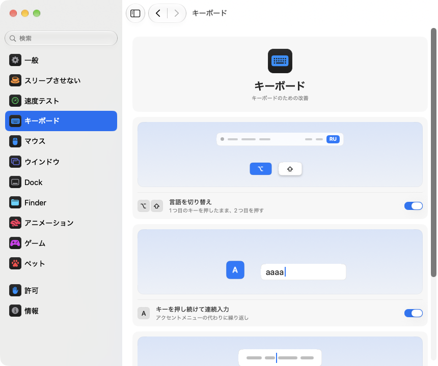

<p align="center"></p>
<h1 align="center">pikapik</h1>
<p align="center">キーボード、マウス、ウインドウ、Finderをちょっと便利に。Macのメニューバーからすぐ使えます。</p>
<p align="center"><sub><a href="../../README.md">English</a> · <a href="README.ru.md">Русский</a> · <a href="README.uk.md">Українська</a> · <a href="README.de.md">Deutsch</a> · <a href="README.fr.md">Français</a> · <a href="README.es.md">Español</a> · <a href="README.it.md">Italiano</a> · <a href="README.pt-BR.md">Português (Brasil)</a> · <b>日本語</b> · <a href="README.zh-Hans.md">简体中文</a> · <a href="README.ko.md">한국어</a> · <a href="README.ro.md">Română</a> · <a href="README.pl.md">Polski</a> · <a href="README.tr.md">Türkçe</a> · <a href="README.nl.md">Nederlands</a> · <a href="README.sv.md">Svenska</a> · <a href="README.cs.md">Čeština</a> · <a href="README.zh-Hant.md">繁體中文</a> · <a href="README.ar.md">العربية</a> · <a href="README.hi.md">हिन्दी</a> · <a href="README.id.md">Bahasa Indonesia</a> · <a href="README.vi.md">Tiếng Việt</a> · <a href="README.th.md">ไทย</a></sub></p>

<p align="center">
<picture>
<source media="(prefers-color-scheme: dark)" srcset="../media/settings-ja-dark.png">

</picture>
</p>

## インストール

```bash
brew install --cask dev-pikapik/pika-tools/pikapik && open -a pikapik
```

インストールすると、画面上部のメニューバーにpikapikが表示されます。オンにするまで、どの機能もオフのままです。

<details>
<summary>Homebrewがない場合は、ほかに2つの方法があります</summary>

Homebrew を使わない場合は、ターミナルを開いて次の行をペーストし、return キーを押します:

```bash
/bin/bash -c "$(curl -fsSL https://raw.githubusercontent.com/dev-pikapik/pika-tools/main/install.sh)"
```

または [pikapik.dmg](https://github.com/dev-pikapik/pika-tools/releases/latest/download/pikapik.dmg) をダウンロードして開き、アプリを「アプリケーション」フォルダにドラッグします。

Homebrew でもスクリプトでも、アプリは `/Applications` に入り、起動して、許可を求め、「ログイン時に開く」をオンにします。その後はアプリが自動でアップデートされます。**アップデート**を参照してください。削除するときは**アンインストール**を参照してください。

</details>

## できること

<table>
<tbody><tr>
<td width="50%" valign="top">
<picture><source media="(prefers-color-scheme: dark)" srcset="../media/keep-awake-dark.png"></picture>
<br><b>スリープさせない</b>
<br>必要なあいだMacを起こしたまま。蓋を閉じていても大丈夫です。
</td>
<td width="50%" valign="top">
<picture><source media="(prefers-color-scheme: dark)" srcset="../media/command-keys-dark.png"></picture>
<br><b>⌘Qと⌘Wを保護</b>
<br>うっかり終了したり閉じたりしません。意図して使うときは⇧を足します。
</td>
</tr></tbody>
<tbody><tr>
<td width="50%" valign="top">
<picture><source media="(prefers-color-scheme: dark)" srcset="../media/compress-dark.png"></picture>
<br><b>小さいコピー</b>
<br>写真やPDF、ビデオを右クリックすると、隣に軽いコピーができます。
</td>
<td width="50%" valign="top">
<picture><source media="(prefers-color-scheme: dark)" srcset="../media/convert-dark.png"></picture>
<br><b>変換</b>
<br>画像やビデオ、曲を右クリックから別の形式で保存できます。
</td>
</tr></tbody>
<tbody><tr>
<td width="50%" valign="top">
<picture><source media="(prefers-color-scheme: dark)" srcset="../media/input-switch-dark.png"></picture>
<br><b>言語を切り替え</b>
<br>⌥を押したまま⇧を押すと、キーボードの言語が切り替わります。
</td>
<td width="50%" valign="top">
<picture><source media="(prefers-color-scheme: dark)" srcset="../media/quit-on-close-dark.png"></picture>
<br><b>最後のウインドウで終了</b>
<br>アプリの最後のウインドウを閉じると、アプリも終了します。
</td>
</tr></tbody>
<tbody><tr>
<td width="50%" valign="top">
<picture><source media="(prefers-color-scheme: dark)" srcset="../media/window-zoom-dark.png"></picture>
<br><b>緑のボタンで拡大</b>
<br>フルスクリーンにせず、ウインドウを画面いっぱいに広げます。
</td>
<td width="50%" valign="top">
<picture><source media="(prefers-color-scheme: dark)" srcset="../media/dock-hide-dark.png"></picture>
<br><b>Dockのクリックで隠す</b>
<br>使っているアプリのアイコンをクリックすると、さっと隠れます。
</td>
</tr></tbody>
<tbody><tr>
<td width="50%" valign="top">
<picture><source media="(prefers-color-scheme: dark)" srcset="../media/new-file-dark.png"></picture>
<br><b>新規ファイル</b>
<br>Finderで右クリックして名前を入れるだけで、空のファイルができます。
</td>
<td width="50%" valign="top">
<picture><source media="(prefers-color-scheme: dark)" srcset="../media/finder-cut-dark.png"></picture>
<br><b>⌘Xでファイルを移動</b>
<br>Finderでファイルを切り取って、好きな場所にペーストできます。
</td>
</tr></tbody>
<tbody><tr>
<td width="50%" valign="top">
<picture><source media="(prefers-color-scheme: dark)" srcset="../media/finder-open-dark.png"></picture>
<br><b>Enterでファイルを開く</b>
<br>Finderでファイルを選んでEnterを押すと開きます。
</td>
<td width="50%" valign="top">
<picture><source media="(prefers-color-scheme: dark)" srcset="../media/finder-delete-dark.png"></picture>
<br><b>Deleteでゴミ箱へ</b>
<br>Finderで⌫を押すと、選んだファイルがゴミ箱に入ります。
</td>
</tr></tbody>
<tbody><tr>
<td width="50%" valign="top">
<picture><source media="(prefers-color-scheme: dark)" srcset="../media/game-mode-dark.png"></picture>
<br><b>ゲームモード</b>
<br>プレイ中は、ゲームの上に何も開かず、うっかり閉じることもありません。
</td>
<td width="50%" valign="top">
<picture><source media="(prefers-color-scheme: dark)" srcset="../media/speed-test-dark.png"></picture>
<br><b>速度テスト</b>
<br>インターネットの速さと、それで何ができるかがわかります。
</td>
</tr></tbody>
<tbody><tr>
<td width="50%" valign="top">
<picture><source media="(prefers-color-scheme: dark)" srcset="../media/side-buttons-dark.png"></picture>
<br><b>サイドボタン</b>
<br>ボタン4と5で戻る/進む。トラックパッドのスワイプと同じです。
</td>
<td width="50%" valign="top">
<picture><source media="(prefers-color-scheme: dark)" srcset="../media/wheel-lines-dark.png"></picture>
<br><b>行単位でスクロール</b>
<br>ホイールをどれだけ速く回しても、1クリックで同じだけスクロールします。
</td>
</tr></tbody>
<tbody><tr>
<td width="50%" valign="top">
<picture><source media="(prefers-color-scheme: dark)" srcset="../media/wheel-direction-dark.png"></picture>
<br><b>スクロール方向</b>
<br>トラックパッドとマウスで、別々の方向を選べます。
</td>
<td width="50%" valign="top">
<picture><source media="(prefers-color-scheme: dark)" srcset="../media/linear-pointer-dark.png"></picture>
<br><b>ポインタの加速をオフ</b>
<br>手を動かしたぶんだけ、ポインタが正確に動きます。
</td>
</tr></tbody>
<tbody><tr>
<td width="50%" valign="top">
<picture><source media="(prefers-color-scheme: dark)" srcset="../media/key-repeat-dark.png"></picture>
<br><b>キーを押し続けて連続入力</b>
<br>キーを押し続けると、アクセントメニューの代わりに文字が繰り返されます。
</td>
<td width="50%" valign="top">
<picture><source media="(prefers-color-scheme: dark)" srcset="../media/home-end-dark.png"></picture>
<br><b>HomeとEnd</b>
<br>入力中に行頭や行末へジャンプします。
</td>
</tr></tbody>
<tbody><tr>
<td width="50%" valign="top">
<picture><source media="(prefers-color-scheme: dark)" srcset="../media/animations-dark.png"></picture>
<br><b>アニメーション</b>
<br>Dock、ウインドウ、クイックルックを速く。瞬時にもできます。
</td>
<td width="50%" valign="top">
<picture><source media="(prefers-color-scheme: dark)" srcset="../media/leftover-permissions-dark.png"></picture>
<br><b>削除したアプリの許可</b>
<br>削除したアプリのために macOS が残している許可を取り除けます。
</td>
</tr></tbody>
<tbody><tr>
<td width="50%" valign="top">
<picture><source media="(prefers-color-scheme: dark)" srcset="../media/pet-dark.png"></picture>
<br><b>デスクトップのペット</b>
<br>小さな友だちがウインドウの後ろをお散歩します。つかんで投げたり、スペースを押してジャンプさせたりできます。
</td>
</tr></tbody>
</table>

## 詳しく

<details>
<summary>初回起動</summary>

pikapik には 2 つの許可が必要です。初回起動時に設定の「許可」ページが開いて手順を案内し、macOS も独自の確認を表示します。**システム設定 › プライバシーとセキュリティ** を開き、次の項目で pikapik をオンにします:

- **アクセシビリティ**: キー入力やクリックがほかのアプリに届く前に、アプリがそれを変更できるようにします。
- **入力監視**: そもそもアプリがキー入力やクリックを読み取れるようにします。

変更は数秒以内に反映されます。再起動は不要です。

pikapik は、入力やクリックの内容を記録、保存、送信しません。イベントはメモリ上で処理され、すぐにそのまま渡されます。ネットワークへのアクセスは、GitHub に最新リリースを問い合わせるアップデート確認だけです。

</details>

<details>
<summary>すべての機能の詳細</summary>

**⌘Q と ⌘W を保護。** ⌘Q や ⌘W だけを押しても何も起こらないので、うっかりアプリを終了したりウインドウを閉じたりしません。意図して操作するときは Shift を加えます。⇧⌘Q で終了、⇧⌘W で閉じます。すべてのアプリで使えます。キーごとにスイッチがあります。初期設定はオフです。

**Option+Shift で言語を切り替え。** Option を押したまま Shift を押すと、macOS が次の入力ソースに切り替わります。Option を押したまま Shift をもう一度押すと、さらに次に進みます。Shift を押したまま Option を押すと前に戻ります。途中でほかのキーを押したり、クリックしたり、Command、Control、Fn を加えたりすると切り替わらないので、Option+Shift+矢印キーのようなショートカットはこれまでどおり使えます。初期設定はオフです。

**キーを押し続けて連続入力。** キーを押し続けると、アクセントメニューが出る代わりに同じ文字が繰り返し入力されます。ゲームや文字入力で便利です。すでに開いているアプリには再起動後に反映されます。オフにすると macOS はいつもの動作に戻ります。初期設定はオフです。

**HomeとEndで行頭と行末へ。** 入力中にHomeを押すとカーソルが行頭へ、Endを押すと行末へ移動し、ページはスクロールしません。⇧と一緒に押すとそこまで選択し、⌘と一緒に押すとテキスト全体の先頭や末尾へ移動します。テキスト欄の外や、ターミナル、仮想マシン、リモートデスクトップのアプリでは、これまでどおり動作します。通常どおり動作させたいほかのアプリも追加できます。初期設定はオフ。

**ポインタの加速をオフにする。** マウスをどれだけ速く動かしても、ポインタはマウスを動かした分だけ正確に移動します。**軌跡の速さ** スライダで移動の速さを設定します。マウスにだけ効き、トラックパッドはそのままです。オフにするか pikapik を終了すると、macOS 本来の設定に戻ります。初期設定はオフです。

**行単位でスクロール。** マウスホイールを 1 クリックするたびに、どれだけ速く回しても同じ行数だけスクロールします。1 クリックあたり 1〜10 行から選べて、初期設定は 3 行です。ナチュラルなスクロールは、システム設定で選んだとおりのままです。対象はマウスだけで、トラックパッドは今までどおりです。初期設定はオフです。**1クリックの距離** のスライダーの横では、小さなページが選んだ距離だけスクロールし、点が初期値を示します。

スクロール量を正確なピクセル数で数えるアプリやゲームには、同じ設定をピクセルに切り替え、1 クリックあたり 1〜200 ピクセルを選べます（標準は 40）。スライダーには、それが画面の高さのどれくらいかも表示されます。

**トラックパッドとマウスのスクロール方向。** macOS のナチュラルなスクロールの設定は、トラックパッドとマウスで共通の 1 つだけです。これをオンにして、それぞれの方向を選びます。iPhone のようにページが指についてくる **ナチュラル** か、ページが逆方向に動く **クラシック** です。トラックパッドの選択は、横方向のスクロールや指を離したあとの惰性スクロールにも効きます。Magic Mouse はタッチでスクロールするので、トラックパッドの選択に従います。お使いのすべての Mac で同じものを選べば、ユニバーサルコントロールでマウスを別の Mac に移しても、どこでも同じ感覚でスクロールできます。初期設定はオフです。オンにすると、どちらもシステム設定と同じ状態から始まるので、別のものを選ぶまで何も変わりません。

**サイドボタンで戻る/進む。** マウスのボタン 4 と 5 で、Finder、Safari などの Apple のアプリや、ほかの多くのアプリで戻る／進むができます。トラックパッドでのスワイプと同じ操作です。これらのボタンを自分で扱うアプリには、ボタンがそのまま渡されます。マウスのボタンが逆の場合は、**サイドボタンを入れ替える** をオンにしてください。初期設定はオフです。

**最後のウインドウを閉じたら終了。** アプリの最後のウインドウを閉じると、アプリが終了します。Finder は開いたままで、ほかのデスクトップや Dock にウインドウがあるアプリも終了しません。この方法で終了させたくないアプリをリストに登録できます。初期設定はオフです。

**Dock のクリックで隠す。** 使用中のアプリの Dock アイコンをクリックすると、そのアプリが隠れます。もう一度クリックすると戻ります。初期設定はオフです。

**緑のボタンでウインドウを拡大。** ウインドウの緑のボタンをクリックすると、フルスクリーンにはならずに画面いっぱいに広がります。もう一度クリックすると元の大きさに戻ります。⌥を押しながらクリックすると、ボタンはいつもどおりに動きます。フルスクリーンは、ボタンのメニューと⌃⌘Fで引き続き使えます。緑のボタンを通常どおり使いたいアプリは、リストに登録できます。初期設定はオフです。

**Finderで新規ファイル。** Finderのウインドウやデスクトップで右クリックして **新規ファイル** を選び、名前を入力すると空のファイルができます。標準は.txt。初期設定はオフ。

**FinderでEnterキーを押して開く。** Finderのウインドウやデスクトップでファイルを選び、ReturnキーまたはEnterキーを押すと開きます。F2またはfn F2で、選んだファイルの名前を変更できます。名前の入力中など、文字を入力する場所では、キーはいつもどおり使えます。初期設定はオフ。

**Finderで⌘Xを押して切り取る。** ファイルを選んで⌘Xを押し、移動先のフォルダを開いて⌘Vを押すと、ファイルはコピーされずに移動します。⌘Cで切り取りを取り消せます。初期設定はオフ。

**FinderでDeleteキーで削除。** ファイルを選んで⌫または⌦（ノートパソコンではfn ⌫）を押すと、⌘⌫と同じようにゴミ箱に入ります。名前の変更中や検索中、そのほかの入力欄に入力しているときは、通常どおり文字を消します。初期設定はオフ。

**Finderで小さいコピー。** Finderでファイルを右クリックして **小さいコピーを作成** を選びます。写真、GIF、PDF、ビデオの軽いバージョンがすぐ隣に保存され、サイズは数分の一になることもよくあります。WAVやAIFFなどの非圧縮サウンドはコンパクトなM4Aになります。これ以上小さくできないファイルの場合はコピーを作らず、pikapikがそのことを知らせます。元のファイルはそのまま残り、Macの外には何も送られません。初期設定はオフ。

**Finderで変換。** Finderでファイルを右クリックして **変換** を選ぶと、別のフォーマットで保存できます。画像はJPEG、PNG、HEIC、GIF、TIFF、PDFに、ビデオはMP4、MOV、または音声だけに、音楽はM4A、WAV、AIFFに。元のファイルはそのまま残り、Macの外には何も送られません。小さいコピーとは別にオン/オフできます。初期設定はオフ。

**ゲームモード。** ゲームを追加しておくと、プレイ中にMacがあなたをゲームから引き離しません。Spotlight、Siri、⌘Tab、Mission Control、デスクトップ間のスワイプがゲームの上に開かず、⌘Qや⌘Wで誤ってゲームが閉じることも、ポインタがDock、メニューバー、別の画面へ出てしまうこともありません。画面も消えません。それぞれ「ゲーム」ページで個別にオン/オフでき、pikapikはMacで見つけたゲームを提案します。ゲーム中はControl-クリックもただのクリックのままで、Control+矢印でデスクトップが切り替わることもありません。Minecraftも認識します。Minecraft LauncherかCurseForgeを追加すると、Minecraft本体で遊んでいる間はモードがオンになります。ゲームを終了するには⇧⌘Q、ウインドウを閉じるには⇧⌘Wを押します。⌥⌘Escは必ず使えます。ゲームを離れると、すべていつもどおりに動きます。初期設定はオフ。

各ツールには、メニューと設定にそれぞれスイッチがあります。

メニューバーのアイコンで状態がひと目でわかります。ツールが動作中なら pikapik のマーク、すべてオフなら同じマークが薄く、ツールがオンなのに許可が足りないときは警告の三角マークです。

メニューバーのパネルは、最初は少数の行だけを表示します。表示する行は自由に選べます。下の鉛筆ボタンをクリックし、表示したい項目にチェックを付けて「完了」をクリックしてください。非表示にした行も動作は続き、設定には残ります。パネルが画面に収まらないときはスクロールできます。

アプリはシステムの言語、または設定で選んだ言語で表示されます。このページの先頭に並んでいる 23 言語すべてに対応しています。

</details>

<details>
<summary>スリープさせない</summary>

キーボードから離れている間も Mac がスリープしないようにします。1 秒から 365 日までの好きな長さ、またはオフにするまで続けられます。メニューからオンにし、長さは設定で、日、時間、分、秒を入力するか、↑ と ↓ を押すか、15 分から 8 時間までの候補をクリックして指定します。メニューには残り時間と終了時刻が表示されます。**ディスプレイ** は 2 つから選べます。**常にオン** は画面が消えず、スクリーンセーバーもロック画面も出ません。**通常どおりオフ** はいつものタイマーで画面が消え、Mac は動き続けます。**今すぐディスプレイをオフ**（メニューにもあります）を使うとすぐに画面が消え、Mac は動き続けます。戻すにはマウスを動かすかキーを押してください。pikapik を終了すると「スリープさせない」も終わります。

MacBook では **蓋を閉じても動作** をオンにすることもできます。macOS にはこの設定がないため、pikapik は `pmset -a disablesleep 1` を実行して管理者パスワードを求めます。Mac のスリープ方法を変更できるのは管理者だけだからです。この設定は、「スリープさせない」が終わったとき、アプリを終了したとき、またはアプリがクラッシュしたときに自動で元に戻ります。パスワードを入力しなければ何も変わりません。蓋を閉じた状態では Mac の通気を確保してください。**バッテリーが 20% 未満で停止** を使うと、バッテリーが切れる前にセッションが終わります。

「スリープさせない」、画面オン、クラムシェルの各モードは、ショートカットアプリを使って、コントロールセンター、メニューバー、デスクトップのウィジェットのボタンに置けます。リンクは設定 › スリープさせないでコピーできます。

</details>

<details>
<summary>速度テスト</summary>

いまのインターネットの速さを表示します。設定 › 速度テストの**速度を測定**か、鉛筆ボタンで行を追加したメニューの**測定**をクリックします。30秒ほどで、ダウンロードとアップロードの速さ、Ping、応答性（回線が混んでいるときの反応の速さ）がわかります。その下に、4Kの映画、ビデオ通話、オンラインゲーム、大きなダウンロードに足りるかどうかがわかりやすく表示されます。測定にはmacOSに入っているnetworkQualityとAppleのサーバを使います。最後の結果は次の測定まで残り、ショートカット用のリンクでコントロールセンターから測定を始められます。

</details>

<details>
<summary>設定</summary>

メニューの **設定…** または ⌘, で設定を開けます。Finder、Launchpad、Spotlight から pikapik をもう一度起動しても開きます。ウインドウが開いている間は、アプリが Dock と ⌘Tab に表示されます。

- **一般**: ログイン時に開く、外観モード(システム、ライト、ダーク)、言語、アップデート、バックアップ(設定をファイルとして書き出し・読み込み、または iCloud Drive で同期)。
- **スリープさせない**: 長さ、ディスプレイと蓋のオプション。
- **速度テスト**: インターネットの速さと、それで何ができるか。
- **キーボード**: 言語の切り替え、キーのリピート、Home と End。
- **マウス**: ポインタの加速と軌跡の速さ、行単位のスクロール、スクロール方向、サイドボタン。
- **ウインドウ**: 緑のボタンでウインドウを拡大(例外リスト付き)、⌘Q と ⌘W の保護、最後のウインドウで終了(例外リスト付き)。
- **Dock**: Dock のクリックで隠す。
- **Finder**: 新規ファイル、小さいコピーと変換、Return で開く、⌘X でカット、⌫ でゴミ箱へ。
- **許可**: 2 つの許可の状態、同期がオンのときは iCloud Drive の状態と、システム設定の該当箇所を開くボタン。
- **情報**: バージョン、変更履歴へのリンク、問題を報告するリンク。

多くの設定には、その働きを示す小さな絵が付いています。たとえば、スリープしない Mac や、Dock の後ろに隠れるウインドウです。絵はスイッチに合わせて変わり、システム設定で「視差効果を減らす」がオンのときは動きません。

どのページにも、下部に **デフォルトに戻す…** ボタンがあります。最初に確認したうえで、そのページのツールをオフにしてオプションを元に戻し、pikapik が一度も触れなかった状態にします。

**iCloudで設定を同期** をオンにすると、すべての Mac で pikapik が同じ状態になります。設定は iCloud Drive の pika-tools フォルダに保存され、いちばん新しい変更が優先されます。初期設定はオフで、iCloud Drive がオンになっている必要があります。許可は同期されません。Mac ごとに、それぞれで許可を求めます。

</details>

<details>
<summary>アップデート</summary>

pikapik は起動時と 6 時間ごとに新しいバージョンを確認します。この確認は 設定 › 一般 でオフにできます。新しいバージョンが出ると、メニューに **… にアップデート** ボタンが表示されます。クリックするだけで、アプリがアップデートをダウンロードしてインストールし、再起動します。設定 › 一般 の **今すぐ確認** で手動で確認することもできます。

Homebrew を使っている場合は `brew upgrade --cask pikapik` も使えます。

バージョン 1.3 以降、アップデート後も許可はそのまま残ります。

</details>

<details>
<summary>アンインストール</summary>

```bash
/bin/bash -c "$(curl -fsSL https://raw.githubusercontent.com/dev-pikapik/pika-tools/main/uninstall.sh)"
```

Homebrew でインストールした場合: `brew uninstall --cask --zap pikapik`。

どちらもアプリを終了し、ログイン項目から外して削除します。スクリプトは許可のリセットも行います。

</details>

<details>
<summary>よくある質問</summary>

**なぜ 2 つの許可が必要なのですか?**
macOS はキーボードとマウスへのアクセスを 2 つに分けています。入力監視ではイベントを読み取ることができ、アクセシビリティではそれを変更できます。ショートカットをブロックするには両方が必要です。

**「開発元が未確認」と表示されます。**
pikapik は署名されていますが、Apple による公証は受けていません。Homebrew とインストールスクリプトがこれに対処します。dmg を使った場合は **システム設定 › プライバシーとセキュリティ** を開いて **このまま開く** をクリックするか、次を実行します:

```bash
xattr -dr com.apple.quarantine /Applications/pikapik.app
```

**Intel 搭載の Mac で使えますか?**
はい。Apple シリコンと Intel の両方に対応したユニバーサルアプリで、macOS 14 Sonoma 以降で動作します。

**許可はオンなのに何も動きません。**
**システム設定 › プライバシーとセキュリティ** で、両方のリストから − ボタンで pikapik を削除し、もう一度追加します。pikapik の設定の「許可」ページに、該当箇所を開くボタンがあります。

</details>

<p align="center">☕ pikapik を気に入っていただけたら、アプリの開発とサポートのために<a href="https://buymeacoffee.com/pikapik">コーヒーを一杯ごちそうしてください</a>。</p>

<p align="center"><sub><a href="../whats-new/README.ja.md">新機能</a> · <a href="https://github.com/dev-pikapik/homebrew-pika-tools">Homebrew tap</a> · <a href="../../CONTRIBUTING.md">ソースからビルド</a> · <a href="../../LICENSE">MITライセンス</a> · © 2026 pikapik</sub></p>
