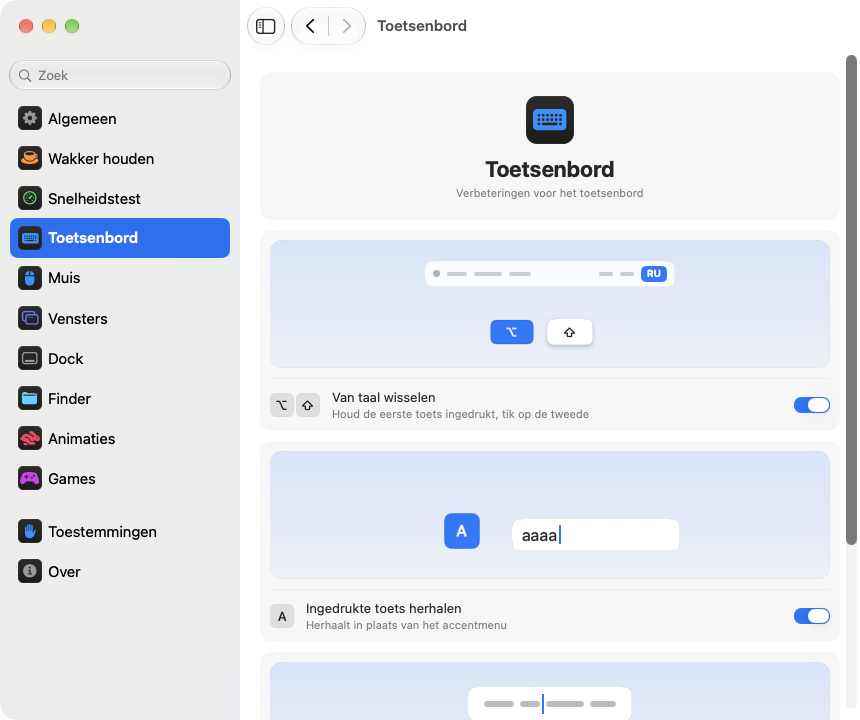

<p align="center"></p>
<h1 align="center">pikapik</h1>
<p align="center">Kleine verbeteringen voor toetsenbord, muis, vensters en Finder, gewoon in de menubalk van je Mac.</p>
<p align="center"><sub><a href="../../README.md">English</a> · <a href="README.ru.md">Русский</a> · <a href="README.uk.md">Українська</a> · <a href="README.de.md">Deutsch</a> · <a href="README.fr.md">Français</a> · <a href="README.es.md">Español</a> · <a href="README.it.md">Italiano</a> · <a href="README.pt-BR.md">Português (Brasil)</a> · <a href="README.ja.md">日本語</a> · <a href="README.zh-Hans.md">简体中文</a> · <a href="README.ko.md">한국어</a> · <a href="README.ro.md">Română</a> · <a href="README.pl.md">Polski</a> · <a href="README.tr.md">Türkçe</a> · <b>Nederlands</b> · <a href="README.sv.md">Svenska</a> · <a href="README.cs.md">Čeština</a> · <a href="README.zh-Hant.md">繁體中文</a> · <a href="README.ar.md">العربية</a> · <a href="README.hi.md">हिन्दी</a> · <a href="README.id.md">Bahasa Indonesia</a> · <a href="README.vi.md">Tiếng Việt</a> · <a href="README.th.md">ไทย</a></sub></p>

<p align="center">
<picture>
<source media="(prefers-color-scheme: dark)" srcset="../media/settings-nl-dark.png">

</picture>
</p>

## Installeren

```bash
brew install --cask dev-pikapik/pika-tools/pikapik && open -a pikapik
```

pikapik staat daarna in de menubalk bovenaan het scherm. Alles blijft uit tot je het zelf aanzet.

<details>
<summary>Geen Homebrew? Twee andere manieren</summary>

Zonder Homebrew: open Terminal, plak deze regel en druk op Return:

```bash
/bin/bash -c "$(curl -fsSL https://raw.githubusercontent.com/dev-pikapik/pika-tools/main/install.sh)"
```

Of download [pikapik.dmg](https://github.com/dev-pikapik/pika-tools/releases/latest/download/pikapik.dmg), open het bestand en sleep de app naar de map Apps.

Zowel Homebrew als het script zetten de app in `/Applications`, openen hem, vragen om de toestemmingen en zetten ‘Open bij inloggen’ aan. Daarna werkt de app zichzelf bij, zie **Updates**. Verwijderen staat bij **Verwijderen**.

</details>

## Wat het doet

<table>
<tbody><tr>
<td width="50%" valign="top">
<picture><source media="(prefers-color-scheme: dark)" srcset="../media/keep-awake-dark.png"></picture>
<br><b>Wakker houden</b>
<br>Je Mac blijft wakker zolang je wilt, zelfs met de klep dicht.
</td>
<td width="50%" valign="top">
<picture><source media="(prefers-color-scheme: dark)" srcset="../media/command-keys-dark.png"></picture>
<br><b>⌘Q en ⌘W beschermen</b>
<br>Niets stopt of sluit per ongeluk. Voeg ⇧ toe als je het echt wilt.
</td>
</tr></tbody>
<tbody><tr>
<td width="50%" valign="top">
<picture><source media="(prefers-color-scheme: dark)" srcset="../media/compress-dark.png"></picture>
<br><b>Kleinere kopie</b>
<br>Klik met rechts op een foto, pdf of video, en je krijgt er een lichtere kopie naast.
</td>
<td width="50%" valign="top">
<picture><source media="(prefers-color-scheme: dark)" srcset="../media/convert-dark.png"></picture>
<br><b>Omzetten</b>
<br>Bewaar een afbeelding, video of nummer in een ander formaat via de rechtermuisknop.
</td>
</tr></tbody>
<tbody><tr>
<td width="50%" valign="top">
<picture><source media="(prefers-color-scheme: dark)" srcset="../media/input-switch-dark.png"></picture>
<br><b>Van taal wisselen</b>
<br>Houd ⌥ ingedrukt en tik op ⇧ om de toetsenbordtaal te wisselen.
</td>
<td width="50%" valign="top">
<picture><source media="(prefers-color-scheme: dark)" srcset="../media/quit-on-close-dark.png"></picture>
<br><b>Stoppen met het laatste venster</b>
<br>Sluit het laatste venster van een app, en de app stopt ook.
</td>
</tr></tbody>
<tbody><tr>
<td width="50%" valign="top">
<picture><source media="(prefers-color-scheme: dark)" srcset="../media/window-zoom-dark.png"></picture>
<br><b>Groene knop vergroot</b>
<br>Het venster vult het scherm zonder schermvullende modus.
</td>
<td width="50%" valign="top">
<picture><source media="(prefers-color-scheme: dark)" srcset="../media/dock-hide-dark.png"></picture>
<br><b>Verbergen met een klik in het Dock</b>
<br>Klik op de app waarin je zit, en hij gaat opzij.
</td>
</tr></tbody>
<tbody><tr>
<td width="50%" valign="top">
<picture><source media="(prefers-color-scheme: dark)" srcset="../media/new-file-dark.png"></picture>
<br><b>Nieuw bestand</b>
<br>Klik met rechts in de Finder, typ een naam, en er staat een leeg bestand.
</td>
<td width="50%" valign="top">
<picture><source media="(prefers-color-scheme: dark)" srcset="../media/finder-cut-dark.png"></picture>
<br><b>⌘X verplaatst bestanden</b>
<br>Knip bestanden in de Finder en plak ze waar je wilt.
</td>
</tr></tbody>
<tbody><tr>
<td width="50%" valign="top">
<picture><source media="(prefers-color-scheme: dark)" srcset="../media/finder-open-dark.png"></picture>
<br><b>Enter opent bestanden</b>
<br>Selecteer bestanden in de Finder en druk op Enter om ze te openen.
</td>
<td width="50%" valign="top">
<picture><source media="(prefers-color-scheme: dark)" srcset="../media/finder-delete-dark.png"></picture>
<br><b>Delete naar de prullenmand</b>
<br>Druk op ⌫ in de Finder, en de geselecteerde bestanden gaan naar de prullenmand.
</td>
</tr></tbody>
<tbody><tr>
<td width="50%" valign="top">
<picture><source media="(prefers-color-scheme: dark)" srcset="../media/game-mode-dark.png"></picture>
<br><b>Gamemodus</b>
<br>Terwijl je speelt, opent niets zich over het spel en sluit niets het af.
</td>
<td width="50%" valign="top">
<picture><source media="(prefers-color-scheme: dark)" srcset="../media/speed-test-dark.png"></picture>
<br><b>Snelheidstest</b>
<br>Hoe snel je internet is, en waar het goed voor is.
</td>
</tr></tbody>
<tbody><tr>
<td width="50%" valign="top">
<picture><source media="(prefers-color-scheme: dark)" srcset="../media/side-buttons-dark.png"></picture>
<br><b>Zijknoppen</b>
<br>Knop 4 en 5 gaan terug en vooruit, net als vegen op het trackpad.
</td>
<td width="50%" valign="top">
<picture><source media="(prefers-color-scheme: dark)" srcset="../media/wheel-lines-dark.png"></picture>
<br><b>Per regel scrollen</b>
<br>Elke klik van het scrollwiel scrolt even ver, hoe snel je ook draait.
</td>
</tr></tbody>
<tbody><tr>
<td width="50%" valign="top">
<picture><source media="(prefers-color-scheme: dark)" srcset="../media/wheel-direction-dark.png"></picture>
<br><b>Scrollrichting</b>
<br>Eén richting voor het trackpad, een andere voor de muis.
</td>
<td width="50%" valign="top">
<picture><source media="(prefers-color-scheme: dark)" srcset="../media/linear-pointer-dark.png"></picture>
<br><b>Zonder aanwijzerversnelling</b>
<br>De aanwijzer gaat precies zo ver als je hand.
</td>
</tr></tbody>
<tbody><tr>
<td width="50%" valign="top">
<picture><source media="(prefers-color-scheme: dark)" srcset="../media/key-repeat-dark.png"></picture>
<br><b>Ingedrukte toets herhalen</b>
<br>Houd een toets ingedrukt om hem te herhalen, zonder accentmenu.
</td>
<td width="50%" valign="top">
<picture><source media="(prefers-color-scheme: dark)" srcset="../media/home-end-dark.png"></picture>
<br><b>Home en End</b>
<br>Spring tijdens het typen naar het begin of einde van de regel.
</td>
</tr></tbody>
<tbody><tr>
<td width="50%" valign="top">
<picture><source media="(prefers-color-scheme: dark)" srcset="../media/animations-dark.png"></picture>
<br><b>Animaties</b>
<br>Maak het Dock, vensters en Snel bekijken sneller, tot direct aan toe.
</td>
<td width="50%" valign="top">
<picture><source media="(prefers-color-scheme: dark)" srcset="../media/leftover-permissions-dark.png"></picture>
<br><b>Toestemmingen van verwijderde apps</b>
<br>Haal de toestemmingen weg die macOS bewaart voor apps die je al hebt verwijderd.
</td>
</tr></tbody>
</table>

## Meer weten

<details>
<summary>Eerste keer openen</summary>

pikapik heeft twee toestemmingen nodig. De eerste keer opent de app de instellingen op de pagina Toestemmingen, die je stap voor stap helpt, en macOS toont zijn eigen meldingen. Ga naar **Systeeminstellingen › Privacy en beveiliging** en zet pikapik aan bij:

- **Toegankelijkheid**, zodat de app een toetsaanslag of klik kan aanpassen voordat die bij andere apps aankomt.
- **Invoerbewaking**, zodat de app toetsaanslagen en klikken überhaupt kan zien.

De app merkt de wijziging binnen een paar seconden op, opnieuw opstarten is niet nodig.

pikapik legt niets vast, bewaart niets en verstuurt niets van wat je typt of aanklikt. Gebeurtenissen worden in het geheugen verwerkt en meteen doorgegeven. Het enige netwerkverzoek is de controle op updates, waarbij GitHub om de nieuwste versie wordt gevraagd.

</details>

<details>
<summary>Elk hulpmiddel in detail</summary>

**⌘Q en ⌘W beschermen.** ⌘Q en ⌘W alleen doen niets, zodat je niet per ongeluk een app stopt of een venster sluit. Voeg Shift toe om het bewust te doen: ⇧⌘Q stopt, ⇧⌘W sluit. Werkt in elke app. Elke toets heeft een eigen schakelaar. Standaard uit.

**Van taal wisselen met Option+Shift.** Houd Option ingedrukt en tik op Shift: macOS gaat naar de volgende invoerbron. Houd Option ingedrukt en tik nog eens op Shift om verder te gaan. Houd Shift ingedrukt en tik op Option om terug te gaan. Druk je tussendoor op een andere toets, klik je of voeg je Command, Control of Fn toe, dan wordt er niet gewisseld, zodat combinaties zoals Option+Shift+pijltoets blijven werken zoals voorheen. Standaard uit.

**Ingedrukte toets herhalen.** Houd een toets ingedrukt en de letter wordt steeds opnieuw getypt, in plaats van dat het accentmenu verschijnt. Handig in games en bij het typen. Apps die al open zijn nemen dit over na een herstart. Zet je het uit, dan werkt macOS weer zoals altijd. Standaard uit.

**Home en End naar begin en einde van de regel.** Terwijl je typt, zet Home de cursor aan het begin van de regel en End aan het einde, in plaats van de pagina te scrollen. Met ⇧ selecteren ze tot daar, met ⌘ gaan ze naar het begin of einde van de hele tekst. Buiten tekstvelden, en in terminals, virtuele machines en apps voor extern bureaublad, werken de toetsen zoals voorheen. Je kunt andere apps toevoegen waarin ze gewoon moeten werken. Standaard uit.

**Aanwijzerversnelling uitschakelen.** De aanwijzer beweegt precies zo ver als de muis, hoe snel je hem ook beweegt. Met een schuifknop **Snelheid aanwijzer** stel je in hoe snel hij gaat. Werkt alleen met muizen, het trackpad blijft zoals het is. Zet het uit of stop pikapik, en macOS krijgt zijn eigen instellingen terug. Standaard uit.

**Per regel scrollen.** Elke klik van het muiswieltje scrolt evenveel regels, hoe snel je het ook draait. Kies van 1 tot 10 regels per klik, standaard 3. Natuurlijk scrollen blijft zoals je het in Systeeminstellingen hebt ingesteld. Werkt alleen voor muizen, het trackpad blijft zoals het is. Standaard uit. Naast de schuifregelaar **Afstand per klik** scrolt een kleine pagina de gekozen afstand, en een stip markeert de standaardwaarde.

Sommige apps en games tellen scrollen in exacte pixels: zet daarvoor dezelfde instelling op pixels en kies 1 tot 200 pixels per klik, standaard 40. De regelaar laat ook zien welk deel van de schermhoogte dat is.

**Scrollrichting voor trackpad en muis.** macOS heeft één schakelaar voor natuurlijk scrollen, voor het trackpad en de muis tegelijk. Zet dit aan en kies voor elk een richting: **Natuurlijk**, waarbij de pagina je vingers volgt zoals op een iPhone, of **Klassiek**, waarbij de pagina de andere kant op gaat. De keuze voor het trackpad geldt ook voor zijwaarts scrollen en voor het uitglijden nadat je je vingers optilt. De Magic Mouse scrollt met aanraking en volgt daarom de keuze voor het trackpad. Kies op elke Mac hetzelfde en scrollen voelt overal gelijk, ook als je de muis met Universele bediening naar een andere Mac beweegt. Standaard uit. Als je het aanzet, staan beide zoals in Systeeminstellingen, dus er verandert niets tot je iets anders kiest.

**Zijknoppen voor terug en vooruit.** Muisknoppen 4 en 5 gaan terug en vooruit in de Finder, Safari en andere Apple-apps en in veel andere apps, net als een veeg op het trackpad. Apps die deze knoppen zelf afhandelen, krijgen ze ongewijzigd. Zitten ze op je muis andersom, zet dan **Zijknoppen omwisselen** aan. Standaard uit.

**Stoppen als het laatste venster sluit.** Sluit het laatste venster van een app en de app stopt. De Finder blijft open, net als apps met vensters op andere bureaubladen of in het Dock. Je kunt apps opgeven die nooit op deze manier mogen stoppen. Standaard uit.

**Verbergen met een klik in het Dock.** Klik in het Dock op het symbool van de app waarin je werkt, en de app wordt verborgen. Klik nog eens om hem terug te halen. Standaard uit.

**Groene knop vergroot het venster.** Klik op de groene knop van een venster en het vult het scherm, zonder naar volledig scherm te gaan. Klik nogmaals om de vorige grootte terug te krijgen. Houd ⌥ ingedrukt en de knop werkt zoals altijd. Volledig scherm blijft beschikbaar in het menu van de knop en met ⌃⌘F. Je kunt apps opgeven waarin de groene knop gewoon moet blijven werken. Standaard uit.

**Nieuw bestand in de Finder.** Klik met rechts in een Finder-venster of op het bureaublad, kies **Nieuw bestand**, typ een naam en er verschijnt een leeg bestand. Standaard .txt. Standaard uit.

**Enter opent bestanden in de Finder.** Selecteer bestanden in een Finder-venster of op het bureaublad en druk op Return of Enter: ze worden geopend. F2 of fn F2 wijzigt de naam van het geselecteerde bestand. In tekstvelden, bijvoorbeeld terwijl je een naam typt, werken de toetsen zoals altijd. Standaard uit.

**⌘X knipt bestanden in de Finder.** Selecteer bestanden en druk op ⌘X, open de map waar je ze wilt hebben en druk op ⌘V: de bestanden worden daarheen verplaatst in plaats van gekopieerd. ⌘C annuleert het knippen. Standaard uit.

**Delete verwijdert bestanden in de Finder.** Selecteer bestanden en druk op ⌫ of ⌦ (fn ⌫ op een laptop): ze gaan naar de Prullenmand, net als met ⌘⌫. Terwijl je een bestand een nieuwe naam geeft, zoekt of in een ander veld typt, wissen de toetsen gewoon letters. Standaard uit.

**Kleinere kopie in de Finder.** Klik met rechts op een bestand in de Finder en kies **Maak kleinere kopie**. Ernaast verschijnt een lichtere versie van een foto, GIF, pdf of video, vaak vele malen kleiner. Ongecomprimeerd geluid zoals WAV of AIFF wordt een compacte M4A. Kan een bestand niet kleiner, dan komt er geen kopie en laat pikapik dat weten. Het origineel blijft zoals het is en niets verlaat je Mac. Standaard uit.

**Omzetten in de Finder.** Klik met rechts op een bestand in de Finder en kies **Zet om naar** om het in een ander formaat te bewaren: een afbeelding als JPEG, PNG, HEIC, GIF, TIFF of PDF, een video als MP4, MOV of alleen het geluid, muziek als M4A, WAV of AIFF. Het origineel blijft zoals het is en niets verlaat je Mac. Los van de kleinere kopie aan te zetten. Standaard uit.

**Gamemodus.** Voeg je games toe, en zolang je speelt, haalt je Mac je niet uit de game. Spotlight, Siri, ⌘Tab, Mission Control en vegen tussen bureaubladen openen niet boven de game, ⌘Q en ⌘W sluiten hem niet per ongeluk, de aanwijzer glipt niet naar het Dock, de menubalk of een ander scherm, en het scherm blijft aan. Elk hiervan heeft een eigen schakelaar op de pagina Games, en pikapik stelt games voor die het op je Mac vindt. In een game blijft Control-klik een klik, en Control met pijltjes wisselt niet van bureaublad. Ook Minecraft wordt herkend: voeg Minecraft Launcher of CurseForge toe, en de modus gaat aan in Minecraft zelf. Druk op ⇧⌘Q om een game te verlaten en op ⇧⌘W om het venster te sluiten. ⌥⌘Esc werkt altijd. Zodra je de game verlaat, werkt alles weer zoals gewoonlijk. Standaard uit.

Elke tool heeft een eigen schakelaar in het menu en in de instellingen.

Het symbool in de menubalk laat in één oogopslag de status zien: het pikapik-teken als de tools werken, hetzelfde teken maar bleek als alles uit staat en een waarschuwingsdriehoek als een tool aan staat maar er toestemmingen ontbreken.

Het paneel in de menubalk begint met maar een paar rijen. Welke rijen het toont, bepaal je zelf: klik onderaan op de potloodknop, vink aan wat je wilt zien en klik op **Gereed**. Verborgen rijen blijven werken en blijven staan in Instellingen. Past het paneel niet op het scherm, dan kun je scrollen.

De app volgt de taal van je systeem of de taal die je in de instellingen kiest. Alle 23 talen uit de lijst bovenaan deze pagina zijn beschikbaar.

</details>

<details>
<summary>Wakker houden</summary>

Voorkomt dat je Mac in de sluimerstand gaat terwijl je niet achter het toetsenbord zit: voor elke duur van 1 seconde tot 365 dagen, of totdat je het uitzet. Zet het aan in het menu en stel de duur in de instellingen in: typ dagen, uren, minuten en seconden, gebruik ↑ en ↓ of klik op een voorinstelling van 15 minuten tot 8 uur. Het menu laat zien hoeveel tijd er nog over is en wanneer het eindigt. Voor het **Scherm** zijn er twee keuzes. **Altijd aan**: het gaat niet uit, zonder schermbeveiliging of toegangsscherm. **Gaat uit zoals gewoonlijk**: het gaat uit volgens de eigen timer terwijl je Mac blijft werken. **Zet het scherm nu uit** (ook in het menu) zet het meteen uit en je Mac blijft werken: beweeg de muis of druk op een toets om het terug te krijgen. Als je pikapik stopt, stopt Wakker houden ook.

Op een MacBook kun je ook **Werken met de klep dicht** aanzetten. macOS heeft daar geen schakelaar voor, dus pikapik voert `pmset -a disablesleep 1` uit en vraagt om een beheerderswachtwoord: alleen een beheerder mag wijzigen hoe de Mac sluimert. De instelling gaat vanzelf terug naar normaal als Wakker houden eindigt, als je de app stopt of als hij vastloopt. Voer je het wachtwoord niet in, dan verandert er niets. Zorg voor goede ventilatie als de klep dicht is. **Stoppen als de batterij onder 20% komt** beëindigt de sessie voordat de batterij leeg is.

Keep Awake, de beeldschermmodus en de modus met gesloten deksel kun je via de app Opdrachten op een knop zetten in het Bedieningscentrum, de menubalk of een widget op het bureaublad, met links die je kopieert in Instellingen › Wakker houden.

</details>

<details>
<summary>Snelheidstest</summary>

Laat zien hoe snel je internet nu is. Klik op **Test snelheid** in Instellingen › Snelheidstest, of op **Test** in het menu als je de rij met de potloodknop hebt toegevoegd. Na ongeveer een halve minuut zie je download, upload, ping en reactiesnelheid: hoe snel alles reageert terwijl de verbinding bezig is. Daaronder staat in gewone woorden waar het geschikt voor is: films in 4K, videogesprekken, onlinegames en grote downloads. De test gebruikt networkQuality uit macOS en servers van Apple. Het laatste resultaat blijft staan tot de volgende test, en een link voor Opdrachten start hem vanuit het bedieningspaneel.

</details>

<details>
<summary>Instellingen</summary>

Open de instellingen vanuit het menu met **Instellingen…** of ⌘, of open pikapik gewoon opnieuw vanuit de Finder, Launchpad of Spotlight. Zolang het venster open is, staat de app in het Dock en in ⌘Tab.

- **Algemeen**: open bij inloggen, weergave (Systeem, Licht of Donker), taal, updates en reservekopie: exporteer en importeer instellingen als bestand, of synchroniseer ze via iCloud Drive.
- **Wakker houden**: duur, opties voor het scherm en de klep.
- **Snelheidstest**: meet je internet en zie waar het geschikt voor is.
- **Toetsenbord**: van taal wisselen, toetsherhaling, Home en End.
- **Muis**: aanwijzerversnelling en snelheid aanwijzer, scrollen per regel, scrollrichting, zijknoppen.
- **Vensters**: vergroten met de groene knop (met een lijst met uitzonderingen), bescherming van ⌘Q en ⌘W, en stoppen bij het laatste venster (met een lijst met uitzonderingen).
- **Dock**: verbergen met een klik in het Dock.
- **Finder**: nieuw bestand, kleinere kopie en omzetten, openen met Return, knippen met ⌘X en verwijderen met ⌫.
- **Toestemmingen**: de status van beide toestemmingen, en van iCloud Drive als synchronisatie aanstaat, met knoppen die de juiste plek in Systeeminstellingen openen.
- **Over**: versie, links naar het wijzigingslogboek en om een probleem te melden.

Veel instellingen hebben een klein plaatje dat laat zien wat ze doen, zoals een Mac die wakker blijft of een venster dat zich achter het Dock verbergt. Het plaatje verandert mee met de schakelaar en staat stil als ‘Verminder beweging’ aan staat in Systeeminstellingen.

Elke pagina heeft onderaan een knop **Herstel standaardinstellingen…**. Die vraagt eerst om bevestiging, zet daarna de tools op die pagina uit en zet hun opties terug, alsof pikapik er nooit aan heeft gezeten.

**Instellingen synchroniseren met iCloud** houdt pikapik op al je Macs hetzelfde. De instellingen staan in de map pika-tools in iCloud Drive, en de meest recente wijziging wint. Standaard uit, en iCloud Drive moet aanstaan. Toestemmingen worden niet gesynchroniseerd: elke Mac vraagt er zelf om.

</details>

<details>
<summary>Updates</summary>

pikapik zoekt bij het openen en elke 6 uur naar nieuwe versies. Je kunt dat uitzetten bij Instellingen › Algemeen. Is er een nieuwe versie, dan verschijnt in het menu de knop **Werk bij naar …**: één klik en de app downloadt de update, installeert hem en start opnieuw op. Je kunt ook zelf controleren met **Controleer nu** bij Instellingen › Algemeen.

Met Homebrew kun je ook `brew upgrade --cask pikapik` uitvoeren.

Sinds versie 1.3 blijven de toestemmingen na updates behouden.

</details>

<details>
<summary>Verwijderen</summary>

```bash
/bin/bash -c "$(curl -fsSL https://raw.githubusercontent.com/dev-pikapik/pika-tools/main/uninstall.sh)"
```

Als je met Homebrew hebt geïnstalleerd: `brew uninstall --cask --zap pikapik`.

Beide stoppen de app, halen hem uit de inlogonderdelen en verwijderen hem. Het script zet ook de toestemmingen van de app terug.

</details>

<details>
<summary>Veelgestelde vragen</summary>

**Waarom zijn er twee toestemmingen nodig?**
macOS splitst de toegang tot toetsenbord en muis in tweeën. Met Invoerbewaking kan de app gebeurtenissen zien, met Toegankelijkheid kan hij ze aanpassen. Om een toetscombinatie te blokkeren zijn ze allebei nodig.

**macOS zegt dat de app van een onbekende ontwikkelaar komt.**
pikapik is ondertekend, maar niet door Apple notarieel bekrachtigd. Homebrew en het installatiescript regelen dit voor je. Heb je de dmg gebruikt, open dan **Systeeminstellingen › Privacy en beveiliging** en klik op **Toch openen**, of voer uit:

```bash
xattr -dr com.apple.quarantine /Applications/pikapik.app
```

**Werkt het op Macs met Intel?**
Ja. Het is een universele app voor Apple Silicon en Intel, voor macOS 14 Sonoma of nieuwer.

**De toestemming staat aan, maar niets werkt.**
Verwijder pikapik in **Systeeminstellingen › Privacy en beveiliging** met de knop − uit beide lijsten en voeg de app daarna opnieuw toe. Op de pagina Toestemmingen in de instellingen van pikapik staan knoppen die de juiste plek openen.

</details>

<p align="center">☕ Vind je pikapik fijn, dan kun je me <a href="https://buymeacoffee.com/pikapik">trakteren op een koffie</a> — alles gaat naar de ontwikkeling en ondersteuning van de app.</p>

<p align="center"><sub><a href="../whats-new/README.nl.md">Wat is er nieuw</a> · <a href="https://github.com/dev-pikapik/homebrew-pika-tools">Homebrew-tap</a> · <a href="../../CONTRIBUTING.md">Zelf bouwen</a> · <a href="../../LICENSE">MIT-licentie</a> · © 2026 pikapik</sub></p>
