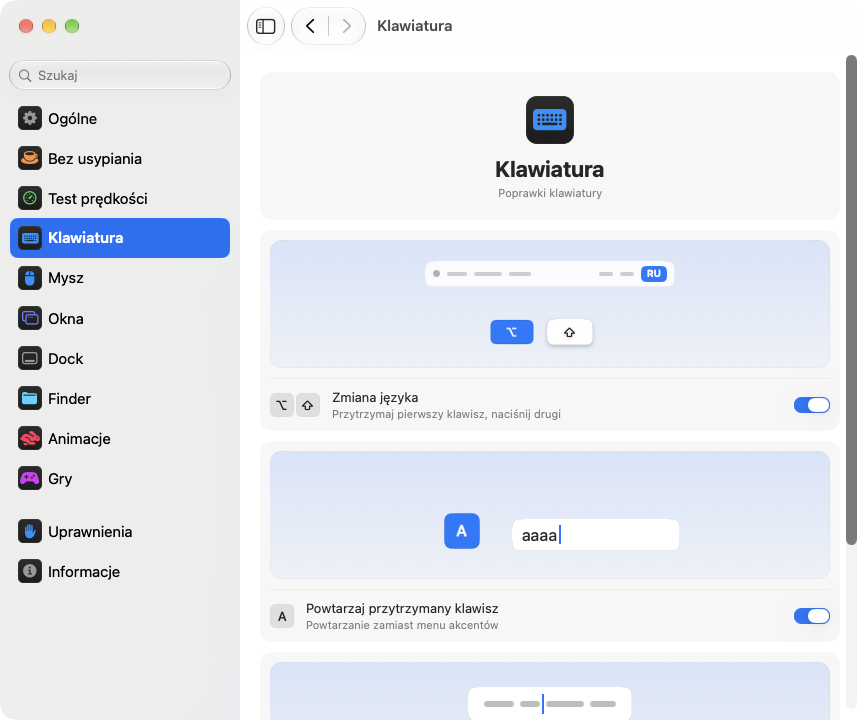

<p align="center"></p>
<h1 align="center">pika-tools</h1>
<p align="center">Drobne usprawnienia klawiatury, myszy, okien i Findera, prosto z paska menu Twojego Maca.</p>
<p align="center"><sub><a href="../../README.md">English</a> · <a href="README.ru.md">Русский</a> · <a href="README.uk.md">Українська</a> · <a href="README.de.md">Deutsch</a> · <a href="README.fr.md">Français</a> · <a href="README.es.md">Español</a> · <a href="README.it.md">Italiano</a> · <a href="README.pt-BR.md">Português (Brasil)</a> · <a href="README.ja.md">日本語</a> · <a href="README.zh-Hans.md">简体中文</a> · <a href="README.ko.md">한국어</a> · <a href="README.ro.md">Română</a> · <b>Polski</b> · <a href="README.tr.md">Türkçe</a> · <a href="README.nl.md">Nederlands</a> · <a href="README.sv.md">Svenska</a> · <a href="README.cs.md">Čeština</a> · <a href="README.zh-Hant.md">繁體中文</a> · <a href="README.ar.md">العربية</a> · <a href="README.hi.md">हिन्दी</a> · <a href="README.id.md">Bahasa Indonesia</a> · <a href="README.vi.md">Tiếng Việt</a> · <a href="README.th.md">ไทย</a></sub></p>

<p align="center">
<picture>
<source media="(prefers-color-scheme: dark)" srcset="../media/settings-pl-dark.png">

</picture>
</p>

## Instalacja

```bash
brew install --cask dev-pikapik/pika-tools/pika-tools && open -a pika-tools
```

pika-tools pojawi się na pasku menu u góry ekranu. Wszystko jest wyłączone, dopóki sam tego nie włączysz.

<details>
<summary>Nie masz Homebrew? Dwa inne sposoby</summary>

Bez Homebrew: otwórz Terminal, wklej ten wiersz i naciśnij Return:

```bash
/bin/bash -c "$(curl -fsSL https://raw.githubusercontent.com/dev-pikapik/pika-tools/main/install.sh)"
```

Możesz też pobrać [pika-tools.dmg](https://github.com/dev-pikapik/pika-tools/releases/latest/download/pika-tools.dmg), otworzyć go i przeciągnąć aplikację do folderu Aplikacje.

Zarówno Homebrew, jak i skrypt umieszczają aplikację w `/Applications`, uruchamiają ją, proszą o uprawnienia i włączają otwieranie po zalogowaniu. Potem aplikacja uaktualnia się sama, zobacz **Uaktualnienia**. Jak ją usunąć, opisano w sekcji **Odinstalowanie**.

</details>

## Co potrafi

<table>
<tbody><tr>
<td width="50%" valign="top">
<picture><source media="(prefers-color-scheme: dark)" srcset="../media/keep-awake-dark.png"></picture>
<br><b>Nie usypiaj</b>
<br>Mac nie zaśnie, dopóki tego potrzebujesz, nawet z zamkniętą klapą.
</td>
<td width="50%" valign="top">
<picture><source media="(prefers-color-scheme: dark)" srcset="../media/command-keys-dark.png"></picture>
<br><b>Ochrona ⌘Q i ⌘W</b>
<br>Nic nie zamknie się przypadkiem. Dodaj ⇧, gdy naprawdę chcesz.
</td>
</tr></tbody>
<tbody><tr>
<td width="50%" valign="top">
<picture><source media="(prefers-color-scheme: dark)" srcset="../media/compress-dark.png"></picture>
<br><b>Mniejsza kopia</b>
<br>Kliknij prawym przyciskiem zdjęcie, PDF lub wideo, a obok pojawi się lżejsza kopia.
</td>
<td width="50%" valign="top">
<picture><source media="(prefers-color-scheme: dark)" srcset="../media/convert-dark.png"></picture>
<br><b>Konwersja</b>
<br>Zapisz obraz, wideo lub utwór w innym formacie z menu pod prawym przyciskiem.
</td>
</tr></tbody>
<tbody><tr>
<td width="50%" valign="top">
<picture><source media="(prefers-color-scheme: dark)" srcset="../media/input-switch-dark.png"></picture>
<br><b>Zmiana języka</b>
<br>Przytrzymaj ⌥ i stuknij ⇧, by zmienić język klawiatury.
</td>
<td width="50%" valign="top">
<picture><source media="(prefers-color-scheme: dark)" srcset="../media/quit-on-close-dark.png"></picture>
<br><b>Zakończ z ostatnim oknem</b>
<br>Zamknij ostatnie okno aplikacji, a aplikacja też się zakończy.
</td>
</tr></tbody>
<tbody><tr>
<td width="50%" valign="top">
<picture><source media="(prefers-color-scheme: dark)" srcset="../media/window-zoom-dark.png"></picture>
<br><b>Zielony przycisk powiększa</b>
<br>Okno wypełnia ekran bez przechodzenia na pełny ekran.
</td>
<td width="50%" valign="top">
<picture><source media="(prefers-color-scheme: dark)" srcset="../media/dock-hide-dark.png"></picture>
<br><b>Ukrywanie kliknięciem w Docku</b>
<br>Kliknij aplikację, w której jesteś, a zejdzie z drogi.
</td>
</tr></tbody>
<tbody><tr>
<td width="50%" valign="top">
<picture><source media="(prefers-color-scheme: dark)" srcset="../media/new-file-dark.png"></picture>
<br><b>Nowy plik</b>
<br>Prawy przycisk w Finderze, nazwa i pusty plik gotowy.
</td>
<td width="50%" valign="top">
<picture><source media="(prefers-color-scheme: dark)" srcset="../media/finder-cut-dark.png"></picture>
<br><b>⌘X przenosi pliki</b>
<br>Wytnij pliki w Finderze i wklej je tam, gdzie chcesz.
</td>
</tr></tbody>
<tbody><tr>
<td width="50%" valign="top">
<picture><source media="(prefers-color-scheme: dark)" srcset="../media/finder-open-dark.png"></picture>
<br><b>Enter otwiera pliki</b>
<br>Zaznacz pliki w Finderze i naciśnij Enter, by je otworzyć.
</td>
<td width="50%" valign="top">
<picture><source media="(prefers-color-scheme: dark)" srcset="../media/finder-delete-dark.png"></picture>
<br><b>Delete do Kosza</b>
<br>Naciśnij ⌫ w Finderze, a zaznaczone pliki trafią do Kosza.
</td>
</tr></tbody>
<tbody><tr>
<td width="50%" valign="top">
<picture><source media="(prefers-color-scheme: dark)" srcset="../media/game-mode-dark.png"></picture>
<br><b>Tryb gry</b>
<br>Gdy grasz, nic nie wyskoczy nad grą ani jej nie zamknie.
</td>
<td width="50%" valign="top">
<picture><source media="(prefers-color-scheme: dark)" srcset="../media/speed-test-dark.png"></picture>
<br><b>Test prędkości</b>
<br>Jak szybki jest Twój internet i do czego wystarczy.
</td>
</tr></tbody>
<tbody><tr>
<td width="50%" valign="top">
<picture><source media="(prefers-color-scheme: dark)" srcset="../media/side-buttons-dark.png"></picture>
<br><b>Boczne przyciski</b>
<br>Przyciski 4 i 5 cofają i przechodzą dalej, jak przesunięcie palcami.
</td>
<td width="50%" valign="top">
<picture><source media="(prefers-color-scheme: dark)" srcset="../media/wheel-lines-dark.png"></picture>
<br><b>Przewijanie o wiersze</b>
<br>Każdy ząbek kółka przewija tyle samo, niezależnie od tempa.
</td>
</tr></tbody>
<tbody><tr>
<td width="50%" valign="top">
<picture><source media="(prefers-color-scheme: dark)" srcset="../media/wheel-direction-dark.png"></picture>
<br><b>Kierunek przewijania</b>
<br>Jeden kierunek dla gładzika, drugi dla myszy.
</td>
<td width="50%" valign="top">
<picture><source media="(prefers-color-scheme: dark)" srcset="../media/linear-pointer-dark.png"></picture>
<br><b>Bez przyspieszenia wskaźnika</b>
<br>Wskaźnik przesuwa się dokładnie tyle, co Twoja ręka.
</td>
</tr></tbody>
<tbody><tr>
<td width="50%" valign="top">
<picture><source media="(prefers-color-scheme: dark)" srcset="../media/key-repeat-dark.png"></picture>
<br><b>Powtarzaj przytrzymany klawisz</b>
<br>Przytrzymaj klawisz, by pisał raz za razem, bez menu akcentów.
</td>
<td width="50%" valign="top">
<picture><source media="(prefers-color-scheme: dark)" srcset="../media/home-end-dark.png"></picture>
<br><b>Home i End</b>
<br>Skacz na początek lub koniec wiersza podczas pisania.
</td>
</tr></tbody>
<tbody><tr>
<td width="50%" valign="top">
<picture><source media="(prefers-color-scheme: dark)" srcset="../media/animations-dark.png"></picture>
<br><b>Animacje</b>
<br>Przyspiesz Dock, okna i Szybki przegląd, nawet do natychmiastowych.
</td>
<td width="50%" valign="top">
<picture><source media="(prefers-color-scheme: dark)" srcset="../media/leftover-permissions-dark.png"></picture>
<br><b>Uprawnienia usuniętych aplikacji</b>
<br>Usuń uprawnienia, które macOS zachowuje dla już usuniętych aplikacji.
</td>
</tr></tbody>
</table>

## Więcej szczegółów

<details>
<summary>Pierwsze uruchomienie</summary>

pika-tools potrzebuje dwóch uprawnień. Przy pierwszym uruchomieniu otwiera ustawienia na stronie Uprawnienia, która prowadzi krok po kroku, a macOS pokazuje własne prośby. Przejdź do **Ustawienia systemowe › Prywatność i ochrona** i włącz pika-tools w sekcjach:

- **Dostępność**, aby aplikacja mogła zmienić naciśnięcie klawisza lub kliknięcie, zanim dotrze ono do innych aplikacji.
- **Monitorowanie wprowadzania**, aby aplikacja w ogóle widziała naciśnięcia klawiszy i kliknięcia.

Aplikacja zauważy zmianę w ciągu kilku sekund, bez ponownego uruchamiania.

pika-tools nie nagrywa, nie przechowuje i nie wysyła niczego, co piszesz lub klikasz. Zdarzenia są obsługiwane w pamięci i od razu przekazywane dalej. Jedyne połączenie z siecią to sprawdzanie uaktualnień, które pyta GitHub o najnowsze wydanie.

</details>

<details>
<summary>Każde narzędzie dokładnie</summary>

**Ochrona ⌘Q i ⌘W.** Same ⌘Q i ⌘W nic nie robią, więc nie zamkniesz przypadkiem aplikacji ani okna. Dodaj Shift, aby zrobić to celowo: ⇧⌘Q kończy aplikację, ⇧⌘W zamyka okno. Działa we wszystkich aplikacjach. Każdy klawisz ma własny przełącznik. Domyślnie wyłączone.

**Zmiana języka skrótem Option+Shift.** Przytrzymaj Option i stuknij Shift: macOS przełączy na następne źródło wprowadzania. Trzymaj dalej Option i stuknij Shift ponownie, aby przejść dalej. Przytrzymaj Shift i stuknij Option, aby wrócić. Jeśli w międzyczasie naciśniesz inny klawisz, klikniesz lub dodasz Command, Control albo Fn, nic się nie przełączy, więc skróty takie jak Option+Shift+strzałka działają jak wcześniej. Domyślnie wyłączone.

**Powtarzaj przytrzymany klawisz.** Przytrzymaj klawisz, a litera będzie się pisać raz za razem, zamiast pokazywać menu akcentów. Przydaje się w grach i przy pisaniu. Już otwarte aplikacje przejmą to po ponownym uruchomieniu. Gdy to wyłączysz, macOS znowu działa po swojemu. Domyślnie wyłączone.

**Home i End na początek i koniec wiersza.** Gdy piszesz, Home przenosi kursor na początek wiersza, a End na jego koniec, zamiast przewijać stronę. Z ⇧ zaznaczają tekst do tego miejsca, z ⌘ przechodzą na początek lub koniec całego tekstu. Poza polami tekstowymi oraz w terminalach, maszynach wirtualnych i aplikacjach pulpitu zdalnego klawisze działają jak dotąd. Możesz dodać inne aplikacje, w których mają działać jak zwykle. Domyślnie wyłączone.

**Wyłącz przyspieszenie wskaźnika.** Wskaźnik przesuwa się dokładnie o tyle, o ile mysz, niezależnie od tego, jak szybko nią ruszasz, jak w LinearMouse. Suwak **Szybkość ruchu** ustala, jak szybko się porusza. Działa tylko z myszami, gładzik zostaje bez zmian. Wyłącz tę funkcję lub zakończ pika-tools, a macOS odzyska własne ustawienia. Domyślnie wyłączone.

**Przewijaj o wiersze.** Każde kliknięcie kółka myszy przewija tyle samo wierszy, bez względu na to, jak szybko nim kręcisz. Wybierz od 1 do 10 wierszy na kliknięcie, domyślnie 3. Naturalne przewijanie zostaje takie, jakie ustawisz w Ustawieniach systemowych. Działa tylko dla myszy, gładzik zostaje bez zmian. Domyślnie wyłączone. Obok suwaka **Odległość na kliknięcie** mała strona przewija się o wybraną odległość, a kropka oznacza wartość domyślną.

Niektóre aplikacje i gry liczą przewijanie w dokładnych pikselach: dla nich przełącz to samo ustawienie na piksele i wybierz od 1 do 200 pikseli na kliknięcie, domyślnie 40. Suwak pokazuje też, jaką część wysokości ekranu to stanowi.

**Kierunek przewijania dla gładzika i myszy.** macOS ma jeden przełącznik przewijania naturalnego wspólny dla gładzika i myszy. Włącz tę funkcję i wybierz kierunek dla każdego: **Naturalny**, gdy strona podąża za palcami jak na iPhonie, albo **Klasyczny**, w którym strona przesuwa się w przeciwną stronę. Wybór dla gładzika działa też na przewijanie w bok i na rozpęd po podniesieniu palców. Magic Mouse przewija dotykiem, więc podąża za wyborem dla gładzika. Wybierz to samo na każdym swoim Macu, a przewijanie będzie wszędzie takie samo, nawet gdy przenosisz mysz na inny Mac przez Uniwersalne sterowanie. Domyślnie wyłączone. Po włączeniu oba wybory są takie jak w Ustawieniach systemowych, więc nic się nie zmienia, dopóki nie wybierzesz czegoś innego.

**Boczne przyciski: wstecz i dalej.** Przyciski myszy 4 i 5 cofają i przechodzą dalej w Safari, Finderze i innych aplikacjach Apple oraz w Firefoksie, Operze i ForkLifcie, tak jak machnięcie na gładziku. Inne aplikacje, na przykład środowiska JetBrains, dostają przyciski bez zmian i obsługują je po swojemu. Jeśli twoja mysz ma je odwrotnie, włącz **Zamień boczne przyciski**. Domyślnie wyłączone.

**Zakończenie po zamknięciu ostatniego okna.** Zamknij ostatnie okno aplikacji, a aplikacja się zakończy. Finder pozostaje otwarty, podobnie jak aplikacje z oknami na innych biurkach lub w Docku. Możesz utworzyć listę aplikacji, które nigdy nie mają się tak kończyć. Domyślnie wyłączone.

**Ukrywanie kliknięciem w Docku.** Kliknij ikonę w Docku aplikacji, której używasz, a zostanie ukryta. Kliknij ponownie, aby ją przywrócić. Domyślnie wyłączone.

**Zielony przycisk powiększa okno.** Kliknij zielony przycisk okna, a okno wypełni ekran, nie przechodząc w pełny ekran. Kliknij ponownie, aby wrócić do poprzedniego rozmiaru. Przytrzymaj ⌥, a przycisk zadziała jak zawsze. Pełny ekran nadal jest w menu przycisku i pod ⌃⌘F. Możesz wypisać aplikacje, w których zielony przycisk ma działać jak zwykle. Domyślnie wyłączone.

**Nowy plik w Finderze.** Kliknij prawym w oknie Findera lub na biurku, wybierz **Nowy plik**, wpisz nazwę i gotowe – pojawi się pusty plik. Domyślnie .txt. Domyślnie wyłączone.

**Enter otwiera pliki w Finderze.** Zaznacz pliki w oknie Findera lub na biurku i naciśnij Return albo Enter – pliki się otworzą. F2 lub fn F2 zmienia nazwę zaznaczonego pliku. W polach tekstowych, na przykład podczas wpisywania nazwy, klawisze działają jak zwykle. Domyślnie wyłączone.

**⌘X wycina pliki w Finderze.** Zaznacz pliki i naciśnij ⌘X, otwórz folder docelowy i naciśnij ⌘V – pliki zostaną tam przeniesione zamiast skopiowane. ⌘C anuluje wycinanie. Domyślnie wyłączone.

**Delete usuwa pliki w Finderze.** Zaznacz pliki i naciśnij ⌫ lub ⌦ (fn ⌫ na laptopie) – trafią do Kosza, tak jak po ⌘⌫. Gdy zmieniasz nazwę pliku, szukasz lub piszesz w innym polu, klawisze kasują litery jak zwykle. Domyślnie wyłączone.

**Mniejsza kopia w Finderze.** Kliknij prawym plik w Finderze i wybierz **Utwórz mniejszą kopię**. Obok pojawi się lżejsza wersja zdjęcia, GIF-a, PDF-a lub wideo, często kilka razy mniejsza. Nieskompresowany dźwięk, np. WAV lub AIFF, zmienia się w zgrabny M4A. Jeśli pliku nie da się już zmniejszyć, kopia nie powstaje, a pika-tools o tym mówi. Oryginał zostaje bez zmian i nic nie opuszcza Twojego Maca. Domyślnie wyłączone.

**Konwersja w Finderze.** Kliknij prawym plik w Finderze i wybierz **Konwertuj na**, aby zapisać go w innym formacie: obraz jako JPEG, PNG, HEIC, GIF, TIFF lub PDF, wideo jako MP4, MOV albo sam dźwięk, muzykę jako M4A, WAV lub AIFF. Oryginał zostaje bez zmian i nic nie opuszcza Twojego Maca. Włącza się osobno od mniejszej kopii. Domyślnie wyłączone.

**Tryb gry.** Dodaj swoje gry, a gdy grasz, Mac nie wyrywa Cię z gry. Spotlight, Siri, ⌘Tab, Mission Control i przesunięcia między biurkami nie otwierają się nad grą, ⌘Q i ⌘W nie zamykają jej przypadkiem, wskaźnik nie ucieka na Dock, pasek menu ani inny ekran, a ekran nie gaśnie. Każda z tych opcji ma własny przełącznik na stronie Gry, a pika-tools podpowiada gry, które znajdzie na Twoim Macu. W grze Control-kliknięcie pozostaje zwykłym kliknięciem, a Control ze strzałkami nie zmienia biurka. Rozpoznaje też Minecrafta: dodaj Minecraft Launcher lub CurseForge, a tryb włączy się w samym Minecrafcie. Aby wyjść z gry, naciśnij ⇧⌘Q, a żeby zamknąć jej okno – ⇧⌘W. ⌥⌘Esc działa zawsze. Gdy tylko wyjdziesz z gry, wszystko działa jak zwykle. Domyślnie wyłączone.

Każde narzędzie ma własny przełącznik w menu i w ustawieniach.

Ikona na pasku menu od razu pokazuje stan: znak pikapik, gdy narzędzia działają, ten sam znak, ale blady, gdy wszystko jest wyłączone, i trójkąt ostrzegawczy, gdy narzędzie jest włączone, ale brakuje uprawnień.

Panel na pasku menu na początku pokazuje tylko kilka wierszy. Które wiersze są widoczne, wybierasz sam: kliknij przycisk z ołówkiem na dole, zaznacz to, co chcesz widzieć, i kliknij **Gotowe**. Ukryte wiersze nadal działają i zostają w Ustawieniach. Jeśli panel nie mieści się na ekranie, można go przewijać.

Aplikacja używa języka systemu lub tego, który wybierzesz w ustawieniach. Dostępne są wszystkie 23 języki z listy na początku tej strony.

</details>

<details>
<summary>Nie usypiaj</summary>

Nie pozwala Macowi przejść w stan uśpienia, gdy nie ma Cię przy klawiaturze: na dowolny czas od 1 sekundy do 365 dni lub do momentu wyłączenia. Włącz to w menu, a czas trwania ustaw w ustawieniach: wpisz dni, godziny, minuty i sekundy, użyj ↑ i ↓ albo kliknij gotową opcję od 15 minut do 8 godzin. Menu pokazuje, ile czasu zostało i kiedy się skończy. Dla opcji **Ekran** są dwa warianty. **Zawsze włączony**: nie gaśnie, bez wygaszacza i ekranu blokady. **Gaśnie jak zwykle**: gaśnie według własnego licznika, a Mac dalej pracuje. **Wyłącz ekran teraz** (jest też w menu) od razu wygasza ekran, a Mac dalej pracuje: aby go przywrócić, rusz myszą lub naciśnij dowolny klawisz. Zakończenie pika-tools kończy także Nie usypiaj.

Na MacBooku możesz też włączyć **Pracuj z zamkniętą pokrywą**. macOS nie ma takiego przełącznika, więc pika-tools uruchamia `pmset -a disablesleep 1` i prosi o hasło administratora: tylko administrator może zmienić sposób usypiania Maca. Ustawienie samo wraca do normy, gdy Nie usypiaj się skończy, gdy zakończysz aplikację lub gdy ta ulegnie awarii. Jeśli nie podasz hasła, nic się nie zmieni. Zadbaj o dobrą wentylację Maca z zamkniętą pokrywą. **Zatrzymaj, gdy bateria spadnie poniżej 20%** kończy sesję, zanim bateria się wyczerpie.

Keep Awake oraz tryby wyświetlacza i zamkniętej klapy można umieścić na przycisku w Centrum sterowania, na pasku menu lub w widżecie na pulpicie przez aplikację Skróty, z linkami skopiowanymi z Ustawień › Bez usypiania.

</details>

<details>
<summary>Test prędkości</summary>

Pokazuje, jak szybki jest teraz twój internet. Kliknij **Sprawdź prędkość** w Ustawieniach › Test prędkości albo **Sprawdź** w menu, jeśli dodasz tam wiersz przyciskiem z ołówkiem. Po mniej więcej pół minucie widzisz pobieranie, wysyłanie, ping i responsywność, czyli jak szybko wszystko reaguje, gdy łącze jest zajęte. Niżej prostymi słowami jest napisane, do czego wystarczy: filmy w 4K, rozmowy wideo, gry online i duże pliki. Test korzysta z wbudowanego w macOS narzędzia networkQuality i serwerów Apple. Ostatni wynik zostaje do następnego testu, a link do Skrótów uruchamia go z centrum sterowania.

</details>

<details>
<summary>Ustawienia</summary>

Otwórz ustawienia z menu poleceniem **Ustawienia…** lub skrótem ⌘, albo po prostu uruchom pika-tools ponownie z Findera, Launchpada lub Spotlight. Gdy okno jest otwarte, aplikacja pojawia się w Docku i w ⌘Tab.

- **Ogólne**: otwieranie po zalogowaniu, wygląd (Systemowy, Jasny lub Ciemny), język, uaktualnienia i kopia zapasowa: eksport i import ustawień jako pliku albo synchronizacja przez iCloud Drive.
- **Bez usypiania**: czas trwania, opcje ekranu i pokrywy.
- **Test prędkości**: sprawdzenie internetu i tego, do czego wystarczy.
- **Klawiatura**: zmiana języka, powtarzanie klawisza, Home i End.
- **Mysz**: przyspieszenie wskaźnika i szybkość ruchu, przewijanie o wiersze, kierunek przewijania, boczne przyciski.
- **Okna**: powiększanie zielonym przyciskiem (z listą wyjątków), ochrona ⌘Q i ⌘W oraz zakończenie po ostatnim oknie (z listą wyjątków).
- **Dock**: ukrywanie kliknięciem w Docku.
- **Finder**: nowy plik, mniejsza kopia i konwersja, otwieranie klawiszem Return, wycinanie przez ⌘X i usuwanie klawiszem ⌫.
- **Uprawnienia**: stan obu uprawnień, a przy włączonej synchronizacji także iCloud Drive, z przyciskami, które otwierają właściwe miejsce w Ustawieniach systemowych.
- **Informacje**: wersja, łącza do listy zmian i do zgłaszania problemów.

Wiele ustawień ma mały obrazek pokazujący, co robią, na przykład Maca, który nie zasypia, albo okno chowające się za Dociem. Obrazek zmienia się razem z przełącznikiem i stoi w miejscu, gdy w Ustawieniach systemowych jest włączone „Ogranicz ruch”.

Na dole każdej strony jest przycisk **Przywróć domyślne…**. Najpierw pyta o potwierdzenie, potem wyłącza narzędzia z tej strony i przywraca ich opcje, jakby pika-tools nigdy ich nie dotykał.

**Synchronizuj ustawienia przez iCloud** sprawia, że pika-tools jest taki sam na wszystkich twoich Macach. Ustawienia leżą w folderze pika-tools w iCloud Drive, a wygrywa ostatnia zmiana. Domyślnie wyłączone i wymaga włączonego iCloud Drive. Uprawnienia nie są synchronizowane: każdy Mac prosi o nie osobno.

</details>

<details>
<summary>Uaktualnienia</summary>

pika-tools sprawdza nowe wersje przy uruchomieniu i co 6 godzin. Możesz to wyłączyć w Ustawienia › Ogólne. Gdy pojawi się nowa wersja, w menu pokaże się przycisk **Uaktualnij do …**: jedno kliknięcie i aplikacja pobierze uaktualnienie, zainstaluje je i uruchomi się ponownie. Możesz też sprawdzić ręcznie przyciskiem **Sprawdź teraz** w Ustawienia › Ogólne.

Z Homebrew możesz też uruchomić `brew upgrade --cask pika-tools`.

Od wersji 1.3 uprawnienia zostają zachowane po uaktualnieniach.

</details>

<details>
<summary>Odinstalowanie</summary>

```bash
/bin/bash -c "$(curl -fsSL https://raw.githubusercontent.com/dev-pikapik/pika-tools/main/uninstall.sh)"
```

Jeśli instalacja była przez Homebrew: `brew uninstall --cask --zap pika-tools`.

Oba sposoby kończą aplikację, usuwają ją z rzeczy otwieranych podczas logowania i kasują. Skrypt dodatkowo resetuje jej uprawnienia.

</details>

<details>
<summary>Najczęstsze pytania</summary>

**Dlaczego potrzebne są dwa uprawnienia?**
macOS dzieli dostęp do klawiatury i myszy na dwie części. Monitorowanie wprowadzania pozwala aplikacji widzieć zdarzenia, a Dostępność pozwala je zmieniać. Do zablokowania skrótu potrzebne są oba.

**macOS informuje, że aplikacja pochodzi od niezidentyfikowanego dewelopera.**
pika-tools jest podpisana, ale nie jest poświadczona przez Apple. Homebrew i skrypt instalacyjny załatwiają to za Ciebie. Jeśli korzystasz z pliku dmg, otwórz **Ustawienia systemowe › Prywatność i ochrona** i kliknij **Otwórz mimo to** lub uruchom:

```bash
xattr -dr com.apple.quarantine /Applications/pika-tools.app
```

**Czy działa na Macach z procesorem Intel?**
Tak. To aplikacja uniwersalna dla Apple Silicon i Intel, wymaga macOS 14 Sonoma lub nowszego.

**Uprawnienie jest włączone, ale nic nie działa.**
W **Ustawieniach systemowych › Prywatność i ochrona** usuń pika-tools z obu list przyciskiem −, a potem dodaj ją ponownie. Na stronie Uprawnienia w ustawieniach pika-tools są przyciski, które otwierają właściwe miejsce.

</details>

<p align="center">☕ Jeśli pika-tools się przydaje, możesz <a href="https://buymeacoffee.com/pikapik">postawić mi kawę</a> – wszystko idzie na rozwój i wsparcie aplikacji.</p>

<p align="center"><sub><a href="../whats-new/README.pl.md">Co nowego</a> · <a href="https://github.com/dev-pikapik/homebrew-pika-tools">Tap Homebrew</a> · <a href="../../CONTRIBUTING.md">Zbuduj samodzielnie</a> · <a href="../../LICENSE">Licencja MIT</a> · © 2026 pikapik</sub></p>
