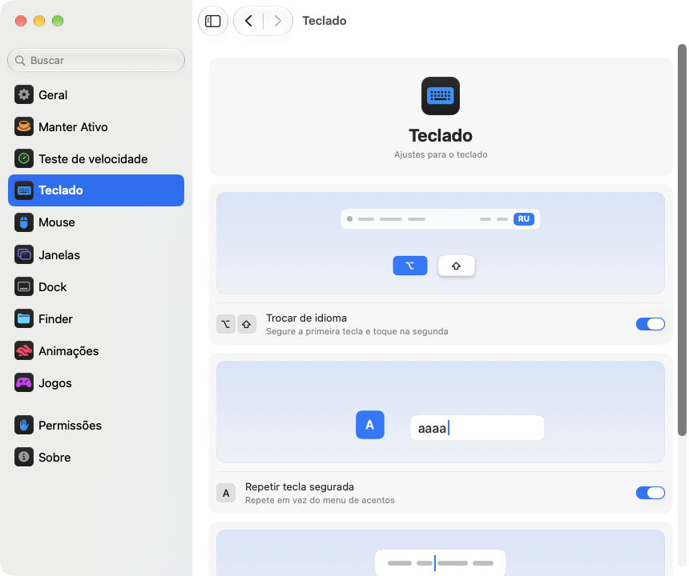

<p align="center"></p>
<h1 align="center">pika-tools</h1>
<p align="center">Pequenos ajustes para o teclado, o mouse, as janelas e o Finder, direto na barra de menus do seu Mac.</p>
<p align="center"><sub><a href="../../README.md">English</a> · <a href="README.ru.md">Русский</a> · <a href="README.uk.md">Українська</a> · <a href="README.de.md">Deutsch</a> · <a href="README.fr.md">Français</a> · <a href="README.es.md">Español</a> · <a href="README.it.md">Italiano</a> · <b>Português (Brasil)</b> · <a href="README.ja.md">日本語</a> · <a href="README.zh-Hans.md">简体中文</a> · <a href="README.ko.md">한국어</a> · <a href="README.ro.md">Română</a> · <a href="README.pl.md">Polski</a> · <a href="README.tr.md">Türkçe</a> · <a href="README.nl.md">Nederlands</a> · <a href="README.sv.md">Svenska</a> · <a href="README.cs.md">Čeština</a> · <a href="README.zh-Hant.md">繁體中文</a> · <a href="README.ar.md">العربية</a> · <a href="README.hi.md">हिन्दी</a> · <a href="README.id.md">Bahasa Indonesia</a> · <a href="README.vi.md">Tiếng Việt</a> · <a href="README.th.md">ไทย</a></sub></p>

<p align="center">
<picture>
<source media="(prefers-color-scheme: dark)" srcset="../media/settings-pt-BR-dark.png">

</picture>
</p>

## Instalação

```bash
brew install --cask dev-pikapik/pika-tools/pika-tools && open -a pika-tools
```

O pika-tools aparece na barra de menus, no alto da tela. Tudo fica desligado até você ligar.

<details>
<summary>Não tem Homebrew? Outros dois jeitos</summary>

Sem o Homebrew, abra o Terminal, cole esta linha e pressione Return:

```bash
/bin/bash -c "$(curl -fsSL https://raw.githubusercontent.com/dev-pikapik/pika-tools/main/install.sh)"
```

Ou baixe o [pika-tools.dmg](https://github.com/dev-pikapik/pika-tools/releases/latest/download/pika-tools.dmg), abra-o e arraste o app para a pasta Aplicativos.

Tanto o Homebrew quanto o script colocam o app em `/Applications`, abrem o app, pedem as permissões e ativam a abertura ao iniciar sessão. Depois disso, o app se atualiza sozinho; veja **Atualizações**. Para removê-lo, veja **Desinstalação**.

</details>

## O que ele faz

<table>
<tbody><tr>
<td width="50%" valign="top">
<picture><source media="(prefers-color-scheme: dark)" srcset="../media/keep-awake-dark.png"></picture>
<br><b>Manter Ativo</b>
<br>Seu Mac fica acordado pelo tempo que precisar, até com a tampa fechada.
</td>
<td width="50%" valign="top">
<picture><source media="(prefers-color-scheme: dark)" srcset="../media/command-keys-dark.png"></picture>
<br><b>Proteger ⌘Q e ⌘W</b>
<br>Nada fecha sem querer. Adicione ⇧ quando for de propósito.
</td>
</tr></tbody>
<tbody><tr>
<td width="50%" valign="top">
<picture><source media="(prefers-color-scheme: dark)" srcset="../media/compress-dark.png"></picture>
<br><b>Cópia menor</b>
<br>Clique com o botão direito em uma foto, PDF ou vídeo e ganhe uma cópia mais leve.
</td>
<td width="50%" valign="top">
<picture><source media="(prefers-color-scheme: dark)" srcset="../media/convert-dark.png"></picture>
<br><b>Conversão</b>
<br>Salve uma imagem, um vídeo ou uma música em outro formato pelo botão direito.
</td>
</tr></tbody>
<tbody><tr>
<td width="50%" valign="top">
<picture><source media="(prefers-color-scheme: dark)" srcset="../media/input-switch-dark.png"></picture>
<br><b>Trocar de idioma</b>
<br>Segure ⌥ e toque em ⇧ para trocar o idioma do teclado.
</td>
<td width="50%" valign="top">
<picture><source media="(prefers-color-scheme: dark)" srcset="../media/quit-on-close-dark.png"></picture>
<br><b>Encerrar com a última janela</b>
<br>Feche a última janela de um app, e o app também é encerrado.
</td>
</tr></tbody>
<tbody><tr>
<td width="50%" valign="top">
<picture><source media="(prefers-color-scheme: dark)" srcset="../media/window-zoom-dark.png"></picture>
<br><b>O botão verde amplia</b>
<br>A janela ocupa a tela toda sem entrar em tela cheia.
</td>
<td width="50%" valign="top">
<picture><source media="(prefers-color-scheme: dark)" srcset="../media/dock-hide-dark.png"></picture>
<br><b>Ocultar com um clique no Dock</b>
<br>Clique no app que você está usando, e ele sai da frente.
</td>
</tr></tbody>
<tbody><tr>
<td width="50%" valign="top">
<picture><source media="(prefers-color-scheme: dark)" srcset="../media/new-file-dark.png"></picture>
<br><b>Novo arquivo</b>
<br>Botão direito no Finder, um nome, e o arquivo vazio está pronto.
</td>
<td width="50%" valign="top">
<picture><source media="(prefers-color-scheme: dark)" srcset="../media/finder-cut-dark.png"></picture>
<br><b>⌘X move arquivos</b>
<br>Recorte arquivos no Finder e cole onde quiser.
</td>
</tr></tbody>
<tbody><tr>
<td width="50%" valign="top">
<picture><source media="(prefers-color-scheme: dark)" srcset="../media/finder-open-dark.png"></picture>
<br><b>Enter abre arquivos</b>
<br>Selecione arquivos no Finder e pressione Enter para abri-los.
</td>
<td width="50%" valign="top">
<picture><source media="(prefers-color-scheme: dark)" srcset="../media/finder-delete-dark.png"></picture>
<br><b>Delete manda para o Lixo</b>
<br>Pressione ⌫ no Finder, e os arquivos selecionados vão para o Lixo.
</td>
</tr></tbody>
<tbody><tr>
<td width="50%" valign="top">
<picture><source media="(prefers-color-scheme: dark)" srcset="../media/game-mode-dark.png"></picture>
<br><b>Modo Jogo</b>
<br>Enquanto você joga, nada abre por cima do jogo nem o fecha.
</td>
<td width="50%" valign="top">
<picture><source media="(prefers-color-scheme: dark)" srcset="../media/speed-test-dark.png"></picture>
<br><b>Teste de velocidade</b>
<br>A velocidade da sua internet e para que ela dá.
</td>
</tr></tbody>
<tbody><tr>
<td width="50%" valign="top">
<picture><source media="(prefers-color-scheme: dark)" srcset="../media/side-buttons-dark.png"></picture>
<br><b>Botões laterais</b>
<br>Os botões 4 e 5 voltam e avançam, como um gesto no trackpad.
</td>
<td width="50%" valign="top">
<picture><source media="(prefers-color-scheme: dark)" srcset="../media/wheel-lines-dark.png"></picture>
<br><b>Rolar por linhas</b>
<br>Cada clique da roda rola o mesmo tanto, não importa a velocidade.
</td>
</tr></tbody>
<tbody><tr>
<td width="50%" valign="top">
<picture><source media="(prefers-color-scheme: dark)" srcset="../media/wheel-direction-dark.png"></picture>
<br><b>Direção de rolagem</b>
<br>Uma direção para o trackpad e outra para o mouse.
</td>
<td width="50%" valign="top">
<picture><source media="(prefers-color-scheme: dark)" srcset="../media/linear-pointer-dark.png"></picture>
<br><b>Sem aceleração do cursor</b>
<br>O cursor anda exatamente o quanto a sua mão anda.
</td>
</tr></tbody>
<tbody><tr>
<td width="50%" valign="top">
<picture><source media="(prefers-color-scheme: dark)" srcset="../media/key-repeat-dark.png"></picture>
<br><b>Repetir tecla segurada</b>
<br>Segure uma tecla para repeti-la, sem o menu de acentos.
</td>
<td width="50%" valign="top">
<picture><source media="(prefers-color-scheme: dark)" srcset="../media/home-end-dark.png"></picture>
<br><b>Home e End</b>
<br>Vá ao início ou ao fim da linha enquanto digita.
</td>
</tr></tbody>
<tbody><tr>
<td width="50%" valign="top">
<picture><source media="(prefers-color-scheme: dark)" srcset="../media/animations-dark.png"></picture>
<br><b>Animações</b>
<br>Acelere o Dock, as janelas e a Visualização Rápida, até ficarem instantâneos.
</td>
<td width="50%" valign="top">
<picture><source media="(prefers-color-scheme: dark)" srcset="../media/leftover-permissions-dark.png"></picture>
<br><b>Permissões de apps apagados</b>
<br>Remova as permissões que o macOS guarda para apps que você já apagou.
</td>
</tr></tbody>
</table>

## Mais detalhes

<details>
<summary>Primeira abertura</summary>

O pika-tools precisa de duas permissões. Na primeira vez, ele abre os ajustes na página Permissões, que guia você passo a passo, e o macOS mostra os próprios avisos. Vá em **Ajustes do Sistema › Privacidade e Segurança** e ative o pika-tools em:

- **Acessibilidade**, para que o app possa alterar um toque de tecla ou um clique antes que ele chegue a outros apps.
- **Monitoração de Entrada**, para que o app possa ver os toques de tecla e os cliques.

O app percebe a mudança em um ou dois segundos, sem precisar reiniciar.

O pika-tools não grava, não guarda e não envia nada do que você digita ou clica. Os eventos são tratados na memória e repassados na hora. A única conexão de rede é a busca por atualizações, que pergunta ao GitHub qual é a versão mais recente.

</details>

<details>
<summary>Cada ferramenta em detalhes</summary>

**Proteger ⌘Q e ⌘W.** ⌘Q e ⌘W sozinhos não fazem nada, então você não encerra um app nem fecha uma janela sem querer. Adicione Shift para fazer isso de propósito: ⇧⌘Q encerra, ⇧⌘W fecha. Funciona em todos os apps. Cada tecla tem a própria chave. Desativado por padrão.

**Trocar de idioma com Option+Shift.** Mantenha Option pressionada e toque em Shift: o macOS passa para a próxima fonte de entrada. Continue segurando Option e toque em Shift de novo para avançar. Mantenha Shift pressionada e toque em Option para voltar. Se nesse meio-tempo você pressionar outra tecla, clicar ou adicionar Command, Control ou Fn, nada muda, então atalhos como Option+Shift+seta funcionam como antes. Desativado por padrão.

**Repetir tecla segurada.** Segure uma tecla e a letra é digitada várias e várias vezes, em vez de aparecer o menu de acentos. Ótimo em jogos e na hora de digitar. Os apps que já estão abertos aplicam isso depois de reiniciados. Desative e o macOS volta ao comportamento de sempre. Desativado por padrão.

**Home e End vão ao início e ao fim da linha.** Enquanto você digita, Home leva o cursor ao início da linha e End ao fim, em vez de rolar a página. Com ⇧ selecionam até ali, com ⌘ vão ao início ou ao fim do texto inteiro. Fora dos campos de texto, e em terminais, máquinas virtuais e apps de área de trabalho remota, as teclas funcionam como antes. Você pode adicionar outros apps em que elas devem funcionar como sempre. Desativado por padrão.

**Desativar a aceleração do cursor.** O ponteiro se move exatamente o quanto o mouse se move, não importa a velocidade, como no LinearMouse. Um controle **Velocidade do rastreamento** define a rapidez dele. Funciona só com mouses; o trackpad fica como está. Desative a opção ou encerre o pika-tools e o macOS volta aos próprios ajustes. Desativado por padrão.

**Rolar por linhas.** Cada clique da roda do mouse rola o mesmo número de linhas, por mais rápido que você a gire. Escolha de 1 a 10 linhas por clique, 3 por padrão. A rolagem natural continua como você definiu nos Ajustes do Sistema. Funciona só para mouses, o trackpad continua como está. Desativado por padrão. Ao lado do controle deslizante **Distância por clique**, uma página pequena rola a distância escolhida, e um ponto marca o valor padrão.

Alguns apps e jogos contam a rolagem em pixels exatos: para eles, mude a mesma opção para pixels e escolha de 1 a 200 pixels por clique, 40 por padrão. O controle também mostra que parte da altura da tela isso representa.

**Direção de rolagem para o trackpad e o mouse.** O macOS tem um só ajuste de rolagem natural para o trackpad e o mouse ao mesmo tempo. Ative este recurso e escolha uma direção para cada um: **Natural**, em que a página acompanha os dedos como no iPhone, ou **Clássica**, em que a página vai no sentido oposto. A escolha do trackpad também vale para a rolagem lateral e para o deslize depois que você tira os dedos. O Magic Mouse rola pelo toque, por isso segue a escolha do trackpad. Escolha o mesmo em cada Mac e a rolagem fica igual em todos, mesmo quando você leva o mouse para outro Mac com o Universal Control. Desativado por padrão. Ao ativar, os dois começam como em Ajustes do Sistema, então nada muda até você escolher outra coisa.

**Botões laterais para voltar e avançar.** Os botões 4 e 5 do mouse voltam e avançam no Safari, no Finder e em outros apps da Apple, no Firefox, no Opera e no ForkLift, como um gesto de deslizar no trackpad. Outros apps, como os IDEs da JetBrains, recebem os botões do jeito que são e os tratam à própria maneira. Se o seu mouse tem esses botões ao contrário, ative **Inverter os botões laterais**. Desativado por padrão.

**Encerrar ao fechar a última janela.** Feche a última janela de um app e o app é encerrado. O Finder continua aberto, assim como os apps com janelas em outras mesas ou no Dock. Você pode listar os apps que nunca devem ser encerrados assim. Desativado por padrão.

**Ocultar com um clique no Dock.** Clique no ícone do Dock do app que você está usando e ele é ocultado. Clique de novo para trazê-lo de volta. Desativado por padrão.

**O botão verde amplia a janela.** Clique no botão verde de uma janela e ela cresce até ocupar a tela, sem entrar em tela inteira. Clique de novo para voltar ao tamanho anterior. Segure ⌥ e o botão funciona como sempre. A tela inteira continua no menu do botão e em ⌃⌘F. Você pode listar os apps em que o botão verde deve funcionar como sempre. Desativado por padrão.

**Novo arquivo no Finder.** Clique com o botão direito numa janela do Finder ou na mesa, escolha **Novo arquivo**, digite um nome e aparece um arquivo vazio. .txt por padrão. Desativado por padrão.

**Enter abre arquivos no Finder.** Selecione arquivos numa janela do Finder ou na mesa e pressione Return ou Enter: eles abrem. F2 ou fn F2 renomeia o arquivo selecionado. Em campos de texto, por exemplo enquanto você digita um nome, as teclas funcionam como sempre. Desativado por padrão.

**⌘X corta arquivos no Finder.** Selecione arquivos e pressione ⌘X, abra a pasta de destino e pressione ⌘V: os arquivos são movidos para lá em vez de copiados. ⌘C cancela o corte. Desativado por padrão.

**Delete apaga arquivos no Finder.** Selecione arquivos e pressione ⌫ ou ⌦ (fn ⌫ no notebook): eles vão para o Lixo, como com ⌘⌫. Enquanto você renomeia um arquivo, pesquisa ou digita em qualquer outro campo, as teclas apagam letras como sempre. Desativado por padrão.

**Cópia menor no Finder.** Clique com o botão direito num arquivo no Finder e escolha **Criar cópia menor**. Ao lado aparece uma versão mais leve de uma foto, GIF, PDF ou vídeo, muitas vezes várias vezes menor. Som sem compressão, como WAV ou AIFF, vira um M4A compacto. Se o arquivo não puder ficar menor, nenhuma cópia é criada e o pika-tools avisa. O original continua igual e nada sai do seu Mac. Desativado por padrão.

**Conversão no Finder.** Clique com o botão direito num arquivo no Finder e escolha **Converter para** para salvá-lo em outro formato: uma imagem como JPEG, PNG, HEIC, GIF, TIFF ou PDF, um vídeo como MP4, MOV ou só o som, música como M4A, WAV ou AIFF. O original continua igual e nada sai do seu Mac. Liga separadamente da cópia menor. Desativado por padrão.

**Modo Jogo.** Adicione seus jogos e, enquanto você joga, o Mac não tira você do jogo. Spotlight, Siri, ⌘Tab, Mission Control e os gestos entre mesas não abrem por cima do jogo, ⌘Q e ⌘W não o fecham sem querer, o ponteiro não escapa para o Dock, a barra de menus ou outra tela, e a tela continua ligada. Cada uma dessas opções tem a própria chave na página Jogos, e o pika-tools sugere os jogos que encontra no seu Mac. No jogo, Control-clique continua sendo um clique, e Control com as setas não troca de mesa. O Minecraft também é reconhecido: adicione o Minecraft Launcher ou o CurseForge, e o modo liga dentro do próprio Minecraft. Para sair de um jogo, pressione ⇧⌘Q; para fechar a janela dele, ⇧⌘W. ⌥⌘Esc sempre funciona. Assim que você sai do jogo, tudo funciona como sempre. Desativado por padrão.

Cada ferramenta tem a própria chave no menu e nos ajustes.

O ícone na barra de menus mostra o estado num relance: a marca do pikapik quando as ferramentas estão funcionando, a mesma marca mais clara quando tudo está desativado e um triângulo de aviso quando uma ferramenta está ativada, mas faltam permissões.

O painel da barra de menus começa com poucas linhas. Você escolhe quais ele mostra: clique no botão de lápis na parte de baixo, marque o que quer ver e clique em **Concluir**. As linhas ocultas continuam funcionando e ficam nos Ajustes. Se o painel não couber na tela, ele rola.

O app segue o idioma do sistema ou o que você escolher nos ajustes. Estão disponíveis os 23 idiomas da lista no topo desta página.

</details>

<details>
<summary>Manter Ativo</summary>

Impede que o Mac entre em repouso enquanto você está longe do teclado: por qualquer tempo de 1 segundo a 365 dias, ou até você desativar. Ative no menu e defina a duração nos ajustes: digite dias, horas, minutos e segundos, use ↑ e ↓ ou clique em uma opção pronta de 15 minutos a 8 horas. O menu mostra quanto tempo falta e quando termina. Para a **Tela** há duas opções. **Sempre ligada**: não desliga, sem protetor de tela nem tela bloqueada. **Desliga como sempre**: desliga no próprio temporizador enquanto o Mac continua funcionando. **Desligar a tela agora** (também no menu) desliga a tela na hora e o Mac continua funcionando: mova o mouse ou pressione uma tecla para trazê-la de volta. Ao encerrar o pika-tools, o Manter Ativo termina.

Em um MacBook você também pode ativar **Funcionar com a tampa fechada**. O macOS não tem um ajuste para isso, então o pika-tools executa `pmset -a disablesleep 1` e pede uma senha de administrador: só um administrador pode mudar como o Mac entra em repouso. O ajuste volta ao normal sozinho quando o Manter Ativo termina, quando você encerra o app ou se ele travar. Se você não digitar a senha, nada muda. Mantenha o Mac bem ventilado com a tampa fechada. **Parar com bateria abaixo de 20%** termina a sessão antes que a bateria acabe.

Manter ativo, os modos de tela e de tampa fechada podem virar um botão na Central de Controle, na barra de menus ou em um widget na mesa pelo app Atalhos, com links que você copia em Ajustes › Manter Ativo.

</details>

<details>
<summary>Teste de velocidade</summary>

Mostra a velocidade da sua internet agora. Clique em **Testar velocidade** em Ajustes › Teste de velocidade, ou em **Testar** no menu depois de adicionar a linha pelo botão de lápis. Em cerca de meio minuto você vê download, upload, ping e responsividade: a rapidez com que tudo responde enquanto a conexão está ocupada. Abaixo, em palavras simples, para que ela serve: filmes em 4K, videochamadas, jogos online e downloads grandes. O teste usa o networkQuality, que vem no macOS, e servidores da Apple. O último resultado fica salvo até o próximo teste, e um link para o Atalhos o inicia pela Central de Controle.

</details>

<details>
<summary>Ajustes</summary>

Abra os ajustes pelo menu com **Ajustes…** ou ⌘, ou abra o pika-tools de novo pelo Finder, Launchpad ou Spotlight. Enquanto a janela estiver aberta, o app aparece no Dock e no ⌘Tab.

- **Geral**: abrir ao iniciar sessão, aparência (Sistema, Claro ou Escuro), idioma, atualizações e backup: exportar e importar os ajustes como arquivo, ou sincronizá-los pelo iCloud Drive.
- **Manter Ativo**: duração e opções de tela e de tampa.
- **Teste de velocidade**: mede a internet e mostra para que ela serve.
- **Teclado**: troca de idioma, repetição de teclas, Home e End.
- **Mouse**: aceleração do ponteiro e velocidade do rastreamento, rolagem por linhas, direção de rolagem, botões laterais.
- **Janelas**: ampliar com o botão verde (com uma lista de exceções), proteção de ⌘Q e ⌘W, e encerrar ao fechar a última janela (com uma lista de exceções).
- **Dock**: ocultar com um clique no Dock.
- **Finder**: novo arquivo, cópia menor e conversão, abrir com Return, recortar com ⌘X e apagar com ⌫.
- **Permissões**: o estado das duas permissões, e do iCloud Drive quando a sincronização está ligada, com botões que abrem o lugar certo nos Ajustes do Sistema.
- **Sobre**: versão, links para o histórico de mudanças e para relatar um problema.

Muitos ajustes vêm com uma imagem pequena que mostra o que eles fazem, como um Mac que continua ativo ou uma janela que se esconde atrás do Dock. A imagem muda junto com o interruptor e fica parada quando “Reduzir movimento” está ativado em Ajustes do Sistema.

Cada página tem um botão **Restaurar Padrões…** na parte de baixo. Ele pergunta antes, depois desativa as ferramentas da página e devolve as opções ao que eram, como se o pika-tools nunca tivesse mexido nelas.

**Sincronizar ajustes com o iCloud** mantém o pika-tools igual em todos os seus Macs. Os ajustes ficam na pasta pika-tools do iCloud Drive, e vale a alteração mais recente. Vem desativado por padrão e precisa do iCloud Drive ligado. As permissões não são sincronizadas: cada Mac pede as suas.

</details>

<details>
<summary>Atualizações</summary>

O pika-tools procura novas versões ao abrir e a cada 6 horas. Você pode desativar isso em Ajustes › Geral. Quando sai uma nova versão, aparece no menu o botão **Atualizar para …**: um clique e o app baixa a atualização, instala e reinicia. Você também pode verificar manualmente com **Verificar Agora** em Ajustes › Geral.

Com o Homebrew, você também pode executar `brew upgrade --cask pika-tools`.

A partir da versão 1.3, as permissões continuam valendo depois das atualizações.

</details>

<details>
<summary>Desinstalação</summary>

```bash
/bin/bash -c "$(curl -fsSL https://raw.githubusercontent.com/dev-pikapik/pika-tools/main/uninstall.sh)"
```

Se você instalou com o Homebrew: `brew uninstall --cask --zap pika-tools`.

Os dois encerram o app, removem o app dos itens de início e o apagam. O script também redefine as permissões dele.

</details>

<details>
<summary>Perguntas frequentes</summary>

**Por que são necessárias duas permissões?**
O macOS divide o acesso ao teclado e ao mouse em dois. A Monitoração de Entrada permite que o app veja os eventos, e a Acessibilidade permite que ele os altere. Para bloquear um atalho são necessárias as duas.

**O macOS diz que o app é de um desenvolvedor não identificado.**
O pika-tools é assinado, mas não é notarizado pela Apple. O Homebrew e o script de instalação cuidam disso para você. Se você usou o dmg, abra **Ajustes do Sistema › Privacidade e Segurança** e clique em **Abrir Mesmo Assim**, ou execute:

```bash
xattr -dr com.apple.quarantine /Applications/pika-tools.app
```

**Funciona em Macs com Intel?**
Sim. É um app universal para Apple Silicon e Intel, com macOS 14 Sonoma ou posterior.

**A permissão está ativada, mas nada funciona.**
Em **Ajustes do Sistema › Privacidade e Segurança**, remova o pika-tools das duas listas com o botão − e adicione-o de novo. A página Permissões nos ajustes do pika-tools tem botões que abrem o lugar certo.

</details>

<p align="center">☕ Se você gosta do pika-tools, pode <a href="https://buymeacoffee.com/pikapik">me pagar um café</a> — tudo vai para o desenvolvimento e o suporte do app.</p>

<p align="center"><sub><a href="../whats-new/README.pt-BR.md">Novidades</a> · <a href="https://github.com/dev-pikapik/homebrew-pika-tools">Tap do Homebrew</a> · <a href="../../CONTRIBUTING.md">Compilar você mesmo</a> · <a href="../../LICENSE">Licença MIT</a> · © 2026 pikapik</sub></p>
