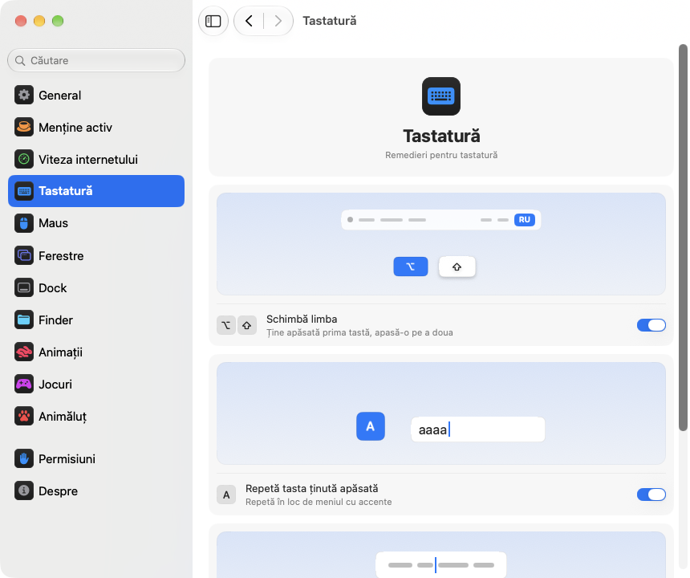

<p align="center"></p>
<h1 align="center">pikapik</h1>
<p align="center">Mici îmbunătățiri pentru tastatură, maus, ferestre și Finder, direct în bara de meniu a Mac-ului tău.</p>
<p align="center"><sub><a href="../../README.md">English</a> · <a href="README.ru.md">Русский</a> · <a href="README.uk.md">Українська</a> · <a href="README.de.md">Deutsch</a> · <a href="README.fr.md">Français</a> · <a href="README.es.md">Español</a> · <a href="README.it.md">Italiano</a> · <a href="README.pt-BR.md">Português (Brasil)</a> · <a href="README.ja.md">日本語</a> · <a href="README.zh-Hans.md">简体中文</a> · <a href="README.ko.md">한국어</a> · <b>Română</b> · <a href="README.pl.md">Polski</a> · <a href="README.tr.md">Türkçe</a> · <a href="README.nl.md">Nederlands</a> · <a href="README.sv.md">Svenska</a> · <a href="README.cs.md">Čeština</a> · <a href="README.zh-Hant.md">繁體中文</a> · <a href="README.ar.md">العربية</a> · <a href="README.hi.md">हिन्दी</a> · <a href="README.id.md">Bahasa Indonesia</a> · <a href="README.vi.md">Tiếng Việt</a> · <a href="README.th.md">ไทย</a></sub></p>

<p align="center">
<picture>
<source media="(prefers-color-scheme: dark)" srcset="../media/settings-ro-dark.png">

</picture>
</p>

## Instalare

```bash
brew install --cask dev-pikapik/pika-tools/pikapik && open -a pikapik
```

pikapik apare în bara de meniu, sus pe ecran. Totul rămâne oprit până îl pornești tu.

<details>
<summary>Nu ai Homebrew? Încă două variante</summary>

Fără Homebrew, deschide Terminal, lipește această linie și apasă Retur:

```bash
/bin/bash -c "$(curl -fsSL https://raw.githubusercontent.com/dev-pikapik/pika-tools/main/install.sh)"
```

Sau descarcă [pikapik.dmg](https://github.com/dev-pikapik/pika-tools/releases/latest/download/pikapik.dmg), deschide-l și trage aplicația în dosarul Aplicații.

Atât Homebrew, cât și scriptul pun aplicația în `/Applications`, o pornesc, cer permisiunile și activează deschiderea la autentificare. După aceea, aplicația se actualizează singură, vezi **Actualizări**. Pentru a o elimina, vezi **Dezinstalare**.

</details>

## Ce face

<table>
<tbody><tr>
<td width="50%" valign="top">
<picture><source media="(prefers-color-scheme: dark)" srcset="../media/keep-awake-dark.png"></picture>
<br><b>Rămâi treaz</b>
<br>Mac-ul rămâne treaz cât ai nevoie, chiar și cu capacul închis.
</td>
<td width="50%" valign="top">
<picture><source media="(prefers-color-scheme: dark)" srcset="../media/command-keys-dark.png"></picture>
<br><b>Protejarea ⌘Q și ⌘W</b>
<br>Nimic nu se închide din greșeală. Adaugă ⇧ când chiar vrei.
</td>
</tr></tbody>
<tbody><tr>
<td width="50%" valign="top">
<picture><source media="(prefers-color-scheme: dark)" srcset="../media/compress-dark.png"></picture>
<br><b>Copie mai mică</b>
<br>Clic dreapta pe o poză, un PDF sau un video, și alături apare o copie mai ușoară.
</td>
<td width="50%" valign="top">
<picture><source media="(prefers-color-scheme: dark)" srcset="../media/convert-dark.png"></picture>
<br><b>Conversie</b>
<br>Salvează o imagine, un video sau o melodie în alt format din meniul de clic dreapta.
</td>
</tr></tbody>
<tbody><tr>
<td width="50%" valign="top">
<picture><source media="(prefers-color-scheme: dark)" srcset="../media/input-switch-dark.png"></picture>
<br><b>Schimbă limba</b>
<br>Ține apăsat ⌥ și apasă ⇧ ca să schimbi limba tastaturii.
</td>
<td width="50%" valign="top">
<picture><source media="(prefers-color-scheme: dark)" srcset="../media/quit-on-close-dark.png"></picture>
<br><b>Ieșire cu ultima fereastră</b>
<br>Închide ultima fereastră a unei aplicații, și se închide și aplicația.
</td>
</tr></tbody>
<tbody><tr>
<td width="50%" valign="top">
<picture><source media="(prefers-color-scheme: dark)" srcset="../media/window-zoom-dark.png"></picture>
<br><b>Butonul verde mărește</b>
<br>Fereastra umple ecranul fără să treacă pe ecran complet.
</td>
<td width="50%" valign="top">
<picture><source media="(prefers-color-scheme: dark)" srcset="../media/dock-hide-dark.png"></picture>
<br><b>Ascundere cu un clic în Dock</b>
<br>Dă clic pe aplicația în care ești, și se dă la o parte.
</td>
</tr></tbody>
<tbody><tr>
<td width="50%" valign="top">
<picture><source media="(prefers-color-scheme: dark)" srcset="../media/new-file-dark.png"></picture>
<br><b>Fișier nou</b>
<br>Clic dreapta în Finder, un nume, și fișierul gol e gata.
</td>
<td width="50%" valign="top">
<picture><source media="(prefers-color-scheme: dark)" srcset="../media/finder-cut-dark.png"></picture>
<br><b>⌘X mută fișiere</b>
<br>Decupează fișiere în Finder și lipește-le unde vrei.
</td>
</tr></tbody>
<tbody><tr>
<td width="50%" valign="top">
<picture><source media="(prefers-color-scheme: dark)" srcset="../media/finder-open-dark.png"></picture>
<br><b>Enter deschide fișiere</b>
<br>Selectează fișiere în Finder și apasă Enter ca să le deschizi.
</td>
<td width="50%" valign="top">
<picture><source media="(prefers-color-scheme: dark)" srcset="../media/finder-delete-dark.png"></picture>
<br><b>Delete în Coș</b>
<br>Apasă ⌫ în Finder, și fișierele selectate ajung în Coș.
</td>
</tr></tbody>
<tbody><tr>
<td width="50%" valign="top">
<picture><source media="(prefers-color-scheme: dark)" srcset="../media/game-mode-dark.png"></picture>
<br><b>Modul Joc</b>
<br>Cât timp te joci, nimic nu apare peste joc și nimic nu-l închide.
</td>
<td width="50%" valign="top">
<picture><source media="(prefers-color-scheme: dark)" srcset="../media/speed-test-dark.png"></picture>
<br><b>Viteza internetului</b>
<br>Cât de rapid e internetul tău și la ce îți ajunge.
</td>
</tr></tbody>
<tbody><tr>
<td width="50%" valign="top">
<picture><source media="(prefers-color-scheme: dark)" srcset="../media/side-buttons-dark.png"></picture>
<br><b>Butoanele laterale</b>
<br>Butoanele 4 și 5 merg înapoi și înainte, ca un gest pe trackpad.
</td>
<td width="50%" valign="top">
<picture><source media="(prefers-color-scheme: dark)" srcset="../media/wheel-lines-dark.png"></picture>
<br><b>Derulare pe rânduri</b>
<br>Fiecare clic al rotiței derulează la fel, oricât de repede o învârți.
</td>
</tr></tbody>
<tbody><tr>
<td width="50%" valign="top">
<picture><source media="(prefers-color-scheme: dark)" srcset="../media/wheel-direction-dark.png"></picture>
<br><b>Direcția de derulare</b>
<br>O direcție pentru trackpad, alta pentru maus.
</td>
<td width="50%" valign="top">
<picture><source media="(prefers-color-scheme: dark)" srcset="../media/linear-pointer-dark.png"></picture>
<br><b>Fără accelerarea cursorului</b>
<br>Cursorul merge exact cât mâna ta.
</td>
</tr></tbody>
<tbody><tr>
<td width="50%" valign="top">
<picture><source media="(prefers-color-scheme: dark)" srcset="../media/key-repeat-dark.png"></picture>
<br><b>Repetă tasta ținută apăsată</b>
<br>Ține o tastă apăsată ca s-o repeți, fără meniul de accente.
</td>
<td width="50%" valign="top">
<picture><source media="(prefers-color-scheme: dark)" srcset="../media/home-end-dark.png"></picture>
<br><b>Home și End</b>
<br>Sari la începutul sau la sfârșitul rândului în timp ce scrii.
</td>
</tr></tbody>
<tbody><tr>
<td width="50%" valign="top">
<picture><source media="(prefers-color-scheme: dark)" srcset="../media/animations-dark.png"></picture>
<br><b>Animații</b>
<br>Grăbește Dock-ul, ferestrele și Privirea rapidă, până la instantaneu.
</td>
<td width="50%" valign="top">
<picture><source media="(prefers-color-scheme: dark)" srcset="../media/leftover-permissions-dark.png"></picture>
<br><b>Permisiunile aplicațiilor șterse</b>
<br>Elimină permisiunile pe care macOS le păstrează pentru aplicațiile deja șterse.
</td>
</tr></tbody>
<tbody><tr>
<td width="50%" valign="top">
<picture><source media="(prefers-color-scheme: dark)" srcset="../media/pet-dark.png"></picture>
<br><b>Animăluț pe birou</b>
<br>Un mic prieten se plimbă în spatele ferestrelor. Ia-l și aruncă-l sau apasă Spațiu ca să sară.
</td>
</tr></tbody>
</table>

## Mai multe detalii

<details>
<summary>Prima pornire</summary>

pikapik are nevoie de două permisiuni. La prima pornire, deschide configurările pe pagina Permisiuni, care te ghidează pas cu pas, iar macOS afișează propriile solicitări. Mergi la **Configurări sistem › Confidențialitate și securitate** și activează pikapik în:

- **Accesibilitate**, ca aplicația să poată modifica o apăsare de tastă sau un clic înainte să ajungă la alte aplicații.
- **Monitorizare intrare**, ca aplicația să poată vedea apăsările de taste și clicurile.

Aplicația observă schimbarea în câteva secunde, fără repornire.

pikapik nu înregistrează, nu păstrează și nu trimite nimic din ce tastezi sau pe ce dai clic. Evenimentele sunt procesate în memorie și transmise imediat mai departe. Singura cerere în rețea este verificarea actualizărilor, care întreabă GitHub care este cea mai nouă versiune.

</details>

<details>
<summary>Fiecare unealtă în detaliu</summary>

**Protejarea ⌘Q și ⌘W.** ⌘Q și ⌘W singure nu fac nimic, așa că nu închizi din greșeală o aplicație sau o fereastră. Adaugă Shift ca să o faci intenționat: ⇧⌘Q închide aplicația, ⇧⌘W închide fereastra. Funcționează în toate aplicațiile. Fiecare tastă are propriul comutator. Dezactivat implicit.

**Schimbarea limbii cu Opțiune+Shift.** Ține apăsat Opțiune și atinge Shift: macOS trece la următoarea sursă de introducere. Ține în continuare Opțiune și atinge din nou Shift ca să mergi mai departe. Ține apăsat Shift și atinge Opțiune ca să revii. Dacă între timp apeși altă tastă, dai clic sau adaugi Comandă, Control sau Fn, limba nu se schimbă, așa că scurtături precum Opțiune+Shift+săgeată funcționează ca înainte. Dezactivat implicit.

**Repetă tasta ținută apăsată.** Ține apăsată o tastă și litera se scrie din nou și din nou, în loc să apară meniul cu accente. Util în jocuri și când scrii. Aplicațiile deja deschise preiau asta după repornire. Dacă o dezactivezi, macOS se poartă din nou ca de obicei. Dezactivat implicit.

**Home și End la începutul și sfârșitul rândului.** Cât timp scrii, Home duce cursorul la începutul rândului, iar End la sfârșitul lui, în loc să deruleze pagina. Cu ⇧ selectează până acolo, cu ⌘ merg la începutul sau sfârșitul întregului text. În afara câmpurilor de text, precum și în terminale, mașini virtuale și aplicații de desktop la distanță, tastele funcționează ca înainte. Poți adăuga și alte aplicații în care să funcționeze ca de obicei. Implicit dezactivat.

**Dezactivează accelerarea cursorului.** Cursorul se mișcă exact cât mausul, oricât de repede l-ai mișca. Un glisor **Viteză urmărire** stabilește cât de repede merge. Funcționează doar cu mausuri, trackpadul rămâne cum este. Dezactiveaz-o sau închide pikapik, iar macOS își recapătă propriile setări. Dezactivat implicit.

**Derulare pe rânduri.** Fiecare clic al rotiței mausului derulează același număr de rânduri, oricât de repede o rotești. Alege de la 1 la 10 rânduri per clic, implicit 3. Derularea naturală rămâne așa cum ai setat-o în Configurări sistem. Funcționează doar pentru mausuri, trackpadul rămâne cum este. Dezactivat implicit. Lângă cursorul **Distanța per clic**, o pagină mică se derulează pe distanța aleasă, iar un punct marchează valoarea implicită.

Unele aplicații și jocuri măsoară derularea în pixeli exacți: pentru ele, comută aceeași setare pe pixeli și alege între 1 și 200 de pixeli per clic, implicit 40. Cursorul arată și ce parte din înălțimea ecranului reprezintă.

**Direcția de derulare pentru trackpad și maus.** macOS are un singur comutator de derulare naturală, comun pentru trackpad și maus. Activează funcția și alege o direcție pentru fiecare: **Naturală**, în care pagina îți urmează degetele ca pe iPhone, sau **Clasică**, în care pagina se mișcă în sens invers. Alegerea pentru trackpad se aplică și derulării laterale și alunecării după ce ridici degetele. Magic Mouse derulează prin atingere, așa că urmează alegerea pentru trackpad. Alege la fel pe fiecare Mac și derularea va fi la fel peste tot, chiar și când muți mausul pe alt Mac cu Control universal. Dezactivat implicit. Când îl activezi, ambele pornesc ca în Configurări sistem, deci nimic nu se schimbă până nu alegi altceva.

**Butoanele laterale merg înapoi și înainte.** Butoanele 4 și 5 ale mausului merg înapoi și înainte în Finder, Safari și alte aplicații Apple, precum și în multe alte aplicații, la fel ca o glisare pe trackpad. Aplicațiile care tratează singure aceste butoane le primesc așa cum sunt. Dacă mausul tău le are invers, activează **Inversează butoanele laterale**. Dezactivat implicit.

**Ieșire la închiderea ultimei ferestre.** Închide ultima fereastră a unei aplicații, iar aplicația se închide. Finder rămâne deschis, la fel ca aplicațiile cu ferestre pe alte spații de lucru sau în Dock. Poți face o listă de aplicații care nu trebuie să se închidă niciodată așa. Dezactivat implicit.

**Ascundere cu un clic în Dock.** Dă clic pe pictograma din Dock a aplicației în care lucrezi și aceasta se ascunde. Dă clic din nou ca s-o readuci. Dezactivat implicit.

**Butonul verde mărește fereastra.** Dă clic pe butonul verde al unei ferestre, iar ea se mărește până umple ecranul, fără să treacă în ecran complet. Dă clic din nou ca să revii la mărimea de dinainte. Ține apăsat ⌥, iar butonul funcționează ca de obicei. Ecranul complet rămâne în meniul butonului și pe ⌃⌘F. Poți face o listă cu aplicațiile în care butonul verde să funcționeze ca de obicei. Dezactivat implicit.

**Fișier nou în Finder.** Clic dreapta într-o fereastră Finder sau pe birou, alege **Fișier nou**, scrie un nume și apare un fișier gol. Implicit .txt. Implicit dezactivat.

**Enter deschide fișierele în Finder.** Selectează fișiere într-o fereastră Finder sau pe birou și apasă Return sau Enter: se deschid. F2 sau fn F2 redenumește fișierul selectat. În câmpurile de text, de exemplu când scrii un nume, tastele funcționează ca de obicei. Implicit dezactivat.

**⌘X decupează fișierele în Finder.** Selectează fișiere și apasă ⌘X, deschide folderul dorit și apasă ⌘V: fișierele sunt mutate acolo în loc să fie copiate. ⌘C anulează decuparea. Implicit dezactivat.

**Delete șterge fișierele în Finder.** Selectează fișierele și apasă ⌫ sau ⌦ (fn ⌫ pe laptop): ajung în Coș, la fel ca la ⌘⌫. Cât timp redenumești un fișier, cauți sau scrii în alt câmp, tastele șterg literele ca de obicei. Implicit dezactivat.

**Copie mai mică în Finder.** Clic dreapta pe un fișier în Finder și alege **Creează o copie mai mică**. Alături apare o versiune mai ușoară a unei fotografii, a unui GIF, PDF sau video, adesea de câteva ori mai mică. Sunetul necomprimat, ca WAV sau AIFF, devine un M4A compact. Dacă fișierul nu poate fi mai mic, nu se face nicio copie, iar pikapik îți spune asta. Originalul rămâne neschimbat și nimic nu pleacă de pe Mac. Implicit dezactivat.

**Conversie în Finder.** Clic dreapta pe un fișier în Finder și alege **Convertește în** ca să-l salvezi în alt format: o imagine ca JPEG, PNG, HEIC, GIF, TIFF sau PDF, un video ca MP4, MOV sau doar sunetul, muzica ca M4A, WAV sau AIFF. Originalul rămâne neschimbat și nimic nu pleacă de pe Mac. Se activează separat de copia mai mică. Implicit dezactivat.

**Modul Joc.** Adaugă-ți jocurile și, cât timp joci, Mac-ul nu te scoate din joc. Spotlight, Siri, ⌘Tab, Mission Control și glisările între birouri nu se deschid peste joc, ⌘Q și ⌘W nu îl închid din greșeală, cursorul nu alunecă spre Dock, bara de meniu sau alt ecran, iar ecranul rămâne aprins. Fiecare dintre acestea are propriul comutator pe pagina Jocuri, iar pikapik îți sugerează jocurile pe care le găsește pe Mac. În joc, Control-clic rămâne un clic obișnuit, iar Control cu săgețile nu schimbă desktopul. Recunoaște și Minecraft: adaugă Minecraft Launcher sau CurseForge, iar modul pornește chiar în Minecraft. Ca să ieși dintr-un joc, apasă ⇧⌘Q, iar ca să-i închizi fereastra, ⇧⌘W. ⌥⌘Esc merge mereu. Imediat ce ieși din joc, totul merge ca de obicei. Implicit dezactivat.

Fiecare instrument are propriul comutator în meniu și în configurări.

Pictograma din bara de meniu arată starea dintr-o privire: semnul pikapik când instrumentele funcționează, același semn, dar palid, când totul este dezactivat și un triunghi de avertizare când un instrument este activat, dar lipsesc permisiuni.

Panoul din bara de meniu începe cu doar câteva rânduri. Poți alege ce rânduri arată: apasă butonul cu creion din partea de jos, bifează ce vrei să vezi și apasă **Gata**. Rândurile ascunse continuă să funcționeze și rămân în Configurări. Dacă panoul nu încape pe ecran, poate fi derulat.

Aplicația folosește limba sistemului sau pe cea aleasă în configurări. Sunt disponibile toate cele 23 de limbi din lista de la începutul acestei pagini.

</details>

<details>
<summary>Rămâi treaz</summary>

Împiedică Mac-ul să intre în repaus cât timp nu ești la tastatură: pentru orice durată între 1 secundă și 365 de zile sau până când îl dezactivezi. Activează-l din meniu și setează durata în configurări: scrie zilele, orele, minutele și secundele, folosește ↑ și ↓ sau apasă pe o variantă gata făcută, de la 15 minute la 8 ore. Meniul arată cât timp a mai rămas și când se termină. Pentru **Ecran** sunt două variante. **Mereu aprins**: nu se stinge, fără protector de ecran sau ecran de blocare. **Se stinge ca de obicei**: se stinge după propriul cronometru, iar Mac-ul continuă să lucreze. **Stinge ecranul acum** (și din meniu) stinge ecranul imediat, iar Mac-ul continuă să lucreze: mișcă mouse-ul sau apasă o tastă ca să-l aprinzi la loc. Dacă închizi pikapik, se oprește și Rămâi treaz.

Pe un MacBook poți activa și **Funcționează cu capacul închis**. macOS nu are o opțiune pentru asta, așa că pikapik rulează `pmset -a disablesleep 1` și cere o parolă de administrator: doar un administrator poate schimba modul în care Mac-ul intră în repaus. Configurarea revine singură la normal când se termină Rămâi treaz, când închizi aplicația sau dacă aceasta se blochează. Dacă nu introduci parola, nu se schimbă nimic. Asigură-te că Mac-ul are o ventilație bună cu capacul închis. **Oprește când bateria scade sub 20%** încheie sesiunea înainte să se descarce bateria.

Keep Awake, modurile ecran și capac închis pot fi puse pe un buton în Centrul de control, în bara de meniu sau într-un widget pe desktop prin aplicația Comenzi rapide, cu linkuri copiate din Setări › Menține activ.

</details>

<details>
<summary>Viteza internetului</summary>

Arată cât de rapid e internetul tău acum. Apasă **Verifică viteza** în Setări › Viteza internetului sau **Verifică** în meniu, după ce adaugi rândul cu butonul creion. În circa jumătate de minut vezi descărcarea, încărcarea, ping-ul și reactivitatea: cât de repede răspunde totul când conexiunea e ocupată. Dedesubt scrie simplu la ce e bună: filme în 4K, apeluri video, jocuri online și descărcări mari. Testul folosește networkQuality, inclus în macOS, și serverele Apple. Ultimul rezultat rămâne până la testul următor, iar un link pentru Comenzi rapide îl pornește din Centrul de control.

</details>

<details>
<summary>Configurări</summary>

Deschide configurările din meniu cu **Configurări…** sau ⌘, ori pornește din nou pikapik din Finder, Launchpad sau Spotlight. Cât timp fereastra este deschisă, aplicația apare în Dock și în ⌘Tab.

- **General**: deschidere la autentificare, aspect (Sistem, Luminos sau Întunecat), limbă, actualizări și copie de siguranță: exportă și importă configurările ca fișier sau sincronizează-le prin iCloud Drive.
- **Menține activ**: durată, opțiuni pentru ecran și capac.
- **Viteza internetului**: măsoară conexiunea și arată la ce e bună.
- **Tastatură**: schimbarea limbii, repetarea tastelor, Home și End.
- **Maus**: accelerarea cursorului și viteza de urmărire, derularea pe rânduri, direcția de derulare, butoanele laterale.
- **Ferestre**: mărire cu butonul verde (cu o listă de excepții), protecție pentru ⌘Q și ⌘W, și ieșire la ultima fereastră (cu o listă de excepții).
- **Dock**: ascundere cu un clic în Dock.
- **Finder**: fișier nou, copie mai mică și conversie, deschidere cu Return, decupare cu ⌘X și ștergere cu ⌫.
- **Permisiuni**: starea ambelor permisiuni și a iCloud Drive când sincronizarea este pornită, cu butoane care deschid locul potrivit din Configurări sistem.
- **Despre**: versiune, linkuri către lista de modificări și pentru raportarea unei probleme.

Multe setări au o imagine mică ce arată ce fac, de exemplu un Mac care rămâne treaz sau o fereastră care se ascunde în spatele Dock-ului. Imaginea se schimbă odată cu comutatorul și stă pe loc când „Reducere mișcare” este activată în Configurări sistem.

Fiecare pagină are jos un buton **Restaurează valorile implicite…**. Întreabă mai întâi, apoi dezactivează instrumentele de pe pagina respectivă și le readuce opțiunile, ca și cum pikapik nu le-ar fi atins niciodată.

**Sincronizează configurările cu iCloud** ține pikapik la fel pe toate Mac-urile tale. Configurările stau în folderul pika-tools din iCloud Drive, iar cea mai recentă modificare câștigă. Este dezactivat implicit și are nevoie de iCloud Drive pornit. Permisiunile nu se sincronizează: fiecare Mac le cere separat.

</details>

<details>
<summary>Actualizări</summary>

pikapik caută versiuni noi la pornire și la fiecare 6 ore. Poți dezactiva asta în Configurări › General. Când apare o versiune nouă, în meniu apare butonul **Actualizează la …**: un clic, iar aplicația descarcă actualizarea, o instalează și repornește. Poți verifica și manual cu **Verifică acum** în Configurări › General.

Cu Homebrew poți rula și `brew upgrade --cask pikapik`.

Începând cu versiunea 1.3, permisiunile rămân valabile după actualizări.

</details>

<details>
<summary>Dezinstalare</summary>

```bash
/bin/bash -c "$(curl -fsSL https://raw.githubusercontent.com/dev-pikapik/pika-tools/main/uninstall.sh)"
```

Dacă ai instalat cu Homebrew: `brew uninstall --cask --zap pikapik`.

Ambele închid aplicația, o scot din articolele de autentificare și o șterg. Scriptul îi resetează și permisiunile.

</details>

<details>
<summary>Întrebări frecvente</summary>

**De ce are nevoie de două permisiuni?**
macOS împarte accesul la tastatură și mouse în două. Monitorizarea intrării îi permite aplicației să vadă evenimentele, iar Accesibilitatea îi permite să le modifice. Pentru a bloca o scurtătură e nevoie de amândouă.

**macOS spune că aplicația provine de la un dezvoltator neidentificat.**
pikapik este semnată, dar nu este notarizată de Apple. Homebrew și scriptul de instalare se ocupă de asta în locul tău. Dacă ai folosit dmg-ul, deschide **Configurări sistem › Confidențialitate și securitate** și dă clic pe **Deschide oricum** sau rulează:

```bash
xattr -dr com.apple.quarantine /Applications/pikapik.app
```

**Funcționează pe Mac-uri cu Intel?**
Da. Este o aplicație universală pentru Apple Silicon și Intel, cu macOS 14 Sonoma sau mai nou.

**Permisiunea este activată, dar nu funcționează nimic.**
În **Configurări sistem › Confidențialitate și securitate**, elimină pikapik din ambele liste cu butonul −, apoi adaug-o din nou. Pagina Permisiuni din configurările pikapik are butoane care deschid locul potrivit.

</details>

<p align="center">☕ Dacă îți place pikapik, poți să <a href="https://buymeacoffee.com/pikapik">îmi cumperi o cafea</a> — totul merge în dezvoltarea și întreținerea aplicației.</p>

<p align="center"><sub><a href="../whats-new/README.ro.md">Noutăți</a> · <a href="https://github.com/dev-pikapik/homebrew-pika-tools">Tap Homebrew</a> · <a href="../../CONTRIBUTING.md">Compilează singur</a> · <a href="../../LICENSE">Licență MIT</a> · © 2026 pikapik</sub></p>
