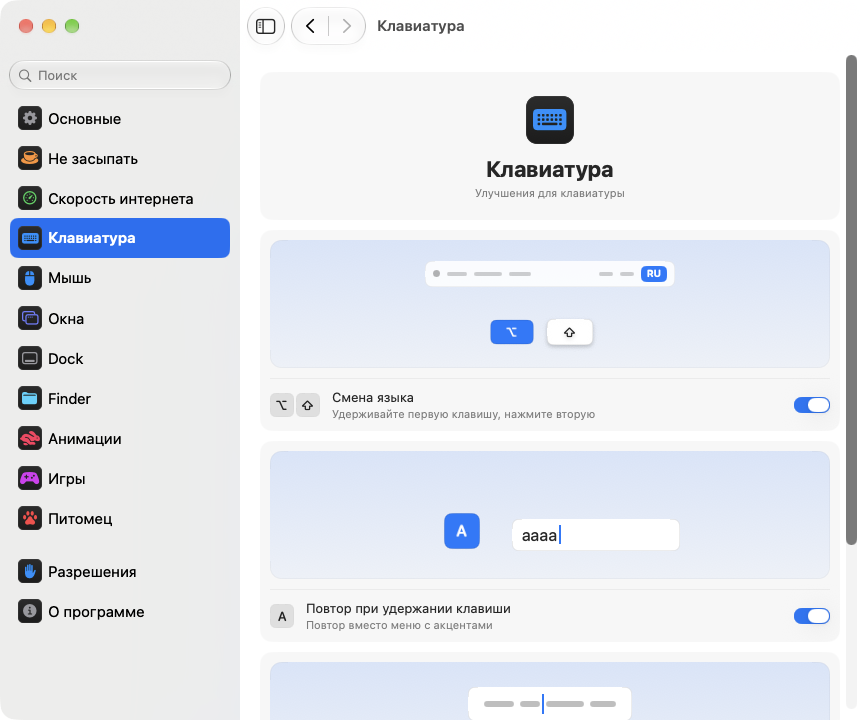

<p align="center"></p>
<h1 align="center">pikapik</h1>
<p align="center">Небольшие улучшения для клавиатуры, мыши, окон и Finder — прямо в строке меню вашего Mac.</p>
<p align="center"><sub><a href="../../README.md">English</a> · <b>Русский</b> · <a href="README.uk.md">Українська</a> · <a href="README.de.md">Deutsch</a> · <a href="README.fr.md">Français</a> · <a href="README.es.md">Español</a> · <a href="README.it.md">Italiano</a> · <a href="README.pt-BR.md">Português (Brasil)</a> · <a href="README.ja.md">日本語</a> · <a href="README.zh-Hans.md">简体中文</a> · <a href="README.ko.md">한국어</a> · <a href="README.ro.md">Română</a> · <a href="README.pl.md">Polski</a> · <a href="README.tr.md">Türkçe</a> · <a href="README.nl.md">Nederlands</a> · <a href="README.sv.md">Svenska</a> · <a href="README.cs.md">Čeština</a> · <a href="README.zh-Hant.md">繁體中文</a> · <a href="README.ar.md">العربية</a> · <a href="README.hi.md">हिन्दी</a> · <a href="README.id.md">Bahasa Indonesia</a> · <a href="README.vi.md">Tiếng Việt</a> · <a href="README.th.md">ไทย</a></sub></p>

<p align="center">
<picture>
<source media="(prefers-color-scheme: dark)" srcset="../media/settings-ru-dark.png">

</picture>
</p>

## Установка

```bash
brew install --cask dev-pikapik/pika-tools/pikapik && open -a pikapik
```

pikapik появится в строке меню вверху экрана. Всё выключено, пока вы сами не включите.

<details>
<summary>Нет Homebrew? Ещё два способа</summary>

Без Homebrew: откройте Терминал, вставьте эту строку и нажмите Return:

```bash
/bin/bash -c "$(curl -fsSL https://raw.githubusercontent.com/dev-pikapik/pika-tools/main/install.sh)"
```

Или скачайте [pikapik.dmg](https://github.com/dev-pikapik/pika-tools/releases/latest/download/pikapik.dmg), откройте его и перетащите приложение в папку «Программы».

Homebrew и скрипт сами кладут приложение в `/Applications`, запускают его, запрашивают разрешения и включают открытие при входе. Дальше приложение обновляется само, см. **Обновления**. Как удалить — в разделе **Удаление**.

</details>

## Что умеет

<table>
<tbody><tr>
<td width="50%" valign="top">
<picture><source media="(prefers-color-scheme: dark)" srcset="../media/keep-awake-dark.png"></picture>
<br><b>Не засыпать</b>
<br>Mac не уснёт, сколько нужно, даже с закрытой крышкой.
</td>
<td width="50%" valign="top">
<picture><source media="(prefers-color-scheme: dark)" srcset="../media/command-keys-dark.png"></picture>
<br><b>Защита ⌘Q и ⌘W</b>
<br>Ничего не закроется случайно. Когда нужно, добавьте ⇧.
</td>
</tr></tbody>
<tbody><tr>
<td width="50%" valign="top">
<picture><source media="(prefers-color-scheme: dark)" srcset="../media/compress-dark.png"></picture>
<br><b>Копия поменьше</b>
<br>Правый клик по фото, PDF или видео — и рядом появится лёгкая копия.
</td>
<td width="50%" valign="top">
<picture><source media="(prefers-color-scheme: dark)" srcset="../media/convert-dark.png"></picture>
<br><b>Конвертация</b>
<br>Сохраните картинку, видео или песню в другом формате прямо из меню правого клика.
</td>
</tr></tbody>
<tbody><tr>
<td width="50%" valign="top">
<picture><source media="(prefers-color-scheme: dark)" srcset="../media/input-switch-dark.png"></picture>
<br><b>Смена языка</b>
<br>Держите ⌥ и нажмите ⇧ — язык клавиатуры сменится.
</td>
<td width="50%" valign="top">
<picture><source media="(prefers-color-scheme: dark)" srcset="../media/quit-on-close-dark.png"></picture>
<br><b>Выход с последним окном</b>
<br>Закрыли последнее окно — приложение тоже закрылось.
</td>
</tr></tbody>
<tbody><tr>
<td width="50%" valign="top">
<picture><source media="(prefers-color-scheme: dark)" srcset="../media/window-zoom-dark.png"></picture>
<br><b>Зелёная кнопка увеличивает</b>
<br>Окно растягивается на весь экран без полноэкранного режима.
</td>
<td width="50%" valign="top">
<picture><source media="(prefers-color-scheme: dark)" srcset="../media/dock-hide-dark.png"></picture>
<br><b>Скрыть кликом в Dock</b>
<br>Кликните по значку приложения, в котором вы сейчас, и оно уйдёт с глаз.
</td>
</tr></tbody>
<tbody><tr>
<td width="50%" valign="top">
<picture><source media="(prefers-color-scheme: dark)" srcset="../media/new-file-dark.png"></picture>
<br><b>Новый файл</b>
<br>Правый клик в Finder, имя — и пустой файл готов.
</td>
<td width="50%" valign="top">
<picture><source media="(prefers-color-scheme: dark)" srcset="../media/finder-cut-dark.png"></picture>
<br><b>⌘X переносит файлы</b>
<br>Вырежьте файлы в Finder и вставьте туда, куда нужно.
</td>
</tr></tbody>
<tbody><tr>
<td width="50%" valign="top">
<picture><source media="(prefers-color-scheme: dark)" srcset="../media/finder-open-dark.png"></picture>
<br><b>Return открывает файлы</b>
<br>Выберите файлы в Finder и нажмите Return, чтобы открыть.
</td>
<td width="50%" valign="top">
<picture><source media="(prefers-color-scheme: dark)" srcset="../media/finder-delete-dark.png"></picture>
<br><b>Delete — в Корзину</b>
<br>Нажмите ⌫ в Finder, и выбранные файлы уйдут в Корзину.
</td>
</tr></tbody>
<tbody><tr>
<td width="50%" valign="top">
<picture><source media="(prefers-color-scheme: dark)" srcset="../media/game-mode-dark.png"></picture>
<br><b>Игровой режим</b>
<br>Пока вы играете, ничто не всплывёт поверх игры и не закроет её.
</td>
<td width="50%" valign="top">
<picture><source media="(prefers-color-scheme: dark)" srcset="../media/speed-test-dark.png"></picture>
<br><b>Скорость интернета</b>
<br>Насколько быстрый у вас интернет и на что его хватит.
</td>
</tr></tbody>
<tbody><tr>
<td width="50%" valign="top">
<picture><source media="(prefers-color-scheme: dark)" srcset="../media/side-buttons-dark.png"></picture>
<br><b>Боковые кнопки мыши</b>
<br>Кнопки 4 и 5 листают назад и вперёд, как свайп.
</td>
<td width="50%" valign="top">
<picture><source media="(prefers-color-scheme: dark)" srcset="../media/wheel-lines-dark.png"></picture>
<br><b>Прокрутка по строкам</b>
<br>Каждый щелчок колёсика прокручивает одинаково, как быстро ни крутите.
</td>
</tr></tbody>
<tbody><tr>
<td width="50%" valign="top">
<picture><source media="(prefers-color-scheme: dark)" srcset="../media/wheel-direction-dark.png"></picture>
<br><b>Направление прокрутки</b>
<br>Одно направление для трекпада, другое для мыши.
</td>
<td width="50%" valign="top">
<picture><source media="(prefers-color-scheme: dark)" srcset="../media/linear-pointer-dark.png"></picture>
<br><b>Без ускорения курсора</b>
<br>Курсор проходит ровно столько, сколько ваша рука.
</td>
</tr></tbody>
<tbody><tr>
<td width="50%" valign="top">
<picture><source media="(prefers-color-scheme: dark)" srcset="../media/key-repeat-dark.png"></picture>
<br><b>Повтор клавиши</b>
<br>Удерживайте клавишу — буква повторяется, без меню с акцентами.
</td>
<td width="50%" valign="top">
<picture><source media="(prefers-color-scheme: dark)" srcset="../media/home-end-dark.png"></picture>
<br><b>Home и End</b>
<br>Переход в начало или конец строки, пока вы печатаете.
</td>
</tr></tbody>
<tbody><tr>
<td width="50%" valign="top">
<picture><source media="(prefers-color-scheme: dark)" srcset="../media/animations-dark.png"></picture>
<br><b>Анимации</b>
<br>Dock, окна и Быстрый просмотр станут быстрее — вплоть до мгновенных.
</td>
<td width="50%" valign="top">
<picture><source media="(prefers-color-scheme: dark)" srcset="../media/leftover-permissions-dark.png"></picture>
<br><b>Разрешения удалённых приложений</b>
<br>Уберите разрешения, которые macOS хранит для уже удалённых приложений.
</td>
</tr></tbody>
</table>

## Подробности

<details>
<summary>Первый запуск</summary>

pikapik нужны два разрешения. При первом запуске откроются настройки на странице «Разрешения», где всё объясняется по шагам, а macOS покажет свои запросы. Откройте **Системные настройки › Конфиденциальность и безопасность** и включите pikapik в двух списках:

- **Универсальный доступ** — чтобы менять нажатие или клик, пока они не дошли до других приложений.
- **Мониторинг ввода** — чтобы вообще видеть нажатия и клики.

Приложение заметит изменения через пару секунд, перезапускать ничего не надо.

pikapik не записывает, не хранит и никуда не отправляет то, что вы печатаете и нажимаете. События обрабатываются в памяти и сразу передаются дальше. Единственный запрос в сеть — проверка обновлений: приложение спрашивает у GitHub, какая версия последняя.

</details>

<details>
<summary>Каждая функция подробно</summary>

**Защита ⌘Q и ⌘W.** Сами по себе ⌘Q и ⌘W ничего не делают, так что вы не закроете приложение или окно случайно. Чтобы сделать это нарочно, добавьте Shift: ⇧⌘Q завершает приложение, ⇧⌘W закрывает окно. Работает во всех приложениях. У каждой клавиши свой переключатель. По умолчанию выключено.

**Смена языка по Option+Shift.** Держите Option и нажмите Shift — macOS включит следующий источник ввода. Не отпуская Option, нажмите Shift ещё раз, чтобы идти дальше. Держите Shift и нажимайте Option, чтобы вернуться назад. Если в это время нажать другую клавишу, кликнуть или добавить Cmd, Ctrl или Fn, язык не сменится, так что сочетания вроде Option+Shift+стрелка работают как раньше. По умолчанию выключено.

**Повтор при удержании клавиши.** Держите клавишу — буква печатается снова и снова, а не всплывает меню с акцентами. Удобно в играх и при наборе текста. Уже открытые программы подхватят это после перезапуска. Выключите — и macOS снова ведёт себя как обычно. По умолчанию выключено.

**Home и End — к началу и концу строки.** Пока вы печатаете, Home ставит курсор в начало строки, а End — в конец, а не прокручивает страницу. С ⇧ они выделяют текст до этого места, с ⌘ переходят к началу или концу всего текста. Вне текстовых полей, а также в терминалах, виртуальных машинах и программах удалённого доступа клавиши работают как раньше. Можно указать и другие приложения, где они должны работать как обычно. По умолчанию выключено.

**Выключить ускорение указателя.** Указатель проходит ровно столько, сколько мышь, как бы быстро вы её ни двигали. Ползунок **Скорость перемещения** задаёт, насколько быстро он движется. Работает только с мышью, трекпад остаётся как есть. Выключите функцию или закройте pikapik — и macOS вернёт свои настройки. По умолчанию выключено.

**Прокрутка по строкам.** Каждый щелчок колесика мыши прокручивает одно и то же число строк, как бы быстро вы ни крутили колесо. Выберите от 1 до 10 строк на щелчок, по умолчанию 3. Естественная прокрутка остаётся такой, как вы задали в Системных настройках. Работает только для мышей, трекпад остаётся как есть. По умолчанию выключено. Рядом с ползунком **Расстояние за щелчок** маленькая страница прокручивается на выбранное расстояние, а точка отмечает значение по умолчанию.

Некоторые приложения и игры считают прокрутку в точных пикселях: для них переключите эту же настройку на пиксели и выберите от 1 до 200 пикселей за щелчок, по умолчанию 40. Ползунок ещё показывает, какую долю высоты экрана это составляет.

**Направление прокрутки для трекпада и мыши.** В macOS один переключатель естественной прокрутки сразу для трекпада и мыши. Включите эту функцию и выберите направление для каждого: **Естественное**, когда страница идёт за пальцами, как на iPhone, или **Классическое**, где страница движется в обратную сторону. Выбор для трекпада действует и на прокрутку вбок, и на докат страницы после того, как вы отпустили пальцы. Magic Mouse прокручивает касанием, поэтому идёт по выбору для трекпада. Выберите одно и то же на всех своих Mac, и прокрутка будет одинаковой везде, даже когда вы переводите мышь на другой Mac через Универсальное управление. По умолчанию выключено. При включении оба выбора такие же, как в Системных настройках, так что ничего не меняется, пока вы не выберете другое.

**Боковые кнопки — назад и вперёд.** Кнопки мыши 4 и 5 работают как «назад» и «вперёд» в Finder, Safari и других приложениях Apple и во многих других программах, как смахивание на трекпаде. Приложения, которые сами обрабатывают эти кнопки, получают их без изменений. Если на вашей мыши они перепутаны, включите **Поменять боковые кнопки местами**. По умолчанию выключено.

**Выход после закрытия последнего окна.** Закрыли последнее окно приложения — приложение завершается. Finder остаётся открытым, как и приложения, у которых есть окна на других рабочих столах или в Dock. Можно составить список приложений, которые так никогда не завершаются. По умолчанию выключено.

**Скрытие кликом в Dock.** Кликните по значку в Dock того приложения, в котором работаете, — оно скроется. Ещё клик — вернётся. По умолчанию выключено.

**Зелёная кнопка увеличивает окно.** Кликните по зелёной кнопке окна — оно заполнит экран, не переходя в полный экран. Ещё клик — вернётся прежний размер. Если держать ⌥, кнопка работает как обычно. Полный экран остаётся в меню кнопки и на ⌃⌘F. Можно составить список приложений, где зелёная кнопка должна работать как обычно. По умолчанию выключено.

**Новый файл в Finder.** Правый клик в окне Finder или на рабочем столе › **Новый файл**, введите имя — и появится пустой файл. По умолчанию .txt. По умолчанию выключено.

**Enter открывает файлы в Finder.** Выделите файлы в окне Finder или на рабочем столе и нажмите Return или Enter — они откроются. F2 или fn F2 переименовывает выделенный файл. В текстовых полях, например когда вы вводите имя, клавиши работают как обычно. По умолчанию выключено.

**⌘X вырезает файлы в Finder.** Выделите файлы и нажмите ⌘X, откройте нужную папку и нажмите ⌘V — файлы переместятся туда, а не скопируются. ⌘C отменяет вырезание. По умолчанию выключено.

**Delete и ⌫ удаляют файлы в Finder.** Выделите файлы и нажмите ⌫ или ⌦ (fn ⌫ на ноутбуке) — они уйдут в Корзину, как по ⌘⌫. Пока вы переименовываете файл, ищете или печатаете в любом другом поле, клавиши стирают буквы как обычно. По умолчанию выключено.

**Копия поменьше в Finder.** Правый клик по файлу в Finder › **Сделать копию поменьше** — рядом появится облегчённая версия фото, GIF, PDF или видео, часто в разы меньше. Несжатый звук вроде WAV или AIFF станет компактным M4A. Если файл меньше уже не сделать, копия не появится, и pikapik об этом скажет. Оригинал остаётся как был, ничего не уходит с вашего Mac. По умолчанию выключено.

**Конвертация в Finder.** Правый клик по файлу в Finder › **Конвертировать в** — файл сохранится в другом формате: картинка в JPEG, PNG, HEIC, GIF, TIFF или PDF, видео в MP4, MOV или только звук, музыка в M4A, WAV или AIFF. Оригинал остаётся как был, ничего не уходит с вашего Mac. Включается отдельно от копии поменьше. По умолчанию выключено.

**Игровой режим.** Добавьте свои игры — и пока вы играете, Mac не выдёргивает вас из игры. Spotlight, Siri, ⌘Tab, Mission Control и смахивания между рабочими столами не открываются поверх игры, ⌘Q и ⌘W не закрывают её случайно, курсор не уезжает на Dock, строку меню или другой экран, а экран не гаснет. У каждого из этих пунктов свой переключатель на странице «Игры», а ещё pikapik подскажет игры, которые нашёл на вашем Mac. В игре Ctrl-клик остаётся простым кликом, а Ctrl со стрелками не переключает рабочий стол. Minecraft тоже узнаётся: добавьте Minecraft Launcher или CurseForge, и режим будет включаться в самом Minecraft. Чтобы выйти из игры, нажмите ⇧⌘Q, а чтобы закрыть её окно — ⇧⌘W. ⌥⌘Esc работает всегда. Как только вы вышли из игры, всё работает как обычно. По умолчанию выключено.

У каждого инструмента свой переключатель в меню и в настройках.

Значок в строке меню сразу показывает состояние: знак pikapik — инструменты работают, тот же знак, но бледный — всё выключено, предупреждающий треугольник — инструмент включён, но не хватает разрешений.

Панель в строке меню сначала показывает всего несколько строк. Какие именно, выбираете вы сами: нажмите кнопку с карандашом внизу, отметьте галочками нужное и нажмите **Готово**. Скрытые строки продолжают работать и остаются в Настройках. Если панель не помещается на экране, её можно прокручивать.

Приложение говорит на языке системы или на том, который вы выберете в настройках. Доступны все 23 языка из списка в начале этой страницы.

</details>

<details>
<summary>Не засыпать</summary>

Не даёт Mac уснуть, пока вас нет за клавиатурой: на любое время от 1 секунды до 365 суток или пока вы не выключите. Включается в меню, а длительность задаётся в настройках: введите дни, часы, минуты и секунды, нажимайте ↑ и ↓ или выберите готовый вариант от 15 минут до 8 часов. В меню видно, сколько осталось и когда закончится. В строке **Экран** два варианта. **Всегда включён**: экран не гаснет, без заставки и экрана блокировки. **Гаснет как обычно**: экран гаснет по своему таймеру, а Mac работает. Кнопка **Выключить экран сейчас** (она есть и в меню) сразу гасит экран, а Mac продолжает работать: чтобы вернуть экран, подвигайте мышью или нажмите любую клавишу. Если завершить pikapik, режим тоже выключится.

На MacBook можно включить и **Работать с закрытой крышкой**. В macOS нет такого переключателя, поэтому pikapik выполняет `pmset -a disablesleep 1` и просит пароль администратора: менять режим сна Mac может только администратор. Настройка сама возвращается в обычное состояние, когда режим заканчивается, когда вы завершаете приложение или если оно аварийно закроется. Если не ввести пароль, ничего не изменится. Следите, чтобы Mac с закрытой крышкой не перегревался. **Остановить при заряде ниже 20 %** выключает режим раньше, чем сядет аккумулятор.

«Не засыпать», режимы дисплея и закрытой крышки можно вынести на кнопку в Пункте управления, строке меню или виджет на рабочем столе через приложение «Быстрые команды»; ссылки можно скопировать в Настройках › Не засыпать.

</details>

<details>
<summary>Скорость интернета</summary>

Показывает, насколько быстрый интернет прямо сейчас. Нажмите **Проверить скорость** в Настройках › Скорость интернета или **Проверить** в меню, если добавили туда строку кнопкой с карандашом. Примерно через полминуты видно скорость загрузки и отдачи, пинг и отзывчивость: как быстро всё откликается, пока интернет занят. Ниже простыми словами сказано, для чего его хватит: фильмы в 4K, видеозвонки, онлайн-игры и большие файлы. Проверка идёт через встроенную в macOS программу networkQuality и серверы Apple. Последний результат сохраняется до следующей проверки, а ссылка для «Быстрых команд» запускает её из Пункта управления.

</details>

<details>
<summary>Настройки</summary>

Откройте настройки из меню кнопкой **Настройки…** или сочетанием ⌘, — либо просто запустите pikapik ещё раз из Finder, Launchpad или Spotlight. Пока окно открыто, приложение видно в Dock и в ⌘Tab.

- **Основные**: открытие при входе, оформление (как в системе, светлое или тёмное), язык, обновления и резервная копия: экспорт и импорт настроек файлом или синхронизация через iCloud Drive.
- **Не засыпать**: длительность, экран и крышка.
- **Скорость интернета**: проверка скорости и для чего её хватит.
- **Клавиатура**: смена языка, повтор клавиш, Home и End.
- **Мышь**: ускорение указателя и скорость перемещения, прокрутка по строкам, направление прокрутки, боковые кнопки.
- **Окна**: увеличение окна зелёной кнопкой (со списком исключений), защита ⌘Q и ⌘W и выход после последнего окна (со списком исключений).
- **Dock**: скрытие кликом в Dock.
- **Finder**: новый файл, копия поменьше и конвертация, открытие клавишей Return, вырезание клавишами ⌘X и удаление в Корзину клавишей ⌫.
- **Разрешения**: состояние обоих разрешений, при включённой синхронизации ещё и iCloud Drive, и кнопки, которые открывают нужное место в Системных настройках.
- **О программе**: версия, ссылки на список изменений и на сообщение о проблеме.

У многих настроек есть небольшая картинка, которая показывает, что они делают: например, Mac, который не засыпает, или окно, прячущееся за Dock. Картинка меняется вместе с переключателем и замирает, если в Системных настройках включено «Уменьшить движение».

На каждой странице внизу есть кнопка **Восстановить настройки по умолчанию…**. Сначала она спросит, а затем выключит инструменты на этой странице и вернёт их параметры, как будто pikapik их и не трогал.

**Синхронизировать настройки через iCloud** делает pikapik одинаковым на всех ваших Mac. Настройки лежат в папке pika-tools в iCloud Drive, и побеждает самое свежее изменение. По умолчанию выключено, нужен включённый iCloud Drive. Разрешения не синхронизируются: каждый Mac запрашивает их сам.

</details>

<details>
<summary>Обновления</summary>

pikapik проверяет новые версии при запуске и каждые 6 часов. Это можно выключить в «Настройки › Основные». Когда выходит новая версия, в меню появляется кнопка **Обновить до …**: один клик — и приложение скачает обновление, установит его и перезапустится. Проверить вручную можно кнопкой **Проверить** в «Настройки › Основные».

Если вы ставили через Homebrew, можно также выполнить `brew upgrade --cask pikapik`.

Начиная с версии 1.3 разрешения сохраняются после обновлений.

</details>

<details>
<summary>Удаление</summary>

```bash
/bin/bash -c "$(curl -fsSL https://raw.githubusercontent.com/dev-pikapik/pika-tools/main/uninstall.sh)"
```

Если ставили через Homebrew: `brew uninstall --cask --zap pikapik`.

Обе команды завершают приложение, убирают его из объектов входа и удаляют. Скрипт ещё и сбрасывает его разрешения.

</details>

<details>
<summary>Вопросы и ответы</summary>

**Зачем два разрешения?**
macOS делит доступ к клавиатуре и мыши на две части. Мониторинг ввода позволяет видеть события, Универсальный доступ — менять их. Чтобы заблокировать сочетание, нужны оба.

**macOS пишет, что приложение от неустановленного разработчика.**
pikapik подписано, но не нотаризовано Apple. Homebrew и скрипт установки решают это сами. Если вы ставили из dmg, откройте **Системные настройки › Конфиденциальность и безопасность** и нажмите **Все равно открыть** или выполните:

```bash
xattr -dr com.apple.quarantine /Applications/pikapik.app
```

**Работает ли на Mac с Intel?**
Да. Это универсальное приложение для Apple Silicon и Intel, нужна macOS 14 Sonoma или новее.

**Разрешение включено, но ничего не работает.**
В **Системных настройках › Конфиденциальность и безопасность** удалите pikapik из обоих списков кнопкой −, затем добавьте снова. На странице «Разрешения» в настройках pikapik есть кнопки, которые открывают нужное место.

</details>

<p align="center">☕ Если pikapik вам нравится, можете <a href="https://buymeacoffee.com/pikapik">угостить меня кофе</a> — всё пойдёт на развитие и поддержку приложения.</p>

<p align="center"><sub><a href="../whats-new/README.ru.md">Что нового</a> · <a href="https://github.com/dev-pikapik/homebrew-pika-tools">Тап Homebrew</a> · <a href="../../CONTRIBUTING.md">Сборка из исходников</a> · <a href="../../LICENSE">Лицензия MIT</a> · © 2026 pikapik</sub></p>
