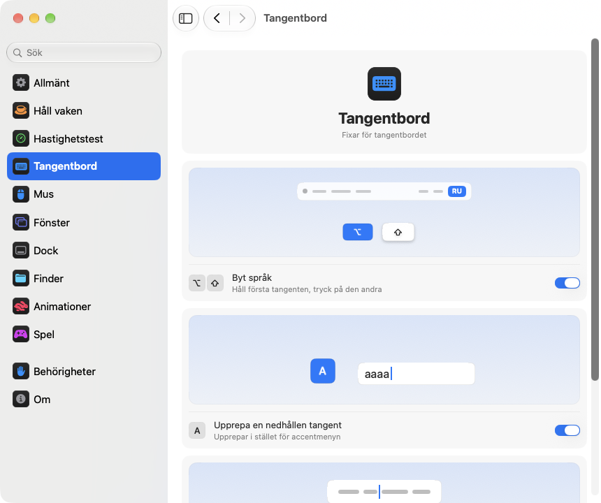

<p align="center"></p>
<h1 align="center">pikapik</h1>
<p align="center">Små förbättringar för tangentbord, mus, fönster och Finder, direkt i menyraden på din Mac.</p>
<p align="center"><sub><a href="../../README.md">English</a> · <a href="README.ru.md">Русский</a> · <a href="README.uk.md">Українська</a> · <a href="README.de.md">Deutsch</a> · <a href="README.fr.md">Français</a> · <a href="README.es.md">Español</a> · <a href="README.it.md">Italiano</a> · <a href="README.pt-BR.md">Português (Brasil)</a> · <a href="README.ja.md">日本語</a> · <a href="README.zh-Hans.md">简体中文</a> · <a href="README.ko.md">한국어</a> · <a href="README.ro.md">Română</a> · <a href="README.pl.md">Polski</a> · <a href="README.tr.md">Türkçe</a> · <a href="README.nl.md">Nederlands</a> · <b>Svenska</b> · <a href="README.cs.md">Čeština</a> · <a href="README.zh-Hant.md">繁體中文</a> · <a href="README.ar.md">العربية</a> · <a href="README.hi.md">हिन्दी</a> · <a href="README.id.md">Bahasa Indonesia</a> · <a href="README.vi.md">Tiếng Việt</a> · <a href="README.th.md">ไทย</a></sub></p>

<p align="center">
<picture>
<source media="(prefers-color-scheme: dark)" srcset="../media/settings-sv-dark.png">

</picture>
</p>

## Installera

```bash
brew install --cask dev-pikapik/pika-tools/pikapik && open -a pikapik
```

pikapik syns i menyraden högst upp på skärmen. Allt är avstängt tills du själv slår på det.

<details>
<summary>Ingen Homebrew? Två andra sätt</summary>

Utan Homebrew: öppna Terminal, klistra in den här raden och tryck på returtangenten:

```bash
/bin/bash -c "$(curl -fsSL https://raw.githubusercontent.com/dev-pikapik/pika-tools/main/install.sh)"
```

Eller hämta [pikapik.dmg](https://github.com/dev-pikapik/pika-tools/releases/latest/download/pikapik.dmg), öppna filen och dra appen till mappen Program.

Både Homebrew och skriptet lägger appen i `/Applications`, öppnar den, ber om behörigheterna och slår på ”Öppna vid inloggning”. Därefter uppdaterar appen sig själv, se **Uppdateringar**. Hur du tar bort den står under **Avinstallera**.

</details>

## Vad den gör

<table>
<tbody><tr>
<td width="50%" valign="top">
<picture><source media="(prefers-color-scheme: dark)" srcset="../media/keep-awake-dark.png"></picture>
<br><b>Håll vaken</b>
<br>Din Mac håller sig vaken så länge du vill, även med locket stängt.
</td>
<td width="50%" valign="top">
<picture><source media="(prefers-color-scheme: dark)" srcset="../media/command-keys-dark.png"></picture>
<br><b>Skydda ⌘Q och ⌘W</b>
<br>Inget avslutas eller stängs av misstag. Lägg till ⇧ när du menar det.
</td>
</tr></tbody>
<tbody><tr>
<td width="50%" valign="top">
<picture><source media="(prefers-color-scheme: dark)" srcset="../media/compress-dark.png"></picture>
<br><b>Mindre kopia</b>
<br>Högerklicka på ett foto, en PDF eller en video, så får du en lättare kopia.
</td>
<td width="50%" valign="top">
<picture><source media="(prefers-color-scheme: dark)" srcset="../media/convert-dark.png"></picture>
<br><b>Konvertering</b>
<br>Spara en bild, en video eller en låt i ett annat format med ett högerklick.
</td>
</tr></tbody>
<tbody><tr>
<td width="50%" valign="top">
<picture><source media="(prefers-color-scheme: dark)" srcset="../media/input-switch-dark.png"></picture>
<br><b>Byt språk</b>
<br>Håll ned ⌥ och tryck på ⇧ för att byta tangentbordsspråk.
</td>
<td width="50%" valign="top">
<picture><source media="(prefers-color-scheme: dark)" srcset="../media/quit-on-close-dark.png"></picture>
<br><b>Avsluta med sista fönstret</b>
<br>Stäng en apps sista fönster, så avslutas appen också.
</td>
</tr></tbody>
<tbody><tr>
<td width="50%" valign="top">
<picture><source media="(prefers-color-scheme: dark)" srcset="../media/window-zoom-dark.png"></picture>
<br><b>Gröna knappen förstorar</b>
<br>Fönstret fyller skärmen utan att gå till helskärm.
</td>
<td width="50%" valign="top">
<picture><source media="(prefers-color-scheme: dark)" srcset="../media/dock-hide-dark.png"></picture>
<br><b>Göm med ett klick i Dock</b>
<br>Klicka på appen du använder, så kliver den åt sidan.
</td>
</tr></tbody>
<tbody><tr>
<td width="50%" valign="top">
<picture><source media="(prefers-color-scheme: dark)" srcset="../media/new-file-dark.png"></picture>
<br><b>Ny fil</b>
<br>Högerklicka i Finder, skriv ett namn, så finns en tom fil där.
</td>
<td width="50%" valign="top">
<picture><source media="(prefers-color-scheme: dark)" srcset="../media/finder-cut-dark.png"></picture>
<br><b>⌘X flyttar filer</b>
<br>Klipp ut filer i Finder och klistra in dem där du vill.
</td>
</tr></tbody>
<tbody><tr>
<td width="50%" valign="top">
<picture><source media="(prefers-color-scheme: dark)" srcset="../media/finder-open-dark.png"></picture>
<br><b>Enter öppnar filer</b>
<br>Markera filer i Finder och tryck på Enter för att öppna dem.
</td>
<td width="50%" valign="top">
<picture><source media="(prefers-color-scheme: dark)" srcset="../media/finder-delete-dark.png"></picture>
<br><b>Delete till papperskorgen</b>
<br>Tryck på ⌫ i Finder, så hamnar de markerade filerna i papperskorgen.
</td>
</tr></tbody>
<tbody><tr>
<td width="50%" valign="top">
<picture><source media="(prefers-color-scheme: dark)" srcset="../media/game-mode-dark.png"></picture>
<br><b>Spelläge</b>
<br>Medan du spelar dyker inget upp över spelet och inget stänger det.
</td>
<td width="50%" valign="top">
<picture><source media="(prefers-color-scheme: dark)" srcset="../media/speed-test-dark.png"></picture>
<br><b>Hastighetstest</b>
<br>Hur snabbt ditt internet är och vad det räcker till.
</td>
</tr></tbody>
<tbody><tr>
<td width="50%" valign="top">
<picture><source media="(prefers-color-scheme: dark)" srcset="../media/side-buttons-dark.png"></picture>
<br><b>Sidoknappar</b>
<br>Knapp 4 och 5 går bakåt och framåt, som ett svep.
</td>
<td width="50%" valign="top">
<picture><source media="(prefers-color-scheme: dark)" srcset="../media/wheel-lines-dark.png"></picture>
<br><b>Rulla per rad</b>
<br>Varje klick på hjulet rullar lika långt, hur snabbt du än snurrar.
</td>
</tr></tbody>
<tbody><tr>
<td width="50%" valign="top">
<picture><source media="(prefers-color-scheme: dark)" srcset="../media/wheel-direction-dark.png"></picture>
<br><b>Rullningsriktning</b>
<br>En riktning för styrplattan, en annan för musen.
</td>
<td width="50%" valign="top">
<picture><source media="(prefers-color-scheme: dark)" srcset="../media/linear-pointer-dark.png"></picture>
<br><b>Ingen pekaracceleration</b>
<br>Pekaren rör sig exakt lika långt som din hand.
</td>
</tr></tbody>
<tbody><tr>
<td width="50%" valign="top">
<picture><source media="(prefers-color-scheme: dark)" srcset="../media/key-repeat-dark.png"></picture>
<br><b>Upprepa en nedhållen tangent</b>
<br>Håll ned en tangent för att skriva den om och om igen, utan accentmeny.
</td>
<td width="50%" valign="top">
<picture><source media="(prefers-color-scheme: dark)" srcset="../media/home-end-dark.png"></picture>
<br><b>Home och End</b>
<br>Hoppa till början eller slutet av raden medan du skriver.
</td>
</tr></tbody>
<tbody><tr>
<td width="50%" valign="top">
<picture><source media="(prefers-color-scheme: dark)" srcset="../media/animations-dark.png"></picture>
<br><b>Animationer</b>
<br>Snabba upp Dock, fönster och Snabbtitt, ända till direkt.
</td>
<td width="50%" valign="top">
<picture><source media="(prefers-color-scheme: dark)" srcset="../media/leftover-permissions-dark.png"></picture>
<br><b>Behörigheter för raderade appar</b>
<br>Ta bort behörigheterna som macOS sparar för appar du redan har raderat.
</td>
</tr></tbody>
</table>

## Mer information

<details>
<summary>Första start</summary>

pikapik behöver två behörigheter. Första gången öppnas inställningarna på sidan Behörigheter, som guidar dig steg för steg, och macOS visar sina egna frågor. Gå till **Systeminställningar › Integritet och säkerhet** och slå på pikapik under:

- **Hjälpmedel**, så att appen kan ändra en tangenttryckning eller ett klick innan det når andra appar.
- **Indataövervakning**, så att appen över huvud taget kan se tangenttryckningar och klick.

Appen märker ändringen inom ett par sekunder, ingen omstart behövs.

pikapik spelar inte in, sparar inte och skickar inte något av det du skriver eller klickar på. Händelser hanteras i minnet och skickas vidare direkt. Den enda nätverksförfrågan är sökningen efter uppdateringar, som frågar GitHub efter den senaste versionen.

</details>

<details>
<summary>Varje verktyg i detalj</summary>

**Skydda ⌘Q och ⌘W.** ⌘Q och ⌘W ensamma gör ingenting, så du avslutar inte en app eller stänger ett fönster av misstag. Lägg till skift för att göra det med flit: ⇧⌘Q avslutar, ⇧⌘W stänger. Fungerar i alla appar. Varje tangent har en egen reglage. Av som standard.

**Byt språk med alternativ+skift.** Håll ned alternativ och tryck på skift: macOS går till nästa inmatningskälla. Fortsätt hålla ned alternativ och tryck på skift igen för att gå vidare. Håll ned skift och tryck på alternativ för att gå tillbaka. Om du under tiden trycker på en annan tangent, klickar eller lägger till kommando, kontroll eller Fn byts inget språk, så kortkommandon som alternativ+skift+pil fungerar som förut. Av som standard.

**Upprepa en nedhållen tangent.** Håll ned en tangent så skrivs bokstaven om och om igen i stället för att accentmenyn visas. Smidigt i spel och när du skriver. Appar som redan är öppna använder det efter en omstart. Stänger du av det fungerar macOS som vanligt igen. Av som standard.

**Home och End till början och slutet av raden.** Medan du skriver flyttar Home markören till början av raden och End till slutet, i stället för att rulla sidan. Med ⇧ markerar de fram dit, med ⌘ går de till början eller slutet av hela texten. Utanför textfält, och i terminaler, virtuella maskiner och appar för fjärrskrivbord, fungerar tangenterna som förut. Du kan lägga till fler appar där de ska fungera som vanligt. Av som standard.

**Stäng av pekaracceleration.** Pekaren rör sig exakt lika långt som musen, hur snabbt du än rör den. Reglaget **Pekarhastighet** ställer in hur snabbt pekaren rör sig. Fungerar bara med möss, styrplattan förblir som den är. Stäng av funktionen eller avsluta pikapik så får macOS tillbaka sina egna inställningar. Av som standard.

**Rulla per rad.** Varje klick med mushjulet rullar lika många rader, hur snabbt du än snurrar på det. Välj från 1 till 10 rader per klick, 3 som standard. Naturlig rullning är kvar som du ställt in den i Systeminställningar. Fungerar bara för möss, styrplattan förblir som den är. Av som standard. Bredvid skjutreglaget **Avstånd per klick** rullar en liten sida det avstånd du väljer, och en prick markerar standardvärdet.

Vissa appar och spel räknar rullning i exakta pixlar: för dem byter du samma inställning till pixlar och väljer 1 till 200 pixlar per klick, 40 som standard. Reglaget visar också hur stor del av skärmhöjden det motsvarar.

**Rullningsriktning för styrplatta och mus.** macOS har en enda inställning för naturlig rullning, både för styrplattan och musen. Slå på det här och välj en riktning för var och en: **Naturlig**, där sidan följer fingrarna som på iPhone, eller **Klassisk**, där sidan rör sig åt andra hållet. Valet för styrplattan gäller också rullning i sidled och glidet efter att du lyft fingrarna. Magic Mouse rullar med beröring och följer därför valet för styrplattan. Välj samma på alla dina Mac så känns rullningen likadan överallt, även när du flyttar musen till en annan Mac med Universell kontroll. Av som standard. När du slår på det börjar båda som i Systeminställningar, så inget ändras förrän du väljer något annat.

**Sidoknapparna går bakåt och framåt.** Musknapp 4 och 5 går bakåt och framåt i Finder, Safari och andra Apple-appar och i många andra appar, som en svepning på styrplattan. Appar som själva hanterar de här knapparna får dem som de är. Sitter de åt andra hållet på din mus slår du på **Byt plats på sidoknapparna**. Av som standard.

**Avsluta när det sista fönstret stängs.** Stäng det sista fönstret i en app så avslutas appen. Finder förblir öppen, liksom appar med fönster på andra skrivbord eller i Dock. Du kan lista appar som aldrig ska avslutas på det här sättet. Av som standard.

**Göm med ett klick i Dock.** Klicka på Dock-symbolen för appen du använder så göms den. Klicka igen för att ta fram den. Av som standard.

**Gröna knappen förstorar fönstret.** Klicka på fönstrets gröna knapp så fyller det skärmen, utan att gå till helskärm. Klicka igen för att få tillbaka den förra storleken. Håll ned ⌥ så fungerar knappen som vanligt. Helskärm finns kvar i knappens meny och på ⌃⌘F. Du kan göra en lista över appar där gröna knappen ska fungera som vanligt. Av som standard.

**Ny fil i Finder.** Högerklicka i ett Finder-fönster eller på skrivbordet, välj **Ny fil**, skriv ett namn och en tom fil dyker upp. .txt som standard. Av som standard.

**Enter öppnar filer i Finder.** Markera filer i ett Finder-fönster eller på skrivbordet och tryck på Return eller Enter, så öppnas de. F2 eller fn F2 byter namn på den markerade filen. I textfält, till exempel när du skriver ett namn, fungerar tangenterna som vanligt. Av som standard.

**⌘X klipper ut filer i Finder.** Markera filer och tryck på ⌘X, öppna mappen du vill ha dem i och tryck på ⌘V, så flyttas filerna dit i stället för att kopieras. ⌘C avbryter utklippningen. Av som standard.

**Delete raderar filer i Finder.** Markera filer och tryck på ⌫ eller ⌦ (fn ⌫ på en bärbar dator), så hamnar de i papperskorgen, precis som med ⌘⌫. Medan du byter namn på en fil, söker eller skriver i något annat fält raderar tangenterna bokstäver som vanligt. Av som standard.

**Mindre kopia i Finder.** Högerklicka på en fil i Finder och välj **Skapa mindre kopia**. Bredvid hamnar en lättare version av ett foto, en GIF, en PDF eller en video, ofta flera gånger mindre. Okomprimerat ljud som WAV eller AIFF blir en kompakt M4A. Om filen inte kan bli mindre skapas ingen kopia, och pikapik säger till. Originalet förblir som det är och inget lämnar din Mac. Av som standard.

**Konvertering i Finder.** Högerklicka på en fil i Finder och välj **Konvertera till** för att spara den i ett annat format: en bild som JPEG, PNG, HEIC, GIF, TIFF eller PDF, en video som MP4, MOV eller bara ljudet, musik som M4A, WAV eller AIFF. Originalet förblir som det är och inget lämnar din Mac. Slås på separat från mindre kopia. Av som standard.

**Spelläge.** Lägg till dina spel, så drar din Mac inte ut dig ur spelet medan du spelar. Spotlight, Siri, ⌘Tab, Mission Control och svep mellan skrivbord öppnas inte ovanpå spelet, ⌘Q och ⌘W stänger det inte av misstag, pekaren glider inte till Dock, menyraden eller en annan skärm, och skärmen förblir på. Var och en av dessa har ett eget reglage på sidan Spel, och pikapik föreslår spel som det hittar på din Mac. I ett spel förblir kontroll-klick ett vanligt klick, och kontroll med pilar byter inte skrivbord. Minecraft känns också igen: lägg till Minecraft Launcher eller CurseForge, så slås läget på i själva Minecraft. Tryck på ⇧⌘Q för att lämna ett spel och på ⇧⌘W för att stänga dess fönster. ⌥⌘Esc fungerar alltid. Så fort du lämnar spelet fungerar allt som vanligt. Av som standard.

Varje verktyg har ett eget reglage i menyn och i inställningarna.

Symbolen i menyraden visar läget med en blick: pikapik-märket när verktygen arbetar, samma märke fast blekt när allt är avstängt och en varningstriangel när ett verktyg är på men behörigheter saknas.

Panelen i menyraden visar först bara några få rader. Du väljer själv vilka som visas: klicka på pennknappen längst ned, markera det du vill se och klicka på **Klar**. Dolda rader fortsätter fungera och finns kvar i Inställningar. Om panelen inte ryms på skärmen går den att scrolla.

Appen följer systemets språk eller det språk du väljer i inställningarna. Appen finns på alla 23 språk i listan högst upp på den här sidan.

</details>

<details>
<summary>Håll vaken</summary>

Hindrar din Mac från att gå i vila medan du är borta från tangentbordet: under valfri tid från 1 sekund till 365 dagar, eller tills du stänger av det. Slå på det i menyn och ställ in tiden i inställningarna: skriv dagar, timmar, minuter och sekunder, använd ↑ och ↓ eller klicka på ett färdigt val från 15 minuter till 8 timmar. Menyn visar hur lång tid som är kvar och när det tar slut. För **Skärm** finns två val. **Alltid på**: den släcks inte, ingen skärmsläckare eller låsskärm. **Stängs av som vanligt**: den stängs av enligt sin egen timer medan din Mac fortsätter arbeta. **Stäng av skärmen nu** (finns även i menyn) släcker skärmen direkt och din Mac fortsätter arbeta: flytta musen eller tryck på en tangent för att få tillbaka den. När du avslutar pikapik avslutas även Håll vaken.

På en MacBook kan du också slå på **Arbeta med locket stängt**. macOS har inget reglage för det, så pikapik kör `pmset -a disablesleep 1` och ber om ett administratörslösenord: bara en administratör kan ändra hur datorn går i vila. Inställningen återställs automatiskt när Håll vaken tar slut, när du avslutar appen eller om den kraschar. Om du inte anger lösenordet ändras ingenting. Se till att datorn har god ventilation med locket stängt. **Stoppa när batteriet är under 20 %** avslutar sessionen innan batteriet tar slut.

Keep Awake, skärmläget och läget med stängt lock kan läggas på en knapp i Kontrollcenter, menyraden eller en widget på skrivbordet via appen Genvägar, med länkar du kopierar från Inställningar › Håll vaken.

</details>

<details>
<summary>Hastighetstest</summary>

Visar hur snabbt ditt internet är just nu. Klicka på **Testa hastigheten** under Inställningar › Hastighetstest, eller på **Testa** i menyn när du har lagt till raden med pennknappen. Efter ungefär en halv minut ser du nedladdning, uppladdning, ping och responsivitet: hur snabbt allt svarar medan anslutningen är upptagen. Under det står med enkla ord vad den räcker till: filmer i 4K, videosamtal, onlinespel och stora nedladdningar. Testet använder networkQuality som finns i macOS och Apples servrar. Det senaste resultatet ligger kvar till nästa test, och en länk för Genvägar startar det från Kontrollcenter.

</details>

<details>
<summary>Inställningar</summary>

Öppna inställningarna från menyn med **Inställningar…** eller ⌘, eller starta pikapik igen från Finder, Launchpad eller Spotlight. Medan fönstret är öppet syns appen i Dock och i ⌘Tab.

- **Allmänt**: öppna vid inloggning, utseende (System, Ljust eller Mörkt), språk, uppdateringar och säkerhetskopia: exportera och importera inställningar som en fil, eller synkronisera dem via iCloud Drive.
- **Håll vaken**: tid, alternativ för skärm och lock.
- **Hastighetstest**: mät internet och se vad det räcker till.
- **Tangentbord**: byte av språk, tangentupprepning, Home och End.
- **Mus**: pekaracceleration och hastighet, rullning per rad, rullningsriktning, sidoknappar.
- **Fönster**: förstora med gröna knappen (med en lista över undantag), skydd för ⌘Q och ⌘W, och avsluta vid sista fönstret (med en lista över undantag).
- **Dock**: göm med ett klick i Dock.
- **Finder**: ny fil, mindre kopia och konvertering, öppna med Retur, klipp ut med ⌘X och radera med ⌫.
- **Behörigheter**: status för båda behörigheterna, och för iCloud Drive när synkronisering är på, med knappar som öppnar rätt ställe i Systeminställningar.
- **Om**: version, länkar till ändringsloggen och för att rapportera ett problem.

Många inställningar har en liten bild som visar vad de gör, till exempel en Mac som förblir vaken eller ett fönster som göms bakom Dock. Bilden ändras tillsammans med reglaget och står stilla när ”Reducera rörelser” är aktiverat i Systeminställningar.

Varje sida har knappen **Återställ förval…** längst ned. Den frågar först, stänger sedan av verktygen på sidan och återställer deras alternativ, som om pikapik aldrig hade rört dem.

**Synkronisera inställningar med iCloud** håller pikapik likadant på alla dina Mac-datorer. Inställningarna ligger i mappen pika-tools i iCloud Drive, och den senaste ändringen gäller. Av som standard, och iCloud Drive måste vara på. Behörigheter synkroniseras inte: varje Mac frågar efter dem själv.

</details>

<details>
<summary>Uppdateringar</summary>

pikapik söker efter nya versioner vid start och var 6:e timme. Du kan stänga av det under Inställningar › Allmänt. När en ny version finns visas knappen **Uppdatera till …** i menyn: ett klick så hämtar appen uppdateringen, installerar den och startar om. Du kan också söka själv med **Sök nu** under Inställningar › Allmänt.

Med Homebrew kan du också köra `brew upgrade --cask pikapik`.

Sedan version 1.3 finns behörigheterna kvar efter uppdateringar.

</details>

<details>
<summary>Avinstallera</summary>

```bash
/bin/bash -c "$(curl -fsSL https://raw.githubusercontent.com/dev-pikapik/pika-tools/main/uninstall.sh)"
```

Om du installerade med Homebrew: `brew uninstall --cask --zap pikapik`.

Båda avslutar appen, tar bort den från inloggningsobjekten och raderar den. Skriptet återställer även appens behörigheter.

</details>

<details>
<summary>Vanliga frågor</summary>

**Varför behövs två behörigheter?**
macOS delar upp åtkomsten till tangentbord och mus i två delar. Indataövervakning låter appen se händelser och Hjälpmedel låter den ändra dem. För att blockera ett kortkommando behövs båda.

**macOS säger att appen kommer från en oidentifierad utvecklare.**
pikapik är signerad men inte notariserad av Apple. Homebrew och installationsskriptet tar hand om det åt dig. Om du använde dmg-filen öppnar du **Systeminställningar › Integritet och säkerhet** och klickar på **Öppna ändå**, eller kör:

```bash
xattr -dr com.apple.quarantine /Applications/pikapik.app
```

**Fungerar den på Mac-datorer med Intel?**
Ja. Det är en universell app för Apple Silicon och Intel, för macOS 14 Sonoma eller senare.

**Behörigheten är på, men ingenting fungerar.**
Ta bort pikapik från båda listorna i **Systeminställningar › Integritet och säkerhet** med knappen − och lägg sedan till den igen. På sidan Behörigheter i pikapik inställningar finns knappar som öppnar rätt ställe.

</details>

<p align="center">☕ Gillar du pikapik får du gärna <a href="https://buymeacoffee.com/pikapik">bjuda mig på en kaffe</a> – allt går till att utveckla och underhålla appen.</p>

<p align="center"><sub><a href="../whats-new/README.sv.md">Nyheter</a> · <a href="https://github.com/dev-pikapik/homebrew-pika-tools">Homebrew-tap</a> · <a href="../../CONTRIBUTING.md">Bygg själv</a> · <a href="../../LICENSE">MIT-licens</a> · © 2026 pikapik</sub></p>
