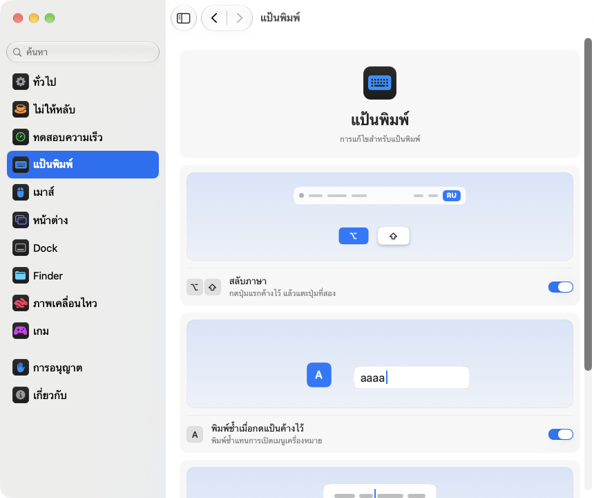

<p align="center"></p>
<h1 align="center">pikapik</h1>
<p align="center">ปรับแต่งเล็กๆ สำหรับแป้นพิมพ์ เมาส์ หน้าต่าง และ Finder ใช้ได้ทันทีจากแถบเมนูของ Mac</p>
<p align="center"><sub><a href="../../README.md">English</a> · <a href="README.ru.md">Русский</a> · <a href="README.uk.md">Українська</a> · <a href="README.de.md">Deutsch</a> · <a href="README.fr.md">Français</a> · <a href="README.es.md">Español</a> · <a href="README.it.md">Italiano</a> · <a href="README.pt-BR.md">Português (Brasil)</a> · <a href="README.ja.md">日本語</a> · <a href="README.zh-Hans.md">简体中文</a> · <a href="README.ko.md">한국어</a> · <a href="README.ro.md">Română</a> · <a href="README.pl.md">Polski</a> · <a href="README.tr.md">Türkçe</a> · <a href="README.nl.md">Nederlands</a> · <a href="README.sv.md">Svenska</a> · <a href="README.cs.md">Čeština</a> · <a href="README.zh-Hant.md">繁體中文</a> · <a href="README.ar.md">العربية</a> · <a href="README.hi.md">हिन्दी</a> · <a href="README.id.md">Bahasa Indonesia</a> · <a href="README.vi.md">Tiếng Việt</a> · <b>ไทย</b></sub></p>

<p align="center">
<picture>
<source media="(prefers-color-scheme: dark)" srcset="../media/settings-th-dark.png">

</picture>
</p>

## การติดตั้ง

```bash
brew install --cask dev-pikapik/pika-tools/pikapik && open -a pikapik
```

หลังติดตั้ง pikapik จะอยู่ในแถบเมนูด้านบนของหน้าจอ ทุกอย่างปิดอยู่จนกว่าคุณจะเปิดเอง

<details>
<summary>ไม่มี Homebrew? ยังมีอีกสองวิธี</summary>

หากไม่ใช้ Homebrew ให้เปิดเทอร์มินัล วางบรรทัดนี้ แล้วกดปุ่ม Return:

```bash
/bin/bash -c "$(curl -fsSL https://raw.githubusercontent.com/dev-pikapik/pika-tools/main/install.sh)"
```

หรือดาวน์โหลด [pikapik.dmg](https://github.com/dev-pikapik/pika-tools/releases/latest/download/pikapik.dmg) เปิดไฟล์ แล้วลากแอปไปไว้ในโฟลเดอร์แอปพลิเคชัน

ทั้ง Homebrew และสคริปต์จะวางแอปไว้ใน `/Applications` เปิดแอป ขอสิทธิ์ และเปิด “เปิดเมื่อเข้าสู่ระบบ” ให้ หลังจากนั้นแอปจะอัปเดตตัวเอง ดู**การอัปเดต** หากต้องการลบ ดู**การถอนการติดตั้ง**

</details>

## ทำอะไรได้บ้าง

<table>
<tbody><tr>
<td width="50%" valign="top">
<picture><source media="(prefers-color-scheme: dark)" srcset="../media/keep-awake-dark.png"></picture>
<br><b>ไม่ให้เข้าสู่โหมดพัก</b>
<br>Mac ตื่นอยู่ได้นานเท่าที่ต้องการ แม้ปิดฝาไว้
</td>
<td width="50%" valign="top">
<picture><source media="(prefers-color-scheme: dark)" srcset="../media/command-keys-dark.png"></picture>
<br><b>ป้องกัน ⌘Q และ ⌘W</b>
<br>ไม่มีอะไรปิดไปโดยไม่ตั้งใจ ถ้าตั้งใจจริงให้กด ⇧ เพิ่ม
</td>
</tr></tbody>
<tbody><tr>
<td width="50%" valign="top">
<picture><source media="(prefers-color-scheme: dark)" srcset="../media/compress-dark.png"></picture>
<br><b>สำเนาที่เล็กลง</b>
<br>คลิกขวาที่รูป PDF หรือวิดีโอ แล้วจะได้สำเนาที่เบากว่าวางอยู่ข้างๆ
</td>
<td width="50%" valign="top">
<picture><source media="(prefers-color-scheme: dark)" srcset="../media/convert-dark.png"></picture>
<br><b>แปลงไฟล์</b>
<br>บันทึกรูป วิดีโอ หรือเพลงเป็นรูปแบบอื่นได้จากเมนูคลิกขวา
</td>
</tr></tbody>
<tbody><tr>
<td width="50%" valign="top">
<picture><source media="(prefers-color-scheme: dark)" srcset="../media/input-switch-dark.png"></picture>
<br><b>สลับภาษา</b>
<br>กด ⌥ ค้างไว้แล้วแตะ ⇧ เพื่อเปลี่ยนภาษาแป้นพิมพ์
</td>
<td width="50%" valign="top">
<picture><source media="(prefers-color-scheme: dark)" srcset="../media/quit-on-close-dark.png"></picture>
<br><b>ปิดแอปพร้อมหน้าต่างสุดท้าย</b>
<br>ปิดหน้าต่างสุดท้ายของแอป แล้วแอปจะปิดตามไปด้วย
</td>
</tr></tbody>
<tbody><tr>
<td width="50%" valign="top">
<picture><source media="(prefers-color-scheme: dark)" srcset="../media/window-zoom-dark.png"></picture>
<br><b>ปุ่มสีเขียวขยายหน้าต่าง</b>
<br>หน้าต่างขยายเต็มจอโดยไม่เข้าโหมดเต็มหน้าจอ
</td>
<td width="50%" valign="top">
<picture><source media="(prefers-color-scheme: dark)" srcset="../media/dock-hide-dark.png"></picture>
<br><b>ซ่อนด้วยการคลิกใน Dock</b>
<br>คลิกแอปที่กำลังใช้อยู่ แล้วแอปจะหลบไป
</td>
</tr></tbody>
<tbody><tr>
<td width="50%" valign="top">
<picture><source media="(prefers-color-scheme: dark)" srcset="../media/new-file-dark.png"></picture>
<br><b>ไฟล์ใหม่</b>
<br>คลิกขวาใน Finder พิมพ์ชื่อ แล้วไฟล์เปล่าก็พร้อมใช้
</td>
<td width="50%" valign="top">
<picture><source media="(prefers-color-scheme: dark)" srcset="../media/finder-cut-dark.png"></picture>
<br><b>⌘X ย้ายไฟล์</b>
<br>ตัดไฟล์ใน Finder แล้ววางไว้ที่ไหนก็ได้
</td>
</tr></tbody>
<tbody><tr>
<td width="50%" valign="top">
<picture><source media="(prefers-color-scheme: dark)" srcset="../media/finder-open-dark.png"></picture>
<br><b>Enter เปิดไฟล์</b>
<br>เลือกไฟล์ใน Finder แล้วกด Enter เพื่อเปิด
</td>
<td width="50%" valign="top">
<picture><source media="(prefers-color-scheme: dark)" srcset="../media/finder-delete-dark.png"></picture>
<br><b>Delete ลงถังขยะ</b>
<br>กด ⌫ ใน Finder แล้วไฟล์ที่เลือกจะไปอยู่ในถังขยะ
</td>
</tr></tbody>
<tbody><tr>
<td width="50%" valign="top">
<picture><source media="(prefers-color-scheme: dark)" srcset="../media/game-mode-dark.png"></picture>
<br><b>โหมดเกม</b>
<br>ระหว่างเล่น จะไม่มีอะไรเด้งขึ้นมาทับเกมหรือปิดเกมไป
</td>
<td width="50%" valign="top">
<picture><source media="(prefers-color-scheme: dark)" srcset="../media/speed-test-dark.png"></picture>
<br><b>ทดสอบความเร็ว</b>
<br>อินเทอร์เน็ตเร็วแค่ไหน และพอสำหรับอะไรบ้าง
</td>
</tr></tbody>
<tbody><tr>
<td width="50%" valign="top">
<picture><source media="(prefers-color-scheme: dark)" srcset="../media/side-buttons-dark.png"></picture>
<br><b>ปุ่มด้านข้างเมาส์</b>
<br>ปุ่ม 4 และ 5 ใช้ย้อนกลับและไปข้างหน้า เหมือนปัดบนแทร็คแพด
</td>
<td width="50%" valign="top">
<picture><source media="(prefers-color-scheme: dark)" srcset="../media/wheel-lines-dark.png"></picture>
<br><b>เลื่อนทีละบรรทัด</b>
<br>หมุนล้อเร็วแค่ไหน แต่ละคลิกก็เลื่อนเท่ากัน
</td>
</tr></tbody>
<tbody><tr>
<td width="50%" valign="top">
<picture><source media="(prefers-color-scheme: dark)" srcset="../media/wheel-direction-dark.png"></picture>
<br><b>ทิศทางการเลื่อน</b>
<br>ทิศหนึ่งสำหรับแทร็คแพด อีกทิศสำหรับเมาส์
</td>
<td width="50%" valign="top">
<picture><source media="(prefers-color-scheme: dark)" srcset="../media/linear-pointer-dark.png"></picture>
<br><b>ปิดความเร่งตัวชี้</b>
<br>ตัวชี้เคลื่อนที่เท่ากับที่มือขยับพอดี
</td>
</tr></tbody>
<tbody><tr>
<td width="50%" valign="top">
<picture><source media="(prefers-color-scheme: dark)" srcset="../media/key-repeat-dark.png"></picture>
<br><b>พิมพ์ซ้ำเมื่อกดแป้นค้างไว้</b>
<br>กดแป้นค้างไว้เพื่อพิมพ์ซ้ำ โดยไม่มีเมนูอักษรพิเศษ
</td>
<td width="50%" valign="top">
<picture><source media="(prefers-color-scheme: dark)" srcset="../media/home-end-dark.png"></picture>
<br><b>Home และ End</b>
<br>กระโดดไปต้นหรือท้ายบรรทัดขณะพิมพ์
</td>
</tr></tbody>
<tbody><tr>
<td width="50%" valign="top">
<picture><source media="(prefers-color-scheme: dark)" srcset="../media/animations-dark.png"></picture>
<br><b>ภาพเคลื่อนไหว</b>
<br>เร่ง Dock หน้าต่าง และดูด่วนให้เร็วขึ้น จนถึงทันที
</td>
<td width="50%" valign="top">
<picture><source media="(prefers-color-scheme: dark)" srcset="../media/leftover-permissions-dark.png"></picture>
<br><b>สิทธิ์ของแอปที่ลบไปแล้ว</b>
<br>ล้างสิทธิ์ที่ macOS ยังเก็บไว้ให้แอปที่คุณลบไปแล้ว
</td>
</tr></tbody>
</table>

## รายละเอียดเพิ่มเติม

<details>
<summary>การเปิดครั้งแรก</summary>

pikapik ต้องใช้สิทธิ์สองอย่าง เมื่อเปิดครั้งแรก แอปจะเปิดการตั้งค่าที่หน้าสิทธิ์ซึ่งจะแนะนำคุณทีละขั้นตอน และ macOS จะแสดงคำขอของตัวเอง ไปที่ **การตั้งค่าระบบ › ความเป็นส่วนตัวและความปลอดภัย** แล้วเปิด pikapik ใน:

- **การช่วยการเข้าถึง** เพื่อให้แอปเปลี่ยนการกดปุ่มหรือการคลิกได้ก่อนที่จะไปถึงแอปอื่น
- **การตรวจติดตามอินพุต** เพื่อให้แอปมองเห็นการกดปุ่มและการคลิกได้

แอปจะตรวจพบการเปลี่ยนแปลงภายในไม่กี่วินาที ไม่ต้องเริ่มการทำงานใหม่

pikapik ไม่บันทึก ไม่เก็บ และไม่ส่งสิ่งที่คุณพิมพ์หรือคลิกไปที่ใด เหตุการณ์ต่างๆ จะได้รับการจัดการในหน่วยความจำและส่งต่อทันที การเชื่อมต่อเครือข่ายเพียงอย่างเดียวคือการตรวจหาอัปเดต ซึ่งจะถาม GitHub ว่ารุ่นล่าสุดคือรุ่นใด

</details>

<details>
<summary>รายละเอียดของทุกเครื่องมือ</summary>

**ป้องกัน ⌘Q และ ⌘W** การกด ⌘Q หรือ ⌘W อย่างเดียวจะไม่เกิดอะไรขึ้น คุณจึงไม่เผลอปิดแอปหรือปิดหน้าต่าง หากตั้งใจจะทำ ให้เพิ่ม Shift: ⇧⌘Q เพื่อปิดแอป ⇧⌘W เพื่อปิดหน้าต่าง ใช้ได้กับทุกแอป แต่ละปุ่มมีสวิตช์ของตัวเอง ปิดอยู่ตามค่าเริ่มต้น

**สลับภาษาด้วย Option+Shift** กด Option ค้างไว้แล้วแตะ Shift: macOS จะเปลี่ยนไปยังแหล่งป้อนข้อมูลถัดไป กด Option ค้างไว้ต่อแล้วแตะ Shift อีกครั้งเพื่อไปต่อ กด Shift ค้างไว้แล้วแตะ Option เพื่อย้อนกลับ หากระหว่างนั้นคุณกดปุ่มอื่น คลิก หรือเพิ่ม Command, Control หรือ Fn ภาษาจะไม่สลับ ปุ่มลัดอย่าง Option+Shift+ลูกศรจึงยังทำงานเหมือนเดิม ปิดอยู่ตามค่าเริ่มต้น

**พิมพ์ซ้ำเมื่อกดแป้นค้างไว้** กดแป้นค้างไว้แล้วตัวอักษรจะพิมพ์ซ้ำไปเรื่อย ๆ แทนที่จะขึ้นเมนูเครื่องหมาย สะดวกทั้งตอนเล่นเกมและตอนพิมพ์ แอปที่เปิดอยู่แล้วจะใช้หลังจากเปิดใหม่ ปิดเมื่อไหร่ macOS ก็กลับมาทำงานแบบเดิม ปิดอยู่ตามค่าเริ่มต้น

**Home และ End ไปต้นและท้ายบรรทัด** ขณะพิมพ์ Home จะย้ายเคอร์เซอร์ไปต้นบรรทัด และ End ไปท้ายบรรทัด แทนการเลื่อนหน้า กดพร้อม ⇧ จะเลือกข้อความถึงตรงนั้น กดพร้อม ⌘ จะไปต้นหรือท้ายของข้อความทั้งหมด นอกช่องข้อความ รวมถึงในเทอร์มินัล เครื่องเสมือน และแอปเดสก์ท็อประยะไกล ปุ่มจะทำงานเหมือนเดิม คุณเพิ่มแอปอื่นที่ต้องการให้ปุ่มทำงานตามปกติได้ ปิดอยู่เป็นค่าเริ่มต้น

**ปิดความเร่งตัวชี้** ตัวชี้จะเลื่อนไปเท่ากับระยะที่เมาส์เลื่อนพอดี ไม่ว่าคุณจะขยับเมาส์เร็วแค่ไหน แถบเลื่อน **ความเร็วการเลื่อนตัวชี้** ใช้กำหนดว่าตัวชี้จะเลื่อนเร็วแค่ไหน ใช้ได้กับเมาส์เท่านั้น แทร็คแพดยังคงเหมือนเดิม เมื่อปิดคุณสมบัตินี้หรือปิด pikapik แล้ว macOS จะกลับไปใช้การตั้งค่าของตัวเอง ปิดอยู่ตามค่าเริ่มต้น

**เลื่อนทีละบรรทัด** ทุกครั้งที่คลิกล้อเมาส์ หน้าจอจะเลื่อนด้วยจำนวนบรรทัดเท่ากันเสมอ ไม่ว่าคุณจะหมุนเร็วแค่ไหน เลือกได้ตั้งแต่ 1 ถึง 10 บรรทัดต่อการคลิก ค่าเริ่มต้นคือ 3 การเลื่อนแบบธรรมชาติยังคงเป็นอย่างที่คุณตั้งไว้ในการตั้งค่าระบบ ใช้ได้กับเมาส์เท่านั้น ส่วนแทร็คแพดยังเหมือนเดิม ปิดอยู่ตามค่าเริ่มต้น ข้างแถบเลื่อน **ระยะต่อคลิก** จะมีหน้าเล็กๆ เลื่อนตามระยะที่เลือก และมีจุดบอกค่าเริ่มต้น

บางแอปและเกมนับการเลื่อนเป็นพิกเซลที่แน่นอน สำหรับแอปเหล่านั้น ให้สลับการตั้งค่าเดียวกันนี้เป็นพิกเซล แล้วเลือก 1 ถึง 200 พิกเซลต่อการคลิก ค่าเริ่มต้นคือ 40 แถบเลื่อนยังบอกด้วยว่าระยะนั้นเป็นสัดส่วนเท่าไรของความสูงหน้าจอ

**ทิศทางการเลื่อนสำหรับแทร็คแพดและเมาส์** macOS มีสวิตช์การเลื่อนแบบธรรมชาติอันเดียวที่ใช้ทั้งแทร็คแพดและเมาส์ เปิดคุณสมบัตินี้แล้วเลือกทิศทางให้แต่ละอย่าง: **แบบธรรมชาติ** ที่หน้าเลื่อนตามนิ้วเหมือนบน iPhone หรือ **แบบคลาสสิก** ที่หน้าเลื่อนไปในทิศตรงข้าม ตัวเลือกของแทร็คแพดมีผลกับการเลื่อนด้านข้างและการไหลต่อหลังยกนิ้วด้วย Magic Mouse เลื่อนด้วยการสัมผัส จึงใช้ตัวเลือกของแทร็คแพด เลือกแบบเดียวกันบน Mac ทุกเครื่องของคุณ แล้วการเลื่อนจะรู้สึกเหมือนกันทุกเครื่อง แม้ตอนย้ายเมาส์ไปยัง Mac อีกเครื่องด้วยการควบคุมจากอุปกรณ์กลาง ปิดอยู่โดยค่าเริ่มต้น เมื่อเปิด ทั้งสองจะเริ่มต้นตามการตั้งค่าระบบ จึงไม่มีอะไรเปลี่ยนจนกว่าคุณจะเลือกแบบอื่น

**ปุ่มด้านข้างใช้ย้อนกลับและไปข้างหน้า** ปุ่มเมาส์ที่ 4 และ 5 ใช้ย้อนกลับและไปข้างหน้าได้ใน Finder, Safari และแอปอื่นๆ ของ Apple รวมถึงแอปอื่นอีกมากมาย เหมือนการปัดบนแทร็คแพด ส่วนแอปที่จัดการปุ่มเหล่านี้เองจะได้รับปุ่มตามเดิม ถ้าเมาส์ของคุณมีปุ่มสลับด้านกัน ให้เปิด **สลับปุ่มด้านข้าง** ปิดอยู่ตามค่าเริ่มต้น

**ปิดแอปเมื่อปิดหน้าต่างสุดท้าย** ปิดหน้าต่างสุดท้ายของแอป แล้วแอปจะปิดไปด้วย ส่วน Finder จะยังเปิดอยู่ รวมถึงแอปที่มีหน้าต่างอยู่บนเดสก์ท็อปอื่นหรือใน Dock คุณสามารถระบุรายชื่อแอปที่ไม่ต้องการให้ปิดด้วยวิธีนี้ได้ ปิดอยู่ตามค่าเริ่มต้น

**ซ่อนด้วยการคลิกใน Dock** คลิกไอคอนใน Dock ของแอปที่คุณกำลังใช้อยู่ แล้วแอปจะถูกซ่อน คลิกอีกครั้งเพื่อแสดงกลับมา ปิดอยู่ตามค่าเริ่มต้น

**ปุ่มสีเขียวขยายหน้าต่าง** คลิกปุ่มสีเขียวของหน้าต่าง หน้าต่างจะขยายเต็มหน้าจอโดยไม่เข้าสู่โหมดเต็มหน้าจอ คลิกอีกครั้งเพื่อกลับเป็นขนาดเดิม กด ⌥ ค้างไว้แล้วปุ่มจะทำงานตามปกติ โหมดเต็มหน้าจอยังอยู่ในเมนูของปุ่มและที่ ⌃⌘F คุณสร้างรายการแอปที่ต้องการให้ปุ่มสีเขียวทำงานตามปกติได้ ปิดอยู่ตามค่าเริ่มต้น

**ไฟล์ใหม่ใน Finder** คลิกขวาในหน้าต่าง Finder หรือบนเดสก์ท็อป เลือก **ไฟล์ใหม่** แล้วพิมพ์ชื่อ ก็จะได้ไฟล์เปล่า ค่าเริ่มต้นเป็น .txt ปิดอยู่เป็นค่าเริ่มต้น

**Enter เปิดไฟล์ใน Finder** เลือกไฟล์ในหน้าต่าง Finder หรือบนเดสก์ท็อปแล้วกด Return หรือ Enter ไฟล์ก็จะเปิด ส่วน F2 หรือ fn F2 จะเปลี่ยนชื่อไฟล์ที่เลือก ในช่องข้อความ เช่นตอนพิมพ์ชื่อ ปุ่มเหล่านี้ทำงานตามปกติ ปิดอยู่เป็นค่าเริ่มต้น

**⌘X ตัดไฟล์ใน Finder** เลือกไฟล์แล้วกด ⌘X จากนั้นเปิดโฟลเดอร์ปลายทางแล้วกด ⌘V ไฟล์จะถูกย้ายไปที่นั่นแทนการคัดลอก ส่วน ⌘C จะยกเลิกการตัด ปิดอยู่เป็นค่าเริ่มต้น

**Delete ลบไฟล์ใน Finder** เลือกไฟล์แล้วกด ⌫ หรือ ⌦ (fn ⌫ บนแล็ปท็อป) ไฟล์จะไปที่ถังขยะ เหมือนกด ⌘⌫ ขณะเปลี่ยนชื่อไฟล์ ค้นหา หรือพิมพ์ในช่องอื่น ปุ่มจะลบตัวอักษรตามปกติ ปิดอยู่เป็นค่าเริ่มต้น

**สำเนาที่เล็กลงใน Finder** คลิกขวาที่ไฟล์ใน Finder แล้วเลือก **สร้างสำเนาที่เล็กลง** รูปภาพ GIF PDF หรือวิดีโอเวอร์ชันที่เบากว่าจะถูกบันทึกไว้ข้าง ๆ ซึ่งมักเล็กลงหลายเท่า เสียงที่ไม่บีบอัด เช่น WAV หรือ AIFF จะกลายเป็น M4A ขนาดเล็ก ถ้าไฟล์เล็กลงอีกไม่ได้ จะไม่มีการสร้างสำเนา และ pikapik จะบอกให้คุณรู้ ต้นฉบับยังอยู่เหมือนเดิม และไม่มีอะไรออกจาก Mac ของคุณ ปิดอยู่เป็นค่าเริ่มต้น

**แปลงไฟล์ใน Finder** คลิกขวาที่ไฟล์ใน Finder แล้วเลือก **แปลงเป็น** เพื่อบันทึกเป็นรูปแบบอื่น: รูปภาพเป็น JPEG, PNG, HEIC, GIF, TIFF หรือ PDF วิดีโอเป็น MP4, MOV หรือเฉพาะเสียง เพลงเป็น M4A, WAV หรือ AIFF ต้นฉบับยังอยู่เหมือนเดิม และไม่มีอะไรออกจาก Mac ของคุณ เปิดแยกจากสำเนาที่เล็กลงได้ ปิดอยู่เป็นค่าเริ่มต้น

**โหมดเกม** เพิ่มเกมของคุณ แล้วระหว่างที่คุณเล่น Mac จะไม่ดึงคุณออกจากเกม Spotlight, Siri, ⌘Tab, Mission Control และการปัดระหว่างเดสก์ท็อปจะไม่เปิดทับเกม ⌘Q และ ⌘W จะไม่ปิดเกมโดยไม่ตั้งใจ ตัวชี้จะไม่หลุดไปที่ Dock แถบเมนู หรือหน้าจออื่น และหน้าจอจะเปิดค้างไว้ แต่ละอย่างมีสวิตช์ของตัวเองในหน้าเกม และ pikapik จะแนะนำเกมที่พบใน Mac ของคุณ ในเกม Control-คลิกยังเป็นการคลิกปกติ และ Control กับลูกศรจะไม่สลับเดสก์ท็อป Minecraft ก็รู้จักด้วย เพิ่ม Minecraft Launcher หรือ CurseForge แล้วโหมดจะเปิดเมื่อคุณอยู่ใน Minecraft หากต้องการออกจากเกม ให้กด ⇧⌘Q และหากต้องการปิดหน้าต่างเกม ให้กด ⇧⌘W ส่วน ⌥⌘Esc ใช้ได้เสมอ ทันทีที่คุณออกจากเกม ทุกอย่างจะทำงานตามปกติ ปิดอยู่เป็นค่าเริ่มต้น

เครื่องมือแต่ละอย่างมีสวิตช์ของตัวเองในเมนูและในการตั้งค่า

ไอคอนบนแถบเมนูบอกสถานะได้ในแวบเดียว: สัญลักษณ์ pikapik เมื่อเครื่องมือทำงานอยู่ สัญลักษณ์เดียวกันแต่จางลงเมื่อทุกอย่างปิดอยู่ และสามเหลี่ยมเตือนเมื่อเปิดเครื่องมือไว้แต่ยังขาดสิทธิ์

แผงบนแถบเมนูเริ่มต้นจะแสดงเพียงไม่กี่แถว คุณเลือกได้ว่าจะแสดงแถวใดบ้าง: คลิกปุ่มดินสอด้านล่าง ติ๊กเครื่องหมายถูกที่รายการที่ต้องการเห็น แล้วคลิก **เสร็จสิ้น** แถวที่ซ่อนไว้ยังทำงานต่อไปและยังอยู่ในการตั้งค่า หากแผงสูงเกินหน้าจอ จะเลื่อนดูได้

แอปจะใช้ภาษาของระบบ หรือภาษาที่คุณเลือกในการตั้งค่า รองรับทั้ง 23 ภาษาตามรายการที่ด้านบนของหน้านี้

</details>

<details>
<summary>ไม่ให้เข้าสู่โหมดพัก</summary>

ป้องกันไม่ให้ Mac เข้าสู่โหมดพักขณะที่คุณไม่ได้อยู่หน้าแป้นพิมพ์: นานเท่าใดก็ได้ตั้งแต่ 1 วินาทีถึง 365 วัน หรือจนกว่าคุณจะปิด เปิดได้จากเมนู และตั้งระยะเวลาในการตั้งค่า โดยพิมพ์วัน ชั่วโมง นาที และวินาที กด ↑ และ ↓ หรือคลิกตัวเลือกสำเร็จรูปตั้งแต่ 15 นาทีถึง 8 ชั่วโมง เมนูจะแสดงเวลาที่เหลือและเวลาที่จะสิ้นสุด **หน้าจอ** มีให้เลือกสองแบบ **เปิดตลอด**: หน้าจอไม่ดับ ไม่มีภาพพักหน้าจอและไม่ล็อกหน้าจอ **ปิดตามปกติ**: หน้าจอดับตามตัวจับเวลาของตัวเอง ส่วน Mac ยังทำงานต่อ **ปิดหน้าจอตอนนี้** (มีในเมนูด้วย) จะดับหน้าจอทันทีโดยที่ Mac ยังทำงานต่อ หากต้องการให้หน้าจอกลับมา ให้ขยับเมาส์หรือกดแป้นใดก็ได้ การออกจาก pikapik จะสิ้นสุดโหมดนี้ไปด้วย

บน MacBook คุณยังเปิด **ทำงานต่อเมื่อปิดฝา** ได้ด้วย macOS ไม่มีสวิตช์สำหรับเรื่องนี้ pikapik จึงเรียกใช้ `pmset -a disablesleep 1` และขอรหัสผ่านผู้ดูแลระบบ: เฉพาะผู้ดูแลระบบเท่านั้นที่เปลี่ยนวิธีที่ Mac เข้าสู่โหมดพักได้ การตั้งค่าจะกลับเป็นปกติเองเมื่อโหมดนี้สิ้นสุด เมื่อคุณออกจากแอป หรือหากแอปหยุดทำงานกะทันหัน ถ้าคุณไม่ป้อนรหัสผ่าน จะไม่มีอะไรเปลี่ยนแปลง ดูแลให้ Mac ระบายอากาศได้ดีเมื่อปิดฝา **หยุดเมื่อแบตเตอรี่ต่ำกว่า 20%** จะสิ้นสุดเซสชันก่อนที่แบตเตอรี่จะหมด

Keep Awake โหมดหน้าจอ และโหมดปิดฝา สามารถวางเป็นปุ่มในศูนย์ควบคุม แถบเมนู หรือวิดเจ็ตบนเดสก์ท็อปผ่านแอปคำสั่งลัด โดยคัดลอกลิงก์จากการตั้งค่า › ไม่ให้หลับ

</details>

<details>
<summary>ทดสอบความเร็ว</summary>

แสดงว่าตอนนี้อินเทอร์เน็ตของคุณเร็วแค่ไหน คลิก **ตรวจความเร็ว** ในการตั้งค่า › ทดสอบความเร็ว หรือคลิก **ตรวจ** ในเมนูหลังจากเพิ่มแถวด้วยปุ่มดินสอ ราวครึ่งนาทีคุณจะเห็นความเร็วดาวน์โหลดและอัปโหลด Ping และการตอบสนอง คือทุกอย่างตอบสนองเร็วแค่ไหนขณะที่การเชื่อมต่อใช้งานหนัก ด้านล่างจะบอกด้วยคำง่ายๆ ว่าเหมาะกับอะไร ได้แก่ ภาพยนตร์ 4K วิดีโอคอล เกมออนไลน์ และดาวน์โหลดไฟล์ใหญ่ การตรวจใช้ networkQuality ที่มากับ macOS และเซิร์ฟเวอร์ของ Apple ผลล่าสุดจะอยู่จนถึงการตรวจครั้งถัดไป และลิงก์สำหรับคำสั่งลัดใช้เริ่มการตรวจจากศูนย์ควบคุมได้

</details>

<details>
<summary>การตั้งค่า</summary>

เปิดการตั้งค่าจากเมนูด้วย **การตั้งค่า…** หรือ ⌘, หรือเปิด pikapik อีกครั้งจาก Finder, Launchpad หรือ Spotlight ขณะที่หน้าต่างเปิดอยู่ แอปจะแสดงใน Dock และใน ⌘Tab

- **ทั่วไป**: เปิดเมื่อเข้าสู่ระบบ ลักษณะที่ปรากฏ (ระบบ สว่าง หรือมืด) ภาษา การอัปเดต และการสำรองข้อมูล: ส่งออกและนำเข้าการตั้งค่าเป็นไฟล์ หรือซิงค์ผ่าน iCloud Drive
- **ไม่ให้หลับ**: ระยะเวลา ตัวเลือกจอภาพและฝา
- **ทดสอบความเร็ว**: ตรวจความเร็วอินเทอร์เน็ตและดูว่าเหมาะกับอะไร
- **แป้นพิมพ์**: การสลับภาษา, การกดแป้นค้างเพื่อพิมพ์ซ้ำ, Home และ End
- **เมาส์**: ความเร่งของตัวชี้และความเร็วการเลื่อนตัวชี้, การเลื่อนทีละบรรทัด, ทิศทางการเลื่อน, ปุ่มด้านข้าง
- **หน้าต่าง**: ขยายหน้าต่างด้วยปุ่มสีเขียว (มีรายการข้อยกเว้น), การป้องกัน ⌘Q และ ⌘W และปิดแอปเมื่อปิดหน้าต่างสุดท้าย (มีรายการข้อยกเว้น)
- **Dock**: ซ่อนด้วยการคลิกใน Dock
- **Finder**: ไฟล์ใหม่, สำเนาที่เล็กลงและการแปลง, เปิดด้วย Return, ตัดด้วย ⌘X และลบด้วย ⌫
- **การอนุญาต**: สถานะของสิทธิ์ทั้งสอง และของ iCloud Drive เมื่อเปิดการซิงค์ พร้อมปุ่มที่เปิดตำแหน่งที่ถูกต้องในการตั้งค่าระบบ
- **เกี่ยวกับ**: เวอร์ชัน ลิงก์ไปยังบันทึกการเปลี่ยนแปลงและการรายงานปัญหา

การตั้งค่าหลายอย่างมีภาพเล็ก ๆ ที่แสดงว่าทำอะไร เช่น Mac ที่ไม่หลับ หรือหน้าต่างที่ซ่อนอยู่หลัง Dock ภาพจะเปลี่ยนไปตามสวิตช์ และหยุดนิ่งเมื่อเปิด “ลดการเคลื่อนไหว” ในการตั้งค่าระบบ

ทุกหน้ามีปุ่ม **กู้คืนค่าเริ่มต้น…** อยู่ด้านล่าง ปุ่มนี้จะถามก่อน แล้วจึงปิดเครื่องมือในหน้านั้นและคืนค่าตัวเลือกต่างๆ เหมือนกับว่า pikapik ไม่เคยแตะต้องเลย

**ซิงค์การตั้งค่ากับ iCloud** ช่วยให้ pikapik เหมือนกันบน Mac ทุกเครื่องของคุณ การตั้งค่าจะอยู่ในโฟลเดอร์ pika-tools ใน iCloud Drive และใช้การเปลี่ยนแปลงล่าสุดเป็นหลัก ปิดอยู่ตามค่าเริ่มต้น และต้องเปิด iCloud Drive ไว้ สิทธิ์จะไม่ถูกซิงค์ Mac แต่ละเครื่องจะขอสิทธิ์เอง

</details>

<details>
<summary>การอัปเดต</summary>

pikapik ตรวจหาเวอร์ชันใหม่เมื่อเปิดแอปและทุก 6 ชั่วโมง คุณปิดการตรวจนี้ได้ใน การตั้งค่า › ทั่วไป เมื่อมีเวอร์ชันใหม่ ปุ่ม **อัปเดตเป็น …** จะปรากฏในเมนู: คลิกครั้งเดียว แอปจะดาวน์โหลดอัปเดต ติดตั้ง และเริ่มการทำงานใหม่ คุณยังตรวจเองได้ด้วย **ตรวจสอบเดี๋ยวนี้** ใน การตั้งค่า › ทั่วไป

หากใช้ Homebrew คุณยังเรียกใช้ `brew upgrade --cask pikapik` ได้ด้วย

ตั้งแต่เวอร์ชัน 1.3 สิทธิ์จะยังคงอยู่หลังการอัปเดต

</details>

<details>
<summary>การถอนการติดตั้ง</summary>

```bash
/bin/bash -c "$(curl -fsSL https://raw.githubusercontent.com/dev-pikapik/pika-tools/main/uninstall.sh)"
```

หากติดตั้งด้วย Homebrew: `brew uninstall --cask --zap pikapik`

ทั้งสองวิธีจะปิดแอป เอาแอปออกจากรายการเข้าสู่ระบบ และลบแอป สคริปต์จะรีเซ็ตสิทธิ์ของแอปด้วย

</details>

<details>
<summary>คำถามที่พบบ่อย</summary>

**ทำไมต้องใช้สิทธิ์สองอย่าง**
macOS แบ่งการเข้าถึงแป้นพิมพ์และเมาส์ออกเป็นสองส่วน การตรวจติดตามอินพุตทำให้แอปมองเห็นเหตุการณ์ และการช่วยการเข้าถึงทำให้แอปเปลี่ยนเหตุการณ์ได้ การบล็อกปุ่มลัดต้องใช้ทั้งสองอย่าง

**macOS แจ้งว่าแอปมาจากนักพัฒนาที่ไม่ได้รับการระบุ**
pikapik ได้รับการเซ็นแล้ว แต่ยังไม่ได้รับการรับรอง (notarize) จาก Apple โดย Homebrew และสคริปต์ติดตั้งจะจัดการเรื่องนี้ให้คุณ หากคุณใช้ไฟล์ dmg ให้เปิด **การตั้งค่าระบบ › ความเป็นส่วนตัวและความปลอดภัย** แล้วคลิก **เปิดต่อไป** หรือเรียกใช้:

```bash
xattr -dr com.apple.quarantine /Applications/pikapik.app
```

**ใช้กับ Mac ที่ใช้ Intel ได้ไหม**
ได้ เป็นแอปแบบ Universal สำหรับ Apple silicon และ Intel ใช้กับ macOS 14 Sonoma ขึ้นไป

**เปิดสิทธิ์แล้ว แต่ไม่มีอะไรทำงาน**
ใน **การตั้งค่าระบบ › ความเป็นส่วนตัวและความปลอดภัย** ให้เอา pikapik ออกจากทั้งสองรายการด้วยปุ่ม − แล้วเพิ่มกลับเข้าไปใหม่ หน้าสิทธิ์ในการตั้งค่าของ pikapik มีปุ่มที่เปิดตำแหน่งที่ถูกต้องให้

</details>

<p align="center">☕ ถ้าชอบ pikapik <a href="https://buymeacoffee.com/pikapik">เลี้ยงกาแฟสักแก้วได้นะ</a> ทุกการสนับสนุนจะนำไปพัฒนาและดูแลแอป</p>

<p align="center"><sub><a href="../whats-new/README.th.md">มีอะไรใหม่</a> · <a href="https://github.com/dev-pikapik/homebrew-pika-tools">Homebrew tap</a> · <a href="../../CONTRIBUTING.md">สร้างเอง</a> · <a href="../../LICENSE">สัญญาอนุญาต MIT</a> · © 2026 pikapik</sub></p>
