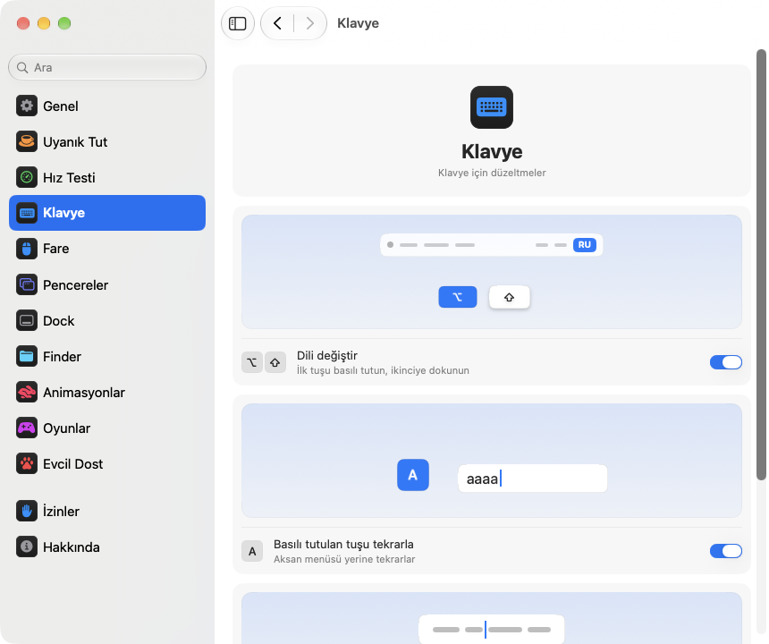

<p align="center"></p>
<h1 align="center">pikapik</h1>
<p align="center">Klavye, fare, pencereler ve Finder için küçük iyileştirmeler, doğrudan Mac’inizin menü çubuğunda.</p>
<p align="center"><sub><a href="../../README.md">English</a> · <a href="README.ru.md">Русский</a> · <a href="README.uk.md">Українська</a> · <a href="README.de.md">Deutsch</a> · <a href="README.fr.md">Français</a> · <a href="README.es.md">Español</a> · <a href="README.it.md">Italiano</a> · <a href="README.pt-BR.md">Português (Brasil)</a> · <a href="README.ja.md">日本語</a> · <a href="README.zh-Hans.md">简体中文</a> · <a href="README.ko.md">한국어</a> · <a href="README.ro.md">Română</a> · <a href="README.pl.md">Polski</a> · <b>Türkçe</b> · <a href="README.nl.md">Nederlands</a> · <a href="README.sv.md">Svenska</a> · <a href="README.cs.md">Čeština</a> · <a href="README.zh-Hant.md">繁體中文</a> · <a href="README.ar.md">العربية</a> · <a href="README.hi.md">हिन्दी</a> · <a href="README.id.md">Bahasa Indonesia</a> · <a href="README.vi.md">Tiếng Việt</a> · <a href="README.th.md">ไทย</a></sub></p>

<p align="center">
<picture>
<source media="(prefers-color-scheme: dark)" srcset="../media/settings-tr-dark.png">

</picture>
</p>

## Kurulum

```bash
brew install --cask dev-pikapik/pika-tools/pikapik && open -a pikapik
```

pikapik ekranın üstündeki menü çubuğunda görünür. Siz açana kadar her şey kapalı kalır.

<details>
<summary>Homebrew yok mu? İki yol daha</summary>

Homebrew olmadan: Terminal’i açın, bu satırı yapıştırın ve Return tuşuna basın:

```bash
/bin/bash -c "$(curl -fsSL https://raw.githubusercontent.com/dev-pikapik/pika-tools/main/install.sh)"
```

Ya da [pikapik.dmg](https://github.com/dev-pikapik/pika-tools/releases/latest/download/pikapik.dmg) dosyasını indirin, açın ve uygulamayı Uygulamalar klasörüne sürükleyin.

Homebrew de betik de uygulamayı `/Applications` klasörüne koyar, açar, izinleri ister ve “Girişte Aç” seçeneğini açar. Bundan sonra uygulama kendini güncel tutar, bkz. **Güncellemeler**. Kaldırmak için bkz. **Kaldırma**.

</details>

## Neler yapar

<table>
<tbody><tr>
<td width="50%" valign="top">
<picture><source media="(prefers-color-scheme: dark)" srcset="../media/keep-awake-dark.png"></picture>
<br><b>Uyanık Tut</b>
<br>Mac’iniz gerektiği kadar uyanık kalır, kapak kapalıyken bile.
</td>
<td width="50%" valign="top">
<picture><source media="(prefers-color-scheme: dark)" srcset="../media/command-keys-dark.png"></picture>
<br><b>⌘Q ve ⌘W’yi koruma</b>
<br>Hiçbir şey yanlışlıkla kapanmaz. Gerçekten istediğinizde ⇧ ekleyin.
</td>
</tr></tbody>
<tbody><tr>
<td width="50%" valign="top">
<picture><source media="(prefers-color-scheme: dark)" srcset="../media/compress-dark.png"></picture>
<br><b>Küçük Kopya</b>
<br>Bir fotoğrafa, PDF’e ya da videoya sağ tıklayın, yanında daha hafif bir kopya belirsin.
</td>
<td width="50%" valign="top">
<picture><source media="(prefers-color-scheme: dark)" srcset="../media/convert-dark.png"></picture>
<br><b>Dönüştürme</b>
<br>Bir resmi, videoyu ya da şarkıyı sağ tıklayarak başka bir biçimde kaydedin.
</td>
</tr></tbody>
<tbody><tr>
<td width="50%" valign="top">
<picture><source media="(prefers-color-scheme: dark)" srcset="../media/input-switch-dark.png"></picture>
<br><b>Dili değiştir</b>
<br>⌥ tuşunu basılı tutup ⇧ tuşuna dokunun, klavye dili değişsin.
</td>
<td width="50%" valign="top">
<picture><source media="(prefers-color-scheme: dark)" srcset="../media/quit-on-close-dark.png"></picture>
<br><b>Son pencereyle çıkış</b>
<br>Bir uygulamanın son penceresini kapatın, uygulama da kapansın.
</td>
</tr></tbody>
<tbody><tr>
<td width="50%" valign="top">
<picture><source media="(prefers-color-scheme: dark)" srcset="../media/window-zoom-dark.png"></picture>
<br><b>Yeşil düğme büyütür</b>
<br>Pencere tam ekrana geçmeden ekranı doldurur.
</td>
<td width="50%" valign="top">
<picture><source media="(prefers-color-scheme: dark)" srcset="../media/dock-hide-dark.png"></picture>
<br><b>Dock’ta tıklayarak gizleme</b>
<br>Kullandığınız uygulamaya tıklayın, kenara çekilsin.
</td>
</tr></tbody>
<tbody><tr>
<td width="50%" valign="top">
<picture><source media="(prefers-color-scheme: dark)" srcset="../media/new-file-dark.png"></picture>
<br><b>Yeni Dosya</b>
<br>Finder’da sağ tıklayın, bir ad yazın, boş dosya hazır.
</td>
<td width="50%" valign="top">
<picture><source media="(prefers-color-scheme: dark)" srcset="../media/finder-cut-dark.png"></picture>
<br><b>⌘X dosyaları taşır</b>
<br>Finder’da dosyaları kesin ve istediğiniz yere yapıştırın.
</td>
</tr></tbody>
<tbody><tr>
<td width="50%" valign="top">
<picture><source media="(prefers-color-scheme: dark)" srcset="../media/finder-open-dark.png"></picture>
<br><b>Enter dosyaları açar</b>
<br>Finder’da dosyaları seçin ve açmak için Enter’a basın.
</td>
<td width="50%" valign="top">
<picture><source media="(prefers-color-scheme: dark)" srcset="../media/finder-delete-dark.png"></picture>
<br><b>Delete ile Çöp Sepeti’ne</b>
<br>Finder’da ⌫ tuşuna basın, seçili dosyalar Çöp Sepeti’ne gitsin.
</td>
</tr></tbody>
<tbody><tr>
<td width="50%" valign="top">
<picture><source media="(prefers-color-scheme: dark)" srcset="../media/game-mode-dark.png"></picture>
<br><b>Oyun Modu</b>
<br>Siz oynarken oyunun üstünde hiçbir şey açılmaz, oyunu hiçbir şey kapatmaz.
</td>
<td width="50%" valign="top">
<picture><source media="(prefers-color-scheme: dark)" srcset="../media/speed-test-dark.png"></picture>
<br><b>Hız Testi</b>
<br>İnternetiniz ne kadar hızlı ve neye yetiyor.
</td>
</tr></tbody>
<tbody><tr>
<td width="50%" valign="top">
<picture><source media="(prefers-color-scheme: dark)" srcset="../media/side-buttons-dark.png"></picture>
<br><b>Yan tuşlar</b>
<br>4 ve 5 numaralı tuşlar, kaydırma hareketi gibi geri ve ileri gider.
</td>
<td width="50%" valign="top">
<picture><source media="(prefers-color-scheme: dark)" srcset="../media/wheel-lines-dark.png"></picture>
<br><b>Satır satır kaydır</b>
<br>Tekerleğin her tıkı, ne kadar hızlı çevirirseniz çevirin aynı miktarda kaydırır.
</td>
</tr></tbody>
<tbody><tr>
<td width="50%" valign="top">
<picture><source media="(prefers-color-scheme: dark)" srcset="../media/wheel-direction-dark.png"></picture>
<br><b>Kaydırma yönü</b>
<br>İzleme dörtgeni için bir yön, fare için başka bir yön.
</td>
<td width="50%" valign="top">
<picture><source media="(prefers-color-scheme: dark)" srcset="../media/linear-pointer-dark.png"></picture>
<br><b>İmleç hızlandırma yok</b>
<br>İmleç tam olarak elinizin gittiği kadar gider.
</td>
</tr></tbody>
<tbody><tr>
<td width="50%" valign="top">
<picture><source media="(prefers-color-scheme: dark)" srcset="../media/key-repeat-dark.png"></picture>
<br><b>Basılı tutulan tuşu tekrarla</b>
<br>Bir tuşu basılı tutun, aksan menüsü çıkmadan tekrar tekrar yazsın.
</td>
<td width="50%" valign="top">
<picture><source media="(prefers-color-scheme: dark)" srcset="../media/home-end-dark.png"></picture>
<br><b>Home ve End</b>
<br>Yazarken satırın başına ya da sonuna atlayın.
</td>
</tr></tbody>
<tbody><tr>
<td width="50%" valign="top">
<picture><source media="(prefers-color-scheme: dark)" srcset="../media/animations-dark.png"></picture>
<br><b>Animasyonlar</b>
<br>Dock’u, pencereleri ve Hızlı Bakış’ı hızlandırın, anında olacak kadar.
</td>
<td width="50%" valign="top">
<picture><source media="(prefers-color-scheme: dark)" srcset="../media/leftover-permissions-dark.png"></picture>
<br><b>Silinen uygulamaların izinleri</b>
<br>macOS’in silinmiş uygulamalar için sakladığı izinleri kaldırın.
</td>
</tr></tbody>
<tbody><tr>
<td width="50%" valign="top">
<picture><source media="(prefers-color-scheme: dark)" srcset="../media/pet-dark.png"></picture>
<br><b>Masaüstünde evcil dost</b>
<br>Küçük bir dost pencerelerinizin arkasında geziniyor. Tutup fırlatın ya da Boşluk tuşuna basın, zıplasın.
</td>
</tr></tbody>
</table>

## Ayrıntılar

<details>
<summary>İlk açılış</summary>

pikapik’in iki izne ihtiyacı vardır. İlk açılışta ayarlar, sizi adım adım yönlendiren İzinler sayfasında açılır ve macOS kendi uyarılarını gösterir. **Sistem Ayarları › Gizlilik ve Güvenlik** bölümüne gidin ve şu listelerde pikapik’i açın:

- **Erişilebilirlik**: Uygulama bir tuş basışını veya tıklamayı diğer uygulamalara ulaşmadan önce değiştirebilsin diye.
- **Girdi İzleme**: Uygulama tuş basışlarını ve tıklamaları görebilsin diye.

Uygulama değişikliği birkaç saniye içinde fark eder, yeniden başlatmaya gerek yoktur.

pikapik yazdığınız veya tıkladığınız hiçbir şeyi kaydetmez, saklamaz ya da göndermez. Olaylar bellekte işlenir ve hemen iletilir. Tek ağ isteği güncelleme denetimidir: GitHub’a en son sürüm sorulur.

</details>

<details>
<summary>Her araç ayrıntılı olarak</summary>

**⌘Q ve ⌘W’yi koruma.** ⌘Q ve ⌘W tek başına hiçbir şey yapmaz, böylece bir uygulamadan yanlışlıkla çıkmaz ya da bir pencereyi yanlışlıkla kapatmazsınız. Bilerek yapmak için Shift ekleyin: ⇧⌘Q çıkar, ⇧⌘W kapatır. Tüm uygulamalarda çalışır. Her tuşun kendi anahtarı vardır. Varsayılan olarak kapalıdır.

**Option+Shift ile dil değiştirme.** Option’ı basılı tutun ve Shift’e dokunun: macOS bir sonraki girdi kaynağına geçer. Option’ı bırakmadan Shift’e yeniden dokunarak ilerlemeye devam edin. Geri gitmek için Shift’i basılı tutup Option’a dokunun. Arada başka bir tuşa basarsanız, tıklarsanız ya da Command, Control veya Fn eklerseniz dil değişmez, böylece Option+Shift+ok gibi kestirmeler eskisi gibi çalışır. Varsayılan olarak kapalıdır.

**Basılı tutulan tuşu tekrarla.** Bir tuşu basılı tuttuğunuzda aksan menüsü yerine harf tekrar tekrar yazılır. Oyunlarda ve yazarken işe yarar. Zaten açık olan uygulamalar bunu yeniden başlatıldıktan sonra kullanır. Kapattığınızda macOS her zamanki gibi çalışır. Varsayılan olarak kapalıdır.

**Home ve End satır başına ve sonuna gider.** Yazarken Home imleci satırın başına, End ise sonuna taşır; sayfa kaymaz. ⇧ ile oraya kadar seçer, ⌘ ile tüm metnin başına veya sonuna gider. Metin alanlarının dışında ve terminallerde, sanal makinelerde ve uzak masaüstü uygulamalarında tuşlar eskisi gibi çalışır. Her zamanki gibi çalışmaları gereken başka uygulamalar da ekleyebilirsiniz. Varsayılan olarak kapalı.

**İmleç hızlandırmayı kapat.** Fareyi ne kadar hızlı hareket ettirirseniz ettirin, imleç tam olarak fare kadar hareket eder. **İzleme hızı** sürgüsü imlecin ne kadar hızlı gideceğini ayarlar. Yalnızca farelerle çalışır, İzleme Dörtgeni olduğu gibi kalır. Özelliği kapatın ya da pikapik’tan çıkın, macOS kendi ayarlarına geri döner. Varsayılan olarak kapalıdır.

**Satır satır kaydır.** Fare tekerinin her tıkı, ne kadar hızlı çevirirseniz çevirin aynı sayıda satır kaydırır. Tık başına 1 ile 10 arasında satır seçebilirsiniz, varsayılan 3’tür. Doğal Kaydırma, Sistem Ayarları’nda nasıl ayarladıysanız öyle kalır. Yalnızca fareler için çalışır, izleme dörtgeni olduğu gibi kalır. Varsayılan olarak kapalıdır. **Tık başına mesafe** kaydırıcısının yanında küçük bir sayfa seçtiğiniz mesafe kadar kayar, bir nokta da varsayılan değeri gösterir.

Bazı uygulama ve oyunlar kaydırmayı tam piksel olarak sayar: onlar için aynı ayarı piksele çevirin ve tık başına 1 ile 200 piksel arasında seçin, varsayılan 40. Kaydırıcı bunun ekran yüksekliğinin ne kadarı olduğunu da söyler.

**İzleme dörtgeni ve fare için kaydırma yönü.** macOS’te izleme dörtgeni ve fare için ortak tek bir doğal kaydırma anahtarı vardır. Bunu açın ve her biri için bir yön seçin: sayfanın iPhone’daki gibi parmaklarınızı izlediği **Doğal** ya da sayfanın ters yöne gittiği **Klasik**. İzleme dörtgeni seçimi yana kaydırmayı ve parmaklarınızı kaldırdıktan sonraki kaymayı da kapsar. Magic Mouse dokunarak kaydırır, bu yüzden izleme dörtgeni seçimini izler. Tüm Mac’lerinizde aynısını seçin, fareyi Evrensel Denetim ile başka bir Mac’e taşısanız bile kaydırma her yerde aynı olur. Varsayılan olarak kapalı. Açtığınızda ikisi de Sistem Ayarları’ndaki gibi başlar, yani siz başka bir şey seçene kadar hiçbir şey değişmez.

**Yan tuşlarla geri ve ileri.** Farenin 4. ve 5. düğmeleri Finder’da, Safari’de ve diğer Apple uygulamalarında, ayrıca birçok başka uygulamada geri ve ileri gider, tıpkı izleme dörtgeninde kaydırma hareketi gibi. Bu düğmeleri kendisi işleyen uygulamalar onları olduğu gibi alır. Farenizde ters yerdeyseler **Yan tuşların yerini değiştir** seçeneğini açın. Varsayılan olarak kapalıdır.

**Son pencere kapanınca çıkma.** Bir uygulamanın son penceresini kapatın, uygulama kapanır. Finder açık kalır; başka masaüstlerinde veya Dock’ta penceresi olan uygulamalar da açık kalır. Bu şekilde asla kapanmaması gereken uygulamaların listesini oluşturabilirsiniz. Varsayılan olarak kapalıdır.

**Dock’ta tıklayarak gizleme.** Kullandığınız uygulamanın Dock simgesine tıklayın, uygulama gizlenir. Geri getirmek için yeniden tıklayın. Varsayılan olarak kapalıdır.

**Yeşil düğme pencereyi büyütür.** Bir pencerenin yeşil düğmesine tıklayın; pencere tam ekrana geçmeden ekranı doldurur. Önceki boyuta dönmek için yeniden tıklayın. ⌥ tuşunu basılı tutarsanız düğme her zamanki gibi çalışır. Tam ekran, düğmenin menüsünde ve ⌃⌘F ile kullanılabilir kalır. Yeşil düğmenin her zamanki gibi çalışacağı uygulamaları listeleyebilirsiniz. Varsayılan olarak kapalıdır.

**Finder’da Yeni Dosya.** Bir Finder penceresinde ya da masaüstünde sağ tıklayın, **Yeni Dosya**’yı seçin, bir ad yazın; boş bir dosya oluşur. Varsayılan .txt. Varsayılan olarak kapalı.

**Enter, Finder’da dosyaları açar.** Bir Finder penceresinde ya da masaüstünde dosyaları seçip Return veya Enter’a basın; dosyalar açılır. F2 veya fn F2 seçili dosyanın adını değiştirir. Metin alanlarında, örneğin bir ad yazarken, tuşlar her zamanki gibi çalışır. Varsayılan olarak kapalı.

**⌘X, Finder’da dosyaları keser.** Dosyaları seçip ⌘X’e basın, hedef klasörü açıp ⌘V’ye basın; dosyalar kopyalanmak yerine oraya taşınır. ⌘C kesmeyi iptal eder. Varsayılan olarak kapalı.

**Delete, Finder’da dosyaları siler.** Dosyaları seçip ⌫ veya ⌦ tuşuna (dizüstünde fn ⌫) basın; dosyalar ⌘⌫’taki gibi Çöp Sepeti’ne gider. Bir dosyayı yeniden adlandırırken, arama yaparken veya başka bir alana yazarken tuşlar her zamanki gibi harf siler. Varsayılan olarak kapalı.

**Finder’da Küçük Kopya.** Finder’da bir dosyaya sağ tıklayıp **Küçük Kopya Oluştur**’u seçin. Bir fotoğrafın, GIF’in, PDF’in veya videonun genellikle birkaç kat daha küçük bir sürümü hemen yanına kaydedilir. WAV veya AIFF gibi sıkıştırılmamış ses, kompakt bir M4A olur. Dosya daha fazla küçülemiyorsa kopya oluşturulmaz ve pikapik bunu size söyler. Orijinal olduğu gibi kalır ve hiçbir şey Mac’inizden çıkmaz. Varsayılan olarak kapalı.

**Finder’da Dönüştürme.** Finder’da bir dosyaya sağ tıklayıp **Dönüştür**’ü seçin; dosya başka bir biçimde kaydedilir: resim JPEG, PNG, HEIC, GIF, TIFF veya PDF, video MP4, MOV ya da yalnızca ses, müzik M4A, WAV veya AIFF olarak. Orijinal olduğu gibi kalır ve hiçbir şey Mac’inizden çıkmaz. Küçük Kopya’dan ayrı açılıp kapanır. Varsayılan olarak kapalı.

**Oyun Modu.** Oyunlarınızı ekleyin; siz oynarken Mac sizi oyundan koparmaz. Spotlight, Siri, ⌘Tab, Mission Control ve masaüstleri arasında kaydırma oyunun üstünde açılmaz, ⌘Q ve ⌘W oyunu yanlışlıkla kapatmaz, imleç Dock’a, menü çubuğuna ya da başka bir ekrana kaymaz ve ekran açık kalır. Bunların her birinin Oyunlar sayfasında kendi anahtarı vardır; pikapik ayrıca Mac’inizde bulduğu oyunları önerir. Oyunda Control-tıklama normal bir tıklama olarak kalır, Control ile ok tuşları masaüstünü değiştirmez. Minecraft da tanınır: Minecraft Launcher’ı ya da CurseForge’u ekleyin, mod Minecraft’ın içinde açılır. Oyundan çıkmak için ⇧⌘Q’ya, penceresini kapatmak için ⇧⌘W’ye basın. ⌥⌘Esc her zaman çalışır. Oyundan çıktığınız anda her şey her zamanki gibi çalışır. Varsayılan olarak kapalı.

Her aracın menüde ve ayarlarda kendi anahtarı vardır.

Menü çubuğu simgesi durumu bir bakışta gösterir: araçlar çalışırken pikapik işareti, her şey kapalıyken aynı işaretin soluk hâli, bir araç açık ama izinler eksikken bir uyarı üçgeni.

Menü çubuğu paneli başta yalnızca birkaç satırla açılır. Hangi satırların görüneceğini sen seçersin: alttaki kalem düğmesine tıkla, görmek istediğin satırları işaretle ve **Bitti**'ye tıkla. Gizlenen satırlar çalışmaya devam eder ve Ayarlar'da kalır. Panel ekrana sığmazsa kaydırılır.

Uygulama sistem dilini ya da ayarlarda seçtiğiniz dili kullanır. Bu sayfanın başındaki listede yer alan 23 dilin tümü desteklenir.

</details>

<details>
<summary>Uyanık Tut</summary>

Siz klavyenin başında değilken Mac’inizin uyku moduna geçmesini engeller: 1 saniyeden 365 güne kadar istediğiniz süre boyunca ya da siz kapatana kadar. Menüden açın, süreyi ayarlarda belirleyin: gün, saat, dakika ve saniyeyi yazın, ↑ ve ↓ tuşlarını kullanın ya da 15 dakikadan 8 saate kadar hazır bir seçeneğe tıklayın. Menü ne kadar süre kaldığını ve ne zaman biteceğini gösterir. **Ekran** için iki seçenek var. **Her zaman açık**: kapanmaz, ekran koruyucu ya da kilit ekranı çıkmaz. **Her zamanki gibi kapanır**: kendi zamanlayıcısıyla kapanır, Mac’iniz çalışmaya devam eder. **Ekranı şimdi kapat** (menüde de var) ekranı hemen kapatır, Mac çalışmaya devam eder: geri getirmek için fareyi oynatın ya da bir tuşa basın. pikapik’ten çıkınca Uyanık Tut da sona erer.

MacBook’ta **Kapak kapalıyken çalış** seçeneğini de açabilirsiniz. macOS’te bunun için bir ayar yoktur, bu yüzden pikapik `pmset -a disablesleep 1` komutunu çalıştırır ve yönetici parolası ister: Mac’in nasıl uyuyacağını yalnızca bir yönetici değiştirebilir. Ayar; Uyanık Tut bittiğinde, uygulamadan çıktığınızda ya da uygulama çöktüğünde kendiliğinden normale döner. Parolayı girmezseniz hiçbir şey değişmez. Kapak kapalıyken Mac’in iyi havalandığından emin olun. **Pil %20’nin altına düşünce durdur** seçeneği oturumu pil bitmeden sonlandırır.

Keep Awake, ekran ve kapak kapalı modları, Kestirmeler uygulamasıyla Denetim Merkezi’nde, menü çubuğunda ya da masaüstü widget’ında bir düğmeye konabilir; bağlantıları Ayarlar › Uyanık Tut bölümünden kopyalarsın.

</details>

<details>
<summary>Hız Testi</summary>

İnternetinin şu anda ne kadar hızlı olduğunu gösterir. Ayarlar › Hız Testi’nde **Hızı Ölç**’e ya da satırı kalem düğmesiyle menüye eklediysen oradaki **Ölç**’e tıkla. Yaklaşık yarım dakikada indirme ve yükleme hızını, ping’i ve tepki hızını görürsün: bağlantı meşgulken her şeyin ne kadar çabuk tepki verdiği. Altında sade bir dille neye yettiği yazar: 4K filmler, görüntülü aramalar, çevrim içi oyunlar ve büyük indirmeler. Ölçüm, macOS’taki networkQuality aracını ve Apple sunucularını kullanır. Son sonuç bir sonraki ölçüme kadar kalır; Kestirmeler için bir bağlantı ölçümü Denetim Merkezi’nden başlatır.

</details>

<details>
<summary>Ayarlar</summary>

Ayarları menüden **Ayarlar…** ile ya da ⌘, ile açın veya pikapik’i Finder, Launchpad ya da Spotlight’tan yeniden başlatın. Pencere açıkken uygulama Dock’ta ve ⌘Tab’de görünür.

- **Genel**: girişte açma, görünüm (Sistem, Açık veya Koyu), dil, güncellemeler ve yedekleme: ayarları dosya olarak dışa ve içe aktarma ya da iCloud Drive ile eşzamanlama.
- **Uyanık Tut**: süre, ekran ve kapak seçenekleri.
- **Hız Testi**: internet hızını ölçer ve neye yettiğini gösterir.
- **Klavye**: dil değiştirme, tuş tekrarı, Home ve End.
- **Fare**: imleç ivmesi ve izleme hızı, satır satır kaydırma, kaydırma yönü, yan düğmeler.
- **Pencereler**: yeşil düğmeyle pencereyi büyütme (istisna listesiyle), ⌘Q ve ⌘W koruması ve son pencerede çıkma (istisna listesiyle).
- **Dock**: Dock’ta tıklayarak gizleme.
- **Finder**: yeni dosya, küçük kopya ve dönüştürme, Return ile açma, ⌘X ile kesme ve ⌫ ile silme.
- **İzinler**: iki iznin durumu, eşzamanlama açıkken iCloud Drive’ın durumu ve Sistem Ayarları’nda doğru yeri açan düğmeler.
- **Hakkında**: sürüm, değişiklik günlüğü bağlantısı ve sorun bildirme bağlantısı.

Birçok ayarın, ne yaptığını gösteren küçük bir resmi vardır; örneğin uyumayan bir Mac ya da Dock’un arkasına saklanan bir pencere. Resim, anahtarla birlikte değişir ve Sistem Ayarları’nda “Hareketi Azalt” açıksa hareketsiz kalır.

Her sayfanın altında bir **Saptanmışlara Dön…** düğmesi vardır. Önce onay ister, ardından o sayfadaki araçları kapatır ve seçeneklerini geri alır; sanki pikapik onlara hiç dokunmamış gibi.

**Ayarları iCloud ile eşzamanla** pikapik’i tüm Mac’lerinizde aynı tutar. Ayarlar iCloud Drive’daki pika-tools klasöründe durur ve en son değişiklik geçerli olur. Varsayılan olarak kapalıdır ve iCloud Drive’ın açık olması gerekir. İzinler eşzamanlanmaz: her Mac kendi izinlerini kendisi ister.

</details>

<details>
<summary>Güncellemeler</summary>

pikapik açılışta ve her 6 saatte bir yeni sürüm olup olmadığını denetler. Bunu Ayarlar › Genel bölümünden kapatabilirsiniz. Yeni bir sürüm çıktığında menüde **… sürümüne güncelle** düğmesi görünür: tek tıklamayla uygulama güncellemeyi indirir, yükler ve yeniden başlar. Ayarlar › Genel bölümündeki **Şimdi Denetle** ile elle de denetleyebilirsiniz.

Homebrew kullanıyorsanız `brew upgrade --cask pikapik` komutunu da çalıştırabilirsiniz.

1.3 sürümünden itibaren izinler güncellemelerden sonra yerinde kalır.

</details>

<details>
<summary>Kaldırma</summary>

```bash
/bin/bash -c "$(curl -fsSL https://raw.githubusercontent.com/dev-pikapik/pika-tools/main/uninstall.sh)"
```

Homebrew ile kurduysanız: `brew uninstall --cask --zap pikapik`.

İkisi de uygulamadan çıkar, onu giriş öğelerinden kaldırır ve siler. Betik ayrıca uygulamanın izinlerini sıfırlar.

</details>

<details>
<summary>Sık sorulan sorular</summary>

**Neden iki izin gerekiyor?**
macOS klavye ve fare erişimini ikiye ayırır. Girdi İzleme uygulamanın olayları görmesini, Erişilebilirlik ise onları değiştirmesini sağlar. Bir kestirmeyi engellemek için ikisi de gerekir.

**macOS uygulamanın tanımlanmamış bir geliştiriciden geldiğini söylüyor.**
pikapik imzalıdır, ancak Apple tarafından onaylanmamıştır (notarize edilmemiştir). Homebrew ve kurulum betiği bunu sizin yerinize halleder. dmg kullandıysanız **Sistem Ayarları › Gizlilik ve Güvenlik** bölümünü açıp **Yine de Aç** düğmesine tıklayın ya da şunu çalıştırın:

```bash
xattr -dr com.apple.quarantine /Applications/pikapik.app
```

**Intel işlemcili Mac’lerde çalışır mı?**
Evet. Apple Silicon ve Intel için evrensel bir uygulamadır, macOS 14 Sonoma veya sonrası gerekir.

**İzin açık ama hiçbir şey çalışmıyor.**
**Sistem Ayarları › Gizlilik ve Güvenlik** bölümünde pikapik’i − düğmesiyle iki listeden de kaldırın, sonra yeniden ekleyin. pikapik ayarlarındaki İzinler sayfasında doğru yeri açan düğmeler vardır.

</details>

<p align="center">☕ pikapik’i seviyorsanız bana <a href="https://buymeacoffee.com/pikapik">bir kahve ısmarlayabilirsiniz</a>; hepsi uygulamanın geliştirilmesine ve desteğine gider.</p>

<p align="center"><sub><a href="../whats-new/README.tr.md">Yenilikler</a> · <a href="https://github.com/dev-pikapik/homebrew-pika-tools">Homebrew tap’i</a> · <a href="../../CONTRIBUTING.md">Kendiniz derleyin</a> · <a href="../../LICENSE">MIT Lisansı</a> · © 2026 pikapik</sub></p>
