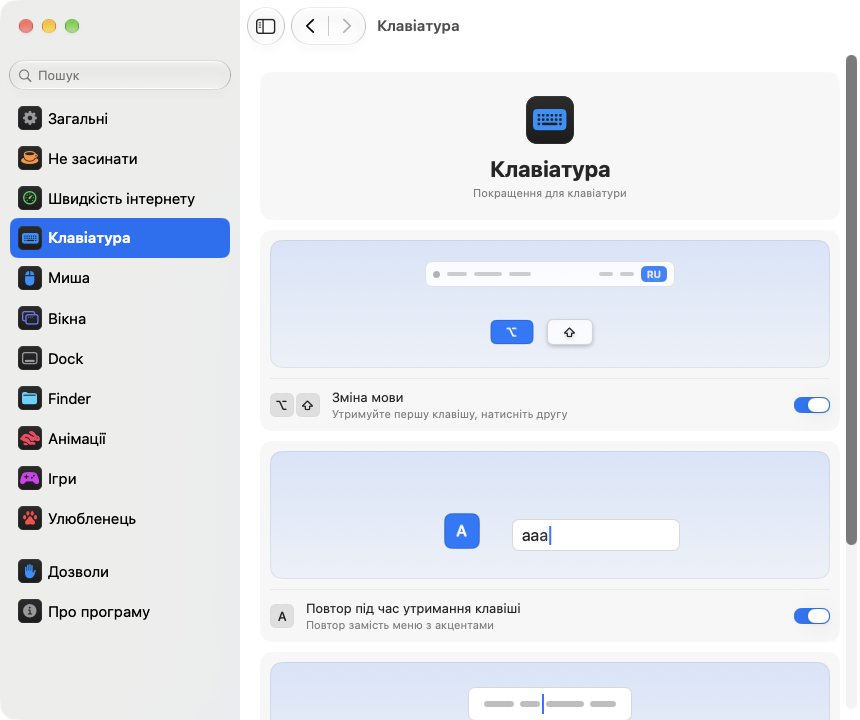

<p align="center"></p>
<h1 align="center">pika-tools</h1>
<p align="center">Невеликі покращення для клавіатури, миші, вікон і Finder — просто в рядку меню вашого Mac.</p>
<p align="center"><sub><a href="../../README.md">English</a> · <a href="README.ru.md">Русский</a> · <b>Українська</b> · <a href="README.de.md">Deutsch</a> · <a href="README.fr.md">Français</a> · <a href="README.es.md">Español</a> · <a href="README.it.md">Italiano</a> · <a href="README.pt-BR.md">Português (Brasil)</a> · <a href="README.ja.md">日本語</a> · <a href="README.zh-Hans.md">简体中文</a> · <a href="README.ko.md">한국어</a> · <a href="README.ro.md">Română</a> · <a href="README.pl.md">Polski</a> · <a href="README.tr.md">Türkçe</a> · <a href="README.nl.md">Nederlands</a> · <a href="README.sv.md">Svenska</a> · <a href="README.cs.md">Čeština</a> · <a href="README.zh-Hant.md">繁體中文</a> · <a href="README.ar.md">العربية</a> · <a href="README.hi.md">हिन्दी</a> · <a href="README.id.md">Bahasa Indonesia</a> · <a href="README.vi.md">Tiếng Việt</a> · <a href="README.th.md">ไทย</a></sub></p>

<p align="center">
<picture>
<source media="(prefers-color-scheme: dark)" srcset="../media/settings-uk-dark.png">

</picture>
</p>

## Встановлення

```bash
brew install --cask dev-pikapik/pika-tools/pika-tools && open -a pika-tools
```

pika-tools з’явиться в рядку меню вгорі екрана. Усе вимкнено, доки ви самі не ввімкнете.

<details>
<summary>Немає Homebrew? Ще два способи</summary>

Без Homebrew: відкрийте Термінал, вставте цей рядок і натисніть Return:

```bash
/bin/bash -c "$(curl -fsSL https://raw.githubusercontent.com/dev-pikapik/pika-tools/main/install.sh)"
```

Або завантажте [pika-tools.dmg](https://github.com/dev-pikapik/pika-tools/releases/latest/download/pika-tools.dmg), відкрийте його й перетягніть програму в папку «Програми».

Homebrew і скрипт самі кладуть програму в `/Applications`, запускають її, запитують дозволи й вмикають відкриття під час входу. Далі програма оновлюється сама, див. **Оновлення**. Як видалити — у розділі **Видалення**.

</details>

## Що вміє

<table>
<tbody><tr>
<td width="50%" valign="top">
<picture><source media="(prefers-color-scheme: dark)" srcset="../media/keep-awake-dark.png"></picture>
<br><b>Не засинати</b>
<br>Mac не засне, скільки потрібно, навіть із закритою кришкою.
</td>
<td width="50%" valign="top">
<picture><source media="(prefers-color-scheme: dark)" srcset="../media/command-keys-dark.png"></picture>
<br><b>Захист ⌘Q і ⌘W</b>
<br>Нічого не закриється випадково. Коли треба, додайте ⇧.
</td>
</tr></tbody>
<tbody><tr>
<td width="50%" valign="top">
<picture><source media="(prefers-color-scheme: dark)" srcset="../media/compress-dark.png"></picture>
<br><b>Менша копія</b>
<br>Правий клік на фото, PDF чи відео — і поруч з’явиться легша копія.
</td>
<td width="50%" valign="top">
<picture><source media="(prefers-color-scheme: dark)" srcset="../media/convert-dark.png"></picture>
<br><b>Конвертація</b>
<br>Збережіть картинку, відео чи пісню в іншому форматі просто з меню правого кліку.
</td>
</tr></tbody>
<tbody><tr>
<td width="50%" valign="top">
<picture><source media="(prefers-color-scheme: dark)" srcset="../media/input-switch-dark.png"></picture>
<br><b>Зміна мови</b>
<br>Тримайте ⌥ і натисніть ⇧ — мова клавіатури зміниться.
</td>
<td width="50%" valign="top">
<picture><source media="(prefers-color-scheme: dark)" srcset="../media/quit-on-close-dark.png"></picture>
<br><b>Вихід з останнім вікном</b>
<br>Закрили останнє вікно — програма теж закрилася.
</td>
</tr></tbody>
<tbody><tr>
<td width="50%" valign="top">
<picture><source media="(prefers-color-scheme: dark)" srcset="../media/window-zoom-dark.png"></picture>
<br><b>Зелена кнопка збільшує</b>
<br>Вікно розтягується на весь екран без повноекранного режиму.
</td>
<td width="50%" valign="top">
<picture><source media="(prefers-color-scheme: dark)" srcset="../media/dock-hide-dark.png"></picture>
<br><b>Сховати кліком у Dock</b>
<br>Клацніть значок програми, у якій ви зараз, і вона зникне з очей.
</td>
</tr></tbody>
<tbody><tr>
<td width="50%" valign="top">
<picture><source media="(prefers-color-scheme: dark)" srcset="../media/new-file-dark.png"></picture>
<br><b>Новий файл</b>
<br>Правий клік у Finder, ім’я — і порожній файл готовий.
</td>
<td width="50%" valign="top">
<picture><source media="(prefers-color-scheme: dark)" srcset="../media/finder-cut-dark.png"></picture>
<br><b>⌘X переносить файли</b>
<br>Виріжте файли у Finder і вставте туди, куди треба.
</td>
</tr></tbody>
<tbody><tr>
<td width="50%" valign="top">
<picture><source media="(prefers-color-scheme: dark)" srcset="../media/finder-open-dark.png"></picture>
<br><b>Return відкриває файли</b>
<br>Виберіть файли у Finder і натисніть Return, щоб відкрити.
</td>
<td width="50%" valign="top">
<picture><source media="(prefers-color-scheme: dark)" srcset="../media/finder-delete-dark.png"></picture>
<br><b>Delete — у Кошик</b>
<br>Натисніть ⌫ у Finder, і вибрані файли підуть у Кошик.
</td>
</tr></tbody>
<tbody><tr>
<td width="50%" valign="top">
<picture><source media="(prefers-color-scheme: dark)" srcset="../media/game-mode-dark.png"></picture>
<br><b>Ігровий режим</b>
<br>Поки ви граєте, ніщо не вискочить поверх гри й не закриє її.
</td>
<td width="50%" valign="top">
<picture><source media="(prefers-color-scheme: dark)" srcset="../media/speed-test-dark.png"></picture>
<br><b>Швидкість інтернету</b>
<br>Наскільки швидкий у вас інтернет і на що його вистачить.
</td>
</tr></tbody>
<tbody><tr>
<td width="50%" valign="top">
<picture><source media="(prefers-color-scheme: dark)" srcset="../media/side-buttons-dark.png"></picture>
<br><b>Бічні кнопки миші</b>
<br>Кнопки 4 і 5 гортають назад і вперед, як свайп.
</td>
<td width="50%" valign="top">
<picture><source media="(prefers-color-scheme: dark)" srcset="../media/wheel-lines-dark.png"></picture>
<br><b>Прокрутка рядками</b>
<br>Кожен клік коліщатка прокручує однаково, хоч як швидко крутите.
</td>
</tr></tbody>
<tbody><tr>
<td width="50%" valign="top">
<picture><source media="(prefers-color-scheme: dark)" srcset="../media/wheel-direction-dark.png"></picture>
<br><b>Напрям прокрутки</b>
<br>Один напрям для трекпада, інший для миші.
</td>
<td width="50%" valign="top">
<picture><source media="(prefers-color-scheme: dark)" srcset="../media/linear-pointer-dark.png"></picture>
<br><b>Без прискорення курсора</b>
<br>Курсор проходить рівно стільки, скільки ваша рука.
</td>
</tr></tbody>
<tbody><tr>
<td width="50%" valign="top">
<picture><source media="(prefers-color-scheme: dark)" srcset="../media/key-repeat-dark.png"></picture>
<br><b>Повтор клавіші</b>
<br>Утримуйте клавішу — літера повторюється, без меню з акцентами.
</td>
<td width="50%" valign="top">
<picture><source media="(prefers-color-scheme: dark)" srcset="../media/home-end-dark.png"></picture>
<br><b>Home і End</b>
<br>Перехід на початок чи кінець рядка, поки ви друкуєте.
</td>
</tr></tbody>
<tbody><tr>
<td width="50%" valign="top">
<picture><source media="(prefers-color-scheme: dark)" srcset="../media/animations-dark.png"></picture>
<br><b>Анімації</b>
<br>Dock, вікна і Швидкий перегляд стануть швидшими — аж до миттєвих.
</td>
<td width="50%" valign="top"></td>
</tr></tbody>
</table>

## Докладніше

<details>
<summary>Перший запуск</summary>

pika-tools потрібні два дозволи. Під час першого запуску відкриються параметри на сторінці «Дозволи», де все пояснено крок за кроком, а macOS покаже свої запити. Відкрийте **Системні параметри › Приватність і безпека** та ввімкніть pika-tools у двох списках:

- **Доступність** — щоб змінювати натискання або клацання, поки вони не дійшли до інших програм.
- **Моніторинг вводу** — щоб узагалі бачити натискання й клацання.

Програма помітить зміни за кілька секунд, нічого перезапускати не треба.

pika-tools не записує, не зберігає й нікуди не надсилає те, що ви друкуєте й натискаєте. Події обробляються в пам’яті й одразу передаються далі. Єдиний мережевий запит — перевірка оновлень: програма питає в GitHub, яка версія остання.

</details>

<details>
<summary>Кожна функція докладно</summary>

**Захист ⌘Q і ⌘W.** Самі по собі ⌘Q і ⌘W нічого не роблять, тож ви не закриєте програму чи вікно випадково. Щоб зробити це навмисно, додайте Shift: ⇧⌘Q завершує програму, ⇧⌘W закриває вікно. Працює в усіх програмах. Кожна клавіша має свій перемикач. Типово вимкнено.

**Зміна мови за Option+Shift.** Тримайте Option і натисніть Shift — macOS увімкне наступне джерело вводу. Не відпускаючи Option, натисніть Shift ще раз, щоб іти далі. Тримайте Shift і натискайте Option, щоб повернутися назад. Якщо в цей час натиснути іншу клавішу, клацнути або додати Cmd, Ctrl чи Fn, мова не зміниться, тож сполучення на кшталт Option+Shift+стрілка працюють як раніше. Типово вимкнено.

**Повтор під час утримання клавіші.** Тримаєш клавішу — літера друкується знову і знову, замість меню з акцентами. Зручно в іграх і під час набору тексту. Уже відкриті програми підхоплять це після перезапуску. Вимкнеш — і macOS знову поводиться як звичайно. Типово вимкнено.

**Home і End — до початку й кінця рядка.** Поки ви друкуєте, Home ставить курсор на початок рядка, а End — у кінець, замість прокручування сторінки. З ⇧ вони виділяють текст до цього місця, з ⌘ переходять до початку або кінця всього тексту. Поза текстовими полями, а також у терміналах, віртуальних машинах і програмах віддаленого доступу клавіші працюють як раніше. Можна вказати й інші програми, де вони мають працювати як зазвичай. Типово вимкнено.

**Вимкнути прискорення вказівника.** Курсор проходить рівно стільки, скільки миша, хоч як швидко її рухати, — як у LinearMouse. Повзунок **Швидкість пересування** задає, наскільки швидко він рухається. Працює лише з мишею, трекпед лишається як є. Вимкніть функцію або закрийте pika-tools — і macOS поверне свої налаштування. Типово вимкнено.

**Прокручування рядками.** Кожне клацання коліщатка миші прокручує однакову кількість рядків, хоч як швидко ви його крутите. Виберіть від 1 до 10 рядків на клацання, типово 3. Природне прокручування лишається таким, як ви налаштували в Системних параметрах. Працює лише для мишей, трекпад лишається як є. Типово вимкнено. Поруч із повзунком **Відстань за клацання** маленька сторінка прокручується на вибрану відстань, а крапка позначає типове значення.

Деякі програми та ігри рахують прокручування в точних пікселях: для них перемкніть це саме налаштування на пікселі й виберіть від 1 до 200 пікселів за клацання, типово 40. Повзунок також показує, яку частку висоти екрана це становить.

**Напрямок прокручування для трекпада й миші.** У macOS один перемикач природного прокручування одразу для трекпада й миші. Увімкніть цю функцію й оберіть напрямок для кожного: **Природний**, коли сторінка йде за пальцями, як на iPhone, або **Класичний**, коли сторінка рухається у зворотний бік. Вибір для трекпада діє і на прокручування вбік, і на докочування сторінки після того, як ви відпустили пальці. Magic Mouse прокручує дотиком, тому йде за вибором для трекпада. Оберіть те саме на всіх своїх Mac, і прокручування буде однаковим усюди, навіть коли ви переводите мишу на інший Mac через Універсальний контроль. Типово вимкнено. Після ввімкнення обидва вибори такі самі, як у Системних параметрах, тож нічого не змінюється, доки ви не оберете інше.

**Бічні кнопки — назад і вперед.** Кнопки миші 4 і 5 працюють як «назад» і «вперед» у Safari, Finder та інших програмах Apple, у Firefox, Opera і ForkLift, як змах на трекпаді. Інші програми, наприклад середовища JetBrains, отримують кнопки як є й обробляють їх по-своєму. Якщо на вашій миші вони переплутані, увімкніть **Поміняти бічні кнопки місцями**. Типово вимкнено.

**Вихід після закриття останнього вікна.** Закрили останнє вікно програми — програма завершується. Finder лишається відкритим, як і програми, що мають вікна на інших робочих столах або в Dock. Можна скласти список програм, які ніколи так не завершуються. Типово вимкнено.

**Приховування клацанням у Dock.** Клацніть значок у Dock тієї програми, в якій працюєте, — вона сховається. Ще одне клацання — повернеться. Типово вимкнено.

**Зелена кнопка збільшує вікно.** Клацніть зелену кнопку вікна — воно заповнить екран, не переходячи в повноекранний режим. Ще клацання — повернеться попередній розмір. Якщо втримувати ⌥, кнопка працює як зазвичай. Повноекранний режим залишається в меню кнопки та на ⌃⌘F. Можна скласти список програм, у яких зелена кнопка має працювати як зазвичай. Типово вимкнено.

**Новий файл у Finder.** Правий клік у вікні Finder або на робочому столі › **Новий файл**, введіть назву — і з’явиться порожній файл. Типово .txt. Типово вимкнено.

**Enter відкриває файли у Finder.** Виділіть файли у вікні Finder або на робочому столі й натисніть Return або Enter — вони відкриються. F2 або fn F2 перейменовує виділений файл. У текстових полях, наприклад коли ви вводите назву, клавіші працюють як зазвичай. Типово вимкнено.

**⌘X вирізає файли у Finder.** Виділіть файли й натисніть ⌘X, відкрийте потрібну папку й натисніть ⌘V — файли переміщаться туди, а не скопіюються. ⌘C скасовує вирізання. Типово вимкнено.

**Delete і ⌫ видаляють файли у Finder.** Виділіть файли й натисніть ⌫ або ⌦ (fn ⌫ на ноутбуці) — вони підуть у Смітник, як за ⌘⌫. Поки ви перейменовуєте файл, шукаєте чи друкуєте в будь-якому іншому полі, клавіші стирають літери як зазвичай. Типово вимкнено.

**Менша копія у Finder.** Правий клік по файлу у Finder › **Зробити меншу копію** — поруч з’явиться полегшена версія фото, GIF, PDF чи відео, часто в рази менша. Нестиснутий звук на кшталт WAV чи AIFF стане компактним M4A. Якщо файл меншим уже не зробити, копія не з’явиться, і pika-tools про це скаже. Оригінал лишається як був, нічого не залишає ваш Mac. Типово вимкнено.

**Конвертація у Finder.** Правий клік по файлу у Finder › **Конвертувати в** — файл збережеться в іншому форматі: зображення в JPEG, PNG, HEIC, GIF, TIFF чи PDF, відео в MP4, MOV або лише звук, музика в M4A, WAV чи AIFF. Оригінал лишається як був, нічого не залишає ваш Mac. Вмикається окремо від меншої копії. Типово вимкнено.

**Ігровий режим.** Додайте свої ігри — і поки ви граєте, Mac не висмикує вас із гри. Spotlight, Siri, ⌘Tab, Mission Control і змахування між робочими столами не відкриваються поверх гри, ⌘Q і ⌘W не закривають її випадково, курсор не з’їжджає на Dock, рядок меню чи інший екран, а екран не гасне. Кожен із цих пунктів має свій перемикач на сторінці «Ігри», а ще pika-tools підкаже ігри, які знайшов на вашому Mac. У грі Ctrl-клік лишається простим кліком, а Ctrl зі стрілками не перемикає робочий стіл. Minecraft теж розпізнається: додайте Minecraft Launcher або CurseForge, і режим вмикатиметься в самому Minecraft. Щоб вийти з гри, натисніть ⇧⌘Q, а щоб закрити її вікно — ⇧⌘W. ⌥⌘Esc працює завжди. Щойно ви вийшли з гри, усе працює як звичайно. Типово вимкнено.

Кожен інструмент має свій перемикач у меню та в параметрах.

Значок у рядку меню одразу показує стан: стрілка з клацанням — інструменти працюють, перекреслена стрілка — усе вимкнено, попереджувальний трикутник — інструмент увімкнено, але бракує дозволів.

Панель у рядку меню спочатку показує лише кілька рядків. Які саме, обираєте ви самі: натисніть кнопку з олівцем унизу, позначте потрібне й натисніть **Готово**. Приховані рядки продовжують працювати й залишаються в Параметрах. Якщо панель не вміщується на екрані, її можна прокручувати.

Програма розмовляє мовою системи або тією, яку ви оберете в параметрах. Доступні всі 23 мови зі списку на початку цієї сторінки.

</details>

<details>
<summary>Не засинати</summary>

Не дає Mac заснути, поки вас немає за клавіатурою: на будь-який час від 1 секунди до 365 діб або доки ви не вимкнете. Вмикається в меню, а тривалість задається в параметрах: введіть дні, години, хвилини й секунди, натискайте ↑ і ↓ або виберіть готовий варіант від 15 хвилин до 8 годин. У меню видно, скільки лишилося і коли закінчиться. У рядку **Екран** два варіанти. **Завжди ввімкнений**: екран не гасне, без заставки та екрана блокування. **Гасне як зазвичай**: екран гасне за своїм таймером, а Mac працює. Кнопка **Вимкнути екран зараз** (вона є і в меню) одразу гасить екран, а Mac працює далі: щоб повернути екран, поворушіть мишею або натисніть будь-яку клавішу. Якщо завершити pika-tools, режим теж вимкнеться.

На MacBook можна ввімкнути й **Працювати із закритою кришкою**. У macOS немає такого перемикача, тому pika-tools виконує `pmset -a disablesleep 1` і просить пароль адміністратора: змінювати режим сну Mac може лише адміністратор. Налаштування саме повертається до звичайного стану, коли режим закінчується, коли ви завершуєте програму або якщо вона аварійно закриється. Якщо не ввести пароль, нічого не зміниться. Стежте, щоб Mac із закритою кришкою не перегрівався. **Зупинити, коли заряд нижче 20 %** вимикає режим раніше, ніж сяде акумулятор.

«Не засинати», режими дисплея та закритої кришки можна винести на кнопку в Центрі керування, рядку меню або віджет на робочому столі через застосунок «Команди»; посилання копіюються в Параметри › Не засинати.

</details>

<details>
<summary>Швидкість інтернету</summary>

Показує, наскільки швидкий інтернет просто зараз. Натисніть **Перевірити швидкість** у Параметри › Швидкість інтернету або **Перевірити** в меню, якщо додали туди рядок кнопкою з олівцем. Приблизно за пів хвилини видно швидкість завантаження й вивантаження, пінг і чуйність: як швидко все відгукується, поки інтернет зайнятий. Нижче простими словами сказано, для чого його вистачить: фільми в 4K, відеодзвінки, онлайн-ігри та великі файли. Перевірка йде через вбудовану в macOS програму networkQuality і сервери Apple. Останній результат зберігається до наступної перевірки, а посилання для «Команд» запускає її з Пункту керування.

</details>

<details>
<summary>Параметри</summary>

Відкрийте параметри з меню кнопкою **Параметри…** або сполученням ⌘, — чи просто запустіть pika-tools ще раз із Finder, Launchpad або Spotlight. Поки вікно відкрите, програму видно в Dock і в ⌘Tab.

- **Загальні**: відкриття під час входу, вигляд (як у системі, світлий або темний), мова, оновлення та резервна копія: експорт та імпорт параметрів файлом або синхронізація через iCloud Drive.
- **Не засинати**: тривалість, екран і кришка.
- **Швидкість інтернету**: перевірка швидкості й для чого її вистачить.
- **Клавіатура**: зміна мови, повтор клавіш, Home і End.
- **Миша**: прискорення курсора і швидкість пересування, прокручування рядками, напрямок прокручування, бічні кнопки.
- **Вікна**: збільшення вікна зеленою кнопкою (зі списком винятків), захист ⌘Q і ⌘W та вихід після останнього вікна (зі списком винятків).
- **Dock**: приховування клацанням у Dock.
- **Finder**: новий файл, менша копія та конвертація, відкриття клавішею Return, вирізання клавішами ⌘X і видалення у Смітник клавішею ⌫.
- **Дозволи**: стан обох дозволів, а коли синхронізацію ввімкнено, ще й iCloud Drive, і кнопки, що відкривають потрібне місце в Системних параметрах.
- **Про програму**: версія, посилання на список змін і на повідомлення про проблему.

У багатьох налаштувань є невеликий малюнок, що показує, що вони роблять: наприклад, Mac, який не засинає, або вікно, що ховається за Dock. Малюнок змінюється разом із перемикачем і завмирає, якщо в Системних параметрах увімкнено «Зменшити рух».

На кожній сторінці внизу є кнопка **Відновити типові…**. Спершу вона перепитає, а потім вимкне інструменти на цій сторінці й поверне їхні параметри, ніби pika-tools їх і не торкався.

**Синхронізувати параметри через iCloud** робить pika-tools однаковим на всіх ваших Mac. Параметри лежать у теці pika-tools в iCloud Drive, а перемагає найсвіжіша зміна. Типово вимкнено, потрібен увімкнений iCloud Drive. Дозволи не синхронізуються: кожен Mac запитує їх сам.

</details>

<details>
<summary>Оновлення</summary>

pika-tools перевіряє нові версії під час запуску та кожні 6 годин. Це можна вимкнути в «Параметри › Загальні». Коли виходить нова версія, у меню з’являється кнопка **Оновити до …**: одне клацання — і програма завантажить оновлення, встановить його й перезапуститься. Перевірити вручну можна кнопкою **Перевірити** в «Параметри › Загальні».

Якщо ви встановлювали через Homebrew, можна також виконати `brew upgrade --cask pika-tools`.

Починаючи з версії 1.3 дозволи зберігаються після оновлень.

</details>

<details>
<summary>Видалення</summary>

```bash
/bin/bash -c "$(curl -fsSL https://raw.githubusercontent.com/dev-pikapik/pika-tools/main/uninstall.sh)"
```

Якщо встановлювали через Homebrew: `brew uninstall --cask --zap pika-tools`.

Обидві команди завершують програму, прибирають її з об’єктів входу й видаляють. Скрипт ще й скидає її дозволи.

</details>

<details>
<summary>Питання й відповіді</summary>

**Навіщо два дозволи?**
macOS ділить доступ до клавіатури й миші на дві частини. Моніторинг вводу дає змогу бачити події, Доступність — змінювати їх. Щоб заблокувати сполучення, потрібні обидва.

**macOS пише, що програма від невстановленого розробника.**
pika-tools підписано, але не нотаризовано Apple. Homebrew і скрипт встановлення вирішують це самі. Якщо ви встановлювали з dmg, відкрийте **Системні параметри › Приватність і безпека** та натисніть **Усе одно відкрити** або виконайте:

```bash
xattr -dr com.apple.quarantine /Applications/pika-tools.app
```

**Чи працює на Mac з Intel?**
Так. Це універсальна програма для Apple Silicon і Intel, потрібна macOS 14 Sonoma або новіша.

**Дозвіл увімкнено, але нічого не працює.**
У **Системних параметрах › Приватність і безпека** видаліть pika-tools з обох списків кнопкою −, потім додайте знову. На сторінці «Дозволи» в параметрах pika-tools є кнопки, що відкривають потрібне місце.

</details>

<p align="center">☕ Якщо pika-tools вам подобається, можете <a href="https://buymeacoffee.com/pikapik">пригостити мене кавою</a> — усе піде на розвиток і підтримку застосунку.</p>

<p align="center"><sub><a href="../whats-new/README.uk.md">Що нового</a> · <a href="https://github.com/dev-pikapik/homebrew-pika-tools">Тап Homebrew</a> · <a href="../../CONTRIBUTING.md">Збирання з вихідного коду</a> · <a href="../../LICENSE">Ліцензія MIT</a> · © 2026 pikapik</sub></p>
