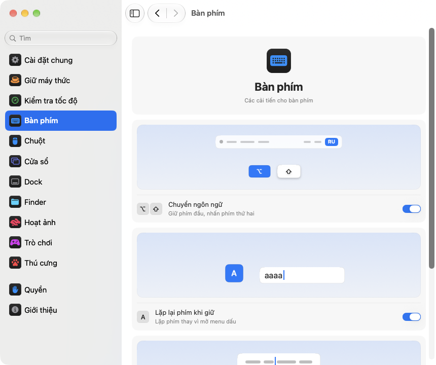

<p align="center"></p>
<h1 align="center">pikapik</h1>
<p align="center">Những tinh chỉnh nhỏ cho bàn phím, chuột, cửa sổ và Finder, ngay trên thanh menu của máy Mac.</p>
<p align="center"><sub><a href="../../README.md">English</a> · <a href="README.ru.md">Русский</a> · <a href="README.uk.md">Українська</a> · <a href="README.de.md">Deutsch</a> · <a href="README.fr.md">Français</a> · <a href="README.es.md">Español</a> · <a href="README.it.md">Italiano</a> · <a href="README.pt-BR.md">Português (Brasil)</a> · <a href="README.ja.md">日本語</a> · <a href="README.zh-Hans.md">简体中文</a> · <a href="README.ko.md">한국어</a> · <a href="README.ro.md">Română</a> · <a href="README.pl.md">Polski</a> · <a href="README.tr.md">Türkçe</a> · <a href="README.nl.md">Nederlands</a> · <a href="README.sv.md">Svenska</a> · <a href="README.cs.md">Čeština</a> · <a href="README.zh-Hant.md">繁體中文</a> · <a href="README.ar.md">العربية</a> · <a href="README.hi.md">हिन्दी</a> · <a href="README.id.md">Bahasa Indonesia</a> · <b>Tiếng Việt</b> · <a href="README.th.md">ไทย</a></sub></p>

<p align="center">
<picture>
<source media="(prefers-color-scheme: dark)" srcset="../media/settings-vi-dark.png">

</picture>
</p>

## Cài đặt

```bash
brew install --cask dev-pikapik/pika-tools/pikapik && open -a pikapik
```

pikapik sẽ nằm trên thanh menu ở phía trên màn hình. Mọi thứ đều tắt cho đến khi bạn bật lên.

<details>
<summary>Không có Homebrew? Còn hai cách khác</summary>

Không dùng Homebrew: mở Terminal, dán dòng này rồi nhấn Return:

```bash
/bin/bash -c "$(curl -fsSL https://raw.githubusercontent.com/dev-pikapik/pika-tools/main/install.sh)"
```

Hoặc tải về [pikapik.dmg](https://github.com/dev-pikapik/pika-tools/releases/latest/download/pikapik.dmg), mở tệp và kéo ứng dụng vào thư mục Ứng dụng.

Cả Homebrew và tập lệnh đều đặt ứng dụng vào `/Applications`, mở ứng dụng, xin quyền và bật “Mở khi đăng nhập”. Sau đó ứng dụng tự cập nhật, xem **Cập nhật**. Để gỡ bỏ, xem **Gỡ cài đặt**.

</details>

## Ứng dụng làm được gì

<table>
<tbody><tr>
<td width="50%" valign="top">
<picture><source media="(prefers-color-scheme: dark)" srcset="../media/keep-awake-dark.png"></picture>
<br><b>Giữ máy thức</b>
<br>Máy Mac luôn thức bao lâu tùy bạn, kể cả khi gập nắp.
</td>
<td width="50%" valign="top">
<picture><source media="(prefers-color-scheme: dark)" srcset="../media/command-keys-dark.png"></picture>
<br><b>Bảo vệ ⌘Q và ⌘W</b>
<br>Không gì bị đóng nhầm. Thêm ⇧ khi bạn thật sự muốn.
</td>
</tr></tbody>
<tbody><tr>
<td width="50%" valign="top">
<picture><source media="(prefers-color-scheme: dark)" srcset="../media/compress-dark.png"></picture>
<br><b>Bản sao nhỏ hơn</b>
<br>Bấm chuột phải vào ảnh, PDF hay video là có ngay bản sao nhẹ hơn bên cạnh.
</td>
<td width="50%" valign="top">
<picture><source media="(prefers-color-scheme: dark)" srcset="../media/convert-dark.png"></picture>
<br><b>Chuyển đổi</b>
<br>Lưu ảnh, video hay bài hát sang định dạng khác chỉ bằng chuột phải.
</td>
</tr></tbody>
<tbody><tr>
<td width="50%" valign="top">
<picture><source media="(prefers-color-scheme: dark)" srcset="../media/input-switch-dark.png"></picture>
<br><b>Chuyển ngôn ngữ</b>
<br>Giữ ⌥ và chạm ⇧ để đổi ngôn ngữ bàn phím.
</td>
<td width="50%" valign="top">
<picture><source media="(prefers-color-scheme: dark)" srcset="../media/quit-on-close-dark.png"></picture>
<br><b>Thoát cùng cửa sổ cuối</b>
<br>Đóng cửa sổ cuối cùng của một ứng dụng là ứng dụng cũng thoát.
</td>
</tr></tbody>
<tbody><tr>
<td width="50%" valign="top">
<picture><source media="(prefers-color-scheme: dark)" srcset="../media/window-zoom-dark.png"></picture>
<br><b>Nút xanh lá phóng to</b>
<br>Cửa sổ phủ kín màn hình mà không vào chế độ toàn màn hình.
</td>
<td width="50%" valign="top">
<picture><source media="(prefers-color-scheme: dark)" srcset="../media/dock-hide-dark.png"></picture>
<br><b>Ẩn bằng một lần bấm trong Dock</b>
<br>Bấm vào ứng dụng đang dùng, nó sẽ tạm lánh đi.
</td>
</tr></tbody>
<tbody><tr>
<td width="50%" valign="top">
<picture><source media="(prefers-color-scheme: dark)" srcset="../media/new-file-dark.png"></picture>
<br><b>Tệp mới</b>
<br>Bấm chuột phải trong Finder, đặt tên, thế là có tệp trống.
</td>
<td width="50%" valign="top">
<picture><source media="(prefers-color-scheme: dark)" srcset="../media/finder-cut-dark.png"></picture>
<br><b>⌘X di chuyển tệp</b>
<br>Cắt tệp trong Finder rồi dán vào nơi bạn muốn.
</td>
</tr></tbody>
<tbody><tr>
<td width="50%" valign="top">
<picture><source media="(prefers-color-scheme: dark)" srcset="../media/finder-open-dark.png"></picture>
<br><b>Enter mở tệp</b>
<br>Chọn tệp trong Finder rồi nhấn Enter để mở.
</td>
<td width="50%" valign="top">
<picture><source media="(prefers-color-scheme: dark)" srcset="../media/finder-delete-dark.png"></picture>
<br><b>Delete vào Thùng rác</b>
<br>Nhấn ⌫ trong Finder, các tệp đã chọn sẽ vào Thùng rác.
</td>
</tr></tbody>
<tbody><tr>
<td width="50%" valign="top">
<picture><source media="(prefers-color-scheme: dark)" srcset="../media/game-mode-dark.png"></picture>
<br><b>Chế độ trò chơi</b>
<br>Khi bạn chơi, không gì bật lên che trò chơi hay đóng nó lại.
</td>
<td width="50%" valign="top">
<picture><source media="(prefers-color-scheme: dark)" srcset="../media/speed-test-dark.png"></picture>
<br><b>Kiểm tra tốc độ</b>
<br>Internet của bạn nhanh cỡ nào và đủ dùng cho việc gì.
</td>
</tr></tbody>
<tbody><tr>
<td width="50%" valign="top">
<picture><source media="(prefers-color-scheme: dark)" srcset="../media/side-buttons-dark.png"></picture>
<br><b>Nút bên của chuột</b>
<br>Nút 4 và 5 để quay lại và tiếp, như vuốt trên bàn di chuột.
</td>
<td width="50%" valign="top">
<picture><source media="(prefers-color-scheme: dark)" srcset="../media/wheel-lines-dark.png"></picture>
<br><b>Cuộn theo dòng</b>
<br>Mỗi nấc bánh xe cuộn như nhau, dù bạn xoay nhanh đến đâu.
</td>
</tr></tbody>
<tbody><tr>
<td width="50%" valign="top">
<picture><source media="(prefers-color-scheme: dark)" srcset="../media/wheel-direction-dark.png"></picture>
<br><b>Hướng cuộn</b>
<br>Một hướng cho bàn di chuột, hướng khác cho chuột.
</td>
<td width="50%" valign="top">
<picture><source media="(prefers-color-scheme: dark)" srcset="../media/linear-pointer-dark.png"></picture>
<br><b>Không tăng tốc con trỏ</b>
<br>Con trỏ đi đúng bằng quãng tay bạn di.
</td>
</tr></tbody>
<tbody><tr>
<td width="50%" valign="top">
<picture><source media="(prefers-color-scheme: dark)" srcset="../media/key-repeat-dark.png"></picture>
<br><b>Lặp lại phím khi giữ</b>
<br>Giữ một phím để gõ lặp lại, không hiện menu dấu.
</td>
<td width="50%" valign="top">
<picture><source media="(prefers-color-scheme: dark)" srcset="../media/home-end-dark.png"></picture>
<br><b>Home và End</b>
<br>Nhảy về đầu hoặc cuối dòng khi đang gõ.
</td>
</tr></tbody>
<tbody><tr>
<td width="50%" valign="top">
<picture><source media="(prefers-color-scheme: dark)" srcset="../media/animations-dark.png"></picture>
<br><b>Hoạt ảnh</b>
<br>Tăng tốc Dock, cửa sổ và Xem nhanh, cho đến tức thì.
</td>
<td width="50%" valign="top">
<picture><source media="(prefers-color-scheme: dark)" srcset="../media/leftover-permissions-dark.png"></picture>
<br><b>Quyền của ứng dụng đã xóa</b>
<br>Gỡ các quyền mà macOS vẫn giữ cho những ứng dụng bạn đã xóa.
</td>
</tr></tbody>
<tbody><tr>
<td width="50%" valign="top">
<picture><source media="(prefers-color-scheme: dark)" srcset="../media/pet-dark.png"></picture>
<br><b>Thú cưng trên màn hình nền</b>
<br>Một người bạn nhỏ dạo bước sau các cửa sổ của bạn. Nhấc lên và tung đi, hoặc nhấn phím cách để nó nhảy.
</td>
</tr></tbody>
</table>

## Chi tiết

<details>
<summary>Lần mở đầu tiên</summary>

pikapik cần hai quyền. Lần đầu mở, ứng dụng hiện phần cài đặt ở trang Quyền để hướng dẫn bạn từng bước, và macOS hiện các yêu cầu của riêng nó. Vào **Cài đặt hệ thống › Quyền riêng tư & Bảo mật** và bật pikapik trong:

- **Trợ năng**, để ứng dụng có thể thay đổi một lần nhấn phím hoặc lần bấm trước khi nó đến các ứng dụng khác.
- **Theo dõi đầu vào**, để ứng dụng có thể thấy các lần nhấn phím và lần bấm.

Ứng dụng nhận ra thay đổi trong vài giây, không cần khởi động lại.

pikapik không ghi lại, không lưu và không gửi bất cứ thứ gì bạn gõ hay bấm. Các sự kiện được xử lý trong bộ nhớ và chuyển tiếp ngay. Yêu cầu mạng duy nhất là kiểm tra cập nhật, hỏi GitHub phiên bản mới nhất.

</details>

<details>
<summary>Từng công cụ chi tiết</summary>

**Bảo vệ ⌘Q và ⌘W.** Chỉ nhấn ⌘Q hoặc ⌘W thì không có gì xảy ra, nên bạn sẽ không vô tình thoát ứng dụng hay đóng cửa sổ. Thêm Shift khi bạn thật sự muốn: ⇧⌘Q để thoát, ⇧⌘W để đóng. Hoạt động trong mọi ứng dụng. Mỗi phím có công tắc riêng. Tắt theo mặc định.

**Chuyển ngôn ngữ bằng Option+Shift.** Giữ Option và nhấn Shift: macOS chuyển sang nguồn đầu vào tiếp theo. Vẫn giữ Option và nhấn Shift lần nữa để đi tiếp. Giữ Shift và nhấn Option để quay lại. Nếu ở giữa chừng bạn nhấn phím khác, bấm chuột, hoặc thêm Command, Control hay Fn, ngôn ngữ sẽ không đổi, nên các phím tắt như Option+Shift+mũi tên vẫn hoạt động như trước. Tắt theo mặc định.

**Lặp lại phím khi giữ.** Giữ một phím là chữ được gõ lặp lại liên tục thay vì hiện menu dấu. Rất tiện khi chơi game và khi gõ. Các app đang mở sẵn sẽ áp dụng sau khi khởi động lại. Tắt đi là macOS hoạt động như bình thường. Tắt theo mặc định.

**Home và End đến đầu và cuối dòng.** Khi bạn gõ, Home đưa con trỏ về đầu dòng và End đến cuối dòng, thay vì cuộn trang. Kèm ⇧ sẽ chọn đến đó, kèm ⌘ sẽ đến đầu hoặc cuối toàn bộ văn bản. Bên ngoài ô văn bản, cũng như trong terminal, máy ảo và ứng dụng màn hình từ xa, các phím vẫn hoạt động như trước. Bạn có thể thêm các ứng dụng khác mà phím cần hoạt động như bình thường. Mặc định tắt.

**Tắt tăng tốc con trỏ.** Con trỏ di chuyển đúng bằng quãng đường của chuột, dù bạn di chuyển nhanh đến đâu. Thanh trượt **Tốc độ di chuyển** đặt tốc độ của con trỏ. Chỉ hoạt động với chuột, bàn di chuột vẫn giữ nguyên. Tắt tính năng hoặc thoát pikapik, macOS sẽ lấy lại cài đặt của chính nó. Tắt theo mặc định.

**Cuộn theo dòng.** Mỗi lần bấm bánh xe chuột sẽ cuộn cùng một số dòng, dù bạn xoay nhanh đến đâu. Chọn từ 1 đến 10 dòng mỗi lần bấm, mặc định là 3. Cuộn tự nhiên vẫn giữ như bạn đã đặt trong Cài đặt hệ thống. Chỉ áp dụng cho chuột, bàn di chuột giữ nguyên. Tắt theo mặc định. Bên cạnh thanh trượt **Quãng mỗi lần bấm**, một trang nhỏ cuộn đúng quãng bạn chọn, và một chấm đánh dấu giá trị mặc định.

Một số ứng dụng và trò chơi đếm thao tác cuộn bằng pixel chính xác: với chúng, hãy chuyển chính cài đặt này sang pixel và chọn từ 1 đến 200 pixel mỗi lần bấm, mặc định là 40. Thanh trượt cũng cho biết quãng đó bằng bao nhiêu phần chiều cao màn hình.

**Hướng cuộn cho bàn di chuột và chuột.** macOS chỉ có một công tắc cuộn tự nhiên dùng chung cho bàn di chuột và chuột. Bật tính năng này và chọn hướng cho từng thứ: **Tự nhiên**, trang đi theo ngón tay như trên iPhone, hoặc **Cổ điển**, khi trang di chuyển theo chiều ngược lại. Lựa chọn cho bàn di chuột cũng áp dụng cho cuộn ngang và đà trượt sau khi bạn nhấc ngón tay. Magic Mouse cuộn bằng cảm ứng nên đi theo lựa chọn cho bàn di chuột. Chọn giống nhau trên mọi máy Mac của bạn để cuộn ở đâu cũng như nhau, kể cả khi bạn đưa chuột sang máy Mac khác bằng Điều khiển chung. Mặc định tắt. Khi bật, cả hai bắt đầu giống như trong Cài đặt hệ thống, nên không có gì thay đổi cho đến khi bạn chọn khác.

**Nút bên để quay lại và tiếp.** Nút chuột 4 và 5 giúp lùi và tiến trong Finder, Safari và các ứng dụng khác của Apple cũng như trong nhiều ứng dụng khác, giống như vuốt trên bàn di chuột. Các ứng dụng tự xử lý hai nút này sẽ nhận chúng nguyên trạng. Nếu chuột của bạn có hai nút này ngược nhau, hãy bật **Đổi chỗ nút bên**. Tắt theo mặc định.

**Thoát khi đóng cửa sổ cuối cùng.** Đóng cửa sổ cuối cùng của một ứng dụng và ứng dụng sẽ thoát. Finder vẫn mở, các ứng dụng có cửa sổ ở màn hình nền khác hoặc trong Dock cũng vậy. Bạn có thể lập danh sách những ứng dụng không bao giờ thoát theo cách này. Tắt theo mặc định.

**Ẩn bằng một lần bấm trong Dock.** Bấm vào biểu tượng trong Dock của ứng dụng bạn đang dùng, ứng dụng sẽ ẩn đi. Bấm lần nữa để hiện lại. Tắt theo mặc định.

**Nút xanh lá phóng to cửa sổ.** Bấm vào nút xanh lá của cửa sổ, cửa sổ sẽ lấp đầy màn hình mà không vào chế độ toàn màn hình. Bấm lần nữa để trở lại kích thước cũ. Giữ ⌥ thì nút hoạt động như bình thường. Chế độ toàn màn hình vẫn có trong menu của nút và ở ⌃⌘F. Bạn có thể lập danh sách các ứng dụng mà nút xanh lá cần hoạt động như bình thường. Tắt theo mặc định.

**Tệp mới trong Finder.** Bấm chuột phải trong cửa sổ Finder hoặc trên màn hình nền, chọn **Tệp mới**, nhập tên là có ngay một tệp trống. Mặc định là .txt. Mặc định tắt.

**Enter mở tệp trong Finder.** Chọn tệp trong cửa sổ Finder hoặc trên màn hình nền rồi nhấn Return hoặc Enter, tệp sẽ mở ra. F2 hoặc fn F2 đổi tên tệp đã chọn. Trong ô nhập văn bản, chẳng hạn khi gõ tên, các phím vẫn hoạt động như bình thường. Mặc định tắt.

**⌘X cắt tệp trong Finder.** Chọn tệp rồi nhấn ⌘X, mở thư mục muốn đến rồi nhấn ⌘V, tệp sẽ được chuyển đến đó thay vì sao chép. ⌘C hủy thao tác cắt. Mặc định tắt.

**Delete xóa tệp trong Finder.** Chọn tệp rồi nhấn ⌫ hoặc ⌦ (fn ⌫ trên máy tính xách tay), tệp sẽ vào Thùng rác, giống như ⌘⌫. Khi bạn đang đổi tên tệp, tìm kiếm hoặc gõ trong ô khác, các phím xóa chữ như bình thường. Mặc định tắt.

**Bản sao nhỏ hơn trong Finder.** Bấm chuột phải vào tệp trong Finder và chọn **Tạo bản sao nhỏ hơn**. Một bản nhẹ hơn của ảnh, GIF, PDF hoặc video được lưu ngay bên cạnh, thường nhỏ hơn nhiều lần. Âm thanh chưa nén như WAV hoặc AIFF sẽ thành tệp M4A gọn nhẹ. Nếu tệp không thể nhỏ hơn nữa, sẽ không có bản sao nào và pikapik sẽ báo cho bạn. Tệp gốc vẫn giữ nguyên và không có gì rời khỏi máy Mac của bạn. Mặc định tắt.

**Chuyển đổi trong Finder.** Bấm chuột phải vào tệp trong Finder và chọn **Chuyển sang** để lưu tệp ở định dạng khác: ảnh thành JPEG, PNG, HEIC, GIF, TIFF hoặc PDF, video thành MP4, MOV hoặc chỉ lấy âm thanh, nhạc thành M4A, WAV hoặc AIFF. Tệp gốc vẫn giữ nguyên và không có gì rời khỏi máy Mac của bạn. Bật riêng với bản sao nhỏ hơn. Mặc định tắt.

**Chế độ trò chơi.** Thêm trò chơi của bạn, và trong lúc bạn chơi, máy Mac không kéo bạn ra khỏi trò chơi. Spotlight, Siri, ⌘Tab, Mission Control và thao tác vuốt giữa các màn hình nền không mở đè lên trò chơi, ⌘Q và ⌘W không vô tình đóng trò chơi, con trỏ không trượt sang Dock, thanh menu hay màn hình khác, và màn hình luôn sáng. Mỗi mục có công tắc riêng trên trang Trò chơi, và pikapik gợi ý những trò chơi tìm thấy trên máy Mac của bạn. Trong trò chơi, Control-bấm vẫn là một cú bấm bình thường, còn Control với phím mũi tên không đổi màn hình nền. Minecraft cũng được nhận ra: thêm Minecraft Launcher hoặc CurseForge, và chế độ sẽ bật ngay trong Minecraft. Để thoát trò chơi, hãy nhấn ⇧⌘Q; để đóng cửa sổ của nó, nhấn ⇧⌘W. ⌥⌘Esc luôn hoạt động. Ngay khi bạn rời trò chơi, mọi thứ hoạt động như bình thường. Mặc định tắt.

Mỗi công cụ có công tắc riêng trong menu và trong cài đặt.

Biểu tượng trên thanh menu cho biết trạng thái chỉ trong nháy mắt: dấu pikapik khi các công cụ đang chạy, cùng dấu đó nhưng nhạt đi khi mọi thứ đều tắt, và tam giác cảnh báo khi một công cụ đang bật nhưng thiếu quyền.

Bảng điều khiển trên thanh menu ban đầu chỉ có vài hàng. Bạn tự chọn hàng nào được hiện: nhấp nút hình bút chì ở phía dưới, chọn những gì bạn muốn thấy rồi nhấp **Xong**. Các hàng bị ẩn vẫn hoạt động và vẫn nằm trong Cài đặt. Nếu bảng không vừa màn hình, bạn có thể cuộn nó.

Ứng dụng dùng ngôn ngữ của hệ thống hoặc ngôn ngữ bạn chọn trong cài đặt. Có sẵn cả 23 ngôn ngữ trong danh sách ở đầu trang này.

</details>

<details>
<summary>Giữ máy thức</summary>

Ngăn máy Mac chuyển sang chế độ ngủ khi bạn rời bàn phím: trong khoảng thời gian bất kỳ từ 1 giây đến 365 ngày, hoặc cho đến khi bạn tắt. Bật từ menu và đặt thời lượng trong cài đặt: nhập ngày, giờ, phút và giây, dùng ↑ và ↓, hoặc bấm một lựa chọn có sẵn từ 15 phút đến 8 giờ. Menu hiển thị thời gian còn lại và khi nào kết thúc. **Màn hình** có hai lựa chọn. **Luôn bật**: không tắt, không có trình bảo vệ màn hình hay màn hình khóa. **Tắt như bình thường**: tắt theo hẹn giờ riêng trong khi máy Mac vẫn làm việc. **Tắt màn hình ngay** (có cả trong menu) tắt màn hình tức thì, máy Mac vẫn làm việc: di chuột hoặc nhấn một phím để màn hình sáng lại. Thoát pikapik sẽ kết thúc Giữ máy thức.

Trên MacBook, bạn cũng có thể bật **Hoạt động khi gập nắp**. macOS không có công tắc cho việc này, nên pikapik chạy `pmset -a disablesleep 1` và yêu cầu mật khẩu quản trị viên: chỉ quản trị viên mới có thể thay đổi cách máy Mac ngủ. Cài đặt tự trở lại bình thường khi Giữ máy thức kết thúc, khi bạn thoát ứng dụng hoặc nếu ứng dụng bị treo. Nếu bạn không nhập mật khẩu, không có gì thay đổi. Hãy để máy Mac được thông thoáng khi gập nắp. **Dừng khi pin dưới 20%** kết thúc phiên trước khi pin cạn.

Keep Awake, chế độ màn hình và chế độ đóng nắp có thể đặt lên một nút trong Trung tâm điều khiển, thanh menu hoặc widget trên màn hình nền qua app Phím tắt, với liên kết bạn sao chép từ Cài đặt › Giữ máy thức.

</details>

<details>
<summary>Kiểm tra tốc độ</summary>

Cho biết internet của bạn đang nhanh đến đâu. Bấm **Kiểm tra tốc độ** trong Cài đặt › Kiểm tra tốc độ, hoặc **Kiểm tra** trong menu sau khi thêm hàng bằng nút bút chì. Sau khoảng nửa phút, bạn thấy tốc độ tải xuống, tải lên, ping và độ phản hồi: mọi thứ phản hồi nhanh thế nào khi kết nối đang bận. Bên dưới là lời giải thích đơn giản về việc kết nối phù hợp cho gì: phim 4K, gọi video, trò chơi trực tuyến và tải tệp lớn. Việc đo dùng networkQuality có sẵn trong macOS và máy chủ của Apple. Kết quả gần nhất được giữ đến lần đo sau, và một liên kết cho Phím tắt bắt đầu đo từ Trung tâm điều khiển.

</details>

<details>
<summary>Cài đặt ứng dụng</summary>

Mở cài đặt từ menu bằng **Cài đặt…** hoặc ⌘, hoặc mở lại pikapik từ Finder, Launchpad hay Spotlight. Khi cửa sổ đang mở, ứng dụng hiện trong Dock và trong ⌘Tab.

- **Cài đặt chung**: mở khi đăng nhập, giao diện (Hệ thống, Sáng hoặc Tối), ngôn ngữ, cập nhật và sao lưu: xuất và nhập cài đặt thành tệp, hoặc đồng bộ qua iCloud Drive.
- **Giữ máy thức**: thời lượng, tùy chọn màn hình và nắp.
- **Kiểm tra tốc độ**: đo internet và xem nó phù hợp cho gì.
- **Bàn phím**: chuyển ngôn ngữ, lặp phím, Home và End.
- **Chuột**: gia tốc con trỏ và tốc độ di chuyển, cuộn theo dòng, hướng cuộn, các nút bên.
- **Cửa sổ**: phóng to cửa sổ bằng nút xanh lá (có danh sách ngoại lệ), bảo vệ ⌘Q và ⌘W, và thoát khi đóng cửa sổ cuối cùng (có danh sách ngoại lệ).
- **Dock**: ẩn bằng một lần bấm trong Dock.
- **Finder**: tạo tệp mới, bản sao nhỏ hơn và chuyển định dạng, mở bằng Return, cắt bằng ⌘X và xóa bằng ⌫.
- **Quyền**: trạng thái của cả hai quyền, và của iCloud Drive khi bật đồng bộ, kèm nút mở đúng chỗ trong Cài đặt hệ thống.
- **Giới thiệu**: phiên bản, liên kết đến nhật ký thay đổi và để báo cáo sự cố.

Nhiều cài đặt có một hình nhỏ cho thấy chúng làm gì, chẳng hạn một chiếc Mac không ngủ hoặc một cửa sổ ẩn sau Dock. Hình thay đổi cùng công tắc và đứng yên khi “Giảm chuyển động” được bật trong Cài đặt hệ thống.

Mỗi trang đều có nút **Khôi phục mặc định…** ở cuối. Nút này hỏi trước, sau đó tắt các công cụ trên trang đó và đưa tùy chọn của chúng về như cũ, như thể pikapik chưa từng chạm vào.

**Đồng bộ hóa cài đặt với iCloud** giữ pikapik giống nhau trên mọi máy Mac của bạn. Cài đặt nằm trong thư mục pika-tools ở iCloud Drive, và thay đổi mới nhất sẽ được áp dụng. Tính năng này tắt theo mặc định và cần bật iCloud Drive. Quyền không được đồng bộ: mỗi máy Mac tự hỏi quyền của mình.

</details>

<details>
<summary>Cập nhật</summary>

pikapik kiểm tra phiên bản mới khi mở và cứ mỗi 6 giờ. Bạn có thể tắt việc này trong Cài đặt › Cài đặt chung. Khi có phiên bản mới, nút **Cập nhật lên …** xuất hiện trong menu: chỉ một lần bấm, ứng dụng sẽ tải bản cập nhật, cài đặt và khởi động lại. Bạn cũng có thể tự kiểm tra bằng **Kiểm tra ngay** trong Cài đặt › Cài đặt chung.

Với Homebrew, bạn cũng có thể chạy `brew upgrade --cask pikapik`.

Từ phiên bản 1.3, các quyền vẫn được giữ sau khi cập nhật.

</details>

<details>
<summary>Gỡ cài đặt</summary>

```bash
/bin/bash -c "$(curl -fsSL https://raw.githubusercontent.com/dev-pikapik/pika-tools/main/uninstall.sh)"
```

Nếu bạn cài bằng Homebrew: `brew uninstall --cask --zap pikapik`.

Cả hai cách đều thoát ứng dụng, gỡ nó khỏi các mục đăng nhập và xóa nó. Tập lệnh còn đặt lại các quyền của ứng dụng.

</details>

<details>
<summary>Câu hỏi thường gặp</summary>

**Vì sao cần hai quyền?**
macOS chia quyền truy cập bàn phím và chuột làm hai. Theo dõi đầu vào cho phép ứng dụng thấy các sự kiện, còn Trợ năng cho phép thay đổi chúng. Muốn chặn một phím tắt thì cần cả hai.

**macOS báo ứng dụng đến từ nhà phát triển không xác định.**
pikapik đã được ký, nhưng chưa được Apple công chứng. Homebrew và tập lệnh cài đặt sẽ lo việc này cho bạn. Nếu bạn dùng tệp dmg, hãy mở **Cài đặt hệ thống › Quyền riêng tư & Bảo mật** và bấm **Vẫn mở**, hoặc chạy:

```bash
xattr -dr com.apple.quarantine /Applications/pikapik.app
```

**Có chạy trên máy Mac dùng chip Intel không?**
Có. Đây là ứng dụng universal cho Apple silicon và Intel, chạy trên macOS 14 Sonoma trở lên.

**Đã bật quyền nhưng không có gì hoạt động.**
Trong **Cài đặt hệ thống › Quyền riêng tư & Bảo mật**, xóa pikapik khỏi cả hai danh sách bằng nút −, rồi thêm lại. Trang Quyền trong cài đặt của pikapik có các nút mở đúng chỗ.

</details>

<p align="center">☕ Nếu bạn thích pikapik, bạn có thể <a href="https://buymeacoffee.com/pikapik">mời mình một ly cà phê</a> — tất cả sẽ dành cho việc phát triển và duy trì ứng dụng.</p>

<p align="center"><sub><a href="../whats-new/README.vi.md">Có gì mới</a> · <a href="https://github.com/dev-pikapik/homebrew-pika-tools">Tap Homebrew</a> · <a href="../../CONTRIBUTING.md">Tự biên dịch</a> · <a href="../../LICENSE">Giấy phép MIT</a> · © 2026 pikapik</sub></p>
