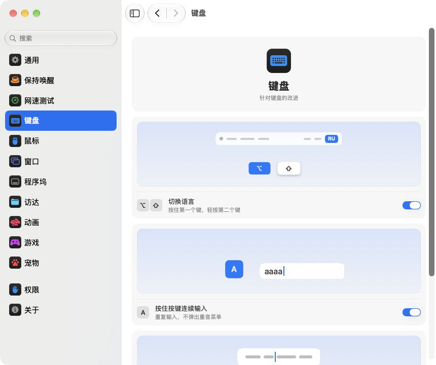

<p align="center"></p>
<h1 align="center">pikapik</h1>
<p align="center">键盘、鼠标、窗口和访达的小改进，就在 Mac 的菜单栏里。</p>
<p align="center"><sub><a href="../../README.md">English</a> · <a href="README.ru.md">Русский</a> · <a href="README.uk.md">Українська</a> · <a href="README.de.md">Deutsch</a> · <a href="README.fr.md">Français</a> · <a href="README.es.md">Español</a> · <a href="README.it.md">Italiano</a> · <a href="README.pt-BR.md">Português (Brasil)</a> · <a href="README.ja.md">日本語</a> · <b>简体中文</b> · <a href="README.ko.md">한국어</a> · <a href="README.ro.md">Română</a> · <a href="README.pl.md">Polski</a> · <a href="README.tr.md">Türkçe</a> · <a href="README.nl.md">Nederlands</a> · <a href="README.sv.md">Svenska</a> · <a href="README.cs.md">Čeština</a> · <a href="README.zh-Hant.md">繁體中文</a> · <a href="README.ar.md">العربية</a> · <a href="README.hi.md">हिन्दी</a> · <a href="README.id.md">Bahasa Indonesia</a> · <a href="README.vi.md">Tiếng Việt</a> · <a href="README.th.md">ไทย</a></sub></p>

<p align="center">
<picture>
<source media="(prefers-color-scheme: dark)" srcset="../media/settings-zh-Hans-dark.png">

</picture>
</p>

## 安装

```bash
brew install --cask dev-pikapik/pika-tools/pikapik && open -a pikapik
```

安装后，pikapik 会出现在屏幕顶部的菜单栏中。在你打开之前，所有功能都保持关闭。

<details>
<summary>没有 Homebrew？还有两种方法</summary>

不使用 Homebrew 时，打开“终端”，粘贴下面这行，然后按下 Return 键：

```bash
/bin/bash -c "$(curl -fsSL https://raw.githubusercontent.com/dev-pikapik/pika-tools/main/install.sh)"
```

或者下载 [pikapik.dmg](https://github.com/dev-pikapik/pika-tools/releases/latest/download/pikapik.dmg)，打开后将 App 拖到“应用程序”文件夹。

Homebrew 和脚本都会把 App 放到 `/Applications`，启动它，请求权限，并打开“登录时打开”。之后 App 会自动更新，详见**更新**。如需移除，请参阅**卸载**。

</details>

## 功能

<table>
<tbody><tr>
<td width="50%" valign="top">
<picture><source media="(prefers-color-scheme: dark)" srcset="../media/keep-awake-dark.png"></picture>
<br><b>保持唤醒</b>
<br>Mac 想醒多久就醒多久，合上盖子也行。
</td>
<td width="50%" valign="top">
<picture><source media="(prefers-color-scheme: dark)" srcset="../media/command-keys-dark.png"></picture>
<br><b>保护 ⌘Q 和 ⌘W</b>
<br>不会误退出或误关闭。真想这么做时，加上 ⇧。
</td>
</tr></tbody>
<tbody><tr>
<td width="50%" valign="top">
<picture><source media="(prefers-color-scheme: dark)" srcset="../media/compress-dark.png"></picture>
<br><b>较小副本</b>
<br>右键点按照片、PDF 或视频，旁边就会出现一个更小的副本。
</td>
<td width="50%" valign="top">
<picture><source media="(prefers-color-scheme: dark)" srcset="../media/convert-dark.png"></picture>
<br><b>转换</b>
<br>通过右键菜单把图片、视频或歌曲存成其他格式。
</td>
</tr></tbody>
<tbody><tr>
<td width="50%" valign="top">
<picture><source media="(prefers-color-scheme: dark)" srcset="../media/input-switch-dark.png"></picture>
<br><b>切换语言</b>
<br>按住 ⌥ 再轻点 ⇧，就能切换键盘语言。
</td>
<td width="50%" valign="top">
<picture><source media="(prefers-color-scheme: dark)" srcset="../media/quit-on-close-dark.png"></picture>
<br><b>关闭最后一个窗口时退出</b>
<br>关闭 App 的最后一个窗口，App 也随之退出。
</td>
</tr></tbody>
<tbody><tr>
<td width="50%" valign="top">
<picture><source media="(prefers-color-scheme: dark)" srcset="../media/window-zoom-dark.png"></picture>
<br><b>绿色按钮放大窗口</b>
<br>窗口铺满屏幕，但不进入全屏模式。
</td>
<td width="50%" valign="top">
<picture><source media="(prefers-color-scheme: dark)" srcset="../media/dock-hide-dark.png"></picture>
<br><b>在程序坞中点按以隐藏</b>
<br>点按正在使用的 App，它就会让开。
</td>
</tr></tbody>
<tbody><tr>
<td width="50%" valign="top">
<picture><source media="(prefers-color-scheme: dark)" srcset="../media/new-file-dark.png"></picture>
<br><b>新建文件</b>
<br>在访达中右键点按，输入名称，空文件就建好了。
</td>
<td width="50%" valign="top">
<picture><source media="(prefers-color-scheme: dark)" srcset="../media/finder-cut-dark.png"></picture>
<br><b>⌘X 移动文件</b>
<br>在访达中剪切文件，再粘贴到想要的位置。
</td>
</tr></tbody>
<tbody><tr>
<td width="50%" valign="top">
<picture><source media="(prefers-color-scheme: dark)" srcset="../media/finder-open-dark.png"></picture>
<br><b>Enter 打开文件</b>
<br>在访达中选中文件，按 Enter 即可打开。
</td>
<td width="50%" valign="top">
<picture><source media="(prefers-color-scheme: dark)" srcset="../media/finder-delete-dark.png"></picture>
<br><b>Delete 移到废纸篓</b>
<br>在访达中按 ⌫，选中的文件就会移到废纸篓。
</td>
</tr></tbody>
<tbody><tr>
<td width="50%" valign="top">
<picture><source media="(prefers-color-scheme: dark)" srcset="../media/game-mode-dark.png"></picture>
<br><b>游戏模式</b>
<br>玩游戏时，不会有东西弹到游戏上面，也不会把游戏关掉。
</td>
<td width="50%" valign="top">
<picture><source media="(prefers-color-scheme: dark)" srcset="../media/speed-test-dark.png"></picture>
<br><b>网速测试</b>
<br>网速有多快、够做什么，一看便知。
</td>
</tr></tbody>
<tbody><tr>
<td width="50%" valign="top">
<picture><source media="(prefers-color-scheme: dark)" srcset="../media/side-buttons-dark.png"></picture>
<br><b>鼠标侧键</b>
<br>按键 4 和 5 用于返回和前进，就像在触控板上轻扫。
</td>
<td width="50%" valign="top">
<picture><source media="(prefers-color-scheme: dark)" srcset="../media/wheel-lines-dark.png"></picture>
<br><b>按行滚动</b>
<br>无论滚轮转得多快，每一格都滚动相同的距离。
</td>
</tr></tbody>
<tbody><tr>
<td width="50%" valign="top">
<picture><source media="(prefers-color-scheme: dark)" srcset="../media/wheel-direction-dark.png"></picture>
<br><b>滚动方向</b>
<br>触控板一个方向，鼠标另一个方向。
</td>
<td width="50%" valign="top">
<picture><source media="(prefers-color-scheme: dark)" srcset="../media/linear-pointer-dark.png"></picture>
<br><b>关闭指针加速</b>
<br>手移动多少，指针就移动多少。
</td>
</tr></tbody>
<tbody><tr>
<td width="50%" valign="top">
<picture><source media="(prefers-color-scheme: dark)" srcset="../media/key-repeat-dark.png"></picture>
<br><b>按住按键连续输入</b>
<br>按住按键会重复输入字母，而不是弹出重音符号菜单。
</td>
<td width="50%" valign="top">
<picture><source media="(prefers-color-scheme: dark)" srcset="../media/home-end-dark.png"></picture>
<br><b>Home 和 End</b>
<br>输入时跳到行首或行尾。
</td>
</tr></tbody>
<tbody><tr>
<td width="50%" valign="top">
<picture><source media="(prefers-color-scheme: dark)" srcset="../media/animations-dark.png"></picture>
<br><b>动画</b>
<br>让程序坞、窗口和快速查看更快，甚至瞬间完成。
</td>
<td width="50%" valign="top">
<picture><source media="(prefers-color-scheme: dark)" srcset="../media/leftover-permissions-dark.png"></picture>
<br><b>已删除 App 的权限</b>
<br>清除 macOS 为已删除的 App 保留的权限。
</td>
</tr></tbody>
<tbody><tr>
<td width="50%" valign="top">
<picture><source media="(prefers-color-scheme: dark)" srcset="../media/pet-dark.png"></picture>
<br><b>桌面宠物</b>
<br>一个小伙伴在窗口后面散步。把它拎起来扔出去，或者按空格键让它跳一下。
</td>
</tr></tbody>
</table>

## 详细信息

<details>
<summary>首次启动</summary>

pikapik 需要两项权限。首次启动时，它会打开设置中的“权限”页面，一步步引导你完成，macOS 也会显示自己的提示。前往 **系统设置 › 隐私与安全性**，在以下两项中打开 pikapik：

- **辅助功能**：让 App 能在按键或点按传到其他 App 之前对其进行修改。
- **输入监控**：让 App 能够看到按键和点按。

App 会在一两秒内识别到更改，无需重新启动。

pikapik 不会记录、存储或发送你输入或点按的任何内容。事件只在内存中处理并立即传递出去。唯一的网络请求是检查更新，即向 GitHub 查询最新版本。

</details>

<details>
<summary>每项功能的详细说明</summary>

**保护 ⌘Q 和 ⌘W。** 单独按 ⌘Q 和 ⌘W 不会有任何反应，因此不会误退出 App 或误关窗口。想要退出或关闭时，加按 Shift：⇧⌘Q 退出，⇧⌘W 关闭。适用于所有 App。每个按键都有单独的开关。默认关闭。

**用 Option+Shift 切换语言。** 按住 Option 再按一下 Shift：macOS 会切换到下一个输入法。继续按住 Option 再按一下 Shift，就会继续往下切换。按住 Shift 再按一下 Option，则切回上一个。如果中途按了其他键、点按了鼠标，或者加按了 Command、Control 或 Fn，就不会切换，所以像 Option+Shift+箭头键这样的快捷键照常可用。默认关闭。

**按住按键连续输入。** 按住一个键，就会不停地重复输入这个字母，而不是弹出重音菜单。玩游戏和打字时都很方便。已经打开的 App 需重新启动后生效。关闭后，macOS 恢复原来的行为。默认关闭。

**Home 和 End 跳到行首和行尾。** 输入时，Home 把光标移到行首，End 移到行尾，不再滚动页面。按住 ⇧ 会选到那里，按住 ⌘ 会跳到整段文本的开头或末尾。在文本框以外，以及终端、虚拟机和远程桌面 App 中，这两个键照旧工作。你还可以添加其他需要照常工作的 App。默认关闭。

**关闭指针加速。** 无论鼠标移动得多快，指针都只移动与鼠标完全相同的距离。**追踪速度** 滑块用于设定指针移动的快慢。仅对鼠标有效，触控板保持不变。关闭此功能或退出 pikapik 后，macOS 会恢复它自己的设置。默认关闭。

**按行滚动。** 鼠标滚轮每滚一格，滚动的行数都一样，不管你转得多快。每格可以选 1 到 10 行，默认 3 行。自然滚动保持你在“系统设置”中的设置。只对鼠标有效，触控板保持不变。默认关闭。在 **每格距离** 滑块旁边，一张小页面会按所选距离滚动，圆点标出默认值。

有些 App 和游戏以精确像素计算滚动：遇到它们时，把同一个设置切换为按像素，每格可选 1 到 200 像素，默认 40。滑块还会显示这相当于屏幕高度的多少。

**触控板和鼠标的滚动方向。** macOS 只有一个自然滚动开关，同时作用于触控板和鼠标。打开此功能，为每一个选择方向：**自然**，页面像在 iPhone 上一样跟着手指走；或 **经典**，页面朝相反方向移动。触控板的选择也适用于横向滚动和抬起手指后的惯性滚动。妙控鼠标靠触摸滚动，所以跟随触控板的选择。在你的每台 Mac 上选择相同的方向，滚动在哪里都一样，即使用通用控制把鼠标移到另一台 Mac 上也是如此。默认关闭。打开时两者都和系统设置一致，所以在你选择别的方向之前什么都不会变。

**侧键用于返回和前进。** 鼠标按键 4 和 5 可以在访达、Safari 等 Apple App 以及许多其他 App 中后退和前进，就像在触控板上轻扫一样。自行处理这两个按键的 App 会原样收到它们。如果你的鼠标侧键方向相反，请打开 **交换侧键**。默认关闭。

**关闭最后一个窗口时退出。** 关闭 App 的最后一个窗口后，App 就会退出。访达会保持打开，在其他桌面上有窗口或有窗口最小化到程序坞的 App 也不会退出。你可以列出永远不要以这种方式退出的 App。默认关闭。

**在程序坞中点按以隐藏。** 在程序坞中点按当前正在使用的 App 的图标，它就会隐藏。再点按一次即可恢复。默认关闭。

**绿色按钮放大窗口。** 点按窗口的绿色按钮，窗口会铺满屏幕，而不会进入全屏幕。再点按一次，恢复原来的大小。按住 ⌥ 时，按钮照常工作。全屏幕仍可在按钮的菜单中或按 ⌃⌘F 使用。可以列出绿色按钮应照常工作的 App。默认关闭。

**在访达中新建文件。** 在访达窗口或桌面上右键点按，选取 **新建文件**，输入名称，就会出现一个空文件。默认为 .txt。默认关闭。

**在访达中用 Enter 打开文件。** 在访达窗口或桌面上选中文件，按 Return 或 Enter 即可打开。按 F2 或 fn F2 可重命名所选文件。在文本框中，比如输入名称时，这些键照常工作。默认关闭。

**在访达中用 ⌘X 剪切文件。** 选中文件并按 ⌘X，打开目标文件夹后按 ⌘V，文件会移动到那里而不是被拷贝。按 ⌘C 可取消剪切。默认关闭。

**在访达中用 Delete 删除文件。** 选中文件后按 ⌫ 或 ⌦（笔记本电脑上为 fn ⌫），文件就会移到废纸篓，和 ⌘⌫ 一样。重命名文件、搜索或在其他输入框中输入时，这两个键照常删除文字。默认关闭。

**在访达中制作较小副本。** 在访达中右键点按文件，然后选择 **制作较小副本**。照片、GIF、PDF 或视频的轻量版本会存储在旁边，通常小好几倍。WAV 或 AIFF 等未压缩的声音会变为小巧的 M4A。如果文件无法再缩小，就不会制作副本，pikapik 会告诉你。原文件保持不变，任何内容都不会离开你的 Mac。默认关闭。

**在访达中转换。** 在访达中右键点按文件，然后选择 **转换为**，即可存储为其他格式：图片存为 JPEG、PNG、HEIC、GIF、TIFF 或 PDF，视频存为 MP4、MOV 或只保留声音，音乐存为 M4A、WAV 或 AIFF。原文件保持不变，任何内容都不会离开你的 Mac。与较小副本分开开启。默认关闭。

**游戏模式。** 添加你的游戏后，玩游戏时 Mac 不会把你拉出游戏。聚焦、Siri、⌘Tab、调度中心和在桌面之间轻扫都不会在游戏上方打开，⌘Q 和 ⌘W 不会意外关闭游戏，指针不会滑到程序坞、菜单栏或另一块屏幕上，屏幕也保持常亮。每一项都可以在“游戏”页面单独开关，pikapik 还会推荐它在你的 Mac 上找到的游戏。游戏中 Control-点按仍是普通点按，Control+箭头也不会切换桌面。也能识别 Minecraft：添加 Minecraft Launcher 或 CurseForge，在 Minecraft 里就会打开这个模式。要退出游戏，请按 ⇧⌘Q；要关闭其窗口，请按 ⇧⌘W。⌥⌘Esc 始终有效。一离开游戏，一切照常工作。默认关闭。

每个工具在菜单和设置中都有单独的开关。

菜单栏图标一眼就能看出状态：工具正在运行时显示 pikapik 标志，全部关闭时同一个标志会变淡，工具已打开但缺少权限时显示警告三角形。

菜单栏面板一开始只显示几行。显示哪些行，由你来选：点按底部的铅笔按钮，勾选想看到的项目，再点按**完成**。隐藏的行仍会照常工作，并保留在设置中。面板在屏幕上放不下时，可以滚动。

App 跟随系统语言，或使用你在设置中选择的语言。支持本页顶部列出的全部 23 种语言。

</details>

<details>
<summary>保持唤醒</summary>

在你离开键盘时防止 Mac 进入睡眠：时长可以是 1 秒到 365 天之间的任意时间，或者一直持续到你手动关闭。在菜单中打开它，在设置中设定时长：输入天、小时、分钟和秒，按 ↑ 和 ↓，或点按 15 分钟到 8 小时的预设。菜单会显示剩余时间和结束时间。**显示器** 有两种选择。**始终开启**：不会熄灭，也不会出现屏幕保护程序和锁定屏幕。**照常关闭**：按自己的计时关闭，Mac 继续工作。**立即关闭显示器**（菜单中也有）会马上关闭显示器，Mac 继续工作：移动鼠标或按任意键即可唤醒。退出 pikapik 会结束“保持唤醒”。

在 MacBook 上，你还可以打开 **合盖时继续运行**。macOS 没有这样的开关，因此 pikapik 会运行 `pmset -a disablesleep 1` 并要求输入管理员密码：只有管理员才能更改 Mac 的睡眠方式。当“保持唤醒”结束、你退出 App 或 App 崩溃时，此设置都会自动恢复原状。如果不输入密码，什么都不会改变。合盖使用时请保持 Mac 通风良好。**电池电量低于 20% 时停止** 会在电池耗尽前结束本次会话。

通过“快捷指令”App，可以把“保持唤醒”、屏幕常亮和合盖模式放到控制中心、菜单栏或桌面小组件的按钮上，链接在“设置 › 保持唤醒”里拷贝。

</details>

<details>
<summary>网速测试</summary>

显示你的网络现在有多快。在“设置 › 网速测试”里点按**测速**，或者用铅笔按钮把这一行加到菜单后，点按菜单里的**测速**。大约半分钟后，就能看到下载和上传速度、延迟和响应能力，也就是网络繁忙时一切反应有多快。下面会用简单的话告诉你，这个网速够不够看 4K 电影、视频通话、玩在线游戏和下载大文件。测速使用 macOS 自带的 networkQuality 和 Apple 的服务器。上次的结果会一直保留到下次测速；用“快捷指令”里的链接，还能从控制中心开始测速。

</details>

<details>
<summary>设置</summary>

从菜单中选择 **设置…** 或按 ⌘, 打开设置，也可以从访达、启动台或聚焦搜索再次启动 pikapik。窗口打开期间，App 会显示在程序坞和 ⌘Tab 中。

- **通用**：登录时打开、外观（跟随系统、浅色或深色）、语言、更新和备份：把设置导出为文件或从文件导入，也可以通过 iCloud 云盘同步。
- **保持唤醒**：时长、显示器和合盖选项。
- **网速测试**：测网速，看看它适合做什么。
- **键盘**：语言切换、按键重复、Home 和 End。
- **鼠标**：指针加速和追踪速度、按行滚动、滚动方向、侧键。
- **窗口**：用绿色按钮放大窗口（附例外列表）、⌘Q 和 ⌘W 保护，以及关闭最后一个窗口时退出（附例外列表）。
- **程序坞**：在程序坞中点按以隐藏。
- **访达**：新建文件、较小副本和转换、用 Return 打开、用 ⌘X 剪切、用 ⌫ 删除。
- **权限**：两项权限的状态，开启同步后还有 iCloud 云盘的状态，以及打开“系统设置”中对应位置的按钮。
- **关于**：版本、更新日志链接和问题反馈链接。

许多设置配有一幅小图，展示它们的作用，例如保持唤醒的 Mac，或藏到 Dock 后面的窗口。图会随开关一起变化；如果在系统设置中开启了“减弱动态效果”，图就保持静止。

每个页面底部都有一个 **恢复默认…** 按钮。它会先询问你，然后关闭该页面上的工具并还原它们的选项，就像 pikapik 从未改动过一样。

**通过 iCloud 同步设置** 能让 pikapik 在你所有的 Mac 上保持一致。设置保存在 iCloud 云盘的 pika-tools 文件夹里，以最近一次的更改为准。默认关闭，并且需要先打开 iCloud 云盘。权限不会同步：每台 Mac 都会各自请求。

</details>

<details>
<summary>更新</summary>

pikapik 会在启动时以及每隔 6 小时检查新版本。你可以在“设置 › 通用”中关闭此功能。有新版本时，菜单中会出现 **更新到 …** 按钮：点按一下，App 就会下载更新、安装并重新启动。你也可以在“设置 › 通用”中点按 **立即检查** 手动检查。

使用 Homebrew 时，也可以运行 `brew upgrade --cask pikapik`。

从 1.3 版开始，更新后权限会保留。

</details>

<details>
<summary>卸载</summary>

```bash
/bin/bash -c "$(curl -fsSL https://raw.githubusercontent.com/dev-pikapik/pika-tools/main/uninstall.sh)"
```

如果是用 Homebrew 安装的：`brew uninstall --cask --zap pikapik`。

两种方式都会退出 App、将其从登录项中移除并删除。脚本还会重置它的权限。

</details>

<details>
<summary>常见问题</summary>

**为什么需要两项权限？**
macOS 把对键盘和鼠标的访问分成两部分。“输入监控”让 App 能看到事件，“辅助功能”让 App 能修改事件。屏蔽快捷键两者都需要。

**macOS 提示 App 来自身份不明的开发者。**
pikapik 已签名，但未经 Apple 公证。Homebrew 和安装脚本会帮你处理这一点。如果你用的是 dmg，请打开 **系统设置 › 隐私与安全性** 并点按 **仍要打开**，或者运行：

```bash
xattr -dr com.apple.quarantine /Applications/pikapik.app
```

**支持搭载 Intel 处理器的 Mac 吗？**
支持。这是适用于 Apple 芯片和 Intel 的通用 App，需要 macOS 14 Sonoma 或更高版本。

**权限已打开，但什么都不起作用。**
在 **系统设置 › 隐私与安全性** 中，用 − 按钮从两个列表中移除 pikapik，然后重新添加。pikapik 设置的“权限”页面中有按钮可以直接打开对应位置。

</details>

<p align="center">☕ 如果你喜欢 pikapik，可以<a href="https://buymeacoffee.com/pikapik">请我喝杯咖啡</a>，每一份心意都会用于 App 的开发与维护。</p>

<p align="center"><sub><a href="../whats-new/README.zh-Hans.md">更新内容</a> · <a href="https://github.com/dev-pikapik/homebrew-pika-tools">Homebrew tap</a> · <a href="../../CONTRIBUTING.md">自行构建</a> · <a href="../../LICENSE">MIT 许可证</a> · © 2026 pikapik</sub></p>
