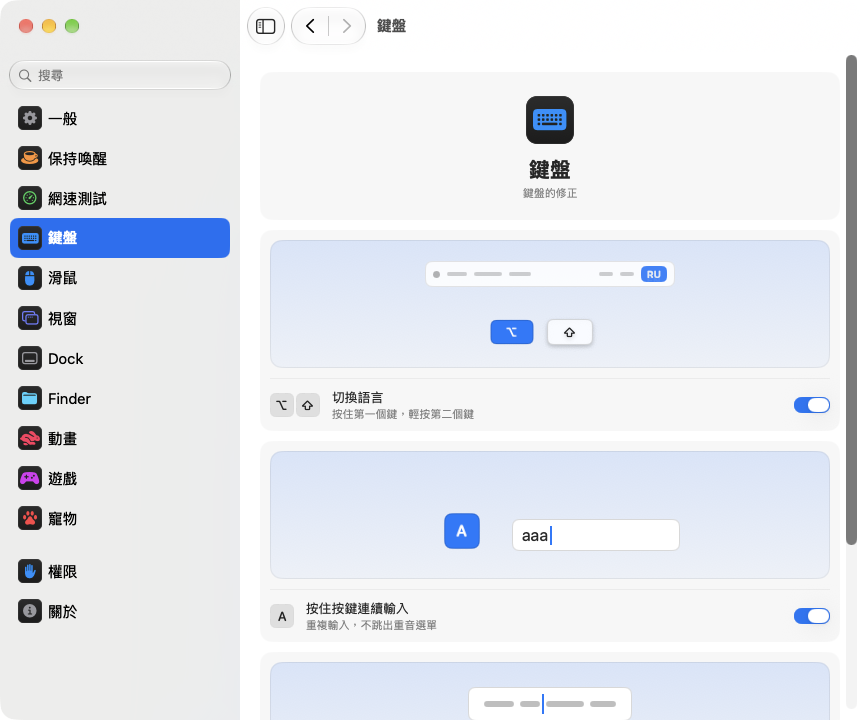

<p align="center"></p>
<h1 align="center">pika-tools</h1>
<p align="center">鍵盤、滑鼠、視窗和 Finder 的小改進，就在 Mac 的選單列裡。</p>
<p align="center"><sub><a href="../../README.md">English</a> · <a href="README.ru.md">Русский</a> · <a href="README.uk.md">Українська</a> · <a href="README.de.md">Deutsch</a> · <a href="README.fr.md">Français</a> · <a href="README.es.md">Español</a> · <a href="README.it.md">Italiano</a> · <a href="README.pt-BR.md">Português (Brasil)</a> · <a href="README.ja.md">日本語</a> · <a href="README.zh-Hans.md">简体中文</a> · <a href="README.ko.md">한국어</a> · <a href="README.ro.md">Română</a> · <a href="README.pl.md">Polski</a> · <a href="README.tr.md">Türkçe</a> · <a href="README.nl.md">Nederlands</a> · <a href="README.sv.md">Svenska</a> · <a href="README.cs.md">Čeština</a> · <b>繁體中文</b> · <a href="README.ar.md">العربية</a> · <a href="README.hi.md">हिन्दी</a> · <a href="README.id.md">Bahasa Indonesia</a> · <a href="README.vi.md">Tiếng Việt</a> · <a href="README.th.md">ไทย</a></sub></p>

<p align="center">
<picture>
<source media="(prefers-color-scheme: dark)" srcset="../media/settings-zh-Hant-dark.png">

</picture>
</p>

## 安裝

```bash
brew install --cask dev-pikapik/pika-tools/pika-tools && open -a pika-tools
```

安裝後，pika-tools 會出現在螢幕頂端的選單列。在你開啟之前，所有功能都保持關閉。

<details>
<summary>沒有 Homebrew？還有兩種方式</summary>

不使用 Homebrew 時，打開「終端機」，貼上下面這一行，然後按下 Return 鍵：

```bash
/bin/bash -c "$(curl -fsSL https://raw.githubusercontent.com/dev-pikapik/pika-tools/main/install.sh)"
```

或下載 [pika-tools.dmg](https://github.com/dev-pikapik/pika-tools/releases/latest/download/pika-tools.dmg)，打開後將 App 拖到「應用程式」檔案夾。

Homebrew 和指令碼都會把 App 放到 `/Applications`，啟動它，要求權限，並開啟「登入時打開」。之後 App 會自動更新，請參閱**更新**。若要移除，請參閱**解除安裝**。

</details>

## 功能

<table>
<tbody><tr>
<td width="50%" valign="top">
<picture><source media="(prefers-color-scheme: dark)" srcset="../media/keep-awake-dark.png"></picture>
<br><b>保持喚醒</b>
<br>Mac 想醒多久就醒多久，闔上螢幕也可以。
</td>
<td width="50%" valign="top">
<picture><source media="(prefers-color-scheme: dark)" srcset="../media/command-keys-dark.png"></picture>
<br><b>保護 ⌘Q 和 ⌘W</b>
<br>不會誤結束或誤關閉。真的要這麼做時，加上 ⇧。
</td>
</tr></tbody>
<tbody><tr>
<td width="50%" valign="top">
<picture><source media="(prefers-color-scheme: dark)" srcset="../media/compress-dark.png"></picture>
<br><b>較小拷貝</b>
<br>在照片、PDF 或影片上按右鍵，旁邊就會出現較小的拷貝。
</td>
<td width="50%" valign="top">
<picture><source media="(prefers-color-scheme: dark)" srcset="../media/convert-dark.png"></picture>
<br><b>轉換</b>
<br>從右鍵選單把圖片、影片或歌曲存成其他格式。
</td>
</tr></tbody>
<tbody><tr>
<td width="50%" valign="top">
<picture><source media="(prefers-color-scheme: dark)" srcset="../media/input-switch-dark.png"></picture>
<br><b>切換語言</b>
<br>按住 ⌥ 再點一下 ⇧，就能切換鍵盤語言。
</td>
<td width="50%" valign="top">
<picture><source media="(prefers-color-scheme: dark)" srcset="../media/quit-on-close-dark.png"></picture>
<br><b>關閉最後一個視窗時結束</b>
<br>關閉 App 的最後一個視窗，App 也會跟著結束。
</td>
</tr></tbody>
<tbody><tr>
<td width="50%" valign="top">
<picture><source media="(prefers-color-scheme: dark)" srcset="../media/window-zoom-dark.png"></picture>
<br><b>綠色按鈕放大視窗</b>
<br>視窗填滿螢幕，但不進入全螢幕模式。
</td>
<td width="50%" valign="top">
<picture><source media="(prefers-color-scheme: dark)" srcset="../media/dock-hide-dark.png"></picture>
<br><b>在 Dock 中按一下以隱藏</b>
<br>按一下正在使用的 App，它就會讓開。
</td>
</tr></tbody>
<tbody><tr>
<td width="50%" valign="top">
<picture><source media="(prefers-color-scheme: dark)" srcset="../media/new-file-dark.png"></picture>
<br><b>新增檔案</b>
<br>在 Finder 中按右鍵、輸入名稱，空白檔案就完成了。
</td>
<td width="50%" valign="top">
<picture><source media="(prefers-color-scheme: dark)" srcset="../media/finder-cut-dark.png"></picture>
<br><b>⌘X 搬移檔案</b>
<br>在 Finder 中剪下檔案，再貼到想要的位置。
</td>
</tr></tbody>
<tbody><tr>
<td width="50%" valign="top">
<picture><source media="(prefers-color-scheme: dark)" srcset="../media/finder-open-dark.png"></picture>
<br><b>Enter 打開檔案</b>
<br>在 Finder 中選取檔案，按 Enter 就能打開。
</td>
<td width="50%" valign="top">
<picture><source media="(prefers-color-scheme: dark)" srcset="../media/finder-delete-dark.png"></picture>
<br><b>Delete 丟到垃圾桶</b>
<br>在 Finder 中按 ⌫，選取的檔案就會丟到垃圾桶。
</td>
</tr></tbody>
<tbody><tr>
<td width="50%" valign="top">
<picture><source media="(prefers-color-scheme: dark)" srcset="../media/game-mode-dark.png"></picture>
<br><b>遊戲模式</b>
<br>玩遊戲時，不會有東西跳到遊戲上面，也不會把遊戲關掉。
</td>
<td width="50%" valign="top">
<picture><source media="(prefers-color-scheme: dark)" srcset="../media/speed-test-dark.png"></picture>
<br><b>網速測試</b>
<br>網路有多快、夠做什麼，一看就知道。
</td>
</tr></tbody>
<tbody><tr>
<td width="50%" valign="top">
<picture><source media="(prefers-color-scheme: dark)" srcset="../media/side-buttons-dark.png"></picture>
<br><b>滑鼠側邊按鈕</b>
<br>按鈕 4 和 5 用於返回和前進，就像在觸控式軌跡板上滑動。
</td>
<td width="50%" valign="top">
<picture><source media="(prefers-color-scheme: dark)" srcset="../media/wheel-lines-dark.png"></picture>
<br><b>按行捲動</b>
<br>無論滾輪轉多快，每一格都捲動相同的距離。
</td>
</tr></tbody>
<tbody><tr>
<td width="50%" valign="top">
<picture><source media="(prefers-color-scheme: dark)" srcset="../media/wheel-direction-dark.png"></picture>
<br><b>捲動方向</b>
<br>觸控式軌跡板一個方向，滑鼠另一個方向。
</td>
<td width="50%" valign="top">
<picture><source media="(prefers-color-scheme: dark)" srcset="../media/linear-pointer-dark.png"></picture>
<br><b>關閉指標加速</b>
<br>手移動多少，指標就移動多少。
</td>
</tr></tbody>
<tbody><tr>
<td width="50%" valign="top">
<picture><source media="(prefers-color-scheme: dark)" srcset="../media/key-repeat-dark.png"></picture>
<br><b>按住按鍵連續輸入</b>
<br>按住按鍵會重複輸入字母，而不是跳出重音符號選單。
</td>
<td width="50%" valign="top">
<picture><source media="(prefers-color-scheme: dark)" srcset="../media/home-end-dark.png"></picture>
<br><b>Home 和 End</b>
<br>輸入時跳到行首或行尾。
</td>
</tr></tbody>
<tbody><tr>
<td width="50%" valign="top">
<picture><source media="(prefers-color-scheme: dark)" srcset="../media/animations-dark.png"></picture>
<br><b>動畫</b>
<br>讓 Dock、視窗和快速查看更快，甚至瞬間完成。
</td>
<td width="50%" valign="top"></td>
</tr></tbody>
</table>

## 詳細資訊

<details>
<summary>第一次啟動</summary>

pika-tools 需要兩項權限。第一次啟動時，它會打開設定中的「權限」頁面，一步步引導你完成，macOS 也會顯示自己的提示。前往 **系統設定 › 隱私權與安全性**，在以下兩項中開啟 pika-tools：

- **輔助使用**：讓 App 能在按鍵或按一下傳到其他 App 之前加以修改。
- **輸入監控**：讓 App 能夠看到按鍵和按一下的動作。

App 會在一兩秒內偵測到變更，不需要重新啟動。

pika-tools 不會記錄、儲存或傳送你輸入或點按的任何內容。事件只在記憶體中處理並立即傳遞出去。唯一的網路請求是檢查更新，也就是向 GitHub 詢問最新版本。

</details>

<details>
<summary>每項功能的詳細說明</summary>

**保護 ⌘Q 和 ⌘W。** 單獨按 ⌘Q 和 ⌘W 不會有任何作用，因此不會誤結束 App 或誤關視窗。想要結束或關閉時，加按 Shift：⇧⌘Q 結束，⇧⌘W 關閉。適用於所有 App。每個按鍵都有各自的開關。預設為關閉。

**用 Option+Shift 切換語言。** 按住 Option 再按一下 Shift：macOS 會切換到下一個輸入方式。繼續按住 Option 再按一下 Shift，就會繼續往下切換。按住 Shift 再按一下 Option，則切回上一個。如果中途按了其他鍵、按了一下滑鼠，或加按 Command、Control 或 Fn，就不會切換，所以像 Option+Shift+方向鍵這類快速鍵照常可用。預設為關閉。

**按住按鍵連續輸入。** 按住一個鍵，就會不停地重複輸入這個字母，而不是彈出重音選單。玩遊戲和打字時都很方便。已經打開的 App 需重新啟動後生效。關閉後，macOS 恢復原來的行為。預設為關閉。

**Home 和 End 跳到行首和行尾。** 輸入時，Home 會把游標移到行首，End 移到行尾，不再捲動頁面。按住 ⇧ 會選取到那裡，按住 ⌘ 會跳到整段文字的開頭或結尾。在文字欄位以外，以及終端機、虛擬機器和遠端桌面 App 中，這兩個鍵照常運作。你也可以加入其他需要照常運作的 App。預設關閉。

**關閉指標加速。** 無論滑鼠移動得多快，指標都只移動與滑鼠完全相同的距離，就像 LinearMouse 一樣。**軌跡速度** 滑桿用來設定指標移動的快慢。只對滑鼠有效，觸控式軌跡板保持不變。關閉此功能或結束 pika-tools 後，macOS 會恢復它自己的設定。預設為關閉。

**按行捲動。** 滑鼠滾輪每捲一格，捲動的行數都一樣，不管你轉得多快。每格可以選 1 到 10 行，預設 3 行。自然捲動維持你在「系統設定」中的設定。只對滑鼠有效，觸控式軌跡板維持不變。預設為關閉。在 **每格距離** 滑桿旁邊，一張小頁面會依所選距離捲動，圓點標示預設值。

有些 App 和遊戲以精確像素計算捲動：遇到它們時，把同一個設定切換為按像素，每格可選 1 到 200 像素，預設 40。滑桿也會顯示這相當於螢幕高度的多少。

**觸控式軌跡板和滑鼠的捲動方向。** macOS 只有一個自然捲動開關，同時作用於觸控式軌跡板和滑鼠。開啟此功能，為每一個選擇方向：**自然**，頁面像在 iPhone 上一樣跟著手指走；或 **經典**，頁面朝相反方向移動。觸控式軌跡板的選擇也適用於橫向捲動和抬起手指後的慣性捲動。巧控滑鼠靠觸碰捲動，所以跟隨觸控式軌跡板的選擇。在你的每台 Mac 上選擇相同的方向，捲動在哪裡都一樣，即使用通用控制把滑鼠移到另一台 Mac 上也是如此。預設關閉。開啟時兩者都和系統設定一致，所以在你選擇別的方向之前什麼都不會變。

**側邊按鈕用於返回和前進。** 滑鼠按鈕 4 和 5 可以在 Safari、Finder 等 Apple App，以及 Firefox、Opera 和 ForkLift 中返回和前進，就像在觸控式軌跡板上輕掃一樣。其他 App，例如 JetBrains 系列 IDE，會原樣收到這兩個按鈕，並按自己的方式處理。如果你的滑鼠側邊按鈕方向相反，請開啟 **交換側邊按鈕**。預設為關閉。

**關閉最後一個視窗時結束。** 關閉 App 的最後一個視窗後，App 就會結束。Finder 會保持開啟，在其他桌面上有視窗或有視窗縮到 Dock 的 App 也不會結束。你可以列出永遠不要以這種方式結束的 App。預設為關閉。

**在 Dock 中按一下以隱藏。** 在 Dock 中按一下目前正在使用的 App 圖像，它就會隱藏。再按一下即可恢復。預設為關閉。

**綠色按鈕放大視窗。** 按一下視窗的綠色按鈕，視窗會填滿螢幕，而不會進入全螢幕。再按一下，恢復原本大小。按住 ⌥ 時，按鈕照常運作。全螢幕仍可在按鈕的選單中或按 ⌃⌘F 使用。可以列出綠色按鈕應照常運作的 App。預設為關閉。

**在 Finder 中新增檔案。** 在 Finder 視窗或桌面上按右鍵，選擇 **新增檔案**，輸入名稱，就會出現一個空白檔案。預設為 .txt。預設關閉。

**在 Finder 中用 Enter 打開檔案。** 在 Finder 視窗或桌面上選取檔案，按 Return 或 Enter 就會打開。按 F2 或 fn F2 可重新命名所選檔案。在文字欄位中，例如輸入名稱時，這些按鍵照常運作。預設關閉。

**在 Finder 中用 ⌘X 剪下檔案。** 選取檔案並按 ⌘X，打開目的地檔案夾後按 ⌘V，檔案會移到那裡而不是被拷貝。按 ⌘C 可取消剪下。預設關閉。

**在 Finder 中用 Delete 刪除檔案。** 選取檔案後按 ⌫ 或 ⌦（筆電上為 fn ⌫），檔案就會移到垃圾桶，和 ⌘⌫ 一樣。重新命名檔案、搜尋或在其他欄位中輸入時，這兩個鍵照常刪除文字。預設關閉。

**在 Finder 中製作較小拷貝。** 在 Finder 中按右鍵點按檔案，然後選擇 **製作較小拷貝**。照片、GIF、PDF 或影片的輕量版本會儲存在旁邊，通常小好幾倍。WAV 或 AIFF 等未壓縮的聲音會變成小巧的 M4A。如果檔案無法再縮小，就不會製作拷貝，pika-tools 會告訴你。原始檔案維持不變，任何內容都不會離開你的 Mac。預設關閉。

**在 Finder 中轉換。** 在 Finder 中按右鍵點按檔案，然後選擇 **轉換為**，即可儲存為其他格式：圖片存為 JPEG、PNG、HEIC、GIF、TIFF 或 PDF，影片存為 MP4、MOV 或只保留聲音，音樂存為 M4A、WAV 或 AIFF。原始檔案維持不變，任何內容都不會離開你的 Mac。與較小拷貝分開開啟。預設關閉。

**遊戲模式。** 加入你的遊戲後，玩遊戲時 Mac 不會把你拉出遊戲。Spotlight、Siri、⌘Tab、指揮中心和在桌面之間滑動都不會在遊戲上方打開，⌘Q 和 ⌘W 不會意外關閉遊戲，指標不會滑到 Dock、選單列或另一個螢幕上，螢幕也保持開啟。每一項都可以在「遊戲」頁面單獨開關，pika-tools 也會推薦它在你的 Mac 上找到的遊戲。遊戲中 Control 點按仍是一般點按，Control+方向鍵也不會切換桌面。也能辨識 Minecraft：加入 Minecraft Launcher 或 CurseForge，在 Minecraft 裡就會開啟這個模式。要結束遊戲，請按 ⇧⌘Q；要關閉其視窗，請按 ⇧⌘W。⌥⌘Esc 永遠有效。一離開遊戲，一切照常運作。預設關閉。

每個工具在選單和設定中都有各自的開關。

選單列圖像一眼就能看出狀態：工具正在運作時顯示帶有點按標記的箭頭，全部關閉時顯示加上斜線的箭頭，工具已開啟但缺少權限時顯示警告三角形。

選單列面板一開始只顯示幾列。要顯示哪些列，由你決定：按一下底部的鉛筆按鈕，勾選想看到的項目，再按一下**完成**。隱藏的列仍會照常運作，並保留在設定中。面板在螢幕上放不下時，可以捲動。

App 會跟隨系統語言，或使用你在設定中選擇的語言。支援本頁頂端列出的全部 23 種語言。

</details>

<details>
<summary>保持喚醒</summary>

在你離開鍵盤時防止 Mac 進入睡眠：時間可以是 1 秒到 365 天之間的任意長度，或一直持續到你手動關閉。在選單中開啟它，並在設定中設定時間長度：輸入天、小時、分鐘和秒，按 ↑ 和 ↓，或按一下 15 分鐘到 8 小時的預設值。選單會顯示剩餘時間和結束時間。**顯示器** 有兩種選擇。**永遠開啟**：不會熄滅，也不會出現螢幕保護程式和鎖定畫面。**照常關閉**：依自己的計時關閉，Mac 繼續運作。**立即關閉顯示器**（選單中也有）會馬上關閉顯示器，Mac 繼續運作：移動滑鼠或按任意鍵即可喚醒。結束 pika-tools 也會結束「保持喚醒」。

在 MacBook 上，你也可以開啟 **闔上螢幕時繼續運作**。macOS 沒有這樣的開關，因此 pika-tools 會執行 `pmset -a disablesleep 1` 並要求輸入管理者密碼：只有管理者才能更改 Mac 的睡眠方式。當「保持喚醒」結束、你結束 App 或 App 當掉時，此設定都會自動恢復原狀。如果不輸入密碼，什麼都不會改變。闔上螢幕使用時，請保持 Mac 通風良好。**電池電量低於 20% 時停止** 會在電池耗盡前結束這次工作階段。

透過「捷徑」App，可以把「保持喚醒」、螢幕常亮和闔蓋模式放到控制中心、選單列或桌面小工具的按鈕上，連結在「設定 › 保持喚醒」裡拷貝。

</details>

<details>
<summary>網速測試</summary>

顯示你的網路現在有多快。在「設定 › 網速測試」裡點按**測速**，或者用鉛筆按鈕把這一列加到選單後，點按選單裡的**測速**。大約半分鐘後，就能看到下載和上傳速度、延遲和回應能力，也就是網路忙碌時一切反應有多快。下面會用簡單的話告訴你，這個網速夠不夠看 4K 電影、視訊通話、玩線上遊戲和下載大型檔案。測速使用 macOS 內建的 networkQuality 和 Apple 的伺服器。上次的結果會一直保留到下次測速；用「捷徑」裡的連結，還能從控制中心開始測速。

</details>

<details>
<summary>設定</summary>

從選單中選擇 **設定⋯** 或按 ⌘, 打開設定，也可以從 Finder、Launchpad 或 Spotlight 再次啟動 pika-tools。視窗打開期間，App 會顯示在 Dock 和 ⌘Tab 中。

- **一般**：登入時打開、外觀（跟隨系統、淺色或深色）、語言、更新和備份：把設定輸出為檔案或從檔案輸入，也可以透過 iCloud 雲碟同步。
- **保持喚醒**：時間長度、顯示器和螢幕闔上選項。
- **網速測試**：測網速，看看它適合做什麼。
- **鍵盤**：語言切換、按鍵重複、Home 和 End。
- **滑鼠**：指標加速和軌跡速度、按行捲動、捲動方向、側邊按鈕。
- **視窗**：用綠色按鈕放大視窗（附例外列表）、⌘Q 和 ⌘W 保護，以及關閉最後一個視窗時結束（附例外列表）。
- **Dock**：在 Dock 中按一下以隱藏。
- **Finder**：新增檔案、較小拷貝和轉換、用 Return 打開、用 ⌘X 剪下、用 ⌫ 刪除。
- **權限**：兩項權限的狀態，開啟同步後還有 iCloud 雲碟的狀態，以及打開「系統設定」中對應位置的按鈕。
- **關於**：版本、更新記錄連結和問題回報連結。

許多設定附有一張小圖，展示它們的作用，例如保持喚醒的 Mac，或藏到 Dock 後面的視窗。圖會隨開關一起變化；如果在系統設定中開啟了「減少動態效果」，圖就保持靜止。

每個頁面底部都有一個 **回復預設值…** 按鈕。它會先詢問你，然後關閉該頁面上的工具並還原它們的選項，就像 pika-tools 從未動過一樣。

**透過 iCloud 同步設定** 能讓 pika-tools 在你所有的 Mac 上保持一致。設定存放在 iCloud 雲碟的 pika-tools 檔夾裡，以最近一次的更改為準。預設為關閉，而且需要先開啟 iCloud 雲碟。權限不會同步：每台 Mac 都會各自請求。

</details>

<details>
<summary>更新</summary>

pika-tools 會在啟動時以及每隔 6 小時檢查新版本。你可以在「設定 › 一般」中關閉此功能。有新版本時，選單中會出現 **更新到 ⋯** 按鈕：按一下，App 就會下載更新、安裝並重新啟動。你也可以在「設定 › 一般」中按一下 **立即檢查** 手動檢查。

使用 Homebrew 時，也可以執行 `brew upgrade --cask pika-tools`。

從 1.3 版開始，更新後權限會保留。

</details>

<details>
<summary>解除安裝</summary>

```bash
/bin/bash -c "$(curl -fsSL https://raw.githubusercontent.com/dev-pikapik/pika-tools/main/uninstall.sh)"
```

如果是用 Homebrew 安裝的：`brew uninstall --cask --zap pika-tools`。

兩種方式都會結束 App、將其從登入項目中移除並刪除。指令碼還會重置它的權限。

</details>

<details>
<summary>常見問題</summary>

**為什麼需要兩項權限？**
macOS 把對鍵盤和滑鼠的存取分成兩部分。「輸入監控」讓 App 能看到事件，「輔助使用」讓 App 能修改事件。阻擋快速鍵兩者都需要。

**macOS 提示 App 來自未識別的開發者。**
pika-tools 已簽署，但未經 Apple 公證。Homebrew 和安裝指令碼會幫你處理這一點。如果你用的是 dmg，請打開 **系統設定 › 隱私權與安全性** 並按一下 **強制打開**，或執行：

```bash
xattr -dr com.apple.quarantine /Applications/pika-tools.app
```

**支援搭載 Intel 處理器的 Mac 嗎？**
支援。這是適用於 Apple 晶片和 Intel 的通用 App，需要 macOS 14 Sonoma 或以上版本。

**權限已開啟，但什麼都沒有作用。**
在 **系統設定 › 隱私權與安全性** 中，用 − 按鈕從兩個列表中移除 pika-tools，然後重新加入。pika-tools 設定的「權限」頁面中有按鈕可以直接打開對應位置。

</details>

<p align="center">☕ 如果你喜歡 pika-tools，可以<a href="https://buymeacoffee.com/pikapik">請我喝杯咖啡</a>，每一份心意都會用於 App 的開發與維護。</p>

<p align="center"><sub><a href="../whats-new/README.zh-Hant.md">更新內容</a> · <a href="https://github.com/dev-pikapik/homebrew-pika-tools">Homebrew tap</a> · <a href="../../CONTRIBUTING.md">自行建置</a> · <a href="../../LICENSE">MIT 授權</a> · © 2026 pikapik</sub></p>
