

<h1 align="center">pikapik의 새로운 기능</h1>

업데이트마다 몇 마디 말과 그림 한 장으로, 최신 순으로 소개합니다.

<a href="README.md">English</a> · <a href="README.ru.md">Русский</a> · <a href="README.uk.md">Українська</a> · <a href="README.de.md">Deutsch</a> · <a href="README.fr.md">Français</a> · <a href="README.es.md">Español</a> · <a href="README.it.md">Italiano</a> · <a href="README.pt-BR.md">Português (Brasil)</a> · <a href="README.ja.md">日本語</a> · <a href="README.zh-Hans.md">简体中文</a> · <b>한국어</b> · <a href="README.ro.md">Română</a> · <a href="README.pl.md">Polski</a> · <a href="README.tr.md">Türkçe</a> · <a href="README.nl.md">Nederlands</a> · <a href="README.sv.md">Svenska</a> · <a href="README.cs.md">Čeština</a> · <a href="README.zh-Hant.md">繁體中文</a> · <a href="README.ar.md">العربية</a> · <a href="README.hi.md">हिन्दी</a> · <a href="README.id.md">Bahasa Indonesia</a> · <a href="README.vi.md">Tiếng Việt</a> · <a href="README.th.md">ไทย</a>

---

## 펫이 더 이상 창 뒤에서 사라지지 않아요

1.30.2 · 2026년 10월 9일

창에 가려져도 펫은 계속 움직이고, 선택을 놓으면 땅으로 떨어져요.

<picture><source media="(prefers-color-scheme: dark)" srcset="../media/pet-dark.png">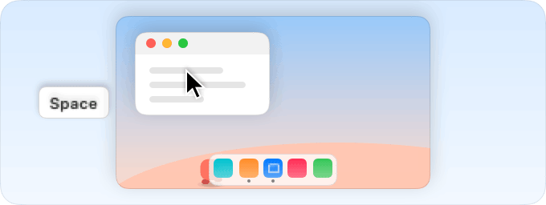</picture>

펫이 사는 띠를 창이 전부 가리면 pikapik이 펫을 일시 정지해서 펫이 공중에 멈춰 버릴 수 있었어요. 이제 펫과 공은 창 뒤에서도 계속 걷고, 떨어지고, 놀아요. 그리기만 잠시 쉬어요.

<picture><source media="(prefers-color-scheme: dark)" srcset="../media/whats-new/1.29.0/pet-ball-dark.png">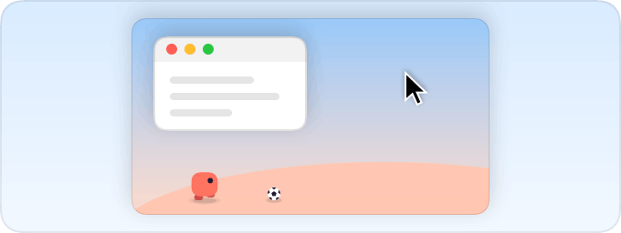</picture>

선택 상자가 창 뒤에서 펫을 들어 올려도, 놓는 순간 펫이 떨어져서 다시 Dock 옆에 보여요.

그리고 선택 상자가 펫을 자기 띠보다 높이 들어 올리지 않아요.

**사용해 보기:** 창을 최대로 키우고, 그 뒤에서 선택 상자로 펫을 들어 올린 다음 놓아 보세요. 펫이 떨어져 Dock 옆에 나타나요.

---

## 데스크탑 선택 상자가 다시 작동해요

1.30.1 · 2026년 10월 9일

펫과 공이 다시 선택 상자 위로 뛰어오르고, 앱 목록은 앱일 때만 빛나요.

<picture><source media="(prefers-color-scheme: dark)" srcset="../media/whats-new/1.29.0/pet-ball-dark.png"></picture>

Dock이나 원격 데스크탑 앱이 화면 전체를 덮고 있으면 데스크탑에 그린 선택 상자를 pikapik이 알아채지 못했어요. 이제 다시 알아채고, 펫과 공이 예전처럼 그 위로 뛰어올라요.

<picture><source media="(prefers-color-scheme: dark)" srcset="../media/whats-new/1.28.0/app-shelf-dark.png"></picture>

설정의 앱 목록은 앱을 끌어왔을 때만 빛나요. 다른 파일은 무시돼서 테두리도 나타나지 않고 쓸데없는 항목도 추가되지 않아요. 앱을 다른 파일과 함께 끌어오면 앱만 추가돼요.

그리고 앱을 놓거나 포인터를 치우면 테두리가 바로 꺼져요.

**사용해 보기:** 데스크탑에 선택 상자를 그리고 펫이 그 위로 뛰어오르는 걸 지켜보세요.

---

## 종료해도 pikapik이 꺼지지 않습니다

1.30.0 · 2026년 10월 9일

습관처럼 종료를 눌렀나요? 단축키, ‘잠자기 방지’, 펫은 그대로 계속 작동합니다.

<picture><source media="(prefers-color-scheme: dark)" srcset="../media/keep-awake-dark.png"></picture>

‘종료’를 선택하거나 ⌘Q를 누르거나 Dock에서 pikapik을 종료하면, 창을 닫고 메뉴 막대 아이콘을 숨기지만 백그라운드에서 조용히 계속 작동합니다. 단축키, ‘잠자기 방지’, 펫은 그대로 켜져 있습니다. 아이콘을 다시 보려면 pikapik을 한 번 더 열기만 하면 됩니다.

<picture><source media="(prefers-color-scheme: dark)" srcset="../media/pet-dark.png"></picture>

정말 종료하고 싶다면 Option(⌥) 키를 누른 채 ‘종료’를 선택하거나 ⌥⌘Q를 누르세요. pikapik이 처음 백그라운드로 갈 때 무슨 일이 일어났는지 알려 주고, 그 자리에서 완전히 종료할 수도 있습니다.

예전 방식이 더 좋다면 설정 › 일반에서 ‘종료 후에도 백그라운드에서 실행’을 끄세요. 업데이트, 언어 변경, 로그아웃, 재시동, 시스템 종료 때는 언제나 pikapik이 완전히 종료되므로 기다릴 일이 없습니다.

**사용해 보기:** ⌘Q를 누른 다음 pikapik을 다시 열어 아이콘을 되돌려 보세요.

---

## 펫이 모든 화면을 걸어 다녀요

1.29.1 · 2026년 10월 9일

모니터가 두 대 이상인가요? 이제 펫과 공이 어느 화면이든 함께하고, 길을 잃지도 않아요.

<picture><source media="(prefers-color-scheme: dark)" srcset="../media/pet-dark.png"></picture>

펫이 한 화면의 가장자리에 닿으면 그대로 옆 화면으로 넘어가고, 공도 뒤따라 굴러가요. 마우스로 펫이나 공을 들어 원하는 화면으로 옮길 수도 있어요. 앱이 전체 화면이 되면 방해되지 않게 다른 화면으로 옮겨 가고, 모니터를 빼면 주 화면으로 돌아와요.

<picture><source media="(prefers-color-scheme: dark)" srcset="../media/whats-new/1.29.0/pet-ball-dark.png"></picture>

공이 더 이상 구석에 끼지 않아요. 펫이 달려가 공을 머리 위로 뒤로 퍼 올리고 계속 놀아요.

그리고 펫이 더는 사라지지 않아요. 2초마다 화면에 있는지 스스로 확인하고, 잠자기, Mac 잠금, 데스크탑 전환, 전체 화면 뒤에 문제가 생겨도 곧바로 알아서 돌아와요.

**사용해 보기:** 펫을 다른 화면으로 옮기거나 공을 구석으로 굴려 보세요.

**수정 사항**

- 던진 펫이 닿을 수 없을 만큼 높은 선택 상자에 내려앉았다가 사라지는 일이 없어졌어요.

---

## 펫에게 공이 생겼어요

1.29.0 · 2026년 10월 9일

이제 화면 아래쪽에서 작은 축구공이 굴러다녀요. 펫이 공을 가지고 놀고, 여러분도 함께 놀 수 있어요.

<picture><source media="(prefers-color-scheme: dark)" srcset="../media/whats-new/1.29.0/pet-ball-dark.png"></picture>

공은 진짜처럼 구르고 튀어요. 펫은 공을 쫓아가서 차고, 다시 쫓아가요. 포인터를 공 쪽으로 빠르게 움직이면 직접 찰 수 있고, 펫처럼 공을 집어 들고 옮겨서 던질 수도 있어요.

작은 비법이 있어요. 데스크탑의 빈 곳을 클릭하고 드래그해서 선택 상자를 그려 보세요. Shift를 눌러도 괜찮아요. 마우스 버튼을 누르고 있는 동안 상자는 선반이 돼요. 펫이 그 위로 뛰어오르고, 공도 올라갈 수 있어요. 버튼을 놓으면 선반은 사라져요.

데스크탑이 조용한 게 좋다면 펫 설정에서 ‘공’을 끄세요. 펫은 다시 혼자 산책해요.

**사용해 보기:** 설정 › 펫 › 공

**수정 사항**

- Dock 옆에서는 펫이 다시 마음껏 높이 뛰어요. Dock 바로 위에 있을 때만 낮게 있어서 Dock 위로 삐져나오지 않아요.

---

## 클릭이나 드래그로 앱 추가

1.28.0 · 2026년 10월 9일

설정의 모든 앱 목록에 이제 Dock에 있는 앱과 지금 열려 있는 앱이 보이고, Finder에서 앱을 끌어다 놓을 수도 있습니다.

<picture><source media="(prefers-color-scheme: dark)" srcset="../media/whats-new/1.28.0/app-shelf-dark.png"></picture>

초록색 버튼이나 Home과 End처럼 어떤 기능은 비켜 줄 앱을 고를 수 있어요. 예전에는 ‘앱 추가…’를 누르면 모든 것이 들어 있는 긴 폴더만 열렸습니다. 이제는 Dock의 앱과 지금 열려 있는 앱이 선반에 놓입니다. 앱을 클릭하면 추가되고, 한 번 더 클릭하면 빠집니다. 그 밖의 앱은 ‘기타…’에서 고르세요.

Finder에서 앱을 목록 위로 바로 끌어다 놓을 수도 있어요. 목록이 빛나며 앱이 들어갈 자리를 보여 줍니다. 게임도 같은 선반으로 똑같이 추가할 수 있어요.

문제가 생겼을 때 쓰는 GitHub 버그 신고 양식에서 이제 pikapik과 macOS 버전을 목록에서 고를 수 있어서, 알려 주시는 시간이 줄어듭니다.

**사용해 보기:** 설정 › 윈도우에서 ‘앱 추가…’

**수정 사항**

- 두 Mac 모두 클래식 스크롤 방향을 쓸 때 AnyDesk 같은 원격 데스크톱 앱을 통한 스크롤이 더 이상 두 번 뒤집히지 않습니다. 이제 pikapik은 실제 마우스나 트랙패드의 스크롤만 뒤집습니다. Mos처럼 자체적으로 부드러운 스크롤을 만드는 앱은 그 앱에서 방향을 설정하세요.
- 펫은 점프할 때도 걸을 때처럼 Dock 뒤에 머물고, 전체 화면 앱이나 게임에서 나오면 스스로 돌아옵니다.
- 설정의 작은 그림을 둘러싼 얇은 테두리가 Retina가 아닌 일반 디스플레이에서 더 이상 사라지지 않습니다.

---

## 펫은 언제나 보이고, 창은 바로 쓸 수 있게 열려요

1.27.3 · 2026년 10월 9일

펫이 점프 도중에 창 뒤로 숨지 않고, pikapik 창은 바로 쓸 수 있는 상태로 열려요.

<picture><source media="(prefers-color-scheme: dark)" srcset="../media/pet-dark.png"></picture>

펫이 포인터를 뛰어넘거나 데굴데굴 구르면 다른 앱의 창 뒤로 들어가 공중에서 사라질 때가 있었어요. 이제는 점프하는 내내 앞에 있다가, 땅에 내려오면 다시 창 뒤로 돌아가요.

<picture><source media="(prefers-color-scheme: dark)" srcset="../media/new-file-dark.png">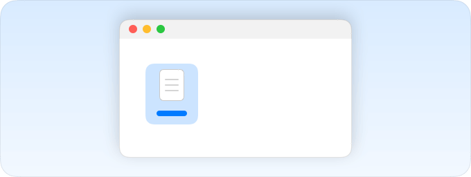</picture>

로그인할 때, 업데이트한 뒤, pikapik:// 링크로 pikapik이 백그라운드에서 조용히 시작되면 창이 회색으로 열리고 클릭할 때까지 다른 창 뒤에 남아 있을 때가 있었어요. 이제 설정과 새 파일 창이 앞으로 나와서 바로 입력할 수 있어요.

작은 사본 만들기 뒤에 나오는 메시지와 추가할 앱을 고르는 목록도 마찬가지예요. 따로 하실 일은 없어요.

**사용해 보기:** 설정 › 펫

---

## 새 파일이 돌아오고, 설정은 더 가벼워졌어요

1.27.2 · 2026년 10월 9일

이제 모두의 Finder 오른쪽 클릭 메뉴에 새 파일이 다시 나타나고, 설정은 Mac에 부담을 더 적게 줘요.

<picture><source media="(prefers-color-scheme: dark)" srcset="../media/new-file-dark.png"></picture>

지난 업데이트 뒤 Finder가 새 파일을 백그라운드에서 다시 시작하면서 어느 폴더에서 동작하는지 잊어버릴 때가 있었어요. 그러면 오른쪽 클릭 메뉴에서 항목이 조용히 사라졌죠. 이제 새 파일은 시작할 때마다 Finder에 폴더를 다시 알려 주고, pikapik도 실행 직후 Finder가 잘 기억하는지 확인해요. 따로 할 일은 없어요.

<picture><source media="(prefers-color-scheme: dark)" srcset="../media/game-mode-dark.png">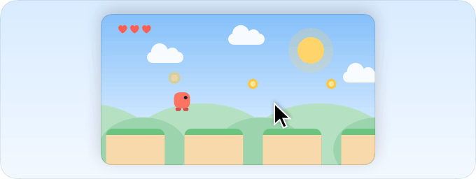</picture>

설정의 움직이는 그림은 이제 그림의 절반 이상이 화면에 보일 때만 움직여요. 게임 그림 속 작은 주인공은 여전히 1초에 30번, 뒤의 언덕과 땅은 15번 움직여요. 그래서 게임 페이지가 Mac에 주는 부담이 훨씬 줄었어요. 모습은 그대로예요.

업데이트 뒤에는 앱이 정말로 다른 위치로 옮겨졌을 때만 Finder 항목을 다시 등록해요. 그래서 Finder가 매번 다시 불러올 필요가 없어요.

**사용해 보기:** 설정 › 게임

---

## 더 조용하고 가볍게, Finder도 바로

1.27.1 · 2026년 10월 9일

설정이 Mac에 거의 부담을 주지 않고, pikapik으로 옮긴 직후부터 Finder 오른쪽 클릭 항목이 작동합니다.

<picture><source media="(prefers-color-scheme: dark)" srcset="../media/wheel-lines-dark.png">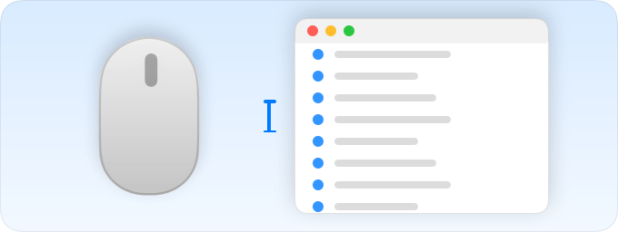</picture>

설정의 작은 움직이는 그림이 예전에는 1초에 여러 번 페이지 전체를 다시 그려서, 창을 열어 두기만 해도 Mac이 바빴습니다. 이제 각 그림은 자기 자신만 1초에 최대 30번 다시 그리고, 스크롤해서 안 보이거나 창을 가리면 쉽니다. 모양은 그대로입니다.

<picture><source media="(prefers-color-scheme: dark)" srcset="../media/new-file-dark.png"></picture>

pika-tools에서 pikapik으로 옮긴 뒤 Finder가 예전 앱을 계속 찾아서 ‘새 파일’, ‘변환’ 같은 오른쪽 클릭 항목이 작동하지 않을 수 있었습니다. 이제 pikapik이 처음 실행할 때 이를 알아차리고, 열린 Finder 창이 없고 복사 중인 것도 없으면 Finder를 알아서 재시작합니다. 그렇지 않으면 Finder 페이지에 짧은 안내와 ‘Finder 재시작’ 버튼이 나타납니다.

시스템 설정의 로그인 시 열리는 앱 목록에 이제 새 이름 pikapik으로 표시되고, 켜진 상태로 유지됩니다.

**사용해 보기:** 설정 › Finder

---

## 데스크탑 펫을 소개해요

1.27.0 · 2026년 10월 9일

이제 화면 아래쪽에 작은 친구가 살아요. 그리고 앱 이름이 pikapik으로 바뀌었어요.

<picture><source media="(prefers-color-scheme: dark)" srcset="../media/pet-dark.png"></picture>

설정 › 펫에서 켜 보세요. 윈도우와 Dock 뒤를 산책하고, 포인터가 길을 막으면 뛰어넘고, 스페이스를 누르면 점프해요. 집어서 옮기고, 던지고, 점프하는 도중에 다시 잡을 수도 있어요.

가끔 앉아서 짧게 한마디 해요. 새 버전이 정말 나오면 한 번만 알려 주고, 펫을 클릭하면 업데이트가 기다리는 설정이 열려요.

pika-tools는 이제 pikapik이에요. 권한, 설정, 단축어 링크는 모두 그대로예요. Homebrew로 설치했다면 `brew update && brew upgrade --cask pikapik`을 한 번 실행하세요.

**사용해 보기:** 설정 › 펫

**수정 사항**

- 이미 최신 버전인데도 업데이트 확인에서 새 버전이 있다고 나오던 문제를 고쳤어요.
- 권한 페이지를 열어 두면 Mac이 계속 바빴어요.

---

## ‘새로운 기능’을 내 언어로

1.26.2 · 2026년 10월 8일

설정의 ‘새로운 기능’이 이제 앱과 같은 언어로 이 페이지를 엽니다.

설정 › 정보에서 ‘새로운 기능’을 클릭하면 바로 이곳으로 옵니다. 업데이트마다 그림이 있는 이 페이지가 pika-tools와 같은 언어로 열립니다.

전체 변경 목록도 더 깔끔해졌습니다. 버전마다 나온 날짜가 표시되고, 버전 번호를 누르면 해당 다운로드 페이지가 열립니다.

pika-tools가 작동하는 방식은 그대로입니다. 업데이트는 전처럼 저절로, 또는 Homebrew로 받습니다.

**사용해 보기:** 설정 › 정보 › 새로운 기능

**수정 사항**

- ‘새로운 기능’이 이 페이지 대신 영어로 된 긴 기술 목록을 열었습니다.
- 변경 목록에서 아무 데도 연결되지 않던 링크가 이제 올바른 페이지를 엽니다.

---

## 게임 그림이 살아 움직입니다

1.26.1 · 2026년 10월 8일

‘게임’ 페이지의 그림이 이제 움직여서, 각 스위치가 무엇을 막는지 바로 보입니다.

<picture><source media="(prefers-color-scheme: dark)" srcset="../media/whats-new/1.26.1/game-previews-dark.png">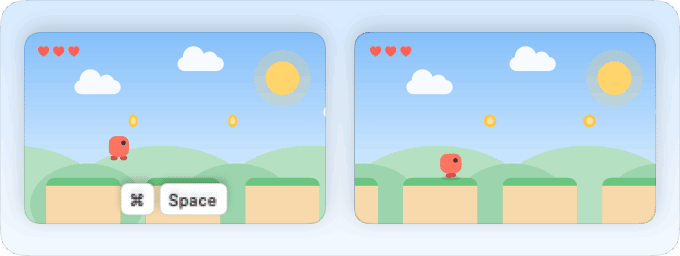</picture>

‘게임’ 페이지의 스위치마다 작은 게임이 돌아갑니다. 키가 나타나 눌리면 Spotlight나 Mission Control처럼 게임 위로 튀어나올 것이 보이고, 게임은 멈춥니다. 스위치가 켜져 있으면 키가 부드럽게 빛날 뿐 게임은 계속됩니다. 스위치를 바꾸면 그림이 그 차이를 바로 보여 줍니다.

<picture><source media="(prefers-color-scheme: dark)" srcset="../media/game-mode-dark.png"></picture>

작은 게임은 Mac의 화면 모드를 따릅니다. 라이트 모드에서는 맑은 낮, 다크 모드에서는 달과 별이 뜬 고요한 밤입니다.

<picture><source media="(prefers-color-scheme: dark)" srcset="../media/new-file-dark.png"></picture>

앱의 모든 그림에서 포인터가 이제 손처럼 움직입니다. 먼 곳은 조금 더 천천히 가고, 멈춘 다음에야 클릭합니다. 그림이 처음으로 돌아갈 때도 뛰지 않고 부드럽게 돌아갑니다. 윈도우가 가려져 있으면 그림은 쉬고, ‘동작 줄이기’를 켜면 멈춰 있습니다.

**사용해 보기:** 설정 › 게임

---

## 새 아이콘, 그리고 오래된 권한 정리

1.26.0 · 2026년 10월 8일

pika-tools가 새 얼굴을 갖췄고, 이제 삭제한 앱이 남긴 권한도 지울 수 있습니다.

새 아이콘은 어두운 타일 위에 파랑, 보라, 코럴로 그린 pikapik 마크입니다. 메뉴 막대에도 같은 모양이 나타나며, 밝은 메뉴 막대와 어두운 메뉴 막대에 맞춰집니다. 모든 도구가 꺼져 있으면 모양이 흐려집니다.

<picture><source media="(prefers-color-scheme: dark)" srcset="../media/leftover-permissions-dark.png"></picture>

앱을 삭제해도 macOS는 그 앱에 준 권한을 그대로 남겨 두고, 시스템 설정에서는 지울 방법이 없습니다. 이제 ‘권한’ 페이지에 ‘삭제한 앱이 남긴 권한’ 목록이 생겼습니다. 앱마다 아이콘과 무엇이 허용되었는지, 언제였는지가 표시됩니다. ‘제거’는 앱 하나를, ‘모두 제거’는 전부를 지우며, 다시 설치한 앱은 그냥 한 번 더 물어봅니다. 목록을 보려면 pika-tools에 전체 디스크 접근 권한을 주세요. ‘제거’를 누르기 전까지는 보기만 하고 아무것도 바꾸지 않습니다.

<picture><source media="(prefers-color-scheme: dark)" srcset="../media/animations-dark.png">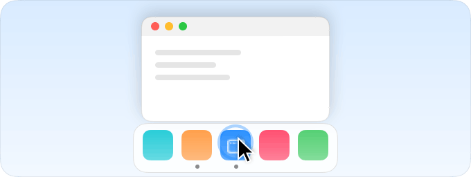</picture>

‘애니메이션’과 ‘게임’ 페이지의 그림을 실제 크기에 맞게 새로 그려서 선명해졌습니다. 윈도우는 둥근 모서리 그대로 Dock으로 줄어들고, 포인터가 먼저 클릭한 다음에야 메뉴가 열립니다. 그리고 ‘정보’ 아래쪽에 조용한 한 줄 ‘정성껏 만들었습니다 · 커피 한 잔 사 주기’가 생겼습니다. 아무것도 튀어나오지 않고, 다시 알려 주지도 않습니다.

**사용해 보기:** 설정 › 권한에서 ‘삭제한 앱이 남긴 권한’

**수정 사항**

- 시스템 단축키를 클릭하면 ‘키보드’만이 아니라 Mission Control처럼 그 단축키가 있는 섹션이 시스템 설정에서 바로 열립니다.
- 키 옆의 도움말이 시스템 설정이 열리자마자 사라지지 않습니다.

---

## 단축키를 바꾸는 곳이 바로 열립니다

1.25.2 · 2026년 10월 8일

설정에서 단축키를 클릭하면 시스템 설정의 올바른 위치가 열립니다.

<picture><source media="(prefers-color-scheme: dark)" srcset="../media/whats-new/1.23.2/game-shortcuts-dark.png">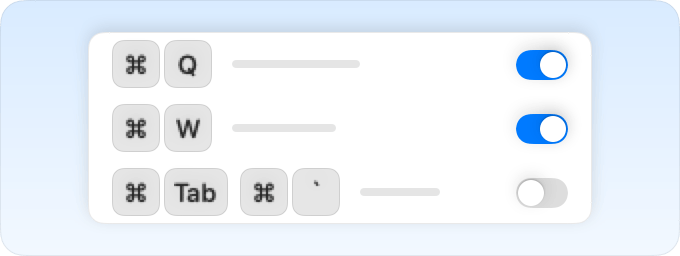</picture>

이전에는 Spotlight 같은 단축키를 클릭하면 항상 ‘보조 키’가 열렸습니다. 이제 Spotlight 키를 클릭하면 바로 Spotlight가 열립니다.

다른 단축키는 시스템 설정의 ‘키보드’가 열리고, 키 옆에 어디를 클릭할지 알려 주는 짧은 도움말이 나타납니다. ‘키보드 단축키…’를 클릭한 다음 ‘Mission Control’ 같은 항목을 클릭하세요.

‘게임’ 페이지와 ‘Finder에서 파일 잘라내기’도 똑같습니다. 파일을 잘라낼 때는 도움말이 ‘앱 단축키’로 안내합니다.

**사용해 보기:** 설정 › 게임에서 ‘검색이 튀어나오지 않음’ 옆의 키를 클릭

**수정 사항**

- 단축키를 클릭해도 더 이상 ‘보조 키’가 열리지 않습니다.

---

## 큰 그림, 그리고 Dock에서 바로 고르는 게임

1.25.1 · 2026년 10월 8일

모든 스위치에 큰 그림이 생겼고, ‘게임 추가…’에서 Dock에 있는 것이 보입니다.

<picture><source media="(prefers-color-scheme: dark)" srcset="../media/whats-new/1.25.1/dock-games-dark.png"></picture>

‘애니메이션’과 ‘게임’ 페이지의 그림이 모두 페이지 맨 위 그림처럼 커졌습니다. 스위치마다 무엇을 하는지 한눈에 보이고, 그림은 여전히 고른 속도대로 움직입니다.

‘게임 추가…’를 누르면 Dock이 그대로 보입니다. Dock에 둔 앱과 지금 열려 있는 앱이 같은 순서로 나옵니다. Dock에 둔 게임은 닫혀 있어도 보이고, Minecraft도 나옵니다. 한 번 클릭하면 추가되고, 체크 표시로 목록에 들어갔다는 것을 알 수 있습니다. 한 번 더 클릭하면 뺄 수 있습니다.

예전처럼 Finder에서 게임을 여기로 끌어올 수도 있습니다. 이제 Dock에서 끌어낼 필요가 없으니 Dock이 제거하겠느냐고 묻지도 않습니다.

**사용해 보기:** 설정 › 게임에서 ‘게임 추가…’

**수정 사항**

- Dock에 있지만 닫혀 있는 게임도 이제 추가 목록에 나옵니다.

---

## 클릭 한 번으로 게임 추가, 키도 직접 정하세요

1.25.0 · 2026년 10월 8일

지금 열려 있는 앱에서 게임을 고르고, 종료와 닫기에 쓸 키도 직접 정할 수 있습니다.

<picture><source media="(prefers-color-scheme: dark)" srcset="../media/whats-new/1.25.0/game-pictures-dark.png">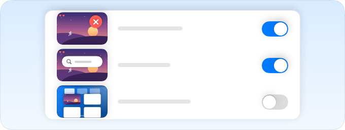</picture>

‘게임 추가…’를 누르면 지금 열려 있는 앱이 Dock처럼 큰 아이콘으로 나타납니다. 한 번 클릭하면 추가되고, 아이콘을 목록으로 끌어와도 됩니다. Finder나 Dock에서 게임을 바로 끌어다 놓을 수도 있습니다. 이제 어떤 앱이든 게임이 될 수 있고, Java로 실행되는 Minecraft도 마찬가지입니다. 전에 추가한 게임은 그대로 남아 있습니다.

게임 모드 스위치가 ‘게임이 종료되지 않음’이나 ‘검색이 튀어나오지 않음’처럼 쉬운 말로 바뀌었고, 각 스위치에는 무엇을 막는지 보여 주는 작은 그림이 붙었습니다. Spotlight 같은 시스템 이름은 옆에 회색으로 표시됩니다.

설정 › 윈도우에서 ‘앱 종료’나 ‘윈도우 닫기’ 옆의 키를 클릭하고 새 키를 누르세요. ⌫를 누르면 ⇧⌘Q와 ⇧⌘W로 돌아가고, 이미 쓰이는 키라면 pika-tools가 먼저 물어봅니다. 게임 모드도 직접 정한 키를 씁니다. 그리고 설정의 모든 단축키가 이제 Mac에 실제로 설정된 그대로 보입니다. 직접 정한 키가 보이거나 ‘끔’으로 표시됩니다.

**사용해 보기:** 설정 › 게임에서 ‘게임 추가…’

**수정 사항**

- Finder에서 파일 잘라내기는 시스템 설정에서 Finder의 ‘잘라내기’에 지정한 단축키를 따릅니다.
- 목록의 앱 이름이 ‘.app’ 없이 표시됩니다.

---

## 바로 눈에 보이는 속도 변화

1.24.1 · 2026년 10월 8일

이제 애니메이션 페이지가 변경 사항이 어디에 나타나는지 알려 주고, 직접 정한 값도 지켜 줍니다.

<picture><source media="(prefers-color-scheme: dark)" srcset="../media/dock-hide-dark.png">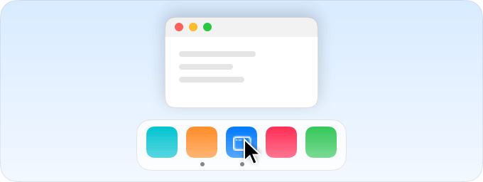</picture>

Dock은 자동으로 가려질 때만 더 빨리 나타날 수 있습니다. Dock을 늘 표시해 두었다면, 이제 ‘자동으로 Dock 가리기와 보기’ 스위치가 속도 슬라이더 바로 아래에 있습니다.

변경하면 페이지 아래에 앱을 다시 열면 적용된다는 줄이 나타납니다. 훑어보기와 계층 보기의 새 속도는 Finder를 재시작해야 보이므로, 이 줄에는 ‘Finder 재시작’ 버튼이 있습니다.

슬라이더는 터미널 명령어 등으로 이미 빠르게 해 둔 것을 절대 느리게 만들지 않습니다. 또 ‘기본값으로 복원’이나 pika-tools 제거는 값을 지우지 않고 이전 값으로 되돌립니다.

**사용해 보기:** 설정 › 애니메이션

**수정 사항**

- Dock이 가려지지 않을 때 쓸데없이 재시작하지 않습니다.

---

## Mac이 움직이는 속도를 직접 고르세요

1.24.0 · 2026년 10월 8일

새 애니메이션 페이지에서 Mac의 모든 것이 열리고, 미끄러지고, 나타나는 속도를 정합니다.

<picture><source media="(prefers-color-scheme: dark)" srcset="../media/animations-dark.png"></picture>

슬라이더 하나면 됩니다. 움직이면 가려진 Dock, 새 윈도우, 저장 대화상자, 훑어보기, Finder의 계층 보기가 한꺼번에 빨라집니다. ‘macOS와 동일’부터 ‘즉시’까지 고를 수 있습니다.

하나만 조절하고 싶나요? 효과마다 따로 설정이 있고, 최소화 효과, Dock에서 튀어오르는 아이콘, Finder 애니메이션도 마찬가지입니다. 각 설정 옆에서는 작은 그림이 고른 속도 그대로 움직입니다.

‘기본값으로 복원’은 pika-tools가 바꾼 것만 되돌리고, 앱을 제거할 때도 같습니다. 예전에 터미널에서 직접 정한 값이 있다면 pika-tools는 그 값을 그대로 보여 줍니다.

**사용해 보기:** 설정 › 애니메이션

---

## 게임 모드의 단축키마다 스위치가 생겼습니다

1.23.2 · 2026년 10월 8일

이제 게임하는 동안 게임 모드가 무엇을 막을지 단축키마다 직접 정합니다.

<picture><source media="(prefers-color-scheme: dark)" srcset="../media/whats-new/1.23.2/game-shortcuts-dark.png"></picture>

⌘Q와 ⌘W의 스위치가 따로 생겼고, Spotlight, Siri, ⌘Tab, Mission Control, 쓸어넘기기, 포인터, 화면 등도 마찬가지입니다. 이전에 고른 설정은 그대로 유지됩니다.

각 줄에는 그 줄이 막는 키가 정확히 표시되어, 스위치가 무슨 일을 하는지 항상 알 수 있습니다.

키보드 언어 설정은 게임 모드에서 빠졌습니다. ⌃스페이스를 비롯한 언어 전환 방법은 게임 중에도 언제나 작동합니다.

**사용해 보기:** 설정 › 게임

**수정 사항**

- 한 단축키의 키들은 더 가깝게 붙고, 서로 다른 단축키 사이에는 여백이 조금 더 생겨 어디서 끝나고 어디서 시작하는지 쉽게 보입니다.

---

## 인터넷 속도를 쉬운 말로

1.23.1 · 2026년 10월 8일

속도 테스트가 연결 상태를 확인하고, 무엇을 하기에 충분한지 쉽게 알려 줍니다.

<picture><source media="(prefers-color-scheme: dark)" srcset="../media/speed-test-dark.png">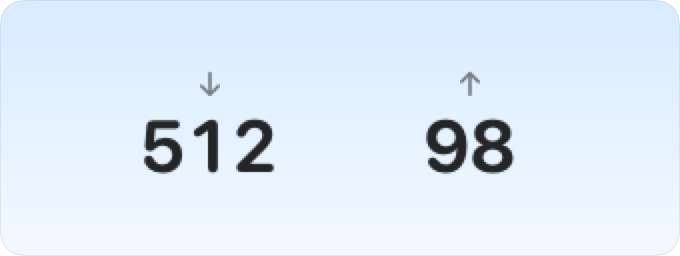</picture>

‘속도 측정’을 누르면 30초쯤 뒤에 다운로드, 업로드, 핑, 응답성이 나타납니다. 숫자 아래에는 4K 영화, 영상 통화, 온라인 게임, 큰 파일 다운로드에 충분한지 쉬운 말로 적혀 있습니다.

측정은 Apple 서버에서 이루어지고, 마지막 결과는 다음 측정 때까지 남아 있습니다. 속도 테스트는 설정에 자체 페이지가 있고, 메뉴 막대 패널에 한 줄이 있으며, 단축어 앱용 링크도 있습니다: `pika-tools://speed-test`.

게임 모드는 두 가지를 새로 배웠습니다. Control 단축키 차단이 이제 게임 모드의 일부가 되어, 게임 중에는 ⌃-클릭이 그냥 클릭으로 남고 ⌃ 단축키가 작동하지 않습니다. 게임 밖에서는 ⌃가 평소처럼 작동합니다. 또 Minecraft를 알아봅니다. Minecraft Launcher나 CurseForge를 게임에 추가하면 Minecraft 자체가 앞에 있을 때 게임 모드가 켜집니다.

**사용해 보기:** 설정 › 속도 테스트에서 ‘속도 측정’

**수정 사항**

- 직접 빌드한 pika-tools 테스트 버전은 iCloud Drive에 설정을 따로 저장하고, 더 이상 사용자의 설정을 건드리지 않습니다.

---

## 게임 모드: 방해 없이 플레이하세요

1.23.0 · 2026년 10월 7일

게임을 추가해 두면 Mac이 더 이상 게임에서 끌어내지 않습니다.

<picture><source media="(prefers-color-scheme: dark)" srcset="../media/game-mode-dark.png"></picture>

플레이하는 동안 Spotlight, Siri, ⌘Tab, Mission Control, 데스크탑 간 쓸어넘기기가 게임 위에 열리지 않습니다. ⌘Q와 ⌘W로 게임이 실수로 닫히지 않고, 포인터는 게임 화면에 머물며, 화면도 꺼지지 않습니다.

게임을 끝내려면 ⇧⌘Q, 게임 윈도우를 닫으려면 ⇧⌘W를 누르세요. ⌥⌘Esc는 언제나 작동합니다. pika-tools가 Mac에서 찾은 게임을 추천합니다. 게임 모드는 직접 켜기 전까지 꺼져 있습니다.

잠자기 방지에서 화면을 어떻게 할지 고를 수 있습니다. 화면 보호기와 잠금 화면 없이 계속 켜 두거나, Mac은 계속 일하면서 화면만 평소처럼 꺼지게 할 수 있습니다. 새 ‘지금 디스플레이 끄기’ 버튼은 화면을 바로 끄고, 마우스를 움직이거나 키를 누르면 다시 켜집니다.

**사용해 보기:** 설정 › 게임에서 ‘게임 추가…’

**수정 사항**

- 덮개가 없는 Mac에서는 잠자기 방지에 덮개를 닫았을 때의 옵션이 더 이상 나타나지 않습니다.

---

이전 버전은 <a href="../../CHANGELOG.md">변경 기록</a>(영어)에서 볼 수 있습니다.

